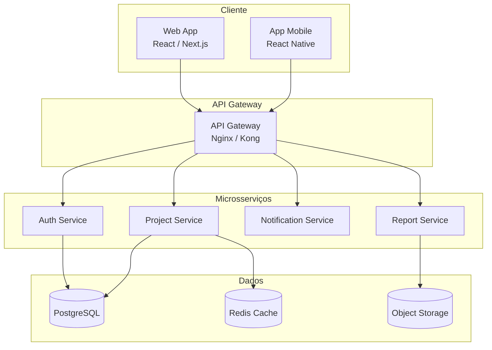

# Documentação de Arquitetura

Visão técnica da plataforma Crianex — diagramas, decisões de arquitetura (ADRs) e descrição dos componentes.

---

## Visão Geral

A Crianex é uma plataforma **SaaS multi-tenant** para gestão e portfólio de projetos, construída sobre uma arquitetura de microsserviços.

---

## Stack Tecnológica

| Camada | Tecnologia |
|--------|-----------|
| Frontend | React / Next.js |
| Backend | Node.js / Python (FastAPI) |
| Banco de dados | PostgreSQL |
| Cache | Redis |
| Infraestrutura | Docker + Kubernetes |
| CI/CD | GitHub Actions |
| Cloud | AWS / GCP |

---

## ADRs — Architecture Decision Records

!!! note "O que é um ADR?"
    Um ADR documenta **uma decisão arquitetural significativa**, seu contexto, as alternativas consideradas e os motivos da escolha. Crie um arquivo `adr-NNN-titulo.md` para cada decisão.

### Índice de ADRs

| ID | Título | Status | Data |
|----|--------|--------|------|
| ADR-001 | *A ser criado* | — | — |

---

## Diagramas

> Adicione diagramas de sequência, ER e implantação conforme o projeto evoluir. Use blocos `mermaid` para diagramas inline ou faça upload de imagens na pasta `assets/`.
