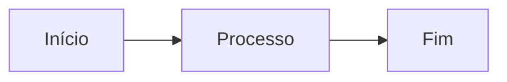

# Instruções do MkDocs

Guia para contribuir com a documentação da Crianex usando MkDocs Material.

---

## Pré-requisitos

```bash
pip install mkdocs-material
```

---

## Rodar localmente

Dentro da pasta `docs/`:

```bash
mkdocs serve
```

Acesse em `http://localhost:8000`. O servidor recarrega automaticamente ao salvar arquivos.

---

## Estrutura de pastas

```
docs/
├── mkdocs.yml          # Configuração principal
└── docs/
    ├── index.md        # Página inicial
    ├── assets/         # CSS, imagens, logo
    ├── atas/           # Atas de reunião
    ├── backlog/        # Backlog do produto
    ├── arquitetura/    # Documentação técnica
    └── mkdocs-guide/   # Este guia
```

---

## Adicionar uma nova página

**1.** Crie o arquivo `.md` na pasta correspondente:

```bash
# Exemplo: nova ata
touch docs/atas/2026-04-09.md
```

**2.** Adicione-o à navegação em `mkdocs.yml`:

```yaml
nav:
  - Atas de Reunião:
    - atas/index.md
    - "09/04/2026": atas/2026-04-09.md  # (1)
```

1. O texto entre aspas é o rótulo exibido no menu lateral.

---

## Recursos de Markdown estendido

### Admonitions (caixas de destaque)

```markdown
!!! tip "Dica"
    Texto da dica.

!!! warning "Atenção"
    Texto de aviso.

!!! danger "Perigo"
    Texto de perigo.
```

!!! tip "Dica"
    Exemplo de admonition do tipo `tip`.

### Abas de conteúdo

```markdown
=== "Python"
    ```python
    print("Olá, Crianex!")
    ```

=== "JavaScript"
    ```js
    console.log("Olá, Crianex!")
    ```
```

=== "Python"
    ```python
    print("Olá, Crianex!")
    ```

=== "JavaScript"
    ```js
    console.log("Olá, Crianex!")
    ```

### Diagramas com Mermaid

````markdown

````


### Badges de status

```html
<span class="badge badge--green">Concluído</span>
<span class="badge badge--blue">Em andamento</span>
<span class="badge badge--yellow">A fazer</span>
<span class="badge badge--red">Bloqueado</span>
```

<span class="badge badge--green">Concluído</span>
<span class="badge badge--blue">Em andamento</span>
<span class="badge badge--yellow">A fazer</span>
<span class="badge badge--red">Bloqueado</span>

---

## Publicar (build estático)

```bash
mkdocs build
```

Os arquivos são gerados na pasta `site/`. Para publicar no GitHub Pages:

```bash
mkdocs gh-deploy
```

---

## Referências

- [Documentação oficial do MkDocs Material](https://squidfunk.github.io/mkdocs-material/)
- [Referência de Mermaid](https://mermaid.js.org/)
