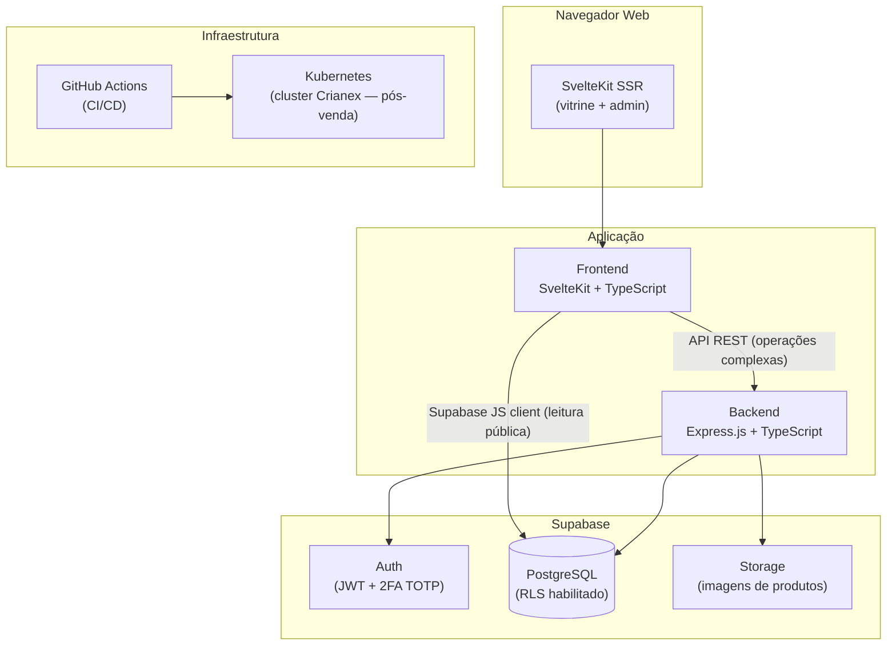

# Documentação de Arquitetura

Visão técnica da plataforma Crianex Hub — diagramas, decisões de arquitetura (ADRs) e descrição dos componentes.

---

## Visão Geral



---

## Stack Tecnológica

| Camada | Tecnologia | Notas |
|--------|-----------|-------|
| **Frontend** | SvelteKit + TypeScript | SSR obrigatório (RNF04) · `adapter-node` |
| **UI** | shadcn-svelte + design tokens Crianex | Space Grotesk + JetBrains Mono |
| **i18n** | paraglide-js (`@inlang/paraglide-sveltekit`) | PT/EN · tree-shakeable por mensagem |
| **Backend** | Express.js + TypeScript | REST API · JWT · rate limiting |
| **Banco** | PostgreSQL via Supabase | RLS habilitado |
| **Auth** | Supabase Auth | JWT 15min + refresh · 2FA TOTP para admin |
| **Storage** | Supabase Storage | imagens de produtos |
| **Infra / Deploy** | Kubernetes | cluster Crianex — pós-venda (IT4+) |
| **CI/CD** | GitHub Actions | build · lint · typecheck · deploy |
| **Controle de versão** | Git / GitHub | monorepo |

---

## Estrutura do Monorepo

```
frontend/                    # SvelteKit app
├── src/
│   ├── routes/
│   │   ├── (vitrine)/       # layout público (Header + Footer)
│   │   │   ├── +layout.svelte
│   │   │   ├── +page.svelte          # homepage
│   │   │   ├── produtos/             # vitrine pública de produtos
│   │   │   ├── sobre/                # página institucional
│   │   │   ├── contato/              # formulário de leads
│   │   │   └── faq/                  # FAQ público + detalhe de artigo
│   │   └── (admin)/         # layout admin (.admin-root, sempre escuro)
│   │       ├── +layout.svelte
│   │       └── login/                # autenticação
│   ├── lib/
│   │   ├── components/
│   │   │   ├── ui/          # shadcn-svelte (primitivos)
│   │   │   ├── vitrine/     # componentes da vitrine pública
│   │   │   └── admin/       # componentes do painel admin
│   │   ├── i18n/            # pt.json + en.json
│   │   ├── stores/          # Svelte stores globais
│   │   ├── utils/           # helpers tipados
│   │   └── api/
│   │       ├── supabase.ts  # client JS (leitura pública)
│   │       └── backend.ts   # fetch tipado para o Express
│   └── app.css              # design tokens + reset
├── svelte.config.js
└── vite.config.ts

backend/                     # Express.js API
├── src/
│   ├── routes/              # routers por feature (auth, products, faq…)
│   ├── middleware/          # auth JWT, rate-limit, validação
│   └── lib/                 # supabase admin client, helpers
└── tsconfig.json

supabase/                    # Supabase CLI
├── migrations/              # SQL versionado — 1 arquivo por issue de DB
├── seed.sql                 # dados iniciais
└── config.toml

gh-pages/                    # Documentação MkDocs Material
```

---

## Estratégia de Deploy

| Ambiente | Frontend | Backend | Banco | Como usar |
|----------|----------|---------|-------|-----------|
| **Dev local** | `vite dev` (porta 5173) | `tsx watch` (porta 3000) | `supabase start` (porta 54322) | `npm run dev` ou `docker compose up` |
| **Dev equipe** | — | — | Supabase free-tier compartilhado | `supabase db push` aplica migrations |
| **Produção Crianex** | — | — | Supabase projeto Crianex | `supabase db push --linked` |
| **Kubernetes** | Docker image | Docker image | Supabase externo | GitHub Actions → cluster Crianex (pós IT4) |

!!! note "Workflow de schema"
    Cada issue que cria ou altera tabelas deve incluir um arquivo de migration gerado por `supabase db diff`.
    O `seed.sql` contém apenas dados de desenvolvimento — nunca dados de produção.

---

## Decisões Técnicas (ADRs)

| ID | Título | Status | Data |
|----|--------|--------|------|
| ADR-001 | SvelteKit em vez de React/Next.js para o frontend | Aceito | 05/2026 |
| ADR-002 | paraglide-js para i18n (em vez de svelte-i18n) | Aceito | 05/2026 |
| ADR-003 | Supabase Auth + TOTP para autenticação admin | Aceito | 05/2026 |
| ADR-004 | RLS como primeira linha de defesa (não apenas validação de app) | Aceito | 05/2026 |

### ADR-001 — SvelteKit em vez de React/Next.js

**Contexto:** necessidade de SSR para SEO (OE2) e bundle pequeno para vitrine pública.

| Critério | SvelteKit | React / Next.js |
|----------|-----------|-----------------|
| Bundle size | Sem runtime virtual DOM | Runtime React incluído |
| SSR + SEO | Nativo, simples | Configuração extra |
| Curva de aprendizado | HTML/CSS/JS puro | JSX + hooks |
| Bilinguismo | paraglide-js nativo SvelteKit | next-intl ou react-i18next |

**Decisão:** SvelteKit com `adapter-node` para SSR em produção.

### ADR-002 — paraglide-js para i18n

**Contexto:** vitrine bilíngue PT/EN com troca em 1 clique (RNF13), SSR obrigatório.

**Decisão:** `@inlang/paraglide-sveltekit` — integração nativa com SvelteKit, mensagens tree-shakeable (só o que é usado vai para o bundle), sem overhead de runtime no cliente.

### ADR-003 — Argon2id / bcrypt para senhas

Supabase Auth gerencia o hash. Fator mínimo 12 (RNF08).

### ADR-004 — RLS como primeira linha de defesa

Row Level Security no PostgreSQL garante isolamento de dados mesmo em acessos diretos do frontend via Supabase JS client — não depender apenas de validações da camada de aplicação.
