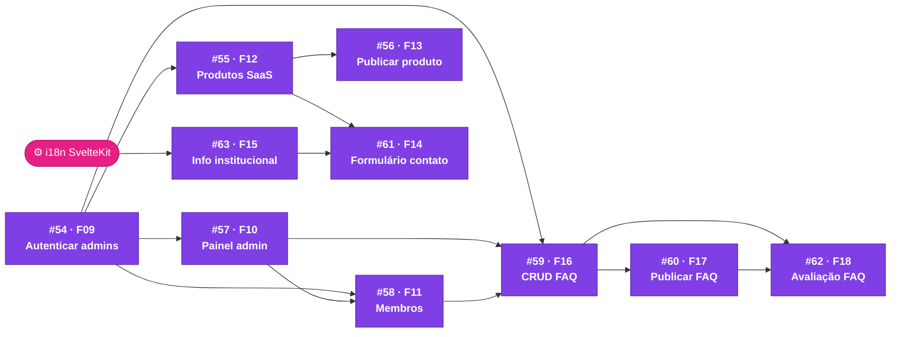
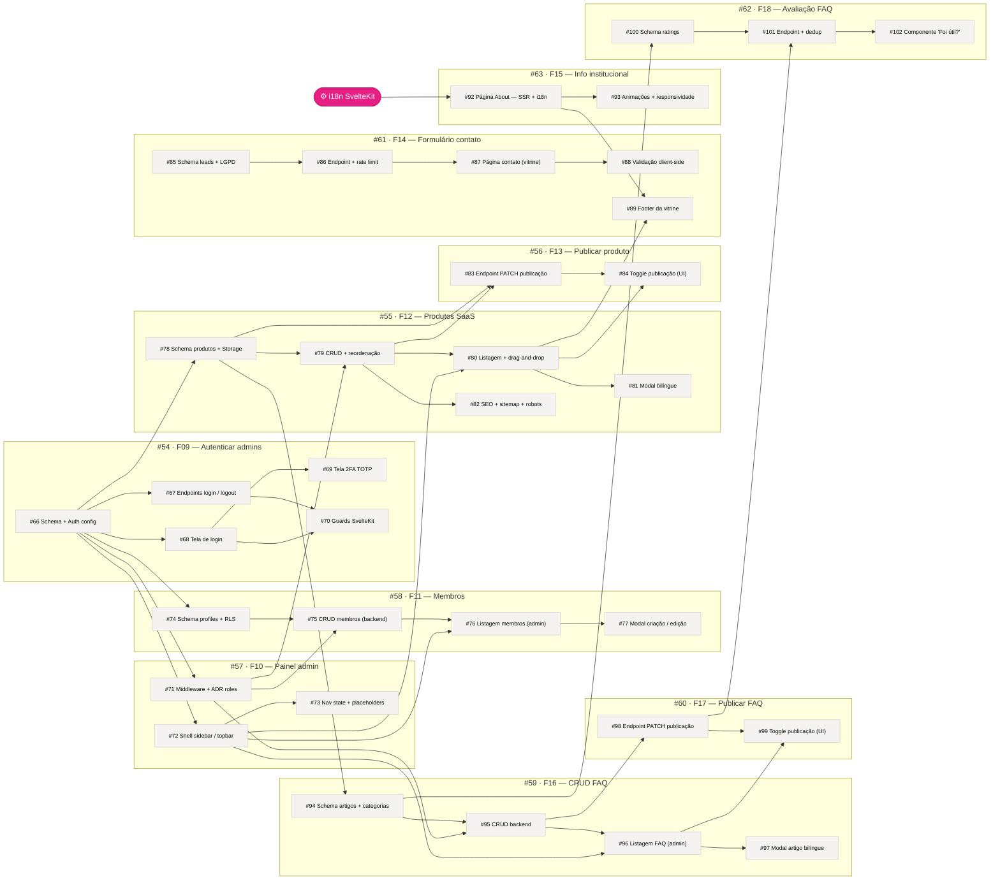

# Mapa de Dependências

Rastreabilidade visual entre as features e sub-issues do projeto. Use este mapa para:

- Identificar o caminho crítico antes de iniciar uma issue
- Verificar se todos os bloqueantes de uma issue estão fechados (DoR)
- Planejar o que pode ser paralelizado

---

## Visão Geral — Features

Dependências entre as 10 features ativas. Cada nó é a issue pai de especificação.

---

## Mapa Completo — Sub-issues

Cada bloco agrupa as sub-issues de uma feature. As setas mostram bloqueios diretos — dentro e entre features.

---

## Legenda

| Elemento                    | Significado                                                 |
| --------------------------- | ----------------------------------------------------------- |
| Bloco roxo (visão geral)    | Feature pai — issue de especificação da CP                  |
| Bloco claro (mapa completo) | Sub-issue de implementação                                  |
| Bloco rosa                  | Dependência externa ao backlog de issues                    |
| `→` seta sólida             | Bloqueio direto — destino não inicia antes da origem fechar |
