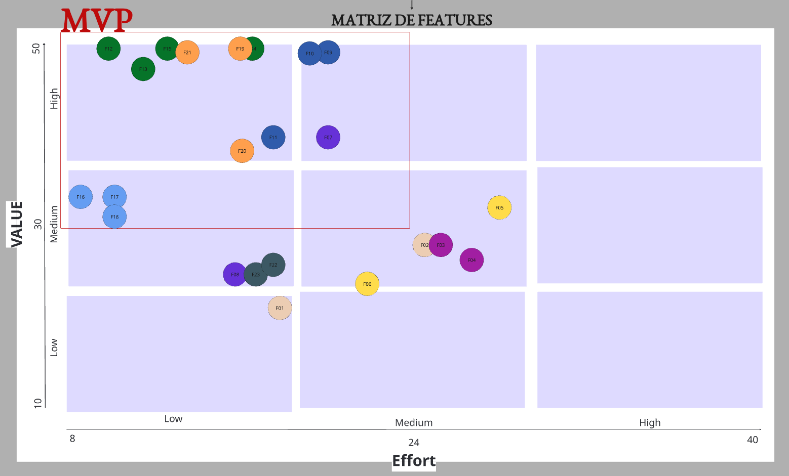

| Sigla  | Descrição                                    |
| ------ | -------------------------------------------- |
| **VB** | Valor de Negócio — impacto direto nos OEs    |
| **ES** | Esforço de implementação da Feature completa |
| **IP** | Índice de Prioridade = VB / ES               |

---

### Critérios para VALOR da Feature

Os mesmos critérios utilizados para os RFs foram aplicados diretamente no nível da Feature. A diferença está no objeto avaliado: em vez de avaliar um requisito isolado, avalia-se **o conjunto de comportamentos que a feature entrega**.

| Critério                         | Peso | Descrição                                                                                                                                                                                                                   |
| -------------------------------- | ---- | --------------------------------------------------------------------------------------------------------------------------------------------------------------------------------------------------------------------------- |
| **Impacto de Negócio**           | 3    | Mede o quanto a feature contribui diretamente para os objetivos estratégicos e operacionais da organização, como aumento de produtividade, centralização de processos, redução de retrabalho ou geração de valor comercial. |
| **Frequência de Uso**            | 3    | Avalia com que frequência a feature será utilizada pelos usuários no contexto diário do sistema. Features acessadas constantemente tendem a possuir maior valor operacional.                                                |
| **Valor percebido pelo Usuário** | 2    | Representa o quanto a feature melhora a experiência, praticidade ou eficiência percebida pelos usuários durante a utilização do sistema.                                                                                    |
| **Impacto Estratégico**          | 2    | Avalia o quanto a feature contribui para diferenciais estratégicos do produto, crescimento futuro da plataforma, tomada de decisão ou posicionamento tecnológico da organização.                                            |

```c
VB = (ImpactoNegocio × 3) + (FrequenciaUso × 3) + (ValorUsuario × 2) + (ImpactoEstrategico × 2)
```

---

### Critérios para ESFORÇO da Feature

Para o esforço, a **complexidade técnica considera tanto os Requisitos Funcionais quanto os Requisitos Não Funcionais** vinculados à feature. RNFs impõem restrições de qualidade (segurança, desempenho, conformidade) que aumentam diretamente a dificuldade de implementação. Ignorá-los subestimaria o esforço real.

| Critério                   | Peso | Descrição                                                                                                                                                                                                          |
| -------------------------- | ---- | ------------------------------------------------------------------------------------------------------------------------------------------------------------------------------------------------------------------ |
| **Complexidade técnica**   | 3    | Mede a dificuldade de implementação considerando lógica de negócio dos RFs, integrações, persistência de dados e **restrições impostas pelos RNFs vinculados** (segurança, desempenho, conformidade, usabilidade). |
| **Dependências**           | 2    | Avalia o quanto a feature depende de outros módulos, serviços ou componentes já existentes para funcionar corretamente.                                                                                            |
| **Risco técnico**          | 2    | Representa a probabilidade de ocorrerem problemas técnicos, falhas de implementação ou inconsistências durante o desenvolvimento.                                                                                  |
| **Tempo de implementação** | 1    | Mede o esforço temporal estimado para desenvolver, testar e validar todos os RFs e atender os RNFs vinculados à feature.                                                                                           |

```c
ES = (Complexidade × 3) + (Dependencias × 2) + (RiscoTecnico × 2) + (Tempo × 1)
```

---

### Validação com o Cliente

Os critérios de valor (impacto de negócio, frequência de uso, valor percebido pelo usuário e impacto estratégico) e seus respectivos pesos foram definidos em conjunto com o cliente em sessão de priorização. O cliente avaliou cada feature e atribuiu notas de 1 a 5 por critério, validando tanto os pesos quanto os scores individuais. Os resultados foram documentados no quadro Miro abaixo.

---

### Cálculos no Miro

Os cálculos detalhados de cada Feature — critério por critério, com notas e justificativas — estão documentados no quadro abaixo:

<iframe
  src="https://miro.com/app/live-embed/uXjVGl991V0=/?moveToWidget=3458764675237762549&cot=14"
  width="100%"
  height="620"
  frameborder="0"
  scrolling="no"
  allow="fullscreen; clipboard-read; clipboard-write"
  allowfullscreen>
</iframe>

---

## Matriz de Features (Valor × Esforço)

A matriz posiciona cada feature no plano Valor × Esforço. O quadrante superior-esquerdo (alto valor, baixo esforço) delimita o **MVP** — as features com melhor retorno relativo sobre o investimento. As features fora do MVP possuem menor relação custo-benefício e serão reavaliadas em iterações futuras.



<figure class="crianex-figure">
  <figcaption>Figura 1 — Matriz de Features: Valor × Esforço. O retângulo vermelho delimita o MVP. Fonte: Elaborado pelos autores (2026).</figcaption>
</figure>

---

## Tabela de Priorização de Features

> Os valores de VB, ES e IP são calculados no Miro e serão preenchidos manualmente nesta tabela.  
> `*` Feature fora do MVP incluída em uma iteração por dependência funcional com outra feature já priorizada.

| ID  | Feature                                             | CP  | OE  | VB  | ES  | IP   | Quadrante | MVP                                            |
| --- | --------------------------------------------------- | --- | --- | --- | --- | ---- | --------- | ---------------------------------------------- |
| F09 | Autenticar as credenciais do usuário                | CP5 | OE2 | 50  | 21  | 2,38 | Q1        | <span class="badge badge--green">MVP</span>    |
| F12 | Cadastrar os produtos da vitrine                    | CP5 | OE2 | 50  | 10  | 5    | Q1        | <span class="badge badge--green">MVP</span>    |
| F13 | Alterar a visibilidade do produto na vitrine        | CP4 | OE2 | 47  | 14  | 3,36 | Q1        | <span class="badge badge--green">MVP</span>    |
| F15 | Visualizar as informações institucionais da empresa | CP4 | OE2 | 50  | 15  | 3,33 | Q1        | <span class="badge badge--green">MVP</span>    |
| F21 | Registrar as interações do relacionamento comercial | CP1 | OE3 | 50  | 16  | 3,12 | Q1        | <span class="badge badge--green">MVP</span>    |
| F19 | Cadastrar os clientes e leads do CRM                | CP1 | OE3 | 50  | 20  | 2,5  | Q1        | <span class="badge badge--green">MVP</span>    |
| F20 | Configurar as colunas do funil                      | CP1 | OE3 | 36  | 17  | 2,12 | Q1        | <span class="badge badge--green">MVP</span>    |
| F11 | Cadastrar os usuários da plataforma                 | CP5 | OE2 | 39  | 18  | 2,17 | Q1        | <span class="badge badge--green">MVP</span>    |
| F16 | Cadastrar os artigos da FAQ                         | CP6 | OE2 | 32  | 8   | 4    | Q1        | <span class="badge badge--green">MVP</span>    |
| F17 | Publicar os artigos da FAQ                          | CP6 | OE2 | 30  | 10  | 3    | Q1        | <span class="badge badge--green">MVP</span>    |
| F18 | Coletar a avaliação positiva/negativa do artigo     | CP6 | OE2 | 30  | 10  | 3    | Q1        | <span class="badge badge--green">MVP</span>    |
| F14 | Exibir os canais de contato da vitrine              | CP4 | OE2 | 50  | 20  | 2,5  | Q1        | <span class="badge badge--green">MVP</span>    |
| F10 | Acessar o painel da plataforma                      | CP5 | OE2 | 50  | 21  | 2,38 | Q1        | <span class="badge badge--green">MVP</span>    |
| F07 | Exibir o histórico de notificações                  | CP9 | OE3 | 39  | 22  | 1,77 | Q1        | <span class="badge badge--green">MVP</span>    |
| F08 | Configurar os templates de notificação              | CP9 | OE3 | 22  | 12  | 1,83 | Q1        | <span class="badge badge--yellow">IT2*</span>  |
| F22 | Consultar os tickets de atendimento                 | CP8 | OE3 | 25  | 19  | 1,31 | Q2        | <span class="badge badge--gray">Fora</span>    |
| F23 | Atualizar o status dos tickets de suporte           | CP8 | OE3 | 20  | 18  | 1,11 | Q2        | <span class="badge badge--gray">Fora</span>    |
| F06 | Gerar os relatórios das finanças                    | CP7 | OE1 | 22  | 22  | 1,00 | Q2        | <span class="badge badge--gray">Fora</span>    |
| F03 | Visualizar as métricas da operação                  | CP3 | OE1 | 27  | 26  | 1,04 | Q2        | <span class="badge badge--gray">Fora</span>    |
| F02 | Monitorar o estado dos componentes do sistema       | CP2 | OE1 | 27  | 25  | 1,08 | Q2        | <span class="badge badge--gray">Fora</span>    |
| F05 | Consultar os registros do faturamento               | CP7 | OE1 | 33  | 29  | 1,14 | Q2        | <span class="badge badge--gray">Fora</span>    |
| F01 | Monitorar os eventos de segurança do sistema        | CP2 | OE1 | 18  | 19  | 0,95 | Q3/Q4     | <span class="badge badge--gray">Fora</span>    |
| F04 | Visualizar as métricas das finanças                 | CP3 | OE1 | 26  | 30  | 0,87 | Q3/Q4     | <span class="badge badge--gray">Fora</span>    |

---

## Features por Iteração

### IT1 — Vitrine Pública

<span class="badge badge--green">Concluída</span> &nbsp; `28/04/2026 – 07/06/2026` &nbsp; CPs entregues: **CP4 · CP5 · CP6**

<div class="it-block it-block--done" markdown>

Primeira iteração focada em estabelecer a presença pública da Crianex e a infraestrutura administrativa base. Todas as features foram implementadas e validadas com o cliente.

#### CP5 — Painel de Gerenciamento do Administrador

| Feature | Descrição                            |
| ------- | ------------------------------------ |
| F09     | Autenticar as credenciais do usuário |
| F10     | Acessar o painel da plataforma       |
| F11     | Cadastrar os usuários da plataforma  |

#### CP4 — Plataforma Pública de Apresentação da Empresa

| Feature | Descrição                                           |
| ------- | --------------------------------------------------- |
| F12     | Cadastrar os produtos da vitrine                    |
| F13     | Alterar a visibilidade do produto na vitrine        |
| F14     | Exibir os canais de contato da vitrine              |
| F15     | Visualizar as informações institucionais da empresa |

#### CP6 — FAQ e Base de Conhecimentos por Produto

| Feature | Descrição                                       |
| ------- | ----------------------------------------------- |
| F16     | Cadastrar os artigos da FAQ                     |
| F17     | Publicar os artigos da FAQ                      |
| F18     | Coletar a avaliação positiva/negativa do artigo |

</div>

---

### IT2 — Lead Capture

<span class="badge badge--blue">Em andamento</span> &nbsp; `08/06/2026 – 28/06/2026` &nbsp; CPs selecionadas: **CP1 · CP9**

<div class="it-block it-block--active" markdown>

Na reunião de Iteration Commitment da IT2, a equipe selecionou as features das CPs **CP1** (CRM Interno de Clientes) e **CP9** (Sistema de Notificações), priorizando o fluxo comercial de gestão de leads e o canal de comunicação interna.

#### CP1 — CRM Interno de Clientes

| Feature | Descrição                                           |
| ------- | --------------------------------------------------- |
| F19     | Cadastrar os clientes e leads do CRM                |
| F20     | Configurar as colunas do funil                      |
| F21     | Registrar as interações do relacionamento comercial |

#### CP9 — Sistema de Notificações

| Feature | Descrição                                                                                |
| ------- | ---------------------------------------------------------------------------------------- |
| F07     | Exibir o histórico de notificações                                                       |
| F08     | Configurar os templates de notificação <span class="badge badge--yellow">Fora do MVP</span> |

> **F08** não atingiu o limiar do MVP na matriz de priorização, mas foi incluída na IT2 por dependência funcional com F07 — o histórico de notificações (F07) pressupõe a existência de templates configurados. Dentro da iteração, F08 será implementada por último, após F07 e todas as features de CP1 estarem concluídas.

</div>

---

### IT3 — Núcleo Operacional

<span class="badge badge--gray">Planejada</span> &nbsp; `29/06/2026 – 07/07/2026`

<div class="it-block it-block--planned" markdown>

Na reunião de Iteration Commitment da IT3, a equipe selecionará **apenas uma fração** das features listadas abaixo, com base na capacidade disponível e na reavaliação de valor naquele momento. Features não selecionadas serão descartadas do escopo da iteração.

#### CP8 — Sistema de Tickets de Suporte <span class="badge badge--gray">Fora do MVP</span>

| Feature | Descrição                                 |
| ------- | ----------------------------------------- |
| F22     | Consultar os tickets de atendimento       |
| F23     | Atualizar o status dos tickets de suporte |

#### CP2 · CP3 · CP7 — Gestão Operacional e Financeira <span class="badge badge--gray">Fora do MVP</span>

| Feature | CP  | Descrição                                     |
| ------- | --- | --------------------------------------------- |
| F01     | CP2 | Monitorar os eventos de segurança do sistema  |
| F02     | CP2 | Monitorar o estado dos componentes do sistema |
| F03     | CP3 | Visualizar as métricas da operação            |
| F04     | CP3 | Visualizar as métricas das finanças           |
| F05     | CP7 | Consultar os registros do faturamento         |
| F06     | CP7 | Gerar os relatórios das finanças              |

</div>