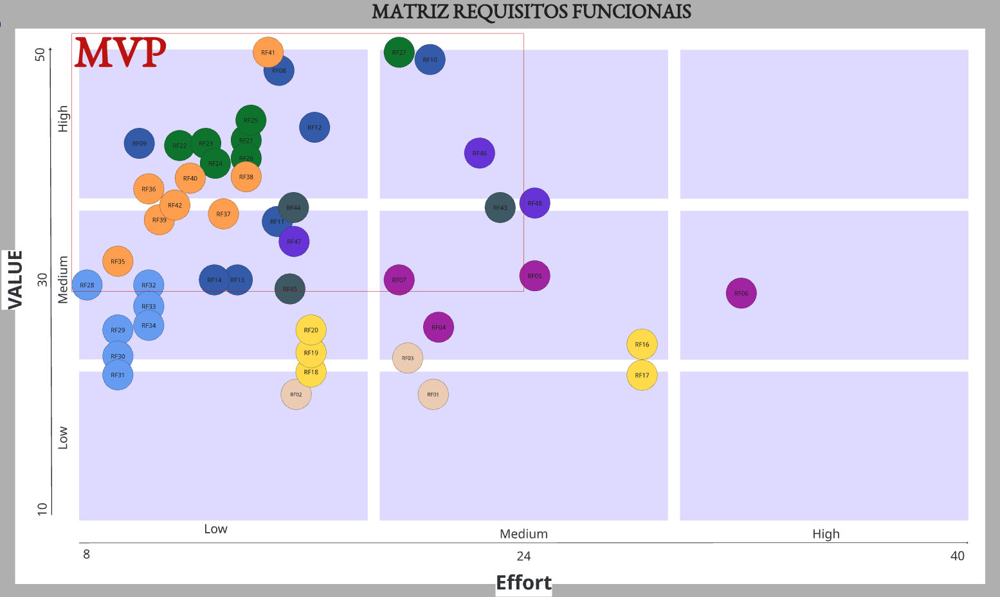
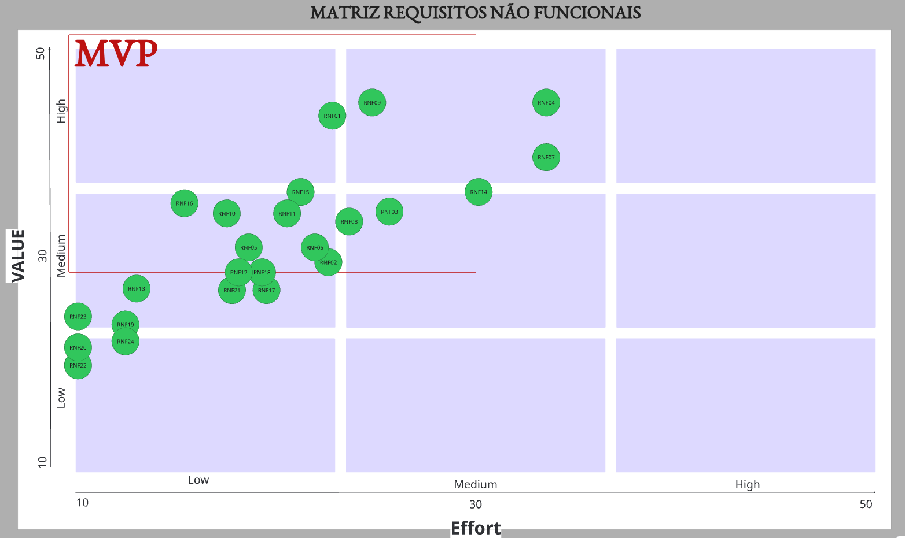
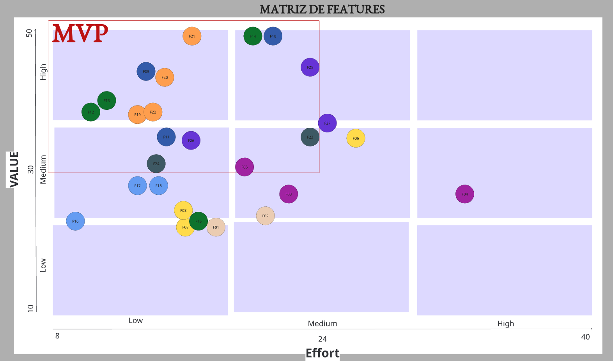
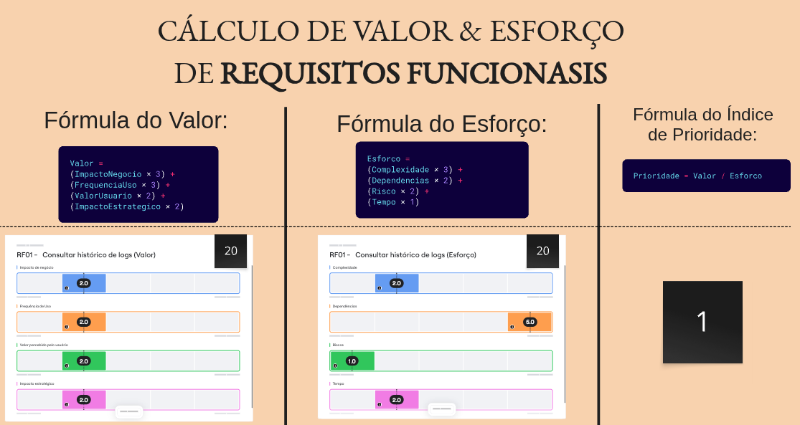
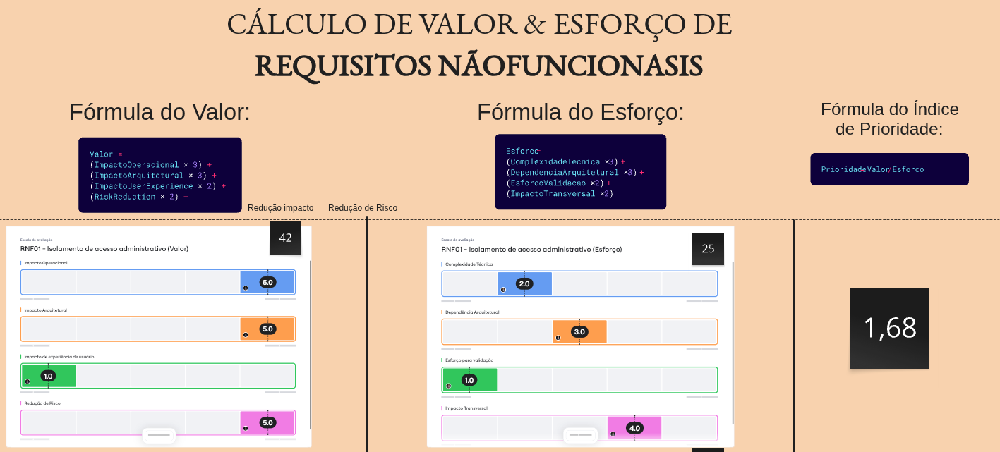

# Priorização de Requisitos — Crianex Hub

## Histórico de Revisão

| Versão | Data | Descrição | Autor(es) |
|--------|------|-----------|-----------|
| 1.0 | 14/05/2026 | Templete do Priorização do backlog | Lucas A. Zanetti |
| 1.1 | 17/05/2026 | Tabela de priorização com diagrama de valorXesforço | Lucas A. Zanetti |


---

## Método de Priorização: Valor × Esforço

A priorização segue a fórmula objetiva abaixo, aplicada a cada Requisito:

```
IP = VB / ES (RF)
IP = IS / ES (RNF)

IP ≥ 1,50 → Alta prioridade  (Q1)
IP 1,00–1,49 → Média prioridade (Q2)
IP < 1,00  → Baixa prioridade  (Q3/Q4)
```
| Sigla | Descrição | 
|-------|-----------|
| **VB** | Valor de Negócio — impacto direto nos OEs | 
| **IS** | Impacto no Sistema - incluso impacto no usuário  | 
| **ES** | Esforço  - impacto na implementação | 
| **IP** | Índice de Prioridade = VB / PT |

A fórmula e critérios para calcular o 'VB' e o 'ES' é diferente entre a tabela de Requisitos Funcionais(RF) e os Requisitos Não Funcionais(RNF).

A escala de valores e esforço para cada Requisito foi estabelecido a partir do que o cliente nos informou e priorizou, e foi validada por ele.  

### Fórmula dos Requisitos Funcionais 

Cada critério para fazer o cálculo é uma escala de 1-5 e então inseridos os pesos de cada critério.

#### Critérios para VALOR

| Critério | Peso | Descrição |
|-------|-----------|-----|
| **Impacto de Negócio** | 3 | Mede o quanto o requisito contribui diretamente para os objetivos estratégicos e operacionais da organização, como aumento de produtividade, centralização de processos, redução de retrabalho ou geração de valor comercial. |
| **Frequência de Uso** | 3 | Avalia com que frequência a funcionalidade será utilizada pelos usuários no contexto diário do sistema. Funcionalidades acessadas constantemente tendem a possuir maior valor operacional. |
| **Valor percebido pelo Usuário** | 2 | Representa o quanto a funcionalidade melhora a experiência, praticidade ou eficiência percebida pelos usuários durante a utilização do sistema. |
| **Impacto Estratégico** | 2 | Avalia o quanto o requisito contribui para diferenciais estratégicos do produto, crescimento futuro da plataforma, tomada de decisão ou posicionamento tecnológico da organização. |


```c
ValorRF = (ImpactoNegocio × 3) + (FrequenciaUso × 3) + (ValorUsuario × 2) + (ImpactoEstrategico × 2)
```

#### Critérios para ESFORÇO

| Critério | Peso | Descrição |
|-------|-----------|-----|
| **Complexidade técnica** | 3 | MMede a dificuldade de implementação da funcionalidade considerando lógica de negócio, integrações, persistência de dados e desenvolvimento técnico necessário. |
| **Dependências** | 2 | Avalia o quanto o requisito depende de outros módulos, serviços, funcionalidades ou componentes já existentes para funcionar corretamente. |
| **Risco técnico** | 2 | Representa a probabilidade de ocorrerem problemas técnicos, falhas de implementação, inconsistências ou dificuldades durante o desenvolvimento da funcionalidade. |
| **Tempo de implementação** | 1 | Mede o esforço temporal estimado para desenvolver, testar e validar o requisito funcional dentro da arquitetura do sistema. |


```c
ValorRF = (Complixidade × 3) + (Dependencias × 2) + (Riscos × 2) + (Tempo × 1)
```

### Fórmula dos Requisitos Não Funcionais 

Cada critério para fazer o cálculo é uma escala de 1-5 e então inseridos os pesos de cada critério.

#### Critérios para VALOR

| Critério | Peso | Descrição |
|-------|-----------|-----|
| **Impacto arquitetural** | 3 | Avalia o quanto o requisito influencia decisões estruturais da arquitetura do sistema, como escalabilidade, distribuição, autenticação, infraestrutura e organização dos componentes. |
| **Impacto operacional** | 3 | Mede o quanto o RNF contribui para eficiência operacional, estabilidade, monitoramento, manutenção e continuidade do funcionamento da plataforma. |
| **Impacto na experiência do usuário** | 2 | Representa o quanto o requisito melhora aspectos de usabilidade, desempenho, acessibilidade, responsividade ou qualidade percebida pelos usuários. |
| **Redução de risco** | 2 | Avalia o quanto o RNF reduz riscos relacionados à segurança, indisponibilidade, perda de dados, falhas operacionais ou não conformidade legal. |


```c
ValorRF = (ImpactoOperacional × 3) + (ImpactoArquitetural × 3) + (UserExperience × 2) + (RiskReduction × 2)
```

#### Critérios para ESFORÇO

| Critério | Peso | Descrição |
|-------|-----------|-----|
| **Complexidade técnica** | 3 | Mede a dificuldade técnica para implementação do requisito não funcional considerando infraestrutura, configuração, segurança, integração e arquitetura. |
| **Dependência arquitetural** | 2 | Avalia o quanto o requisito depende de componentes centrais, decisões arquiteturais, infraestrutura específica ou padrões estruturais do sistema. |
| **Esforço de validação e testes** | 2 | Representa a dificuldade de verificar, medir e validar o atendimento do requisito por meio de testes, monitoramento ou métricas técnicas. |
| **Impacto transversal** | 1 | Mede o quanto o requisito afeta múltiplos módulos, camadas ou funcionalidades do sistema simultaneamente, exigindo adaptações distribuídas pela plataforma. |


```c
ValorRF = (Complixidade × 3) + (DependenciasArquitetural × 3) + (EsforcoValidacao × 2) + (ImpactoTransversal × 2)
```


---

## Diagramas de Valor × Esforço



<figure class="crianex-figure">
  <figcaption>Figura 1 — RF/Value Matrix dos requisitos funcionais. Fonte: Elaborado pelos autores (2026).</figcaption>
</figure>

--- 


<figure class="crianex-figure">
  <figcaption>Figura 2 — RNF/Value Matrix dos requisitos funcionais. Fonte: Elaborado pelos autores (2026).</figcaption>
</figure>

---


<figure class="crianex-figure">
  <figcaption>Figura 2 — Feature/Value Matrix dos requisitos funcionais agrupados em features. Fonte: Elaborado pelos autores (2026).</figcaption>
</figure>

---

## Evidência — Cálculo Objetivo

#### Exemplos:

> Esse padrão segue para todos os requisitos.


<figure class="crianex-figure">
  <figcaption>Figura 3 — Exemplo de uma evidência de cálculo da de priorização do Requisito Funcional. Fonte: Elaborado pelos autores (2026).</figcaption>
</figure>


<figure class="crianex-figure">
  <figcaption>Figura 3 — Exemplo de uma evidência de cálculo da de priorização do Requisito Não Funcional. Fonte: Elaborado pelos autores (2026).</figcaption>
</figure>

---

## Priorização por Feature (RFs agrupados)

> `Somatório(VB)` e `Somatório(ES)` = soma dos valores de todos os RFs vinculados à Feature.  
> `IP = Σ(VB) / Σ(ES)` — mesma fórmula dos RFs, aplicada ao nível da Feature.

| ID | Feature | CP | OE | Σ(VB) | Σ(ES) | IP | Quadrante |
|----|---------|----|----|-------|-------|----|-----------|
| F01 | Consultar logs operacionais para auditoria de atividades | CP2 | OE1 | 20 | 18 | 1,11 | Q2 |
| F02 | Auditar alterações administrativas para rastrear ações do sistema | CP2 | OE1 | 22 | 19 | 1,16 | Q2 |
| F03 | Visualizar indicadores operacionais para acompanhamento estratégico | CP3 | OE1 | 28 | 22,5 | 1,25 | Q2 |
| F04 | Visualizar indicadores financeiros para análise gerencial | CP3 | OE1 | 28 | 33 | 0,85 | Q3/Q4 |
| F05 | Filtrar métricas executivas para análise segmentada | CP3 | OE1 | 30 | 17 | 1,76 | Q1 |
| F06 | Consultar registros financeiros para acompanhamento de faturamento | CP7 | OE1 | 24,5 | 29 | 0,84 | Q3/Q4 |
| F07 | Filtrar dados financeiros para análise contábil | CP7 | OE1 | 23 | 16 | 1,44 | Q2 |
| F08 | Gerar relatórios financeiros para exportação de dados | CP7 | OE1 | 26 | 16 | 1,63 | Q1 |
| F09 | Autenticar para acesso seguro ao sistema | CP5 | OE2 | 45 | 12,5 | 3,6 | Q1 |
| F10 | Permitir acesso ao painel administrativo para gerenciamento da plataforma | CP5 | OE2 | 50 | 22 | 2,27 | Q1 |
| F11 | Gerenciar usuarios da plataforma para controle operacional | CP5 | OE2 | 35 | 15,25 | 2,29 | Q1 |
| F12 | Gerenciar produtos SaaS da vitrine para manutenção do portifólio | CP4 | OE2 | 38,75 | 11,75 | 3,30 | Q1 |
| F13 | Controlar publicação de produto SaaS para exibição pública | CP4 | OE2 | 40,5 | 12 | 3,38 | Q1 |
| F14 | Exibir canais de contato ao final da Página de Vitrine | CP4 | OE2 | 50 | 21 | 2,38 | Q1 |
| F15 | Disponibilizar informações institucionais para apresentação da empresa | CP4 | OE2 | 36 | 26 | 1,38 | Q2 |
| F16 | Gerenciar artigos de FAQs para manuntenção da base de conhecimento | CP6 | OE2 | 24,75 | 9,5 | 2,61 | Q1 |
| F17 | Controlar publicação de artigos FAQ's para disponibilização pública | CP6 | OE2 | 28,5 | 12 | 2,38 | Q1 |
| F18 | Coletar avaliação de utilidade do artigo pelo visitante | CP6 | OE2 | 27 | 12 | 2,25 | Q1 |
| F19 | Gerenciar clientes e leads para organização do relacionamento comercial | CP1 | OE3 | 37 | 12,4 | 2,99 | Q1 |
| F20 | Gerenciar colunas do funil para personalização do processo comercial | CP1 | OE3 | 40 | 14,7 | 2,72 | Q1 |
| F21 | Gerenciar cards do CRM para acompanhamento de oportunidades | CP1 | OE3 | 50 | 18 | 2,77 | Q1 |
| F22 | Registrar interações comerciais para rastreamento do relacionamento | CP1 | OE3 | 39 | 13 | 3,0 | Q1 |
| F23 | Acessar tickets para acompanhamento dos atendimentos | CP8 | OE3 | 35 | 23 | 1,52 | Q1 |
| F24 | Gerenciar tickets para manutenção da operação de suporte | CP8 | OE3 | 32 | 14 | 2,29 | Q1 |
| F25 | Exibir o histórico de notificações para acompanhamento operacional | CP9 | OE3 | 45 | 23 | 1,96 | Q1 |
| F26 | Controlar estado das notificações para acompanhamento de envio | CP9 | OE3 | 34 | 16 | 2,13 | Q1 |
| F27 | Gerenciar notificações para o controle do sistema | CP9 | OE3 | 36 | 26 | 1,38 | Q2 |

---

## Priorização de RNFs

> RNFs são priorizados separadamente, pois não geram valor de negócio direto — são restrições de qualidade.  
> `IS` = Impacto no Sistema · `ES` = Esforço · `IP = IS / ES`

| ID | Nome | Classificação | Escopo | IS | ES | IP | Prioridade |
|----|------|--------------|--------|----|-----|----|------------|
| RNF16 | Stack tecnológico obrigatório | Organizacional > Implementação | Global | 34 | 14 | 2,429 | Alta |
| RNF23 | Visualização resumida e expansível dos cards do CRM | Produto > Usabilidade | F21 | 24 | 10 | 2,4 | Alta |
| RNF10 | Proteção contra abuso do formulário público | Produto > Segurança da Informação | F14 | 33 | 16 | 2,063 | Alta |
| RNF05 | Otimização para mecanismos de busca (SEO) | Produto > Usabilidade | F12, F16 | 30 | 15 | 2 | Alta |
| RNF20 | Disponibilidade das informações institucionais | Produto > Dependabilidade | F15 | 20 | 10 | 2 | Alta |
| RNF22 | Resumo expansível de tickets | Produto > Usabilidade | F23 | 19 | 10 | 1,9 | Alta |
| RNF13 | Bilinguismo da vitrine | Produto > Usabilidade | F12 | 24 | 13 | 1,846 | Alta |
| RNF19 | Facilidade de navegação da vitrine | Produto > Usabilidade | F12 | 21 | 12 | 1,75 | Alta |
| RNF01 | Isolamento de acesso administrativo | Produto > Segurança da Informação | F01, F03, F06, F09, F16, F19, F23 | 42 | 25 | 1,68 | Alta |
| RNF09 | Controle de acesso por linha (RLS) | Produto > Segurança da Informação | F01, F03, F06, F10, F19, F23, F25 | 44 | 26 | 1,692 | Alta |
| RNF15 | Suporte a carga concorrente | Produto > Eficiência | F12 | 35 | 21 | 1,667 | Alta |
| RNF24 | Atualização intuitiva dos cards do CRM | Produto > Usabilidade | F21 | 21 | 13 | 1,615 | Alta |
| RNF11 | Conformidade parcial com LGPD | Externo > Legal | F04, F06, F19 | 33 | 21 | 1,571 | Alta |
| RNF18 | Portabilidade de navegador | Produto > Usabilidade | Global | 28 | 18 | 1,556 | Alta |
| RNF21 | Reorganização intuitiva do CRM | Produto > Usabilidade | F19, F20 | 27 | 18 | 1,5 | Alta |
| RNF12 | Responsividade | Produto > Usabilidade | Global | 27 | 19 | 1,421 | Média |
| RNF17 | Cobertura mínima de testes | Produto > Dependabilidade | Global | 27 | 19 | 1,421 | Média |
| RNF08 | Criptografia de credenciais | Produto > Segurança da Informação | F09 | 33 | 25 | 1,32 | Média |
| RNF02 | Tempo de resposta da vitrine | Produto > Eficiência | F01, F14, F18 | 29 | 22 | 1,318 | Média |
| RNF06 | Integridade transacional | Produto > Dependabilidade | F14 | 30 | 23 | 1,304 | Média |
| RNF04 | Indexação por motores de busca | Produto > Eficiência | F12, F15, F16 | 43 | 35 | 1,229 | Média |
| RNF07 | Conformidade com OWASP Top 10 | Produto > Segurança da Informação | Global | 38 | 33 | 1,152 | Média |
| RNF14 | Escalabilidade horizontal | Produto > Eficiência | Global | 35 | 31 | 1,129 | Média |
| RNF03 | Tempo de resposta da área administrativa | Produto > Eficiência | F01, F03, F06, F09, F13, F19, F23, F25 | 32 | 30 | 1,067 | Média |
