# IT1 — Features Entregues

## Histórico de Revisão

| Versão | Data       | Descrição                                  | Autor(es) |
| ------ | ---------- | ------------------------------------------ | --------- |
| 1.0    | 06/06/2026 | Criação do documento                       | Lucas Z.  |
| 1.1    | 06/06/2026 | Adicionei os diagramas de sequência formal | Lucas Z.  |

---

Registro das features entregues na IT1 — Vitrine Pública (28/04 – 25/05). Para cada feature estão reservados espaços para evidências de funcionamento, validação do cliente e rastreabilidade de PRs/issues.

---

## CP5 — Painel de Gerenciamento do Administrador

### F09 — Autenticar administradores

> **Issues:** [#54](https://github.com/mdsreq-fga-unb/REQ-2026.1-T02-Crianex-/issues/54)  
> **RFs cobertos:** RF08, RF09  
> **RNFs cobertos:** RNF01, RNF03

#### Diagrama de Sequência Formal

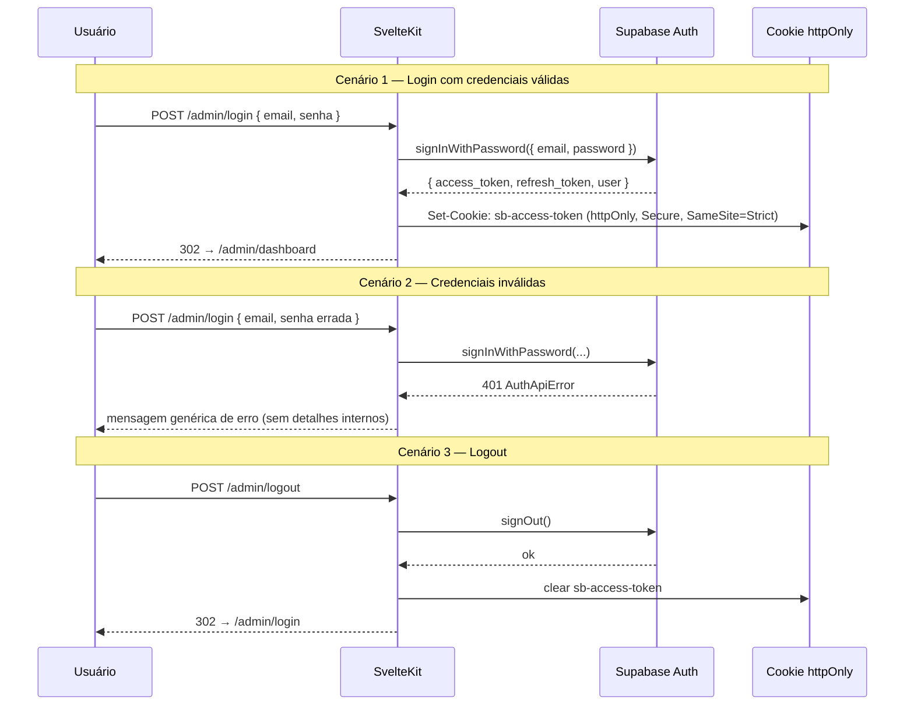

#### Critérios de Aceite Atendidos

| Critério (BDD)                                                                              | RF / RNF     | Status |
| ------------------------------------------------------------------------------------------- | ------------ | ------ |
| Login com credenciais válidas → Supabase Auth gera sessão JWT → redirect `/admin/dashboard` | RF08         | ✅     |
| MFA ativo → código TOTP solicitado antes de emitir sessão                                   | RF08 · RNF08 | ✅     |
| Credenciais inválidas → 401 + mensagem genérica sem expor detalhes internos                 | RF08         | ✅     |
| Logout → `signOut()` + invalida `refresh_token` + limpa cookie + redirect `/admin/login`    | RF09         | ✅     |
| Acesso a `/admin` sem sessão → redirect `/admin/login` sem renderizar dados do painel       | RF09 · RNF01 | ✅     |
| Tempo de autenticação ≤ 2s                                                                  | RNF03        | ✅     |

#### Evidências de Funcionamento

**Tela de Login**

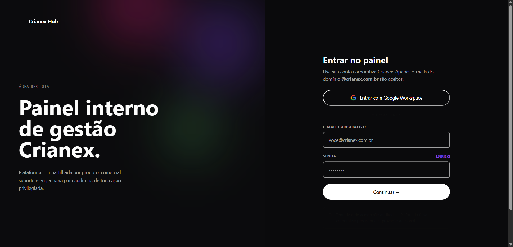

---

**Autenticação de Dois Fatores (2FA)**

Após inserir as credenciais, o usuário escaneia o QR Code no aplicativo autenticador e digita o código TOTP gerado.

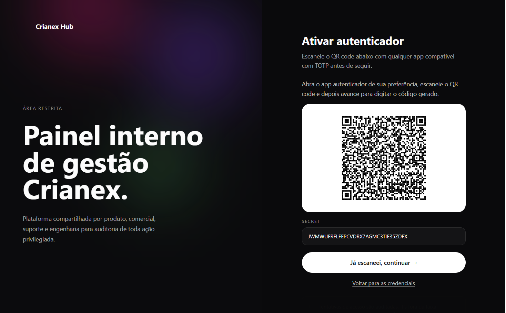

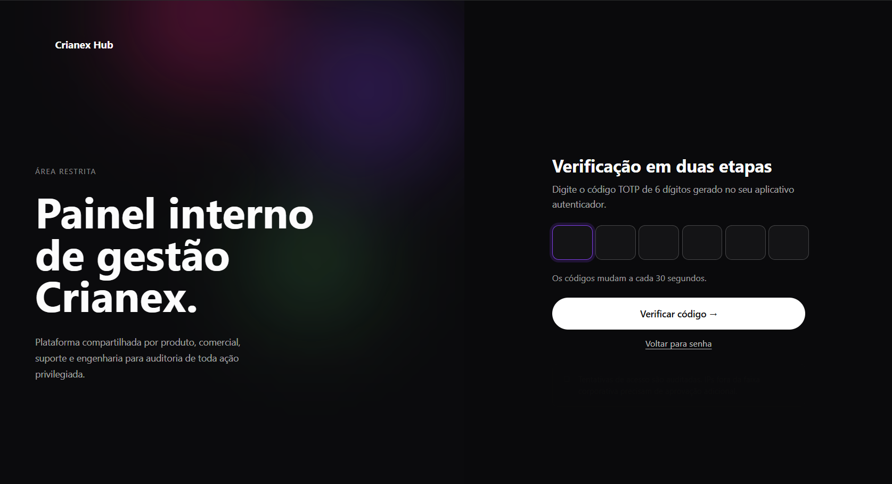

---

#### Validação do Cliente

| Tipo               | Data | Resultado | Observação |
| ------------------ | ---- | --------- | ---------- |
| Partial Validation | —    | ✅        | —          |
| Formal Validation  | —    | ⬜        | —          |

#### Observações

- Sessão gerenciada inteiramente pelo Supabase Auth; token armazenado em cookie `httpOnly` (não `localStorage`) para mitigar XSS.
- Erro 401 retorna mensagem genérica intencionalmente — não diferencia "e-mail inexistente" de "senha errada", prevenindo enumeração de usuários.
- MFA via TOTP (RFC 6238): o QR Code é gerado pelo Supabase Auth SDK no cliente e não trafega pelo backend da aplicação.

---

### F10 — Acessar painel administrativo

> **Issues:** [#57](https://github.com/mdsreq-fga-unb/REQ-2026.1-T02-Crianex-/issues/57)  
> **RFs cobertos:** RF10  
> **RNFs cobertos:** RNF01, RNF03, RNF09

#### Diagrama de Sequência Formal

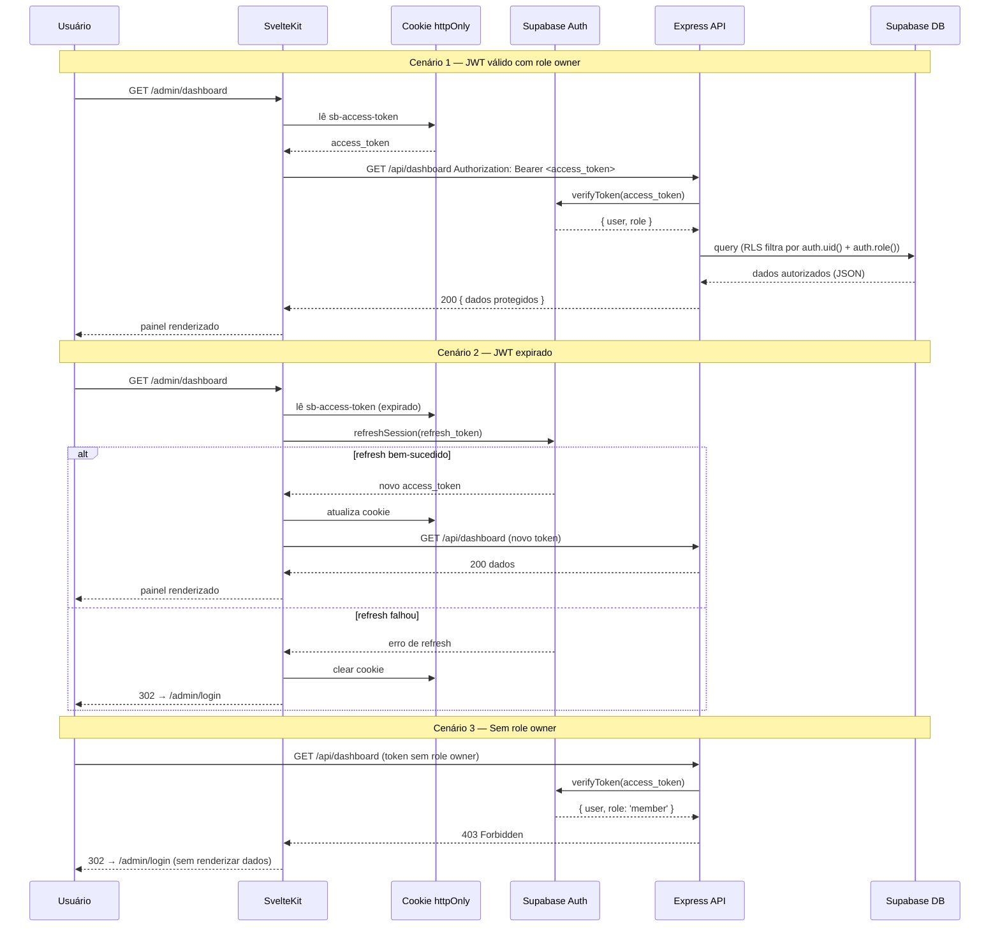

#### Critérios de Aceite Atendidos

| Critério (BDD)                                                                                              | RF / RNF     | Status |
| ----------------------------------------------------------------------------------------------------------- | ------------ | ------ |
| JWT válido com `role = owner` → RLS filtra por `auth.uid()` + `auth.role()` → painel renderizado sem reload | RF10 · RNF09 | ⬜     |
| JWT expirado → `refreshSession()` tentado; se falhar, redirect `/admin/login` sem renderizar dados          | RF10         | ⬜     |
| Token inválido ou sem `role = owner` → 401/403 + redirect `/admin/login` sem expor estrutura                | RF10 · RNF01 | ⬜     |
| Operação no painel → resposta entregue em ≤ 2s em condições normais                                         | RNF03        | ⬜     |

#### Evidências de Funcionamento

_Evidências a serem adicionadas._

#### Validação do Cliente

| Tipo               | Data | Resultado | Observação |
| ------------------ | ---- | --------- | ---------- |
| Partial Validation | —    | ⬜        | —          |
| Formal Validation  | —    | ⬜        | —          |

#### PRs Vinculadas

_A preencher._

#### Observações

- RLS do Supabase opera como segunda camada de autorização; validação de `role = owner` no Express é a primeira — defesa em profundidade intencional.
- O refresh automático de token é tratado no hook `+layout.server.ts` do SvelteKit, transparente ao usuário.
- Redirecionamento ao expirar a sessão ocorre sem flash de conteúdo protegido: o guard corre no servidor antes de qualquer renderização.

---

### F11 — Gerenciar membros da Crianex

> **Issues:** [#58](https://github.com/mdsreq-fga-unb/REQ-2026.1-T02-Crianex-/issues/58)  
> **RFs cobertos:** RF11, RF12, RF13, RF14  
> **RNFs cobertos:** RNF03, RNF09

#### Diagrama de Sequência Formal

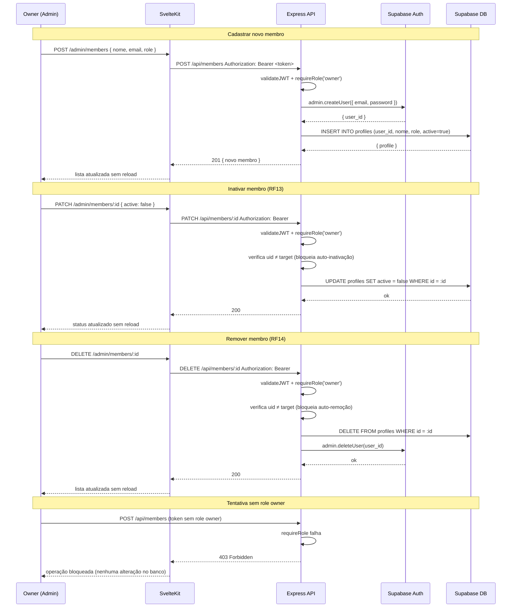

#### Critérios de Aceite Atendidos

| Critério (BDD)                                                                                   | RF / RNF     | Status |
| ------------------------------------------------------------------------------------------------ | ------------ | ------ |
| Owner cadastra novo membro → `createUser()` + insert em `profiles` → lista atualizada sem reload | RF12         | ⬜     |
| Email duplicado → erro informativo sem criar registro duplicado                                  | RF12         | ⬜     |
| Owner edita dados de membro → RLS valida `role = owner` → persiste sem reload                    | RF11 · RNF09 | ⬜     |
| Edição sem `role = owner` → bloqueio 403 pelo RLS sem persistir nada                             | RF11 · RNF09 | ⬜     |
| Owner inativa membro → `active = false` + lista atualizada sem reload                            | RF13         | ⬜     |
| Owner tenta inativar a própria conta → operação bloqueada com mensagem de erro                   | RF13         | ⬜     |
| Owner remove membro → `deleteUser()` + remoção de `profiles` → lista atualizada sem reload       | RF14         | ⬜     |
| Owner tenta remover a própria conta → bloqueado (ao menos um owner ativo garantido)              | RF14         | ⬜     |

#### Evidências de Funcionamento

_Evidências a serem adicionadas._

#### Validação do Cliente

| Tipo               | Data | Resultado | Observação |
| ------------------ | ---- | --------- | ---------- |
| Partial Validation | —    | ⬜        | —          |
| Formal Validation  | —    | ⬜        | —          |

#### PRs Vinculadas

_A preencher._

#### Observações

- Criação de usuário usa `supabase.auth.admin.createUser()` com service role — senha inicial gerada aleatoriamente e enviada por e-mail pelo Supabase.
- A proteção contra auto-inativação/auto-remoção compara o `uid` do token com o `id` alvo na camada Express, evitando lockout acidental do único owner.
- Deleção remove o registro em `profiles` e em seguida chama `admin.deleteUser()` — operação irreversível; soft-delete via `active = false` está disponível para desativação temporária.

---

## CP4 — Vitrine Pública de Produtos SaaS

### F12 — Exibir catálogo de produtos SaaS

> **Issues:** [#55](https://github.com/mdsreq-fga-unb/REQ-2026.1-T02-Crianex-/issues/55)  
> **RFs cobertos:** RF21, RF22, RF23  
> **RNFs cobertos:** RNF02, RNF06, RNF21

#### Diagrama de Sequência Formal

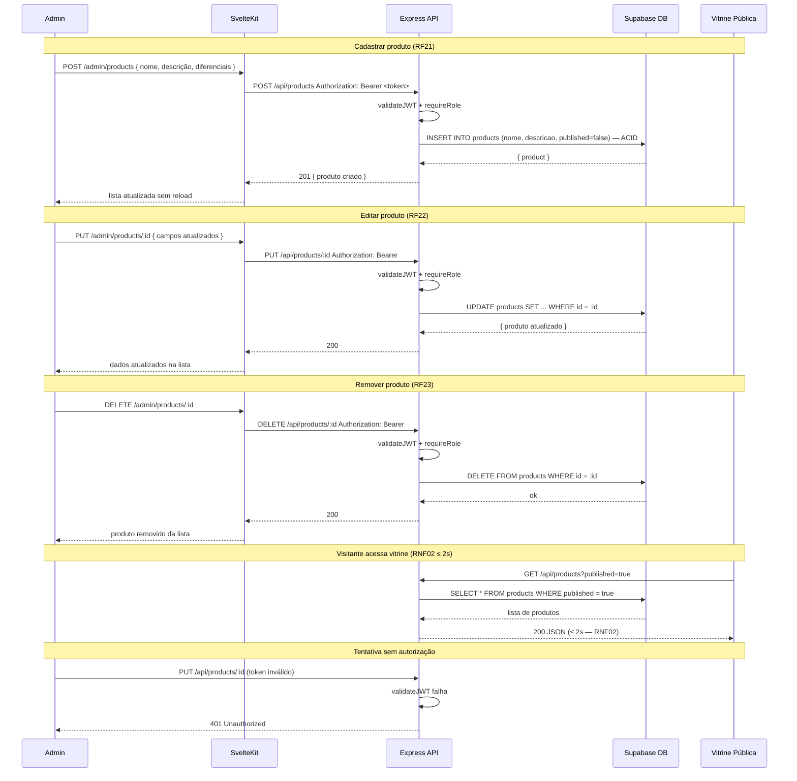

#### Critérios de Aceite Atendidos

| Critério (BDD)                                                                 | RF / RNF        | Status |
| ------------------------------------------------------------------------------ | --------------- | ------ |
| Admin cadastra produto → persistido em transação ACID → apto para publicação   | RF21 · RNF06    | ⬜     |
| Admin edita produto → dados substituídos no banco sem intervenção de dev       | RF22            | ⬜     |
| Admin remove produto → excluído do catálogo e ausente na vitrine imediatamente | RF23            | ⬜     |
| Requisição sem autorização → 401/403 sem executar operação no banco            | RF21–23 · RNF01 | ⬜     |
| Vitrine pública renderiza via SSR → apenas `published = true` em ≤ 2s sem JS   | RNF02 · RNF21   | ⬜     |
| Falha no banco → ROLLBACK completo sem registro parcial                        | RNF06           | ⬜     |

#### Evidências de Funcionamento

_Evidências a serem adicionadas._

#### Validação do Cliente

| Tipo               | Data | Resultado | Observação |
| ------------------ | ---- | --------- | ---------- |
| Partial Validation | —    | ⬜        | —          |
| Formal Validation  | —    | ⬜        | —          |

#### PRs Vinculadas

_A preencher._

#### Observações

- A vitrine usa SSR via `load()` em `+page.server.ts` do SvelteKit — nenhum JS necessário no cliente para renderizar os cards de produto.
- O campo `published` filtra em nível de query; RLS não restringe leitura pública de produtos, apenas escrita/atualização (sem autenticação para visualizar).
- Upload de assets (imagens dos produtos) não estava no escopo desta feature — tratado como extensão futura do painel admin.

---

### F13 — Publicar / despublicar produto SaaS

> **Issues:** [#56](https://github.com/mdsreq-fga-unb/REQ-2026.1-T02-Crianex-/issues/56)  
> **RFs cobertos:** RF25, RF59  
> **RNFs cobertos:** RNF03

#### Diagrama de Sequência Formal

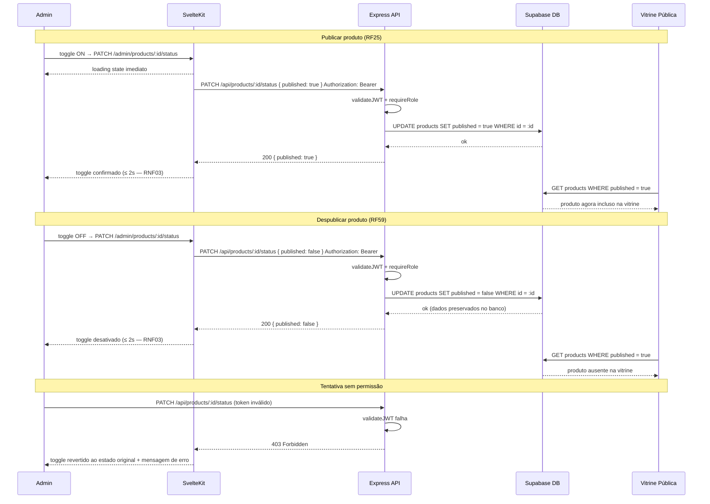

#### Critérios de Aceite Atendidos

| Critério (BDD)                                                                                 | RF / RNF     | Status |
| ---------------------------------------------------------------------------------------------- | ------------ | ------ |
| Admin aciona toggle para publicar → `published = true` + confirmação visual em ≤ 2s            | RF25 · RNF03 | ⬜     |
| Admin aciona toggle para despublicar → produto ocultado da vitrine, dados preservados no banco | RF59 · RNF03 | ⬜     |
| Credenciais inválidas no toggle → API rejeita → toggle revertido + mensagem de erro            | RF25 · RF59  | ⬜     |

#### Evidências de Funcionamento

_Evidências a serem adicionadas._

#### Validação do Cliente

| Tipo               | Data | Resultado | Observação |
| ------------------ | ---- | --------- | ---------- |
| Partial Validation | —    | ⬜        | —          |
| Formal Validation  | —    | ⬜        | —          |

#### PRs Vinculadas

_A preencher._

#### Observações

- Toggle implementado com atualização otimista no cliente: estado muda imediatamente na UI e é revertido em caso de erro da API.
- Operação é um `PATCH` de flag booleana — sem transação multi-tabela, portanto sem risco de estado parcial no banco.
- Decisão de escopo: despublicar preserva todos os dados e mídias do produto; remoção permanente é ação separada (RF23) para evitar perda acidental.

---

### F14 — Formulário de contato

> **Issues:** [#61](https://github.com/mdsreq-fga-unb/REQ-2026.1-T02-Crianex-/issues/61)  
> **RFs cobertos:** RF27  
> **RNFs cobertos:** RNF06, RNF10

#### Diagrama de Sequência Formal

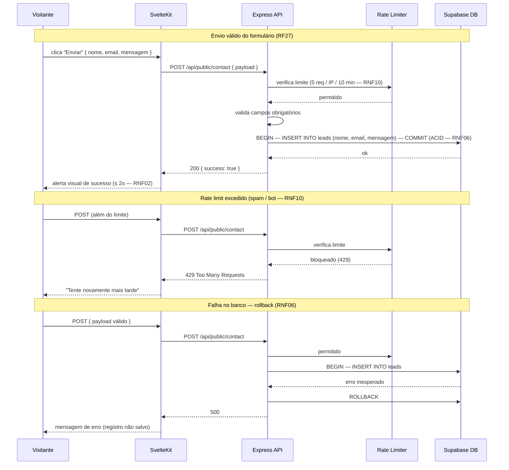

#### Critérios de Aceite Atendidos

| Critério (BDD)                                                               | RF / RNF             | Status |
| ---------------------------------------------------------------------------- | -------------------- | ------ |
| Formulário válido → persistido em transação ACID → alerta de sucesso em ≤ 2s | RF27 · RNF02 · RNF06 | ⬜     |
| Rate limit excedido (5 req/IP/10min) → 429 + "Tente novamente mais tarde"    | RNF10                | ⬜     |
| Falha no banco → ROLLBACK completo sem registro parcial                      | RNF06                | ⬜     |

#### Evidências de Funcionamento

_Evidências a serem adicionadas._

#### Validação do Cliente

| Tipo               | Data | Resultado | Observação |
| ------------------ | ---- | --------- | ---------- |
| Partial Validation | —    | ⬜        | —          |
| Formal Validation  | —    | ⬜        | —          |

#### PRs Vinculadas

_A preencher._

#### Observações

- Rate limit de 5 req/IP/10min implementado via `express-rate-limit` como middleware, antes de qualquer validação de payload — bloqueia bots antes de tocar no banco.
- Campos opcionais (telefone, empresa) não incluídos no MVP — escopo deliberadamente mínimo para IT1.
- Leads salvos na tabela `leads` sem vínculo com contas de usuário; integração com o CRM (CP1) está prevista para IT2.

---

### F15 — Página institucional (Sobre a Crianex)

> **Issues:** [#63](https://github.com/mdsreq-fga-unb/REQ-2026.1-T02-Crianex-/issues/63)  
> **RFs cobertos:** RF28  
> **RNFs cobertos:** RNF02, RNF21

#### Diagrama de Sequência Formal

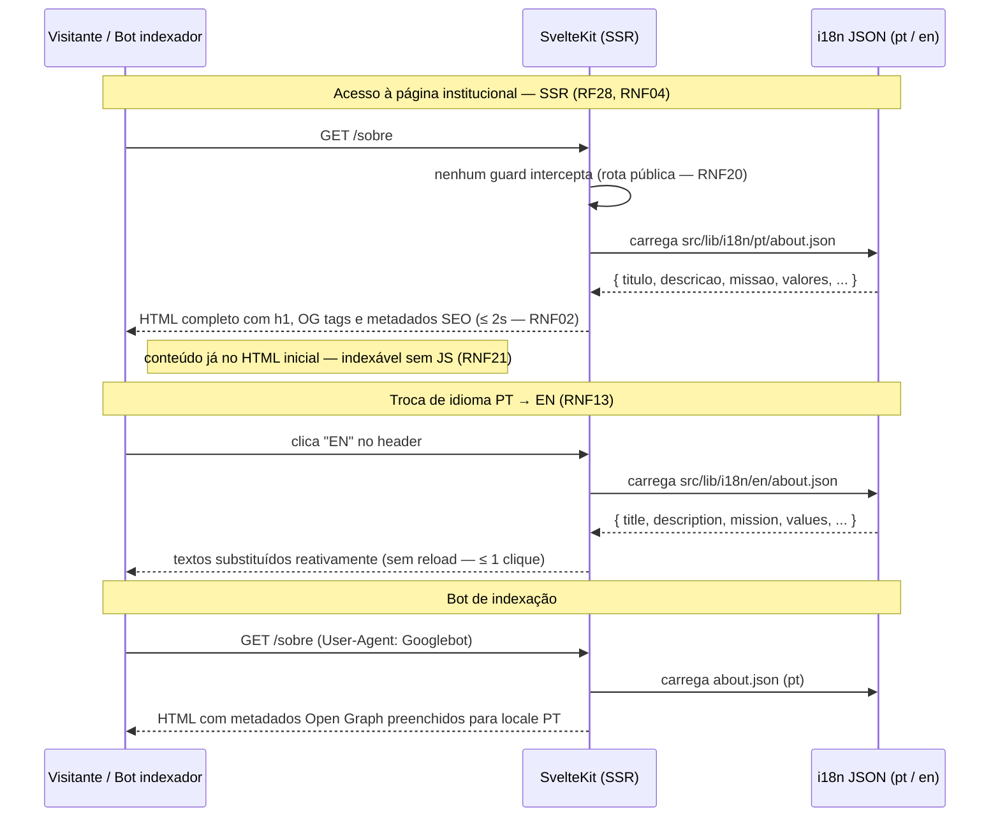

#### Critérios de Aceite Atendidos

| Critério (BDD)                                                                           | RF / RNF             | Status |
| ---------------------------------------------------------------------------------------- | -------------------- | ------ |
| Visitante acessa `/sobre` → SSR carrega i18n estático em ≤ 2s sem chamada a API ou banco | RF28 · RNF02 · RNF04 | ⬜     |
| Visitante clica "EN" → textos trocam para `en/about.json` em ≤ 1 clique sem reload       | RNF13                | ⬜     |
| Bot de indexação → HTML inicial com h1, textos e metadados Open Graph sem depender de JS | RNF04 · RNF21        | ⬜     |
| Visitante sem autenticação → nenhum guard intercepta → conteúdo exibido normalmente      | RNF20                | ⬜     |

#### Evidências de Funcionamento

_Evidências a serem adicionadas._

#### Validação do Cliente

| Tipo               | Data | Resultado | Observação |
| ------------------ | ---- | --------- | ---------- |
| Partial Validation | —    | ⬜        | —          |
| Formal Validation  | —    | ⬜        | —          |

#### PRs Vinculadas

_A preencher._

#### Observações

- Todo conteúdo carregado de arquivos JSON estáticos em `src/lib/i18n/` — zero chamadas a banco ou API, tempo de carregamento depende apenas do SSR.
- Troca de idioma reativa via Svelte store; locale persiste em `localStorage` entre navegações.
- Metadados Open Graph gerados no `+page.server.ts`; sem `<svelte:head>` dinâmico no cliente, garantindo indexabilidade independente de JS.

---

## CP6 — FAQ e Base de Conhecimentos por Produto

### F16 — CRUD de artigos de FAQ

> **Issues:** [#59](https://github.com/mdsreq-fga-unb/REQ-2026.1-T02-Crianex-/issues/59)  
> **RFs cobertos:** RF30, RF31, RF32, RF33  
> **RNFs cobertos:** RNF01, RNF04, RNF05

#### Diagrama de Sequência Formal

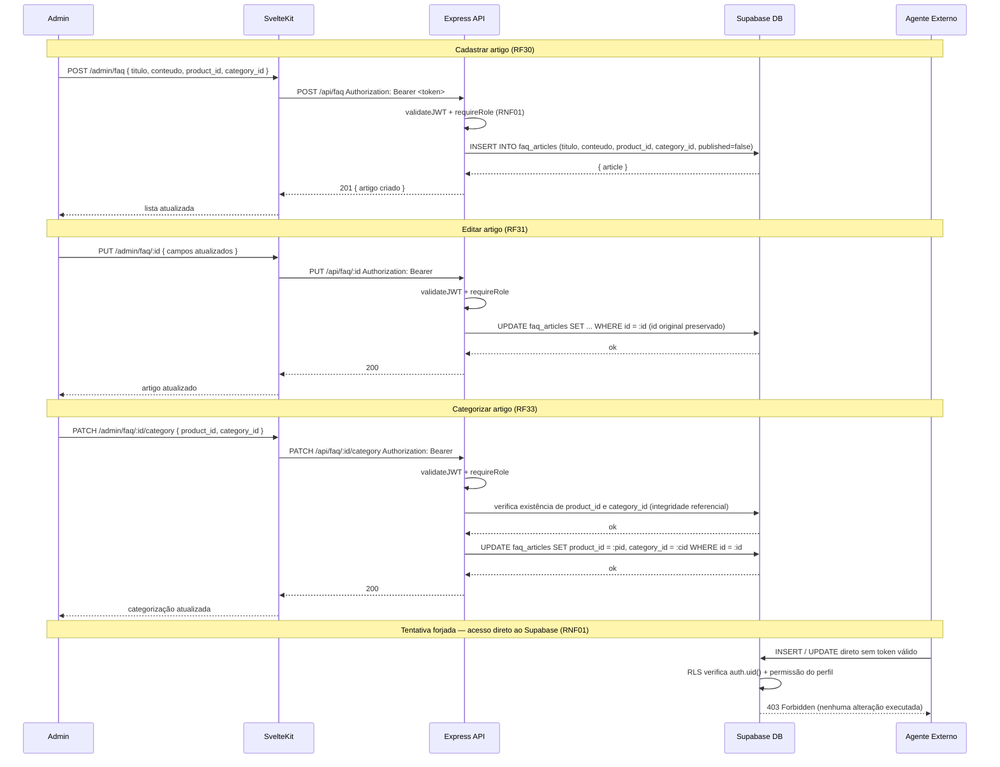

#### Critérios de Aceite Atendidos

| Critério (BDD)                                                                                   | RF / RNF      | Status |
| ------------------------------------------------------------------------------------------------ | ------------- | ------ |
| Admin cadastra artigo (título, conteúdo, produto, categoria) → persistido e apto para publicação | RF30 · RNF01  | ⬜     |
| Admin edita artigo → dados substituídos, ID original preservado                                  | RF31          | ⬜     |
| Admin remove artigo → excluído do banco e ausente na vitrine imediatamente                       | RF32          | ⬜     |
| Admin categoriza artigo → vínculos `product_id` + `category_id` com integridade referencial      | RF33          | ⬜     |
| Agente externo forja requisição sem token → RLS bloqueia com 403 sem alterar dados               | RNF01 · RNF09 | ⬜     |
| Artigos publicados → conteúdo no SSR indexável; despublicados ausentes da resposta SSR           | RNF04 · RNF05 | ⬜     |

#### Evidências de Funcionamento

_Evidências a serem adicionadas._

#### Validação do Cliente

| Tipo               | Data | Resultado | Observação |
| ------------------ | ---- | --------- | ---------- |
| Partial Validation | —    | ⬜        | —          |
| Formal Validation  | —    | ⬜        | —          |

#### PRs Vinculadas

_A preencher._

#### Observações

- Artigos criados com `published = false` por padrão — publicação é ação explícita separada (F17), evitando publicação acidental.
- Integridade referencial entre `faq_articles`, `products` e `faq_categories` garantida por FK no banco; deleção em cascata não habilitada — artigos com produto/categoria inexistente retornam erro informativo.
- RLS bloqueia acesso direto ao Supabase sem passar pelo Express, dupla validação intencional reforçando RNF01.

---

### F17 — Publicar / despublicar artigo de FAQ

> **Issues:** [#60](https://github.com/mdsreq-fga-unb/REQ-2026.1-T02-Crianex-/issues/60)  
> **RFs cobertos:** RF34, RF35  
> **RNFs cobertos:** RNF01, RNF04, RNF05

#### Diagrama de Sequência Formal

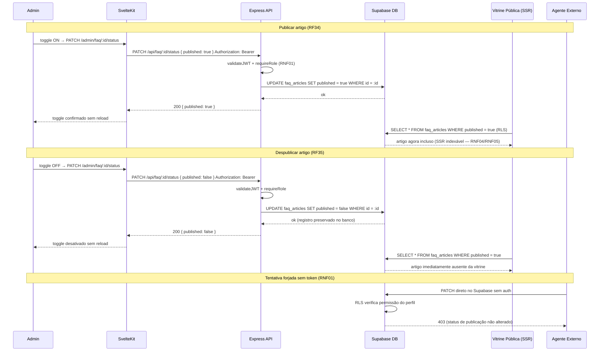

#### Critérios de Aceite Atendidos

| Critério (BDD)                                                                                  | RF / RNF      | Status |
| ----------------------------------------------------------------------------------------------- | ------------- | ------ |
| Admin publica artigo → `published = true` → visível na próxima requisição da vitrine sem reload | RF34 · RNF01  | ⬜     |
| Admin despublica artigo → artigo ausente da vitrine imediatamente, conteúdo preservado no banco | RF35          | ⬜     |
| Agente externo forja requisição sem token → RLS bloqueia com 403 sem alterar status             | RNF01 · RNF09 | ⬜     |
| Artigo publicado → conteúdo e metadados SEO no HTML inicial sem depender de JS                  | RNF04 · RNF05 | ⬜     |

#### Evidências de Funcionamento

_Evidências a serem adicionadas._

#### Validação do Cliente

| Tipo               | Data | Resultado | Observação |
| ------------------ | ---- | --------- | ---------- |
| Partial Validation | —    | ⬜        | —          |
| Formal Validation  | —    | ⬜        | —          |

#### PRs Vinculadas

_A preencher._

#### Observações

- Mesmo padrão de toggle otimista da F13 — consistência intencional na UX do painel admin.
- Despublicar artigo não afeta avaliações já registradas; histórico de ratings preservado para análise futura (Dashboard CP3/IT3).
- A vitrine recarrega artigos publicados a cada requisição SSR; não há cache CDN configurado nesta iteração.

---

### F18 — Avaliação de artigos de FAQ

> **Issues:** [#62](https://github.com/mdsreq-fga-unb/REQ-2026.1-T02-Crianex-/issues/62)  
> **RFs cobertos:** RF37  
> **RNFs cobertos:** RNF02, RNF04, RNF05

#### Diagrama de Sequência Formal

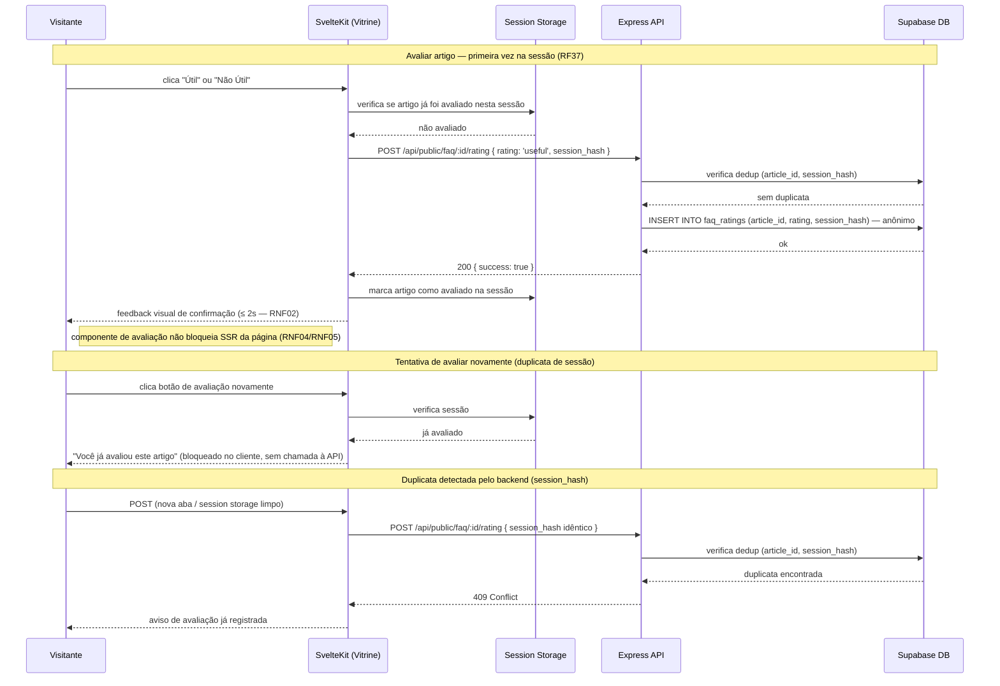

#### Critérios de Aceite Atendidos

| Critério (BDD)                                                                                     | RF / RNF      | Status |
| -------------------------------------------------------------------------------------------------- | ------------- | ------ |
| Visitante clica "Útil" ou "Não Útil" → avaliação persistida anonimamente + feedback visual em ≤ 2s | RF37 · RNF02  | ⬜     |
| Visitante já avaliou o artigo na sessão → interface bloqueia sem chamar a API                      | RF37          | ⬜     |
| `session_hash` já existe no banco para o artigo → backend retorna 409 sem registrar duplicata      | RF37          | ⬜     |
| Componente de avaliação presente → SSR não bloqueado nem degradado                                 | RNF04 · RNF05 | ⬜     |

#### Evidências de Funcionamento

_Evidências a serem adicionadas._

#### Validação do Cliente

| Tipo               | Data | Resultado | Observação |
| ------------------ | ---- | --------- | ---------- |
| Partial Validation | —    | ⬜        | —          |
| Formal Validation  | —    | ⬜        | —          |

#### PRs Vinculadas

_A preencher._

#### Observações

- `session_hash` gerado no cliente via hash de `sessionStorage` + `article_id` — nenhum dado pessoal trafega na requisição de avaliação.
- Deduplicação em dois níveis: `sessionStorage` evita chamada redundante no cliente; constraint única no banco garante consistência mesmo com múltiplas abas abertas.
- Avaliações são anônimas e não expostas na vitrine nesta iteração — análise de utilidade reservada para o Dashboard executivo (CP3/IT3).
