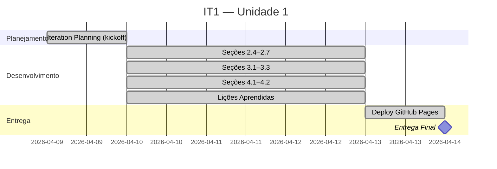

# IT1 — Unidade 1: Documento de Visão

**Período:** 09/04/2026 – 14/04/2026
**Status:** ✅ Concluída
**Entrega:** Documento de Visão — GitHub Pages

---

## Objetivo

Iteração inicial de alinhamento com o cliente e fundação do projeto. O foco foi a produção do **Documento de Visão**, reconhecimento do problema do cliente e a configuração da infraestrutura de documentação (GitHub Pages via MkDocs), com entrega final em **14/04/2026**.

Esta iteração cobre as **etapas 1 e 2 do FDD**:

- **Etapa 1 — Desenvolver Modelo Global:** Brainstorming com o cliente, Rich Picture, Diagrama de Ishikawa, definição do problema central.
- **Etapa 2 — Construir Lista de Funcionalidades:** Identificação dos Objetivos Específicos (OEs) e Características de Produto (CPs) iniciais.

---

## Entregas

| # | Entrega | Responsável | Status |
|---|---------|-------------|--------|
| 1 | Seções 2.4 a 2.7 do Documento de Visão | Hugo e Philipe | ✅ |
| 2 | Seções 3.1 a 3.3 do Documento de Visão | Camille e Leonardo | ✅ |
| 3 | Seções 4.1, 4.2 e Tabela de Engenharia de Requisitos | Heitor e Lucas | ✅ |
| 4 | Lições Aprendidas (10.1), Cronograma e GitHub Pages | Lucas | ✅ |
| 5 | Cenário Atual, Solução Proposta e Correções gerais | Toda a Equipe | ✅ |

---

## Cerimônias e Reuniões

### Iteration Planning — 09/04/2026

Reunião de kickoff realizada via Discord com toda a equipe e o Domain Expert (Otávio Maya / Vitor Marconi).

:material-file-document: [Ver Ata — 09/04/2026](atas/2026-04-09.md)

#### Gravação da Reunião

  <video controls style="width: 100%; display: block;">
    <source src="videos/reuniao-iteracao-1.mp4" type="video/mp4">
    
Seu navegador não suporta reprodução de vídeo.
    <a href="videos/reuniao-iteracao-1.mp4">Baixar o vídeo</a>.

  </video>

---

## Cronograma da Iteração

