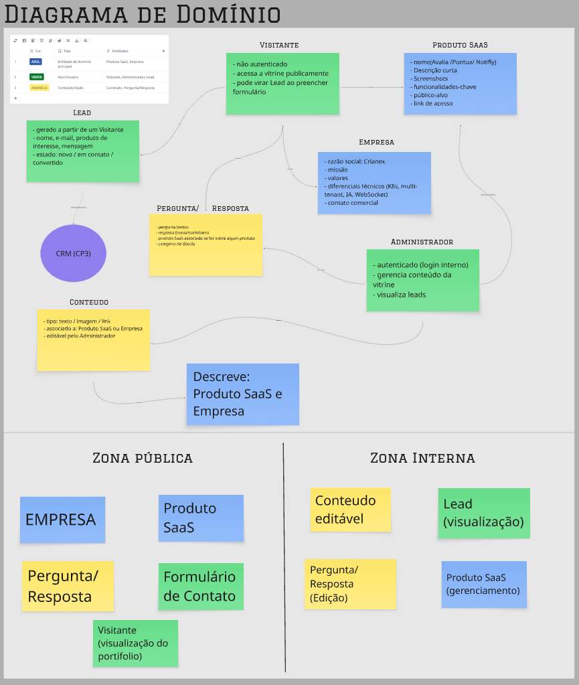
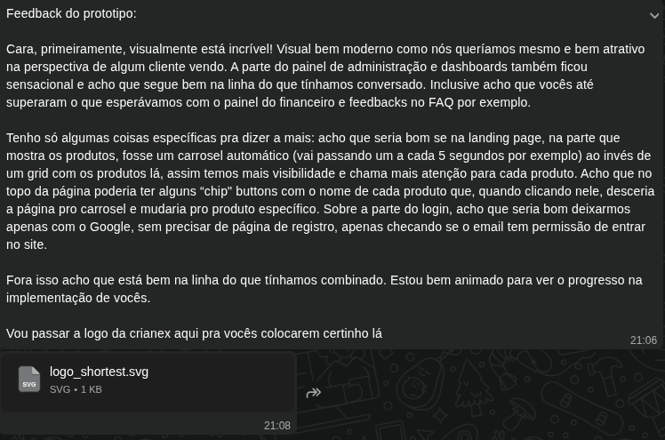

# IT1 — Vitrine Pública

**Período:** 15/04/2026 – 25/05/2026  
**Status:** ✅ Em andamento  
**Meta da Iteração (Iteration Goal):** Ao fim da IT1: (1) qualquer visitante sem autenticação navega pela vitrine pública, visualiza o catálogo de produtos SaaS publicados, consulta informações institucionais e canais de contato da Crianex; (2) um administrador autenticado cadastra, edita, publica e despublica produtos e gerencia usuários via painel seguro; e (3) visitantes consultam e avaliam artigos do FAQ categorizados — tudo em layout responsivo verificado em mobile (≥ 375 px) e desktop (≥ 1 280 px), com Formal Client Validation aprovada por Otavio.

**Observação:** A entrega da unidade 2 ocorrerá dia 19 de maio de 2026, no entanto, nossa iteração termina dia 25 de maio de 2026, por isso alguns dos objetivos definidos para a iteração ainda estarão em fase de conclusão.

---

## Características de Produto (CPs) Trabalhadas

De acordo com o Documento de Visão e o planejamento no Miro, esta iteração foca na entrega de valor para o público externo e interno (visitantes, potenciais leads, cliente e admin), cobrindo as seguintes CPs:

| CP      | Característica de Produto                     | OE Relacionado | Prioridade |
| ------- | --------------------------------------------- | -------------- | ---------- |
| **CP4** | Plataforma Pública de Apresentação da Emprasa | OE2            | Alta       |
| **CP5** | Painel de Gerenciamento do Administrador      | OE2            | Alta       |
| **CP6** | FAQ e Base de Conhecimentos por Produto       | OE2            | Média      |

---

## Cerimônias e Reuniões (FDD + Kanban)

Registro das cerimônias metodológicas realizadas pela equipe para garantir o alinhamento arquitetural e a validação contínua (Definition of Ready e Technical Design Review).

| Data       | Cerimônia                                                  | Participantes                                   | Saída / Ata                                                                             |
| ---------- | ---------------------------------------------------------- | ----------------------------------------------- | --------------------------------------------------------------------------------------- |
| 10/05/2026 | **Domain Modeling & Iteration Replenishment & Commitment** | Lucas, Heitor, Hugo, Otávio (Cliente)           | [Escopo e Iteration Goal definidos.](./atas/2026-05-10.md)                              |
| 11/05/2026 | **Feature Discovery & Slicing**                            | Lucas, Heitor, Hugo, Philipe, Leonardo          | [Features macros fatiadas em issues atômicas](./atas/2026-05-11.md)                     |
| 17/05/2026 | **Technical Design Review**                                | Lucas, Heitor, Philipe, Hugo, Leonardo, Camille | [Diagramas Leves, Critérios de Aceite e Feature Cards aprovados.](./atas/2026-05-17.md) |

---

## Entregas e Decisões de Design (Technical Design)

Durante esta iteração, aplicamos a **Formalização Seletiva**, criando diagramas leves e acordos de arquitetura para mitigar riscos antes de codar, e a validação dos features cards:

  
<strong>Figura 1</strong> — Exemplo de Diagrama Leve

  
  
<em>Fonte: Wondershare, 2026.</em>

  
<strong>Figura 2</strong> — Exemplo de Feature Card

  
  
<em>Fonte: Elaborado pelos autores.</em>

#### **O que é um Diagrama Leve?**

Trata-se de uma representação visual simplificada do fluxo de comunicação entre as entidades do sistema (Frontend, API, Banco de Dados, etc.). Em vez de utilizar toda a notação formal e rigorosa da UML, o diagrama leve foca no essencial: ilustrar de forma clara e ágil como os dados transitam para resolver uma funcionalidade específica. Isso facilita o alinhamento técnico sem gerar sobrecarga de documentação extensa e engessada.

#### **O que é o padrão de Feature Card?**

O Feature Card é um elemento visual utilizado na fase de planejamento (geralmente no Miro ou ferramenta similar) que documenta uma funcionalidade de forma atômica. Ele consolida informações cruciais como o título da feature, regras de negócio e os critérios de aceitação (frequentemente escritos no formato BDD - _Dado/Quando/Então_). Esse modelo garante que toda a equipe tenha clareza do escopo e do comportamento esperado antes de escrever a primeira linha de código, servindo como insumo direto para a criação das _issues_.

---

## Evidências de Entrega e Qualidade

Abaixo estão registradas as evidências das entregas realizadas durante a iteração.

  
<strong>Figura 3</strong> — Glossario de Palavras 

  
  
<em>Fonte: Elaborado pelos autores.</em>

  
<strong>Figura 4</strong> — Glossario de Palavras 

  
  
<em>Fonte: Elaborado pelos autores.</em>

Esse é o glossário de palavras, artefato gerado da Domaing Modeling do FDD, onde listamos e explicamos palavras que devem ter um significado explicítico para o consenso do grupo inteiro, minimizando problemas de compreênsão futura.

  
<strong>Figura 5</strong> — Diagrama de domínio 

  
  
<em>Fonte: Elaborado pelos autores.</em>

Esse é o Diagrama de Domínio, gerado apartir da Domain Modeling do FDD com uma reunião com os nossos Stakeholders (Otávio e Vitor).

  
<strong>Figura 5</strong> — Diagrama Leve Desenvolvida para a Feature F12 

  
  
<em>Fonte: Elaborado pelos autores.</em>

Este diagrama detalha o fluxo arquitetural final acordado e validado, ilustrando a comunicação entre os componentes da Vitrine Pública.

  
<strong>Figura 6</strong> — Feature Card Desenvolvida para a Feature F12 

  
  
<em>Fonte: Elaborado pelos autores.</em>

O feature card consolidado documenta atômicamente os requisitos da funcionalidade, incluindo critérios de aceite formatados em BDD para orientar o desenvolvimento e os testes.

### Evidências por Feature Entregue

O registro detalhado de cada feature — critérios de aceite verificados, evidências de funcionamento (screenshots/vídeos), validação parcial e formal do cliente — está consolidado na página dedicada:

> **[Features Entregues — IT1](./features-entregues.md)**  
> Cobre F09 a F18, agrupadas por CP5 (Painel Admin), CP4 (Vitrine Pública) e CP6 (FAQ).

---

### Rastreabilidade e Priorização do Backlog

Como parte da preparação para esta iteração, o backlog foi estruturado com rastreabilidade completa entre OEs, CPs, Features, RFs e RNFs, e priorizado objetivamente pelo método Valor × Esforço (IP = VB / ES).

- [Rastreabilidade de Requisitos](../../backlog/rastreabilidade.md) — mapeamento completo OEs → CPs → Features → RFs/RNFs com vínculos bidirecionais.
- [Priorização do Backlog](../../backlog/priorizacao.md) — método IP = VB/ES com diagramas de Valor × Esforço e tabelas de prioridade por Feature e RNF.

---

## Protótipo de Alta Fidelidade

> Protótipo desenvolvido em HTML com base nas features priorizadas para a iteração.

  <button onclick="document.getElementById('proto-modal').style.display='flex'"
          style="padding: 6px 16px; background: #2563eb; color: white; border: none; border-radius: 4px; cursor: pointer; font-size: 13px; font-weight: 500;">
    ⛶ &nbsp;Abrir em tela cheia
  </button>

<iframe
  src="./prototipo/Crianex_prototipo_alta_fidelidade/Crianex%20Hub.html"
  width="100%"
  height="540px"
  style="border: 1px solid #ddd; border-radius: 4px; display: block;"
  allowfullscreen>
</iframe>

  

    <button onclick="document.getElementById('proto-modal').style.display='none'"
            style="position:absolute; top:-38px; right:0; padding:6px 16px; background:#ef4444; color:white; border:none; border-radius:4px; cursor:pointer; font-size:13px; font-weight:500;">
      ✕ &nbsp;Fechar
    </button>
    <iframe
      src="./prototipo/Crianex_prototipo_alta_fidelidade/Crianex%20Hub.html"
      width="100%"
      height="100%"
      style="border: none; border-radius: 4px; display: block;"
      allowfullscreen>
    </iframe>
  

---

## Critérios de Aceitação Validados (BDD)

Todas as features abaixo atingiram o _Definition of Ready (DoR)_. Os critérios estão agrupados por feature — não por RF individual — e a coluna **RF / RNF** indica qual requisito cada critério verifica.

### CP5 — Painel de Gerenciamento do Administrador

#### F09 — Autenticar administradores

| #   | Critério de Aceite (BDD)                                                                                                                                                                           | RF / RNF     |
| --- | -------------------------------------------------------------------------------------------------------------------------------------------------------------------------------------------------- | ------------ |
| 1   | **Dado** que o admin acessa `/admin/login` com credenciais válidas, **Quando** submete email e senha, **Então** autentica via Supabase Auth, gera sessão JWT e redireciona para `/admin/dashboard` | RF08         |
| 2   | **Dado** que o MFA está ativo, **Quando** as credenciais base são validadas, **Então** o sistema solicita código TOTP antes de emitir a sessão                                                     | RF08 · RNF08 |
| 3   | **Dado** que as credenciais são inválidas, **Quando** o Supabase Auth processa, **Então** retorna 401 e a interface exibe mensagem genérica sem expor detalhes internos                            | RF08         |
| 4   | **Dado** que o admin aciona "Sair", **Quando** o sistema processa, **Então** invoca `signOut()`, invalida o `refresh_token`, limpa o cookie e redireciona para `/admin/login`                      | RF09         |
| 5   | **Dado** que o admin encerrou sessão e tenta acessar `/admin` diretamente, **Quando** o servidor processa, **Então** redireciona para `/admin/login` sem renderizar nenhum dado do painel          | RF09 · RNF01 |
| 6   | **Dado** que a autenticação é processada pelo Supabase Auth, **Quando** a resposta chega, **Então** o tempo total até a sessão ser emitida não excede 2 segundos                                   | RNF03        |

#### F10 — Acessar painel administrativo

| #   | Critério de Aceite (BDD)                                                                                                                                                                                         | RF / RNF     |
| --- | ---------------------------------------------------------------------------------------------------------------------------------------------------------------------------------------------------------------- | ------------ |
| 1   | **Dado** que o owner possui JWT válido com `role = owner`, **Quando** acessa `/admin`, **Então** o sistema valida o token, aplica RLS filtrando por `auth.uid()` + `auth.role()` e renderiza o painel sem reload | RF10 · RNF09 |
| 2   | **Dado** que o JWT expirou, **Quando** o owner acessa o painel, **Então** o sistema tenta `refreshSession()`; se bem-sucedido continua; se falhar, redireciona para `/admin/login` sem renderizar dados          | RF10         |
| 3   | **Dado** que a requisição chega sem token válido ou sem `role = owner`, **Quando** o middleware intercepta, **Então** bloqueia com 401/403 e redireciona para `/admin/login`                                     | RF10 · RNF01 |
| 4   | **Dado** que o painel carregou e o owner opera qualquer seção, **Quando** a requisição chega ao backend, **Então** a resposta é entregue em ≤ 2 segundos                                                         | RNF03        |
| 5   | **Dado** que um usuário autenticado abre o modal de perfil, **Quando** altera seus dados pessoais ou senha, **Então** o sistema persiste as alterações do próprio perfil e exibe confirmação sem sair do painel   | RF48         |

#### F11 — Gerenciar membros da Crianex

| #   | Critério de Aceite (BDD)                                                                                                                                                        | RF / RNF     |
| --- | ------------------------------------------------------------------------------------------------------------------------------------------------------------------------------- | ------------ |
| 1   | **Dado** que o owner submete dados válidos de novo membro, **Quando** a API processa, **Então** cria via `admin.createUser()`, insere em `profiles` e exibe na lista sem reload | RF12         |
| 2   | **Dado** que o email informado já existe, **Quando** o Supabase Auth processa, **Então** retorna erro informativo sem criar registro duplicado                                  | RF12         |
| 3   | **Dado** que o owner submete alterações válidas em um membro, **Quando** o RLS valida `auth.role() = owner`, **Então** persiste as alterações e retorna feedback sem reload     | RF11 · RNF09 |
| 4   | **Dado** que uma edição chega sem `role = owner`, **Quando** o RLS processa, **Então** bloqueia com 403 sem persistir nada                                                      | RF11 · RNF09 |
| 5   | **Dado** que o owner inativa um membro ativo, **Quando** confirma, **Então** `active = false` é persistido e refletido na lista sem reload                                      | RF13         |
| 6   | **Dado** que o owner tenta inativar a própria conta, **Quando** a API processa, **Então** bloqueia com mensagem de erro                                                         | RF13         |
| 7   | **Dado** que o owner remove um membro, **Quando** confirma, **Então** remove de `profiles` e invoca `admin.deleteUser()`, atualizando a lista sem reload                        | RF14         |
| 8   | **Dado** que o owner tenta remover a própria conta, **Quando** a API processa, **Então** bloqueia garantindo ao menos um owner ativo na plataforma                              | RF14         |

---

### CP4 — Vitrine Pública de Produtos SaaS

#### F12 — Gerenciar produtos SaaS

| #   | Critério de Aceite (BDD)                                                                                                                                                         | RF / RNF        |
| --- | -------------------------------------------------------------------------------------------------------------------------------------------------------------------------------- | --------------- |
| 1   | **Dado** que o admin submete dados válidos de novo produto, **Quando** a API valida o token e processa, **Então** persiste em transação ACID e exibe na lista sem reload         | RF21 · RNF06    |
| 2   | **Dado** que o admin edita produto existente e salva, **Quando** a API processa, **Então** o banco substitui as informações e a vitrine reflete sem intervenção de desenvolvedor | RF22            |
| 3   | **Dado** que o admin confirma remoção, **Quando** a API processa, **Então** produto excluído do catálogo e ausente na vitrine imediatamente                                      | RF23            |
| 4   | **Dado** que o admin arrasta produtos para uma nova ordem, **Quando** confirma a reordenação, **Então** a sequência é persistida e refletida na vitrine pública                  | RF24 · RNF19    |
| 5   | **Dado** que requisição de alteração chega sem autorização, **Quando** o middleware intercepta, **Então** bloqueia com 401/403 sem executar operação no banco                    | RF21–24 · RNF01 |
| 6   | **Dado** que visitante acessa a vitrine, **Quando** o SvelteKit renderiza via SSR, **Então** apenas produtos com `published = true` listados em ≤ 2s sem depender de JS          | RNF02 · RNF04   |
| 7   | **Dado** que ocorre falha no banco durante inserção ou edição, **Quando** o backend detecta, **Então** executa ROLLBACK completo sem registro parcial                            | RNF06           |

#### F13 — Publicar / despublicar produto SaaS

| #   | Critério de Aceite (BDD)                                                                                                                                             | RF / RNF     |
| --- | -------------------------------------------------------------------------------------------------------------------------------------------------------------------- | ------------ |
| 1   | **Dado** que o admin aciona o toggle para publicar, **Quando** a API processa via PATCH, **Então** `published = true` e confirmação visual chega em ≤ 2s             | RF25 · RNF03 |
| 2   | **Dado** que o admin aciona o toggle para despublicar, **Quando** a API processa, **Então** produto imediatamente ocultado da vitrine com dados preservados no banco | RF26 · RNF03 |
| 3   | **Dado** que credenciais inválidas são usadas no toggle, **Quando** a API rejeita, **Então** o toggle reverte ao estado original com mensagem de erro                | RF25 · RF26  |

#### F14 — Formulário de contato

| #   | Critério de Aceite (BDD)                                                                                                                                                        | RF / RNF             |
| --- | ------------------------------------------------------------------------------------------------------------------------------------------------------------------------------- | -------------------- |
| 1   | **Dado** que o visitante preenche o formulário corretamente e clica "Enviar", **Quando** a API processa, **Então** persiste em transação ACID e exibe alerta de sucesso em ≤ 2s | RF27 · RNF02 · RNF06 |
| 2   | **Dado** que o formulário excede o rate limit (5 req/IP/10min), **Quando** a API intercepta, **Então** retorna 429 e a interface exibe "Tente novamente mais tarde"             | RNF10                |
| 3   | **Dado** que ocorre falha inesperada no banco durante inserção, **Quando** o backend detecta, **Então** executa ROLLBACK completo sem registro parcial                          | RNF06                |
| 4   | **Dado** que o visitante precisa consentir com o tratamento de dados, **Quando** marca o aceite LGPD no formulário, **Então** o envio fica habilitado e o consentimento é registrado | RF49 · RNF11         |
| 5   | **Dado** que o visitante acessa o rodapé da vitrine, **Quando** clica nas políticas de privacidade ou cookies, **Então** as páginas de conformidade são exibidas sem autenticação | RF51 · RNF11         |
| 6   | **Dado** que o visitante acessa a vitrine pela primeira vez, **Quando** escolhe aceitar ou recusar cookies, **Então** a preferência é persistida e respeitada nos acessos seguintes | RF55 · RNF11         |

#### F15 — Página institucional

| #   | Critério de Aceite (BDD)                                                                                                                                                       | RF / RNF             |
| --- | ------------------------------------------------------------------------------------------------------------------------------------------------------------------------------ | -------------------- |
| 1   | **Dado** que o visitante acessa `/sobre`, **Quando** o SvelteKit renderiza, **Então** carrega conteúdo dos arquivos i18n estáticos via SSR em ≤ 2s, sem chamada a API ou banco | RF54 · RNF02 · RNF04 |
| 2   | **Dado** que o visitante clica em "EN", **Quando** o locale muda, **Então** todos os textos trocam para `en/about.json` em ≤ 1 clique sem reload                               | RNF13                |
| 3   | **Dado** que a página é acessada por bot de indexação, **Quando** renderiza via SSR, **Então** o HTML inicial contém h1, textos e metadados Open Graph sem depender de JS      | RNF04 · RNF21        |
| 4   | **Dado** que visitante sem autenticação acessa `/sobre`, **Quando** o servidor processa, **Então** nenhum guard intercepta — conteúdo exibido normalmente                      | RNF20                |
| 5   | **Dado** que o visitante abre um produto publicado, **Quando** acessa `/produtos/[slug]`, **Então** visualiza os detalhes completos do produto SaaS sem autenticação           | RF50 · RNF04         |
| 6   | **Dado** que o visitante já definiu preferência de cookies, **Quando** retorna à vitrine, **Então** o sistema mantém a escolha sem solicitar novo consentimento                | RF52                |

---

### CP6 — FAQ e Base de Conhecimentos por Produto

#### F16 — CRUD de artigos de FAQ

| #   | Critério de Aceite (BDD)                                                                                                                                                                       | RF / RNF      |
| --- | ---------------------------------------------------------------------------------------------------------------------------------------------------------------------------------------------- | ------------- |
| 1   | **Dado** que o admin tem permissão e preenche dados válidos, **Quando** cadastra artigo (título, conteúdo, produto, categoria), **Então** persiste e torna o artigo disponível para publicação | RF28 · RNF01  |
| 2   | **Dado** que o admin edita artigo e salva, **Quando** a API processa, **Então** o banco substitui as informações preservando o ID original                                                     | RF29          |
| 3   | **Dado** que o admin confirma remoção de artigo, **Quando** a API processa, **Então** artigo excluído do banco e ausente na vitrine imediatamente                                              | RF30          |
| 4   | **Dado** que o admin altera a categoria, **Quando** salva, **Então** o sistema atualiza vínculos validando integridade referencial de `product_id` e `category_id`                             | RF31          |
| 5   | **Dado** que agente externo forja requisição sem token, **Quando** chega ao banco, **Então** o RLS verifica `auth.uid()` e bloqueia com 403 sem executar alteração                             | RNF01 · RNF09 |
| 6   | **Dado** que artigos publicados existem, **Quando** a vitrine renderiza via SSR, **Então** conteúdo indexável no HTML inicial; despublicados ausentes da resposta SSR                          | RNF04 · RNF05 |

#### F17 — Publicar / despublicar artigo de FAQ

| #   | Critério de Aceite (BDD)                                                                                                                                               | RF / RNF      |
| --- | ---------------------------------------------------------------------------------------------------------------------------------------------------------------------- | ------------- |
| 1   | **Dado** que o admin aciona publicação, **Quando** a API processa via PATCH, **Então** `published = true` e artigo visível na próxima requisição da vitrine sem reload | RF32 · RNF01  |
| 2   | **Dado** que o admin aciona despublicação, **Quando** a API processa, **Então** artigo removido da vitrine imediatamente, registro preservado no banco                 | RF33          |
| 3   | **Dado** que agente externo forja requisição sem token, **Quando** o RLS intercepta, **Então** retorna 403 sem alterar status de publicação                            | RNF01 · RNF09 |
| 4   | **Dado** que artigo está publicado e a vitrine renderiza, **Quando** o SSR processa, **Então** conteúdo e metadados SEO no HTML inicial sem depender de JS             | RNF04 · RNF05 |

#### F18 — Avaliação de artigos de FAQ

| #   | Critério de Aceite (BDD)                                                                                                                                                      | RF / RNF      |
| --- | ----------------------------------------------------------------------------------------------------------------------------------------------------------------------------- | ------------- |
| 1   | **Dado** que o visitante está na página de artigo publicado, **Quando** clica "Útil" ou "Não Útil", **Então** o sistema persiste anonimamente e exibe feedback visual em ≤ 2s | RF34 · RNF02  |
| 2   | **Dado** que o visitante já avaliou o artigo na sessão atual, **Quando** tenta avaliar novamente, **Então** a interface bloqueia sem chamar a API                             | RF34          |
| 3   | **Dado** que o `session_hash` já existe para o artigo no banco, **Quando** nova requisição chega, **Então** o backend retorna 409 Conflict sem registrar duplicata            | RF34          |
| 4   | **Dado** que o componente de avaliação está na página, **Quando** o SSR renderiza, **Então** não bloqueia nem degrada o HTML inicial indexável                                | RNF04 · RNF05 |
| 5   | **Dado** que o visitante consulta a página de FAQ, **Quando** aplica um filtro por termo ou categoria, **Então** a lista exibe apenas artigos compatíveis com o filtro        | RF53          |

---

## Validação pelo Cliente (Domain Expert)

Durante as reuniões com o Domain Expert, colhemos feedbacks essenciais para o alinhamento das expectativas e priorização das funcionalidades do MVP.

  
<strong>Figura 5</strong> — Feedback do Cliente (Domain Expert)

  
  
<em>Fonte: Elaborado pelos autores.</em>

Esta evidência demonstra a participação ativa do cliente no processo de validação contínua e a transparência na comunicação para as tomadas de decisão.

### Validação da Priorização do Backlog

  
<strong>Figura 6</strong> — Feedback do Cliente (Domain Expert) sobre a Priorização do Backlog

  
  
<em>Fonte: Comunicação direta com o cliente (Domain Expert), 17/05/2026.</em>

| Feedback Recebido                                                                   | Aprovação do Cliente | Ação Tomada                                                                                        |
| ----------------------------------------------------------------------------------- | -------------------- | -------------------------------------------------------------------------------------------------- |
| Formato de priorização muito claro — motivo de cada item priorizado está explícito  | ✅ Elogio            | Mantido                                                                                            |
| Features (RFs agrupados) não estão ordenados por prioridade — ao contrário dos RNFs | ✅ Solicita correção | Tabela de Features reordenada por IP decrescente em [priorizacao.md](../../backlog/priorizacao.md) |
| Ausência de flag ou coluna indicando o que entra no MVP                             | ✅ Solicita adição   | Coluna **MVP** adicionada nas tabelas de Features e RNFs (✅ Q1 = Alta / ❌ Q2 em diante)          |
| Dificuldade de leitura de algumas tabelas no GitHub Pages                           | ✅ Registrado        | Tabelas revisadas                                                                                  |

### Validação do Protótipo

  
<strong>Figura 7</strong> — Feedback do cliente Otavio acerca protótipo 

  
  
<em>Fonte: Elaborado pelos autores.</em>

Este é o feedback do nosso Cliente Otávio acerca do protótipo. Realizamos uma segunda versão do protótipo corrigindo o que o cliente nos requisitou.

---
