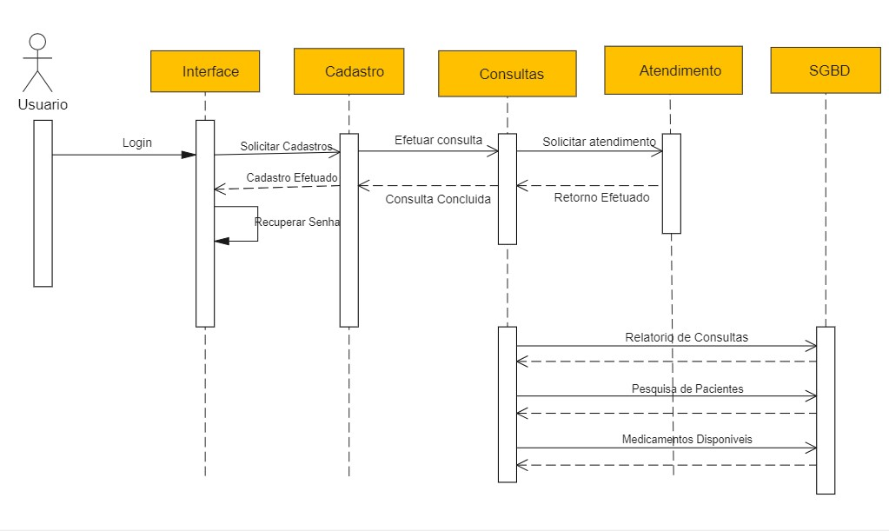
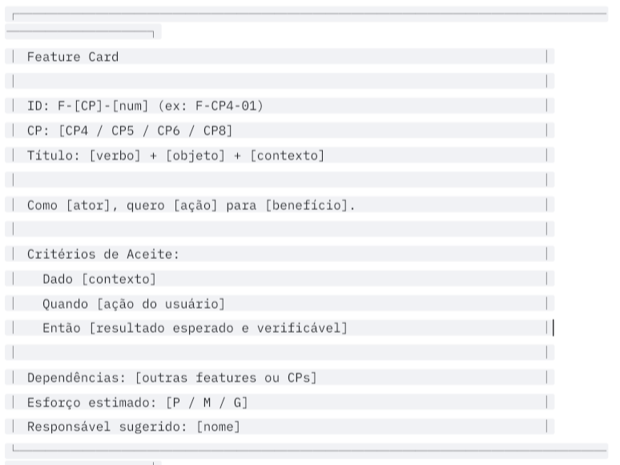
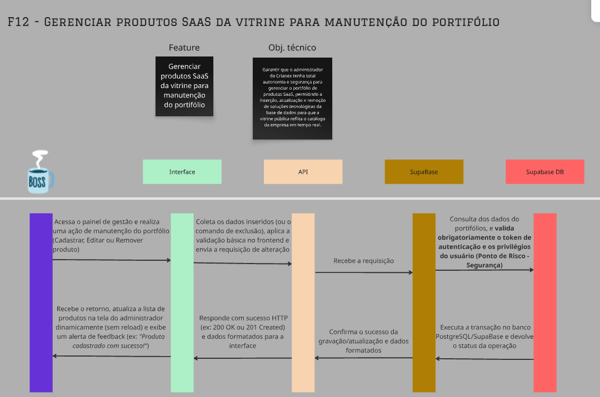
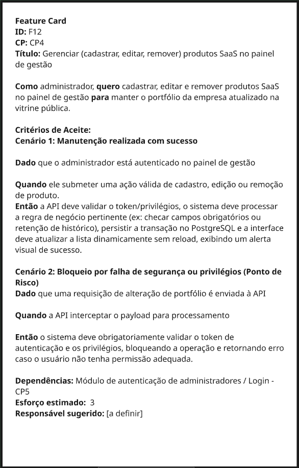
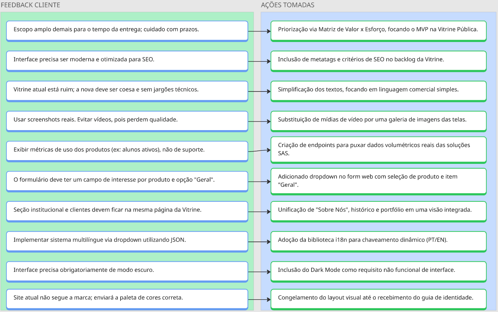
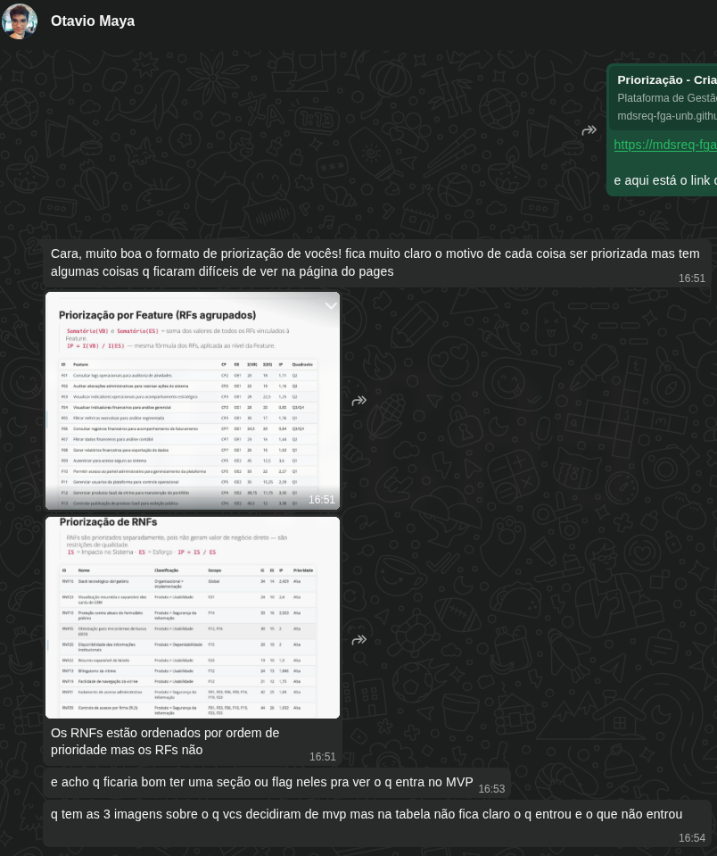

# IT1 — Vitrine Pública

**Período:** 15/04/2026 – 25/05/2026  
**Status:** 🔄 Em andamento  
**Meta da Iteração (Iteration Goal):** Ao fim da IT1: (1) qualquer visitante sem autenticação navega pela vitrine pública, visualiza o catálogo de produtos SaaS publicados, consulta informações institucionais e canais de contato da Crianex; (2) um administrador autenticado cadastra, edita, publica e despublica produtos e gerencia usuários via painel seguro; e (3) visitantes consultam e avaliam artigos do FAQ categorizados — tudo em layout responsivo verificado em mobile (≥ 375 px) e desktop (≥ 1 280 px), com Formal Client Validation aprovada por Otavio.

**Observação:** A entrega da unidade 2 ocorrerá dia 19 de maio de 2026, no entanto, nossa iteração termina dia 25 de maio de 2026, por isso alguns dos objetivos definidos para a iteração ainda estarão em fase de conclusão.

---

## Características de Produto (CPs) Trabalhadas

De acordo com o Documento de Visão e o planejamento no Miro, esta iteração foca na entrega de valor para o público externo e interno (visitantes, potenciais leads, cliente e admin), cobrindo as seguintes CPs:

| CP      | Característica de Produto                     | OE Relacionado | Prioridade |
| ------- | --------------------------------------------- | -------------- | ---------- |
| **CP4** | Plataforma Pública de Apresentação da Emprasa | OE2            | Alta       |
| **CP5** | Painel de Gerenciamento do Administrador      | OE2            | Alta       |
| **CP6** | CP6 - FAQ e Base de Conhecimentos por Produto | OE2            | Média      |

---

## Cerimônias e Reuniões (FDD + Kanban)

Registro das cerimônias metodológicas realizadas pela equipe para garantir o alinhamento arquitetural e a validação contínua (Definition of Ready e Technical Design Review).

| Data       | Cerimônia                                                  | Participantes                                   | Saída / Ata                                                                             |
| ---------- | ---------------------------------------------------------- | ----------------------------------------------- | --------------------------------------------------------------------------------------- |
| 10/05/2026 | **Domain Modeling & Iteration Replenishment & Commitment** | Lucas, Heitor, Hugo, Otávio (Cliente)           | [Escopo e Iteration Goal definidos.](./atas/2026-05-10.md)                              |
| 11/05/2026 | **Feature Discovery & Slicing**                            | Lucas, Heitor, Hugo, Philipe, Leonardo          | [Features macros fatiadas em issues atômicas](./atas/2026-05-11.md)                     |
| 17/05/2026 | **Technical Design Review**                                | Lucas, Heitor, Philipe, Hugo, Leonardo, Camille | [Diagramas Leves, Critérios de Aceite e Feature Cards aprovados.](./atas/2026-05-17.md) |

---

## Entregas e Decisões de Design (Technical Design)

Durante esta iteração, aplicamos a **Formalização Seletiva**, criando diagramas leves e acordos de arquitetura para mitigar riscos antes de codar, e a validação dos features cards:

  
<strong>Figura 1</strong> — Exemplo de Diagrama Leve

  
  
<em>Fonte: Wondershare, 2026.</em>

  
<strong>Figura 2</strong> — Exemplo de Feature Card

  
  
<em>Fonte: Elaborado pelos autores.</em>

#### **O que é um Diagrama Leve?**

Trata-se de uma representação visual simplificada do fluxo de comunicação entre as entidades do sistema (Frontend, API, Banco de Dados, etc.). Em vez de utilizar toda a notação formal e rigorosa da UML, o diagrama leve foca no essencial: ilustrar de forma clara e ágil como os dados transitam para resolver uma funcionalidade específica. Isso facilita o alinhamento técnico sem gerar sobrecarga de documentação extensa e engessada.

#### **O que é o padrão de Feature Card?**

O Feature Card é um elemento visual utilizado na fase de planejamento (geralmente no Miro ou ferramenta similar) que documenta uma funcionalidade de forma atômica. Ele consolida informações cruciais como o título da feature, regras de negócio e os critérios de aceitação (frequentemente escritos no formato BDD - _Dado/Quando/Então_). Esse modelo garante que toda a equipe tenha clareza do escopo e do comportamento esperado antes de escrever a primeira linha de código, servindo como insumo direto para a criação das _issues_.

---

## Evidências de Entrega e Qualidade

Abaixo estão registradas as evidências das entregas realizadas durante a iteração.

  
<strong>Figura 3</strong> — Diagrama Leve Desenvolvida para a Feature F12 

  
  
<em>Fonte: Elaborado pelos autores.</em>

Este diagrama detalha o fluxo arquitetural final acordado e validado, ilustrando a comunicação entre os componentes da Vitrine Pública.

  
<strong>Figura 4</strong> — Feature Card Desenvolvida para a Feature F12 

  
  
<em>Fonte: Elaborado pelos autores.</em>

O feature card consolidado documenta atômicamente os requisitos da funcionalidade, incluindo critérios de aceite formatados em BDD para orientar o desenvolvimento e os testes.

### Rastreabilidade e Priorização do Backlog

Como parte da preparação para esta iteração, o backlog foi estruturado com rastreabilidade completa entre OEs, CPs, Features, RFs e RNFs, e priorizado objetivamente pelo método Valor × Esforço (IP = VB / ES).

- [Rastreabilidade de Requisitos](../../backlog/rastreabilidade.md) — mapeamento completo OEs → CPs → Features → RFs/RNFs com vínculos bidirecionais.
- [Priorização do Backlog](../../backlog/priorizacao.md) — método IP = VB/ES com diagramas de Valor × Esforço e tabelas de prioridade por Feature e RNF.

---

## Protótipo de Alta Fidelidade

> Protótipo desenvolvido em HTML com base nas features priorizadas para a iteração.

  <button onclick="document.getElementById('proto-modal').style.display='flex'"
          style="padding: 6px 16px; background: #2563eb; color: white; border: none; border-radius: 4px; cursor: pointer; font-size: 13px; font-weight: 500;">
    ⛶ &nbsp;Abrir em tela cheia
  </button>

<iframe
  src="./prototipo/Crianex_prototipo_alta_fidelidade/Crianex%20Hub.html"
  width="100%"
  height="540px"
  style="border: 1px solid #ddd; border-radius: 4px; display: block;"
  allowfullscreen>
</iframe>

  

    <button onclick="document.getElementById('proto-modal').style.display='none'"
            style="position:absolute; top:-38px; right:0; padding:6px 16px; background:#ef4444; color:white; border:none; border-radius:4px; cursor:pointer; font-size:13px; font-weight:500;">
      ✕ &nbsp;Fechar
    </button>
    <iframe
      src="./prototipo/Crianex_prototipo_alta_fidelidade/Crianex%20Hub.html"
      width="100%"
      height="100%"
      style="border: none; border-radius: 4px; display: block;"
      allowfullscreen>
    </iframe>
  

---

## Critérios de Aceitação Validados (BDD)

Todas as issues abaixo atingiram o _Definition of Ready (DoR)_ e passaram pela verificação dos requisitos funcionais (RF) e não funcionais (RNF).

### CP4 — Plataforma Pública de Apresentação da Empresa

| Requisito | Descrição                                      | Critério de Aceitação (BDD)                                                                                                                                                                                                                                                                                                                                        |
| --------- | ---------------------------------------------- | ------------------------------------------------------------------------------------------------------------------------------------------------------------------------------------------------------------------------------------------------------------------------------------------------------------------------------------------------------------------ |
| **RF21**  | Cadastrar produto SaaS                         | **Dado** que o administrador está autenticado no painel de gestão, **Quando** ele preencher as informações obrigatórias de uma nova solução SaaS (nome, descrição, diferenciais) e submeter o formulário, **Então** o sistema deve persistir o novo produto no banco de dados e torná-lo imediatamente apto para exibição na vitrine pública.                      |
| **RF22**  | Editar produto SaaS                            | **Dado** que o administrador acessa a lista de produtos existentes, **Quando** ele modificar os dados de um produto ativo (como atualizar um texto ou imagem) e salvar, **Então** o sistema deve substituir as informações antigas no banco e a mudança deve ser refletida na vitrine sem a necessidade de intervenção de um desenvolvedor.                        |
| **RF23**  | Remover produto SaaS                           | **Dado** que a Crianex descontinuou uma solução SaaS, **Quando** o administrador confirmar a ação de remover (ou inativar) o produto no painel, **Então** o sistema deve processar a exclusão do catálogo e garantir que o produto deixe imediatamente de ser listado na vitrine pública para os clientes.                                                         |
| **RF25**  | Publicar produto SaaS                          | **Dado** que o administrador acessa o painel de gerenciamento de produtos, **Quando** ele acionar a opção de "Publicar" um produto que estava inativo, **Então** o sistema deve alterar o status do registro e torná-lo imediatamente visível e acessível para os visitantes na vitrine pública.                                                                   |
| **RF59**  | Despublicar produto SaaS                       | **Dado** que um produto SaaS está atualmente visível na vitrine, **Quando** o administrador acionar a opção de "Despublicar", **Então** o sistema deve ocultá-lo imediatamente da interface pública, preservando todos os dados e o histórico do produto intactos no banco de dados (sem exclusão).                                                                |
| **RF27**  | Cadastrar contato com a empresa                | **Dado** que o visitante preencheu corretamente os campos do formulário de contato (ex: nome, e-mail, mensagem) no rodapé da vitrine, **Quando** ele clicar em "Enviar", **Então** o sistema deve registrar a mensagem no banco de dados e exibir um alerta visual de sucesso na tela.                                                                             |
| **RF28**  | Acessar página institucional                   | **Dado** que o visitante está navegando pela vitrine pública, **Quando** ele clicar no link de "Sobre nós" ou "Sobre" ou "Institucional", **Então** o sistema deve redirecioná-lo para a rota correspondente e exibir os dados de apresentação da empresa.                                                                                                         |
| **RNF02** | Tempo de resposta da vitrine                   | **Dado** que o visitante solicita o acesso à página institucional, **Quando** o sistema processar a requisição e montar a interface, **Então** o tempo total de carregamento dos dados não deve ultrapassar um limite aceitável (ex: 2 segundos), garantindo fluidez e retenção.                                                                                   |
| **RNF03** | Tempo de resposta da área administrativa       | **Dado** que o administrador comanda a ação de publicação ou despublicação no painel, **Quando** o sistema processar a requisição, **Então** o tempo de resposta do servidor e da interface para confirmar o sucesso da operação não deve exceder 2 segundos, garantindo a fluidez exigida para a área administrativa.                                             |
| **RNF06** | Integridade transacional                       | **Dado** que o backend iniciou o processo de gravação do contato, **Quando** ocorrer uma falha inesperada de comunicação com o banco de dados no meio da operação, **Então** o sistema deve realizar a reversão total da transação (rollback) para evitar o salvamento de registros corrompidos ou parciais, alertando o usuário sobre o erro.                     |
| **RNF10** | Proteção contra abuso do formulário público    | **Dado** que o formulário está exposto publicamente na vitrine, **Quando** uma tentativa de submissão ocorrer, **Então** o sistema (API) deve validar a requisição por meio de um mecanismo de proteção (Rate Limiting) antes de processá-la, bloqueando envios maliciosos ou realizados por spam.                                                                 |
| **RNF21** | Disponibilidade das informações institucionais | **Dado** que um artigo de FAQ foi publicado pelo administrador, **Quando** a página pública da base de conhecimento for renderizada, **Então** o conteúdo do artigo publicado deve estar disponível na resposta SSR de forma íntegra e indexável, sem depender de execução de JavaScript pelo crawler, e artigos despublicados não devem aparecer na resposta SSR. |

### CP5 — Painel de Gerenciamento do Administrador

| Requisito | Descrição                                 | Critério de Aceitação (BDD)                                                                                                                                                                                                                                                                                                                                                                                                                                                                                                     |
| --------- | ----------------------------------------- | ------------------------------------------------------------------------------------------------------------------------------------------------------------------------------------------------------------------------------------------------------------------------------------------------------------------------------------------------------------------------------------------------------------------------------------------------------------------------------------------------------------------------------- |
| **RF08**  | Autenticar perfil de usuário              | **Cenário 1:** Dado que o administrador está na tela de login com credenciais válidas cadastradas no Supabase Auth, Quando submete email e senha corretos, Então o sistema deve autenticar via Supabase Auth, gerar sessão JWT e redirecionar para '/admin'.  **Cenário 2:** Dado que o administrador insere email ou senha incorretos, Quando submete o formulário, Então o Supabase Auth deve retornar erro e a interface deve exibir mensagem genérica sem expor detalhes internos.                                    |
| **RF09**  | Encerrar sessão                           | **Cenário 1:** Dado que o administrador está autenticado no painel, Quando aciona "Sair", Então o sistema deve invocar signOut() no Supabase Auth, invalidar o refresh_token server-side, limpar a sessão local e redirecionar para '/admin/login'.  **Cenário 2:** Dado que o administrador encerrou a sessão, Quando tenta acessar /admin diretamente pela URL, Então o sistema deve bloquear o acesso e redirecionar para /admin/login, sem renderizar nenhum dado do painel.                                                      |
| **RNF01** | Isolamento de acesso administrativo       | **Dado** que a Crianex quer entrar na área administrativa da empresa, **Quando** o administrador/membro entra no domínio do site (diferente da vitrine pública), **Então** o sistema deve mostrar na tela a área de login para o membro/admin poder acessar o conteúdo.                                                                                                                                                                                                                                                         |
| **RNF03** | Tempo de resposta da área administrativa  | **Cenário 1:** Dado que o administrador está autenticado e acessa qualquer tela do painel, Quando a requisição é enviada ao Supabase, Então a resposta deve ser entregue em no máximo 2 segundos em condições normais de rede.  **Cenário 2:** Dado que múltiplos administradores acessam o painel simultaneamente, Quando o volume de requisições aumenta, Então o tempo de resposta não deve ultrapassar 4 segundos e o sistema não deve retornar erro 500.                                                             |
| **RF10**  | Acessar painel administrativo             | **Cenário 1:** Dado que o administrador possui sessão JWT válida com role admin, Quando acessa a rota /admin, Então o sistema deve validar o token via Supabase Auth, aplicar RLS no banco e renderizar o painel com os dados permitidos para aquele perfil.  **Cenário 2:** Dado que o administrador possui sessão expirada, Quando tenta acessar o painel, Então o sistema deve tentar renovar via refreshSession() e, se falhar, redirecionar para /admin/login sem renderizar nenhum dado.                                  |
| **RNF09** | Controle de acesso por linha (RLS)        | **Cenário 1:** Dado que o administrador autenticado realiza uma query no Supabase DB, Quando a requisição chega ao banco, Então a política RLS deve filtrar os dados com base em auth.uid() e auth.role(), retornando apenas os registros autorizados para aquele usuário.  **Cenário 2:** Dado que um administrador autenticado tenta acessar dados fora do seu escopo, Quando a query é executada no Supabase DB, Então a política RLS deve bloquear server-side e retornar conjunto vazio ou 403.                      |
| **RF11**  | Editar informações de usuários da Crianex | **Cenário 1:** Dado que o owner está autenticado no painel, Quando submete alterações válidas nos dados de um usuário da Crianex, Então o sistema deve validar via RLS que auth.role() = owner, persistir as alterações no banco e retornar feedback visual de sucesso sem reload.  **Cenário 2:** Dado que uma requisição de edição é enviada sem role owner, Quando o Supabase DB processa a query, Então a política RLS deve bloquear a operação com 403, sem persistir nenhuma alteração.                             |
| **RF12**  | Cadastrar novo membro                     | **Cenário 1:** Dado que o owner está autenticado no painel, Quando submete formulário com dados válidos do novo membro, Então o sistema deve criar o usuário via supabase.auth.admin.createUser(), inserir o perfil na tabela profiles e exibir o novo membro na lista sem reload.  **Cenário 2:** Dado que o owner tenta cadastrar um membro com email já existente, Quando a requisição chega ao Supabase Auth, Então o sistema deve retornar erro e exibir mensagem informativa sem criar registro duplicado.          |
| **RF13**  | Inativar membro cadastrado                | **Cenário 1:** Dado que o owner está autenticado e seleciona um membro ativo, Quando confirma a ação de inativação, Então o sistema deve atualizar active = false no perfil via Supabase DB e refletir o novo status na lista sem reload.  **Cenário 2:** Dado que o owner tenta inativar sua própria conta, Quando a requisição é processada, Então o sistema deve bloquear a operação e exibir mensagem de erro, impedindo auto-inativação.                                                                             |
| **RF14**  | Remover membro cadastrado                 | **Cenário 1:** Dado que o owner está autenticado e seleciona um membro para remoção, Quando confirma a ação, Então o sistema deve remover o perfil da tabela profiles e deletar o usuário via supabase.auth.admin.deleteUser(), removendo o item da lista sem reload.  **Cenário 2:** Dado que o owner tenta remover sua própria conta, Quando a requisição é processada, Então o sistema deve bloquear a operação com erro, impedindo auto-remoção e garantindo que sempre exista ao menos um owner ativo na plataforma. |

### CP7 — FAQ e Base de Conhecimento

| Requisito | Descrição                                                          | Critério de Aceitação (BDD)                                                                                                                                                                                                                                                                                                                                                                                                                                                                                                   |
| --------- | ------------------------------------------------------------------ | ----------------------------------------------------------------------------------------------------------------------------------------------------------------------------------------------------------------------------------------------------------------------------------------------------------------------------------------------------------------------------------------------------------------------------------------------------------------------------------------------------------------------------- |
| **RF30**  | Cadastrar artigo de FAQ                                            | **Dado** que o administrador está autenticado no painel de gestão, **Quando** ele preencher as informações obrigatórias de um novo artigo de FAQ (título, conteúdo, produto SaaS associado e categoria de dúvida) e submeter o formulário, **Então** o sistema deve persistir o novo artigo no banco de dados e torná-lo imediatamente disponível para as ações de publicação na base de conhecimento.                                                                                                                        |
| **RF31**  | Editar artigo de FAQ                                               | **Dado** que o administrador acessa a lista de artigos de FAQ existentes, **Quando** ele modificar os dados de um artigo (como atualizar o título, o conteúdo ou ajustar a redação de uma resposta) e salvar, **Então** o sistema deve substituir as informações antigas no banco preservando o ID original do artigo, e a alteração deve ser refletida na vitrine pública sem necessidade de intervenção de um desenvolvedor.                                                                                                |
| **RF32**  | Remover artigo de FAQ                                              | **Dado** que um artigo de FAQ se tornou obsoleto ou incorreto, **Quando** o administrador confirmar a ação de remover o artigo no painel, **Então** o sistema deve processar a exclusão do registro e garantir que o artigo deixe imediatamente de ser listado na vitrine pública para os visitantes.                                                                                                                                                                                                                         |
| **RF33**  | Categorizar artigo de FAQ                                          | **Dado** que o administrador acessa um artigo de FAQ, **Quando** ele selecionar ou alterar o produto SaaS associado e a categoria de dúvida do artigo e salvar, **Então** o sistema deve atualizar os vínculos de categorização preservando a integridade referencial, validando que tanto o produto SaaS quanto a categoria existam previamente.                                                                                                                                                                             |
| **RF34**  | Publicar artigo de FAQ                                             | **Dado** que existe um artigo de FAQ cadastrado e em estado não publicado, **Quando** o administrador acionar a ação de publicar o artigo no painel de gestão, **Então** o sistema deve atualizar a flag de publicação do registro e o artigo deve passar a constar nas consultas públicas da vitrine na próxima requisição do visitante, sem necessidade de novo deploy ou intervenção técnica.                                                                                                                              |
| **RF35**  | Despublicar artigo de FAQ                                          | **Dado** que existe um artigo de FAQ em estado publicado e visível na vitrine, **Quando** o administrador acionar a ação de despublicar o artigo no painel de gestão, **Então** o sistema deve atualizar a flag de publicação do registro e o artigo deve deixar de ser listado na vitrine pública imediatamente, preservando o conteúdo no banco para eventual republicação posterior.                                                                                                                                       |
| **RF37**  | Avaliar artigo de FAQ                                              | **Dado** que o visitante está visualizando um artigo de FAQ publicado na vitrine pública da base de conhecimento, **Quando** ele clicar em um dos botões de avaliação (Útil ou Não útil) ao final do artigo, **Então** o sistema deve persistir a avaliação no banco de dados de forma anônima, sem coletar dado pessoal identificável do visitante, e atualizar imediatamente o componente de feedback na interface para indicar que a avaliação foi registrada.                                                             |
| **RNF01** | Endpoint administrativo isolado (aplicado a RF30-RF35)             | **Dado** que as rotas de gestão de artigos de FAQ pertencem à área administrativa, **Quando** qualquer requisição às operações de Cadastrar, Editar, Remover, Categorizar, Publicar ou Despublicar for recebida pelo servidor, **Então** o endpoint deve estar servido em domínio distinto e não referenciado publicamente, exigindo autenticação válida para qualquer resposta diferente de 401/403.                                                                                                                         |
| **RNF02** | Tempo de resposta da vitrine (aplicado a RF37)                     | **Dado** que o visitante submete uma avaliação de utilidade sobre um artigo de FAQ na vitrine pública, **Quando** o sistema processar a requisição de gravação, **Então** o tempo de resposta entre o clique no botão e a confirmação visual da avaliação registrada não deve exceder 2 segundos em 95% das requisições, garantindo a fluidez exigida para a experiência da vitrine.                                                                                                                                          |
| **RNF04** | Renderização server-side da vitrine pública (aplicado a RF30-RF37) | **Dado** que um artigo de FAQ foi cadastrado, editado ou teve seu estado de publicação alterado pelo administrador, **Quando** a página pública da base de conhecimento for renderizada, **Então** o conteúdo do artigo publicado deve estar disponível na resposta SSR de forma íntegra e indexável, sem depender de execução de JavaScript pelo crawler, e artigos despublicados não devem aparecer na resposta SSR. O componente de avaliação não deve bloquear nem degradar a renderização inicial do conteúdo indexável. |
| **RNF05** | Otimização para mecanismos de busca (SEO) (aplicado a RF30-RF37)   | **Dado** que o administrador cadastra, edita ou altera o estado de publicação de um artigo de FAQ, **Quando** o artigo for renderizado publicamente, **Então** os metadados de SEO derivados do conteúdo persistido (título, descrição, estrutura semântica) devem estar corretamente preenchidos na página pública para que o artigo seja encontrável por mecanismos de busca, e o componente de avaliação não deve interferir na estrutura semântica da página.                                                             |

---

## Validação pelo Cliente (Domain Expert)

Durante as reuniões com o Domain Expert, colhemos feedbacks essenciais para o alinhamento das expectativas e priorização das funcionalidades do MVP.

  
<strong>Figura 5</strong> — Feedback do Cliente (Domain Expert)

  
  
<em>Fonte: Elaborado pelos autores.</em>

Esta evidência demonstra a participação ativa do cliente no processo de validação contínua e a transparência na comunicação para as tomadas de decisão.

### Validação da Priorização do Backlog

  
<strong>Figura 6</strong> — Feedback do Cliente (Domain Expert) sobre a Priorização do Backlog

  
  
<em>Fonte: Comunicação direta com o cliente (Domain Expert), 17/05/2026.</em>

| Feedback Recebido                                                                   | Aprovação do Cliente | Ação Tomada                                                                                        |
| ----------------------------------------------------------------------------------- | -------------------- | -------------------------------------------------------------------------------------------------- |
| Formato de priorização muito claro — motivo de cada item priorizado está explícito  | ✅ Elogio            | Mantido                                                                                            |
| Features (RFs agrupados) não estão ordenados por prioridade — ao contrário dos RNFs | ✅ Solicita correção | Tabela de Features reordenada por IP decrescente em [priorizacao.md](../../backlog/priorizacao.md) |
| Ausência de flag ou coluna indicando o que entra no MVP                             | ✅ Solicita adição   | Coluna **MVP** adicionada nas tabelas de Features e RNFs (✅ Q1 = Alta / ❌ Q2 em diante)          |
| Dificuldade de leitura de algumas tabelas no GitHub Pages                           | ✅ Registrado        | Tabelas revisadas                                                                                  |

### Validação do Protótipo

---

## Cronograma da Iteração

  
<strong>Figura 6</strong> — Roadmap e Cronograma (FDD + Scrumban Enxuto)

  
  
<em>Fonte: Elaborado pelos autores.</em>

