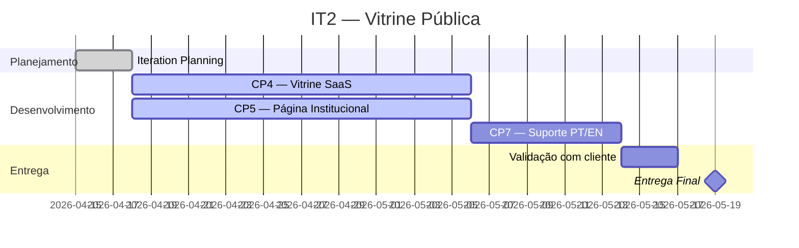

# IT2 — Vitrine Pública

**Período:** 15/04/2026 – 19/05/2026
**Status:** 🔄 Em andamento
**Meta:** "Qualquer visitante acessa a vitrine pública da Crianex, vê o portfólio de SaaS, com página institucional e suporte PT/EN, em layout responsivo."

---

## Características de Produto (CPs)

| CP | Característica | OE | Prioridade |
|----|---------------|-----|------------|
| CP4 | Vitrine pública de produtos SaaS (portfólio) | OE2 | Alta |
| CP5 | Página Institucional da empresa | OE2 | Alta |
| CP7 | Suporte multilíngue PT/EN | OE2 | Alta |

---

## Cerimônias e Reuniões

!!! info "Adicionar reuniões"
    Registre as reuniões desta iteração criando atas em `atas/YYYY-MM-DD.md` e linkando abaixo.

| # | Data | Cerimônia | Ata |
|---|------|-----------|-----|
| — | — | Iteration Planning | — |

---

## Entregas

!!! info "Em andamento"
    As entregas serão registradas conforme o desenvolvimento avança.

---

## Evidências de Entrega

### PRs Mergeados

| # | Feature | PR | Revisor | Data de Merge |
|---|---------|-----|---------|---------------|
| — | — | — | — | — |

### Demonstração das Features

!!! tip "Como registrar"
    Adicione abaixo links para gravações de demo, screenshots ou protótipos validados.

<!-- Exemplo:
#### CP4 — Vitrine pública de produtos SaaS

#### CP5 — Página Institucional

#### CP7 — Suporte PT/EN

-->

### Critérios de Aceitação Validados

| US | Feature | Critério | Validado por | Data |
|----|---------|----------|--------------|------|
| US-01 | F-01 — Listar catálogo SaaS | — | — | — |
| US-02 | F-02 — Detalhes de produto | — | — | — |
| US-03 | F-03 — Página institucional | — | — | — |
| US-04 | F-04 — Equipe e história | — | — | — |
| US-05 | F-05 — Vitrine em inglês | — | — | — |
| US-06 | F-06 — Alternar idioma PT/EN | — | — | — |

### Validação pelo Cliente / Professor

| Data | Origem | Feedback | Issue Aberta | Resolvida |
|------|--------|----------|--------------|-----------|
| — | — | — | — | — |

---

## Cronograma da Iteração

