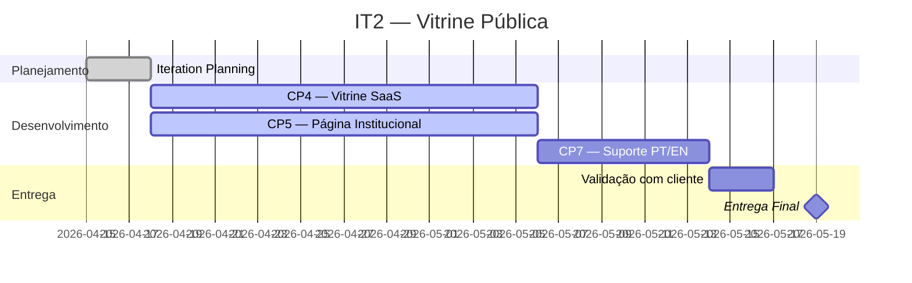

# IT2 — Vitrine Pública

**Período:** 15/04/2026 – 19/05/2026
**Status:** 🔄 Em andamento
**Meta:** "Qualquer visitante acessa a vitrine pública da Crianex, vê o portfólio de SaaS, com página institucional e suporte PT/EN, em layout responsivo."

---

## Características de Produto (CPs)

| CP | Característica | OE | Prioridade |
|----|---------------|-----|------------|
| CP4 | Vitrine pública de produtos SaaS (portfólio) | OE2 | Alta |
| CP5 | Página Institucional da empresa | OE2 | Alta |
| CP7 | Suporte multilíngue PT/EN | OE2 | Alta |

---

## Cerimônias e Reuniões

!!! info "Adicionar reuniões"
    Registre as reuniões desta iteração criando atas em `atas/YYYY-MM-DD.md` e linkando abaixo.

| # | Data | Cerimônia | Ata |
|---|------|-----------|-----|
| — | — | Iteration Planning | — |

---

## Entregas

!!! info "Em andamento"
    As entregas serão registradas conforme o desenvolvimento avança.

---

## Cronograma da Iteração

