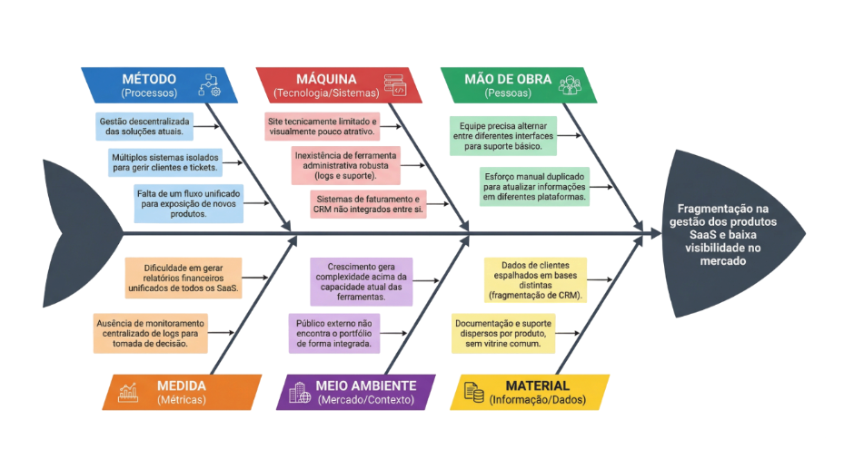
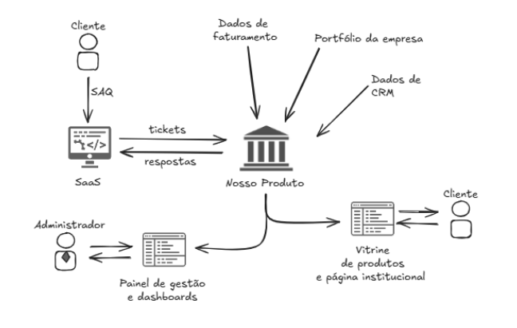
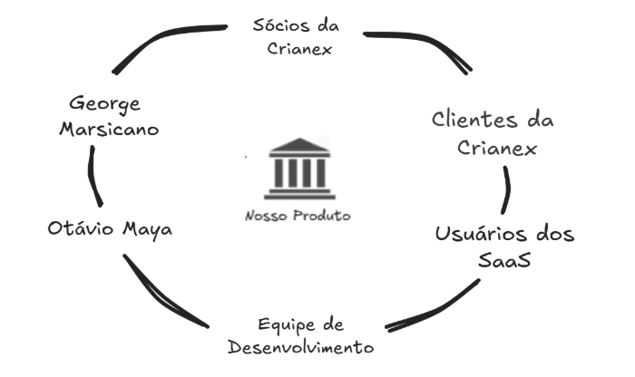

# 1 — Cenário Atual

---

## Histórico de Revisão

| Versão | Data | Descrição | Autor(es) |
|--------|------|-----------|-----------|
| 1.0 | 01/04/2026 | Criação das seções 1.1 a 1.7 | Lucas A. Zanetti |
| 1.1 | 03/04/2026 | Revisão geral | Equipe Crianex |
| 1.2 | 09/04/2026 | Ajustes pós reunião de alinhamento | Equipe Crianex |

---

## 1.1 Contexto da Empresa

A **Crianex** é uma Software House B2B especializada no desenvolvimento de soluções digitais sob demanda para empresas. Atuando com múltiplos projetos simultâneos e uma equipe distribuída, a organização enfrenta dificuldades crescentes para gerenciar internamente o status de cada projeto e, ao mesmo tempo, apresentar seu portfólio de maneira eficaz ao mercado externo.

A empresa não possui atualmente uma ferramenta centralizada que unifique a gestão operacional interna com a divulgação profissional dos seus produtos e entregas, o que gera retrabalho, falta de visibilidade e perda de oportunidades comerciais.

---

## 1.2 Declaração do Problema

| Campo | Descrição |
|-------|-----------|
| **O problema de** | Gestão descentralizada de projetos e baixa visibilidade do portfólio no mercado |
| **Afeta** | A equipe interna da Crianex (colaboradores, gestores e liderança técnica) e potenciais clientes B2B |
| **Cujo impacto é** | Dificuldade no acompanhamento em tempo real do status dos projetos, retrabalho na consolidação de informações e oportunidades comerciais perdidas por falta de vitrine digital |
| **Uma solução bem-sucedida seria** | Uma plataforma unificada com área administrativa para gestão interna e uma vitrine digital pública para exposição do portfólio |

---

## 1.3 Diagrama de Ishikawa

O diagrama abaixo sintetiza as causas raiz que levam ao problema central identificado: a baixa visibilidade e a gestão descentralizada.

<figure class="crianex-figure">
  <figcaption>Figura 1 — Diagrama de Ishikawa: causas da gestão descentralizada e baixa visibilidade. Fonte: Elaborado pelos autores (2026).</figcaption>
</figure>

---

## 1.3.1 Rich Picture

O Rich Picture abaixo representa o contexto do sistema e os fluxos de informação entre os principais atores e componentes do produto.

<figure class="crianex-figure">
  <figcaption>Figura 2 — Rich Picture: contexto do sistema e fluxos de informação. Fonte: Elaborado pelos autores (2026).</figcaption>
</figure>

---

## 1.4 Stakeholders

O diagrama abaixo representa os principais stakeholders do projeto e sua relação com o produto.

<figure class="crianex-figure">
  <figcaption>Figura 3 — Diagrama de Stakeholders: principais partes interessadas e seu relacionamento com o produto. Fonte: Elaborado pelos autores (2026).</figcaption>
</figure>

| Stakeholder | Papel | Interesse principal |
|-------------|-------|---------------------|
| Liderança da Crianex | Patrocinador e cliente principal | Visão consolidada do portfólio e gestão estratégica |
| Gestores de Projeto | Usuário primário (área adm.) | Acompanhamento de status, alocação e logs em tempo real |
| Colaboradores Técnicos | Usuário secundário (área adm.) | Atualização de tarefas e acompanhamento de sprints |
| Clientes B2B Potenciais | Visitante da vitrine digital | Conhecer o portfólio e entrar em contato comercial |
| Equipe de Vendas/Marketing | Usuário da vitrine digital | Apresentar projetos e cases de sucesso |

---

## 1.5 Usuários

### 1.5.1 Usuários Internos (Área Administrativa)

| Perfil | Descrição | Necessidades |
|--------|-----------|--------------|
| Administrador | Acesso total ao sistema, configura permissões | Gestão de usuários, projetos e configurações |
| Gestor de Projeto | Gerencia projetos e equipes | Atualizar status, alocar pessoas, visualizar logs |
| Colaborador | Membro técnico da equipe | Consultar tarefas, atualizar progresso |

### 1.5.2 Usuários Externos (Vitrine Digital)

| Perfil | Descrição | Necessidades |
|--------|-----------|--------------|
| Visitante Anônimo | Potencial cliente B2B | Navegar no portfólio, visualizar cases, entrar em contato |
| Parceiro Comercial | Empresa parceira ou fornecedor | Verificar capacidades técnicas e projetos em andamento |

---

## 1.6 Ambiente dos Usuários

Os usuários internos acessam a plataforma principalmente por meio de navegadores web em ambiente corporativo. O acesso se dá via autenticação (login com credenciais da empresa), e as operações são realizadas em tempo real, com múltiplos usuários podendo operar simultaneamente.

Os usuários externos acessam a vitrine digital publicamente, sem necessidade de cadastro ou autenticação, por qualquer dispositivo com navegador moderno (desktop e mobile).

---

## 1.7 Alternativas e Concorrência

| Solução Existente | Limitação |
|-------------------|-----------|
| Planilhas compartilhadas (Google Sheets) | Sem automação, difícil de escalar, sem vitrine |
| Ferramentas genéricas de PM (Jira, Trello) | Não integram vitrine digital; focadas em times, não em portfólio B2B |
| Sites institucionais estáticos | Não integram a gestão interna; difíceis de manter atualizados |
| Plataformas de freelancer (Behance, etc.) | Não voltadas para Software House B2B com gestão interna |

A ausência de uma solução que unifique **gestão interna** e **vitrine digital** num único produto SaaS justifica o desenvolvimento do Crianex.
