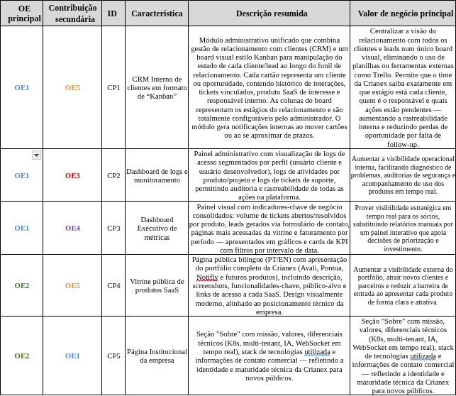
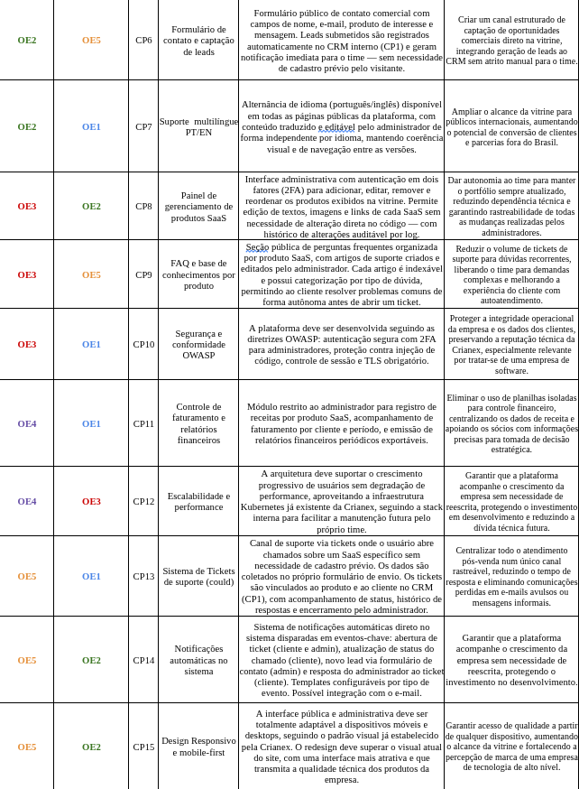

# 2.3 Objetivos Estratégicos e Características do Produto

## Objetivos Estratégicos (OE)

| ID | Objetivo Estratégico |
|----|----------------------|
| OE1 | Centralizar a gestão de projetos da Crianex numa única plataforma |
| OE2 | Aumentar a visibilidade do portfólio de projetos no mercado B2B |
| OE3 | Reduzir o tempo gasto com relatórios manuais e consolidação de informações |
| OE4 | Facilitar a alocação e o acompanhamento de pessoas em projetos em tempo real |
| OE5 | Fortalecer a presença digital da Crianex como Software House de referência |

---

## Características do Produto (CP)

<figure class="crianex-figure">
</figure>

<figure class="crianex-figure">
</figure>