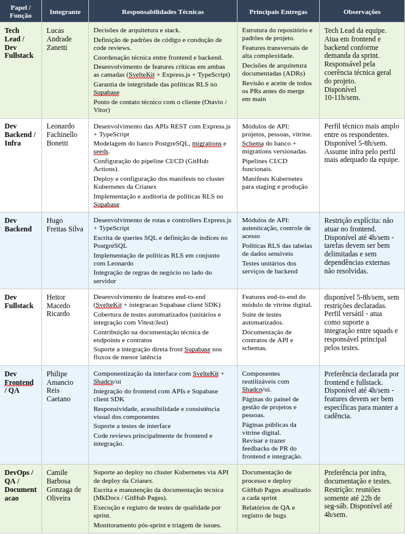

# 6.1 Composição da Equipe

Esta seção descreve a composição da equipe de desenvolvimento, os canais e cerimônias de comunicação adotados e o processo formal de validação das entregas ao longo do projeto. Todas as decisões aqui registradas foram baseadas no mapeamento de perfil técnico dos integrantes, realizado via formulário estruturado no início do projeto.

<figure class="crianex-figure">
</figure>