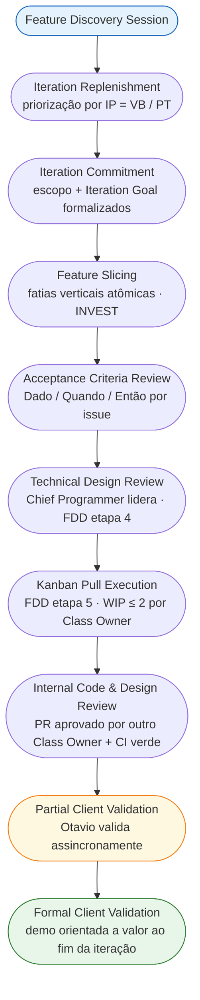
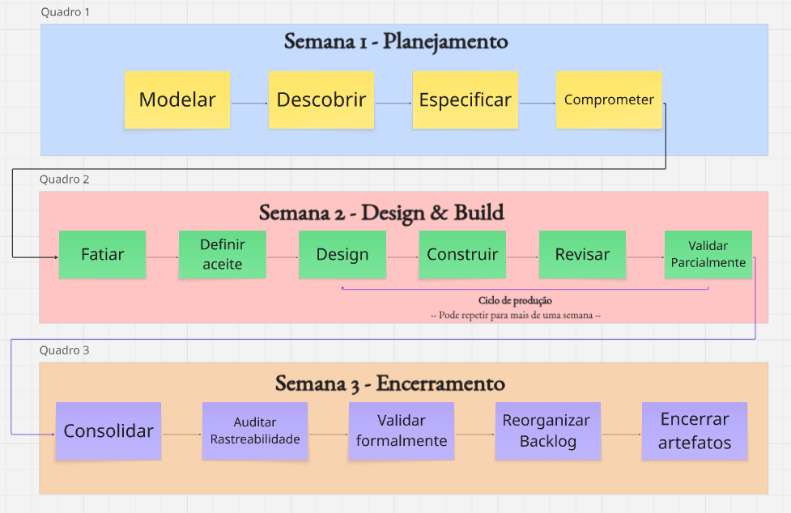

# 5. Cronograma e Entregas

## Histórico de Revisão

| Versão | Data | Descrição | Autor(es) |
|--------|------|-----------|-----------|
| 1.0 | 11/04/2026 | Criação do cronograma de sprints | Lucas A. Zanetti |
| 1.1 | 13/04/2026 | Revisão da seção 5 | Equipe Crianex |
| 1.2 | 04/05/2026 | Atualização do cronograma para Processo Híbrido (Iterações) | Heitor |
| 1.3 | 05/05/2026 | Reestruturação completa: ciclo de vida, cadência semanal e marcos de validação | Lucas A. Zanetti |
| 1.4 | 05/05/2026 | Seções 5.1 e 5.4 convertidas para fluxogramas Mermaid | Lucas A. Zanetti |

---

## 5.1 O Ciclo de Vida de uma Feature

Toda Feature percorre um fluxo padronizado, do primeiro insight até a entrega validada. Não há atalhos: cada etapa depende da conclusão da anterior.

### Regras do fluxo

| Regra | Descrição |
|-------|-----------|
| **Sem atalhos** | Uma issue não pode pular colunas no Kanban (ex.: In Progress direto para Done). |
| **WIP limit é lei** | Máx. 2 issues In Progress por Class Owner. Ao atingir o limite, ajude a destravar antes de iniciar uma nova. |
| **Design antes de código** | Nenhuma linha de código é escrita sem Technical Design Review e critérios de aceite definidos. |
| **Entrega contínua** | Features são entregues a Otavio conforme ficam prontas — não há espera pela data da unidade acadêmica. |
| **Rastreabilidade mandatória** | Toda issue precisa estar linkada à Feature parent no Miro e à CP correspondente no Documento de Visão. |

---

## 5.2 Roadmap de Iterações

O quadro abaixo apresenta os ciclos de trabalho planejados, organizados por **Valor de Negócio** entregue ao cliente real (Otavio Maya, CTO Crianex).

> **Nota:** O planejamento é orientado ao Índice de Prioridade (IP = VB / PT). A ordem das CPs dentro de cada iteração pode ser reordenada conforme feedback do cliente.

| Iteração | Status | Período | Valor de Negócio | CPs | OEs | Iteration Goal | Validação |
|----------|--------|---------|------------------|-----|-----|----------------|-----------|
| **IT1** | ✅ | até 26/04/2026 | Documentação Inicial e Setup | — | — | Levantar escopo, documentar Visão de Produto, configurar ambiente e definir arquitetura macro. | Reunião inicial com Otavio: validação de escopo, domínio e priorização do MVP. |
| **IT2** | 🔄 | 27/04 a 17/05 | **Vitrine Pública** | CP2 · CP5 · CP7 · CP15 | [OE2](solucao.md#objetivos-estrategicos-oe) · [OE5](solucao.md#objetivos-estrategicos-oe) | "Qualquer visitante acessa a vitrine pública da Crianex, vê o portfólio de produtos SaaS com página institucional em PT/EN, em layout responsivo." | Partial Validation contínua. Formal Validation com demo focada em conversão e navegação. |
| **IT3** | ⏳ | 18/05 a 07/06 | **Núcleo Admin** | CP1 · CP3 · CP4 | [OE1](solucao.md#objetivos-estrategicos-oe) | "A equipe interna acessa o CRM Kanban, o Dashboard Executivo e o painel de logs unificados a partir de um único ponto de autenticação." | Validação do cruzamento de logs e tickets; métricas operacionais com os sócios. |
| **IT4** | ⏳ | 08/06 a 24/06 | **Operação Digital** | CP6 · CP8 · CP9 | [OE2](solucao.md#objetivos-estrategicos-oe) · [OE3](solucao.md#objetivos-estrategicos-oe) | "A equipe de suporte opera o sistema de atendimento e gerencia produtos SaaS com autonomia, sem depender de acesso direto ao banco." | Feedback focado na usabilidade da equipe de suporte e fluxos administrativos. |
| **IT5** | ⏳  | 25/06 a 07/07 | **Confiança e Consolidação** | CP10 · CP11 · CP12 · CP13 · CP14 | [OE3](solucao.md#objetivos-estrategicos-oe) · [OE4](solucao.md#objetivos-estrategicos-oe) · [OE5](solucao.md#objetivos-estrategicos-oe) | "O MVP passa por auditoria OWASP, testes end-to-end completos e está pronto para homologação em produção." | Homologação final em ambiente de produção; aprovação formal do MVP pelo cliente. |

---

## 5.3 Cadência Semanal de uma Iteração

A cadência semanal — cerimônias, formatos e tabelas de atividades por semana — está documentada em **[6.3 Cadência de Cerimônias](equipe.md#63-cadencia-de-cerimonias)** na página de Interação Equipe-Cliente, onde faz mais sentido contextualmente.

---

## 5.4 Sequência de Execução em uma Iteração

A sequência abaixo apresenta a ordem obrigatória de atividades dentro de qualquer iteração, agrupada por fase. Nenhuma etapa pode ser invertida ou suprimida — desvios são registrados na retrospectiva e tratados na próxima iteração.

<figure class="crianex-figure">
  <figcaption>Figura 1 — Sequence Execution: Sequencia de execução das cerimônias do FDD. Fonte: Elaborado pelos autores (2026).</figcaption>
</figure>

---

## 5.5 Marcos e Critérios de Encerramento por Iteração

Cada iteração só é considerada **encerrada** quando todos os critérios abaixo estão satisfeitos:

| # | Critério | Responsável |
|---|----------|-------------|
| 1 | Todas as issues comprometidas estão em Done ou com justificativa de carry-over documentada. | Development Manager |
| 2 | Formal Client Validation realizada e aprovação de Otavio registrada na ata. | Responsável por Validação |
| 3 | Matriz de rastreabilidade OE → CP → VN → Feature → Issue → PR → Validação atualizada. | Documentation Lead |
| 4 | Documento de Visão (GitHub Pages) atualizado com artefatos da iteração. | Documentation Lead + PM |
| 5 | Retrospectiva realizada e lições aprendidas registradas no Miro. | Facilitador Metodológico |
| 6 | Backlog macro reordenado por IP para a próxima iteração. | Project Manager |
