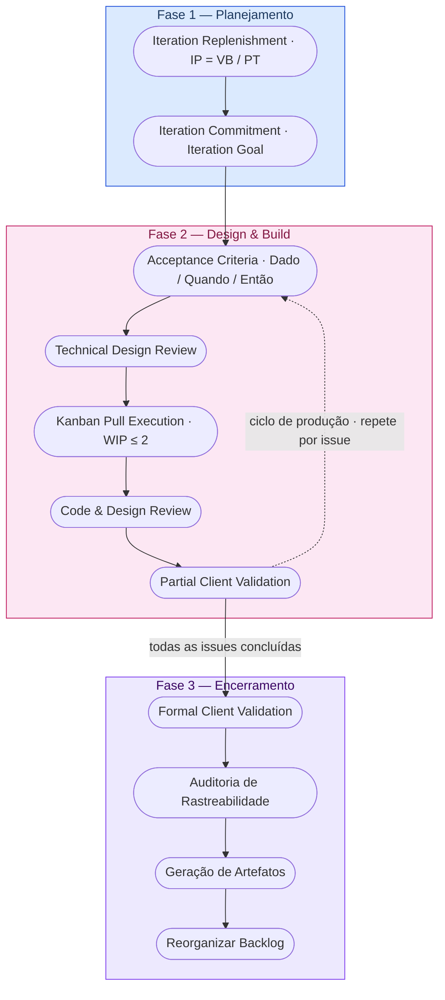

# 5. Cronograma e Entregas

## Histórico de Revisão

| Versão | Data       | Descrição                                                                                              | Autor(es)        |
| ------ | ---------- | ------------------------------------------------------------------------------------------------------ | ---------------- |
| 1.0    | 11/04/2026 | Criação do cronograma de sprints                                                                       | Lucas A. Zanetti |
| 1.1    | 13/04/2026 | Revisão da seção 5                                                                                     | Equipe Crianex   |
| 1.2    | 04/05/2026 | Atualização do cronograma para Processo Híbrido (Iterações)                                            | Heitor           |
| 1.3    | 05/05/2026 | Reestruturação completa: ciclo de vida, cadência semanal e marcos de validação                         | Lucas A. Zanetti |
| 1.4    | 05/05/2026 | Seções 5.1 e 5.4 convertidas para fluxogramas Mermaid                                                  | Lucas A. Zanetti |
| 1.5    | 06/05/2026 | Remoção da coluna OEs e rastreabilidade de CPs na tabela 5.2                                           | Equipe Crianex   |
| 1.6    | 06/05/2026 | Renumeração de CPs (remoção de CP10/CP12 como RNFs) e renomeação IT5 para Pós-venda                    | Lucas A. Zanetti |
| 1.7    | 06/05/2026 | Adição de CP14 (Portal do Cliente) na iteração Pós-venda                                               | Lucas A. Zanetti |
| 1.8    | 06/06/2026 | Substituição da imagem por fluxograma Mermaid corrigido (modelo FDD sem Modelar/Descobrir/Especificar) | Lucas A. Zanetti |
| 1.9    | 07/06/2026 | Adição da seção 5.6 — Calendário (abril–julho) com iterações, cerimônias e eventos da disciplina       | Lucas A. Zanetti |

---

## 5.1 O Ciclo de Vida de uma Feature

Toda Feature percorre um fluxo padronizado, do primeiro insight até a entrega validada. Não há atalhos: cada etapa depende da conclusão da anterior.

### Regras do fluxo

| Regra                          | Descrição                                                                                                    |
| ------------------------------ | ------------------------------------------------------------------------------------------------------------ |
| **Sem atalhos**                | Uma issue não pode pular colunas no Kanban (ex.: In Progress direto para Done).                              |
| **WIP limit é lei**            | Máx. 2 issues In Progress por Class Owner. Ao atingir o limite, ajude a destravar antes de iniciar uma nova. |
| **Design antes de código**     | Nenhuma linha de código é escrita sem Technical Design Review e critérios de aceite definidos.               |
| **Entrega contínua**           | Features são entregues a Otavio conforme ficam prontas — não há espera pela data da unidade acadêmica.       |
| **Rastreabilidade mandatória** | Toda issue precisa estar linkada à Feature parent no Miro e à CP correspondente no Documento de Visão.       |

---

## 5.2 Roadmap de Iterações

O quadro abaixo apresenta os ciclos de trabalho planejados, organizados por **Valor de Negócio** entregue ao cliente real (Otavio Maya, CTO Crianex).

> **Nota:** O planejamento é orientado ao Índice de Prioridade determinado pelo [valorXesforco](solucao.md#mapeamento-de-valor-das-características-feature-setvalue-matrix). A ordem das CPs dentro de cada iteração pode ser reordenada conforme feedback do cliente.

| Iteração | Status | Período         | Valor de Negócio                                  | CPs                                                                                                                                                   | Iteration Goal                                                                                                                                                                                                                                                                                                                                                                                                                                                                                                                              | Validação                                                                                |
| -------- | ------ | --------------- | ------------------------------------------------- | ----------------------------------------------------------------------------------------------------------------------------------------------------- | ------------------------------------------------------------------------------------------------------------------------------------------------------------------------------------------------------------------------------------------------------------------------------------------------------------------------------------------------------------------------------------------------------------------------------------------------------------------------------------------------------------------------------------------- | ---------------------------------------------------------------------------------------- |
| **IT1**  | ✅     | 28/04 até 07/06 | **Vitrine Pública**                               | [CP4](solucao.md#características-do-produto-cp) · [CP5](solucao.md#características-do-produto-cp) · [CP6](solucao.md#características-do-produto-cp)   | Ao fim da IT1: "(1) qualquer visitante sem autenticação navega pela vitrine pública, visualiza o catálogo de produtos SaaS publicados, consulta informações institucionais e canais de contato da Crianex; (2) um administrador autenticado cadastra, edita, publica e despublica produtos e gerencia usuários via painel seguro; e (3) visitantes consultam e avaliam artigos do FAQ categorizados — tudo em layout responsivo verificado em mobile (≥ 375 px) e desktop (≥ 1 280 px), com Formal Client Validation aprovada por Otavio. " | Partial Validation contínua. Formal Validation com demo focada em conversão e navegação. |
| **IT2**  | 🔄     | 08/06 até 28/06 | **Lead Capture**                                  | [CP1](solucao.md#características-do-produto-cp) · [CP8](solucao.md#características-do-produto-cp) · [CP9](solucao.md#características-do-produto-cp)   | "Leads de novos visitantes são capturados via formulário público e registrados automaticamente no CRM; dúvidas comuns são resolvidas pelo FAQ sem abertura de ticket; e receitas por produto são controladas centralmente com exportação de relatórios."                                                                                                                                                                                                                                                                                    | Validação ponta a ponta: lead submetido no formulário aparece como card no CRM;          |
| **IT3**  | ⏳     | 29/06 até 07/07 | **Núcleo Operacional** _(extra · não priorizada)_ | [CP2](solucao.md#características-do-produto-cp) · [CP3](solucao.md#características-do-produto-cp) · [CP7](solucao.md#características-do-produto-cp) · | "A equipe interna acessa o CRM Kanban, o Dashboard Executivo e o painel de logs unificados a partir de um único ponto de autenticação."                                                                                                                                                                                                                                                                                                                                                                                                     | Validação do cruzamento de logs e tickets; métricas operacionais com os sócios.          |

---

## 5.3 Cadência Semanal de uma Iteração

A cadência semanal — cerimônias, formatos e tabelas de atividades por semana — está documentada em **[6.3 Cadência de Cerimônias](equipe.md#63-cadencia-de-cerimonias)** na página de Interação Equipe-Cliente, onde faz mais sentido contextualmente.

---

## 5.4 Sequência de Execução em uma Iteração

A sequência abaixo apresenta a ordem obrigatória de atividades dentro de qualquer iteração, agrupada por fase. Nenhuma etapa pode ser invertida ou suprimida — desvios são registrados na retrospectiva e tratados na próxima iteração.

<figure class="crianex-figure">
  <figcaption>Figura 1 — Sequence Execution: Sequência de execução das cerimônias dentro de uma iteração FDD. Fonte: Elaborado pelos autores (2026).</figcaption>
</figure>

---

## 5.5 Marcos e Critérios de Encerramento por Iteração

Cada iteração só é considerada **encerrada** quando todos os critérios abaixo estão satisfeitos:

| #   | Critério                                                                                    | Responsável               |
| --- | ------------------------------------------------------------------------------------------- | ------------------------- |
| 1   | Todas as issues comprometidas estão em Done ou com justificativa de carry-over documentada. | Development Manager       |
| 2   | Formal Client Validation realizada e aprovação de Otavio registrada na ata.                 | Responsável por Validação |
| 3   | Matriz de rastreabilidade OE → CP → VN → Feature → Issue → PR → Validação atualizada.       | Documentation Lead        |
| 4   | Documento de Visão (GitHub Pages) atualizado com artefatos da iteração.                     | Documentation Lead + PM   |
| 5   | Retrospectiva realizada e lições aprendidas registradas.                                    | Facilitador Metodológico  |
| 6   | Backlog macro reordenado por IP para a próxima iteração.                                    | Project Manager           |

---

## 5.6 Calendário

Consolidação temporal de iterações, cerimônias FDD, entregas da disciplina e feriados (abril–julho/2026).

> A **IT3 — Núcleo Operacional** é uma iteração com requisitos **não priorizada**: seram executadas pós disciplina.

=== "Abril"

    

      
 Pré-IT1 (setup)

      
 IT1 — Vitrine Pública

      
 Entrega (disciplina)

      
 Apresentações

      
 Gravação de Vídeo

      
 Feriado

      
 Fora do mês

    

    

    

      
Seg

      
Ter

      
Qua

      
Qui

      
Sex

      
Sáb

      
Dom

      <!-- Semana 1 — Mar 30 a Abr 5 -->
      
30

      
31

      
1

      
2

      
3Primeiro contato com o cliente

      
4

      
5

      <!-- Semana 2 — Abr 6 a 12 -->
      
6Domain Modeling Workshop

      
7

      
8

      
9Documentanção para a U1

      
10Documentanção para a U1

      
11Gravação Vídeo U1

      
12Gravação Vídeo U1

      <!-- Semana 3 — Abr 13 a 19 -->
      
13Entrega Unidade 1

      
14Apresentações U1

      
15Apresentações U1

      
16Apresentações U1

      
17Correções U1

      
18

      
19

      <!-- Semana 4 — Abr 20 a 26 -->
      
20

      
21Tiradentes

      
22

      
23

      
24Feature Discovery Session

      
25Replenishment Macro

      
26

      <!-- Semana 5 — Abr 27 a Mai 3 -->
      
27Prep IT1

      
28IT1 Início

      
29Replenishment MicroCommitment

      
30

      
1

      
2

      
3

    

    

=== "Maio"

    

      
 IT1 — Vitrine Pública

      
 Entrega (disciplina)

      
 Apresentações

      
 Gravação de Vídeo

      
 Feriado

      
 Fora do mês

    

    

    

      
Seg

      
Ter

      
Qua

      
Qui

      
Sex

      
Sáb

      
Dom

      <!-- Semana 1 — Abr 27 a Mai 3 -->
      
27

      
28

      
29

      
30

      
1Dia do Trabalho

      
2

      
3

      <!-- Semana 2 — Mai 4 a 10 -->
      
4

      
5Midweek Sync

      
6

      
7

      
8

      
9Technical Design Review

      
10

      <!-- Semana 3 — Mai 11 a 17 -->
      
11Kanban Build (dependências)

      
12Kanban Build (arquitetura)13
      Kanban Build (Issues Github)

      
14Midweek Sync

      
15Documentação de evidências para a U2

      
16Documentação de evidências para a U2

      
17Rajustes finais no Pages

      <!-- Semana 4 — Mai 18 a 24 -->
      
18Gravação Vídeo U2

      
19Apresentações U2

      
20Apresentações U2

      
21Apresentações U2

      
22Kanban Build

      
23Kanban BuildPartial Client Validation

      
24

      <!-- Semana 5 — Mai 25 a 31 -->
      
25Feature Build ConsolidationKanban Build

      
26Kanban BuildMidweek SyncPartial Client Validation

      
27Kanban Build

      
28Kanban BuildPartial Client Validation

      
29Kanban Build

      
30Kanban BuildPartial Client Validation

      
31

    

    

=== "Junho"

    

      
 IT1 — Vitrine Pública

      
 IT2 — Lead Capture

      
 IT3 — Núcleo Operacional (extra)

      
 Apresentações

      
 Gravação de Vídeo

      
 Feriado

      
 Ponto Facultativo

      
 Fora do mês

    

    

    

      
Seg

      
Ter

      
Qua

      
Qui

      
Sex

      
Sáb

      
Dom

      <!-- Semana 1 — Jun 1 a 7 -->
      
1Partial Client Validation

      
2

      
3Formal Client Validation

      
4Corpus Christi

      
5Ponto Facultativo

      
6Iteration Artifact Closure

      
7Fim IT1

      <!-- Semana 2 — Jun 8 a 14 -->
      
8IT2 Início

      
9Replenishment MicroCommitment

      
10

      
11Technical Design Review

      
12

      
13Documentações para a U3

      
14Documentação para a U3

      <!-- Semana 3 — Jun 15 a 21 -->
      
15Gravação Vídeo U3

      
16Apresentações U3

      
17Apresentações U3

      
18Apresentações U3

      
19Início do DesenvolvimentoKanban Build

      
20Kanban Build

      
21

      <!-- Semana 4 — Jun 22 a 28 -->
      
22Kanban Build

      
23Kanban Build

      
24Kanban BuildMidweek Sync

      
25Kanban Build

      
26Feature Build Consolidation

      
27Partial Client ValidationFormal Client Validation

      
28Iteration Artifact ClosureFim IT2

      <!-- Semana 5 — Jun 29 a Jul 5 -->
      
29IT3 Início (extra)Replenishment MicroCommitment

      
30Technical Design Review

      
1

      
2

      
3

      
4

      
5

    

    

=== "Julho"

    

      
 IT3 — Núcleo Operacional (extra)

      
 Entrega (disciplina)

      
 Apresentações

      
 Gravação de Vídeo

      
 Fim de Semestre

      
 Fora do mês

    

    

    

      
Seg

      
Ter

      
Qua

      
Qui

      
Sex

      
Sáb

      
Dom

      <!-- Semana 1 — Jun 29 a Jul 5 -->
      
29

      
30

      
1Kanban Build

      
2Kanban Build

      
3Kanban Build

      
4Kanban Build

      
5Feature Build ConsolidationPartial Client Validation

      <!-- Semana 2 — Jul 6 a 12 -->
      
6Gravação Vídeo U4

      
7Apresentações U4Iteration Artifact ClosureFim IT3

      
8Apresentações U4

      
9Apresentações U4

      
10

      
11

      
12

      <!-- Semana 3 — Jul 13 a 19 -->
      
13

      
14

      
15

      
16

      
17

      
18Fim de Semestre

      
19

      <!-- Semana 4 — Jul 20 a 26 -->
      
20

      
21

      
22

      
23

      
24

      
25

      
26

    

    

