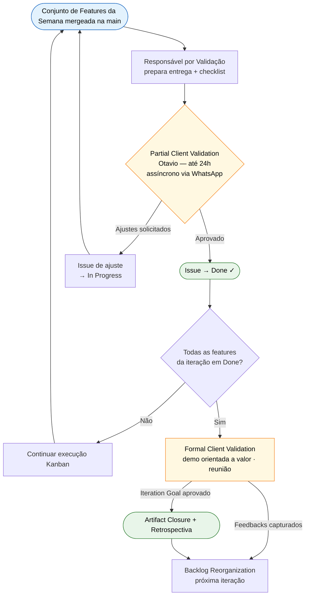
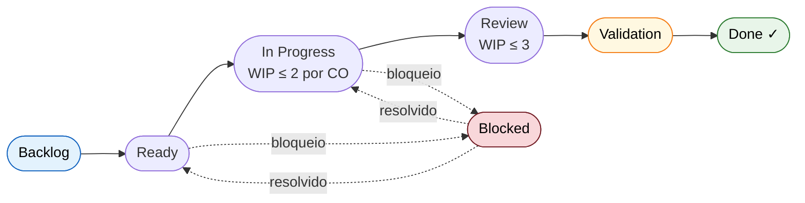

# 6. Interação Equipe-Cliente

## Histórico de Revisão

| Versão | Data | Descrição | Autor(es) |
|--------|------|-----------|-----------|
| 1.0 | 11/04/2026 | Criação das seções 6.1 a 6.6 | Lucas A. Zanetti |
| 1.1 | 13/04/2026 | Revisão das seções 6.1 a 6.6 | Equipe Crianex |
| 1.2 | 03/05/2026 | Atualização da composição da equipe | Lucas A. Zanetti |
| 1.3 | 05/05/2026 | Seções 6.2–6.6 reescritas: metodologia FDD + fluxogramas de validação e Kanban | Lucas A. Zanetti |

---

## 6.1 Composição da Equipe

Os papéis seguem o modelo FDD + Kanban adotado pela equipe. Cada integrante pode acumular mais de um papel; as responsabilidades, no entanto, permanecem individuais e rastreáveis.

| Integrante | Papel FDD | Responsabilidades Principais | Disponibilidade |
|---|---|---|---|
| **Lucas Andrade Zanetti** | Project Manager · Chief Architect · Development Manager(Backup) | **(PM/DM):** Gerenciar o roadmap, prazos e interface principal com o cliente/professor; conduzir *Replenishment*. **(Chief Architect):** Liderar a modelagem de domínio e arbitrar decisões estruturais gerais da arquitetura. **(DM Backup):** Desbloquear issues críticas. | 9 h/sem |
| **Heitor Macedo Ricardo** | Development Manager · Class Owner | **(DM):** Coordenar o progresso técnico diário da iteração (Kanban), acompanhar WIP limits, desbloquear issues da equipe e liderar a consolidação final da fase de Build. **(Class Owner):** Assumir o desenvolvimento e testes de classes/features específicas. | 5–8 h/sem |
| **Leonardo Fachinello Bonetti** | Chief Programmer · Class Owner | **(Chief Programmer):** Conduzir o *Technical Design Review* e mentorar decisões técnicas (especialmente Backend/Infra/K8s); aprovar Pull Requests estruturais. **(Class Owner):** Desenvolver o código das responsabilidades que assumiu no design. | 5–8 h/sem |
| **Philipe Amancio Reis Caetano** | Chief Programmer · Class Owner | **(Chief Programmer):** Conduzir decisões técnicas e revisões de código (PRs) focadas em Frontend e QA; auxiliar no design detalhado de features. **(Class Owner):** Implementar de ponta a ponta as partes da interface pelas quais é responsável. | até 4 h/sem |
| **Hugo Freitas Silva** | Class Owner | **(Class Owner):** Implementação primária de código , garantindo que as regras de negócio e critérios de aceite sejam codificados e testados; atualização do *board* em tempo real e *code review* em PRs entre pares. | até 4 h/sem |
| **Camile Barbosa Gonzaga de Oliveira** | Class Owner · Documentation Lead · Requirements Custodian | **(Requirements/Docs):** Gestão dos artefatos (feature cards, rastreabilidade e critérios de aceite); manutenção do Documento de Visão no MkDocs e consolidação das evidências de fechamento das iterações. **(Class Owner):** Desenvolver e testar features alocadas. | até 4 h/sem |

**Papéis rotativos por iteração**

| Papel | Responsabilidade |
|---|---|
| **Facilitador Metodológico** | Conduz cerimônias semanais; garante adesão ao processo; sinaliza desvios na retrospectiva |
| **Responsável por Validação** | Coordena Partial e Formal Client Validation com Otavio; prepara checklists e materiais de demo; documenta aprovações nas issues |

---

## 6.2 Estrutura de Comunicação

Cada ferramenta tem escopo exclusivo — o que vai para o Miro não vai para o Discord. Isso evita decisões tomadas no canal errado e mantém rastreabilidade.

| Ferramenta | Tipo | Finalidade | Não é usado para |
|---|---|---|---|
| **Miro** | Assíncrono + Síncrono | Roadmap IT1–IT5, backlog macro, Feature Cards, Iteration Goal, modelo de domínio, atas de cerimônias, lições aprendidas | Acompanhamento operacional de issues |
| **GitHub Projects (Kanban)** | Assíncrono | Issues fluindo pelas colunas Backlog → Done; WIP limit visível | Cerimônias, alinhamento estratégico |
| **GitHub (repositório)** | Assíncrono | Código-fonte, Pull Requests, code review, CI/CD, evidências de execução | — |
| **GitHub Pages (MkDocs)** | Assíncrono | Documento de Visão, rastreabilidade OE → CP → Feature, artefatos formais | Operação diária |
| **Discord** | Assíncrono e Síncrono | Comunicação da semana e reuniões da equipe, dúvidas técnicas, MidWeek Sync ("Ontem fiz / Hoje farei / Bloqueios") | - |
| **WhatsApp** | Assíncrono | Canal direto com Otavio para validações parciais e alinhamentos urgentes | — |
| **Google Meets** | Síncrono | Reuniões formais com o cliente | — |

---

## 6.3 Cadência de Cerimônias

> **Princípio:** máximo **2–3 reuniões por semana**. Cerimônias relacionadas são agrupadas no mesmo dia. O Midweek Sync e a validação parcial com o cliente são sempre **assíncronos**; apenas o encerramento formal de iteração ocorre via **reunião**.

### Cerimônias por Iteração

| Cerimônia | Formato | Frequência | Participantes | Duração est. |
|---|---|---|---|---|
| **Iteration Replenishment + Commitment + Domain Modeling** | Reunião | Início da Sem 1 | PM, Chief Arch, CPs, Otavio | ~1h |
| **Feature Discovery** | Reunião | Sem 1 | Todos, menos o Cliente | ~1h |
| **Technical Design Review** | Reunião | Início da Sem 2 (e Sem 3 se necessário) | PM, CPs, Class Owners | ~1h |
| **Midweek Sync/Kanban Pull Execution** | Assíncrono — Discord | Meio de cada semana de execução (sexta ou sábado) | Toda a equipe | - |
| **Partial Client Validation** | Assíncrono — WhatsApp | Fim de cada Sem | Resp. Validação + Otavio | — |
| **Formal Client Validation** | Reunião | Fim da última semana da iteração | Toda a equipe + Otavio | ~1h |
| **Artifact Closure** | Reunião | Fim da unidade + fim da iteração | Toda a equipe | ~1h 30min |
| **Feature Build Consolidation** | Reunião | Fim da semana 2 e semana 3 | Toda a equipe | ~45min |

### Cadência Detalhada por Semana

Cada iteração padrão segue três semanas com objetivos distintos.

#### Semana 1 — Planejamento e Refinamento

Dedicada ao alinhamento estratégico e ao refinamento de requisitos. Devs podem trabalhar em carry-over, spikes ou dívida técnica — novas features da iteração corrente só iniciam após o Technical Design Review da Semana 2.

| Atividade | Etapa FDD | Formato |
|-----------|-----------|---------|
| Iteration Replenishment + Commitment + Domain Modeling Workshop | Etapas 1–3 | Reunião |
| Feature Discovery Session + Feature Card Specification | Etapas 4–5 | Reunião |
| Preparação individual para slicing | Pré-Etapa 6 | Assíncrono |

#### Semana 2 — Build Controlado e Execução Kanban

Todas as Features comprometidas começam a fluir pelo Kanban. A validação parcial ocorre de forma assíncrona ao fim da semana. Este ciclo pode se repetir dependendo do prazo da iteração.

| Atividade | Etapa FDD | Formato |
|-----------|-----------|---------|
| Feature Slicing + Acceptance Criteria Review + Technical Design Review | Etapas 6–8 | Reunião |
| Kanban Pull Execution + Internal Code & Design Review + Sync diário Discord | Etapas 9–11 | Assíncrono |
| Partial Client Validation — update escrito/vídeo a Otavio | Etapa 12 | **Assíncrono** |

#### Semana 3 — Consolidação, Validação e Encerramento

Features consolidadas, rastreabilidade auditada e artefatos empacotados. Apenas o encerramento formal reúne a equipe e o cliente.

| Atividade | Etapa FDD | Formato |
|-----------|-----------|---------|
| Feature Build Consolidation (smoke test) + Requirements Verification Review | Etapas 13–14 | Assíncrono |
| Preparação da demo e fechamento de PRs pendentes | — | Assíncrono |
| Formal Client Validation (demo) + Retrospectiva + Artifact Closure + Backlog Reorganization | Etapas 15–17 | **Reunião** |

---

## 6.4 Processo de Validação com o Cliente

O processo opera em dois modos complementares: **Partial** (contínua e assíncrona, durante a iteração) e **Formal** (reunião de demo ao fim de cada iteração).

*Figura 1 — Fluxo de validação: Partial (assíncrona, contínua por feature) → Formal (reunião, fim da iteração).*
{: style="text-align:center; font-size:0.83rem; color:#666;" }

### Definition of Ready (DoR)

Uma issue está **pronta para entrar em execução** quando:

- [ ] Título no padrão FDD: `<ação> <resultado> <de/para/no/com> <objeto>`
- [ ] Critérios de aceite escritos e verificáveis (Given/When/Then ou checklist)
- [ ] Dependências identificadas e resolvidas
- [ ] Class Owner designado e estimativa relativa registrada (CX, ES)
- [ ] Linkada à Feature parent no Miro e à CP de origem

### Definition of Done (DoD)

Uma issue está **concluída** quando:

- [ ] Código mergeado em `main` via PR aprovado por Chief Programmer
- [ ] CI verde
- [ ] Testes automatizados cobrindo os critérios de aceite (quando aplicável)
- [ ] Validação parcial de Otavio registrada na issue (checklist marcado)
- [ ] Documentação atualizada se houve mudança de contrato ou comportamento
- [ ] Issue movida para Done no GitHub Projects

---

## 6.5 Fluxo das Issues pelo Kanban

Toda issue percorre as colunas abaixo em ordem estrita. Cada avanço depende de critério explícito — sem atalhos.

*Figura 2 — Fluxo Kanban: progressão linear obrigatória com desvio via Blocked. CO = Class Owner.*
{: style="text-align:center; font-size:0.83rem; color:#666;" }

### Critérios de Transição

| De → Para | Critério de avanço | Quem move |
|---|---|---|
| **Backlog → Ready** | Critérios de aceite escritos; design aprovado; dependências resolvidas (DoR atendido) | Class Owner ou Chief Programmer |
| **Ready → In Progress** | Class Owner inicia; WIP limit verificado | Class Owner que pega |
| **In Progress → Review** | PR aberto (`closes #N`); CI verde; auto-revisão feita | Class Owner autor |
| **Review → Validation** | PR aprovado por outro Class Owner; merge realizado | Revisor após approve |
| **Validation → Done** | Otavio aprovou na Partial Client Validation; checklist marcado | Responsável por Validação |
| **\* → Blocked** | Bloqueio externo identificado; comentário com motivo na issue | Quem identificou |
| **Blocked → coluna anterior** | Bloqueio resolvido | Quem desbloqueou |

### Regras invioláveis

| Regra | Descrição |
|---|---|
| **Sem atalhos** | Issue não pode pular colunas (ex.: In Progress direto para Done). |
| **WIP limit é lei** | Máx. 2 In Progress por Class Owner. Ao atingir o limite, ajude a destravar antes de iniciar nova issue. |
| **Blocked é visível** | Toda issue em Blocked precisa de comentário com motivo e responsável por destravar. |
| **Issue fecha via PR** | Não fechar issue manualmente — ela é fechada pelo merge (`closes #N`) e movida para Done após validação de Otavio. |

---

## 6.6 Gestão de Mudanças de Requisitos

Toda mudança segue o ciclo de vida de Feature — não há alteração informal de escopo. Decisões de escopo **nunca** são tomadas no Discord; qualquer mudança que altere o Iteration Goal exige reunião com ata no Miro.

| Origem | Canal de entrada | Processo |
|---|---|---|
| **Feedback de Otavio na demo** | Feature Card capturado na Formal Validation | PM incorpora ao backlog; entra na próxima Replenishment com IP calculado |
| **Dúvida crítica durante execução** | Discord + issue de bloqueio | Feature Discovery pontual com Otavio; issue vai para Blocked até resolução |
| **Issue do professor** | Issue aberta no repositório | PM triagem em até 24h; se escopo → Feature Card + backlog; se correção → issue direta |
| **Ajuste menor em critério de aceite** | Class Owner atualiza a issue | Chief Programmer revisa e aprova; sem nova cerimônia |
| **Mudança de escopo significativa** | PM convoca reunião de alinhamento | Equipe avalia impacto; IP recalculado; Iteration Goal pode ser renegociado com Otavio |
