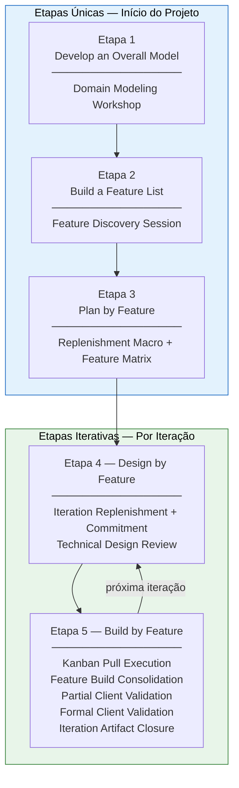

# 4. Engenharia de Requisitos

## Histórico de Revisão

| Versão | Data       | Descrição                                                                                                                 | Autor(es)        |
| ------ | ---------- | ------------------------------------------------------------------------------------------------------------------------- | ---------------- |
| 1.0    | 12/04/2026 | Criação das seções 4.1 a 4.4                                                                                              | Heitor e Lucas   |
| 1.1    | 13/04/2026 | Revisão da seção 4                                                                                                        | Equipe Crianex   |
| 1.2    | 04/05/2026 | Ajustes da seção 4.1                                                                                                      | Heitor           |
| 1.3    | 04/05/2026 | Ajustes da seção 4.2                                                                                                      | Heitor           |
| 1.4    | 06/05/2026 | Revisão dos ajustes da seção 4.1 e reajustes                                                                              | Philipe          |
| 1.5    | 05/05/2026 | Ajustes de clareza e consistência na seção 4                                                                              | Hugo             |
| 1.6    | 08/05/2026 | Ajustes de cerimônias e técnicas                                                                                          | Lucas e Philipe  |
| 1.7    | 18/05/2026 | Reestruturação completa: separação entre etapas únicas e iterativas do FDD; adição da tabela de atividades de ER          | Lucas A. Zanetti |
| 1.8    | 06/06/2026 | Reestruturação da tabela 4.5: colunas Etapa FDD · Atividade de ER · Técnicas; enunciação explícita das 6 atividades de ER | Lucas A. Zanetti |

---

## 4.1 Abordagem de Engenharia de Requisitos

O projeto Crianex adota um **Processo Híbrido (FDD + Kanban)**. O FDD (Feature-Driven Development) estrutura o planejamento orientado a valor — o que construir —, enquanto o Kanban fornece o controle visual da execução — quando puxar o trabalho e quando parar — por meio da limitação de Work in Progress (WIP).

O FDD é composto por **5 etapas**, mas elas **não são todas iterativas**. A separação entre o que ocorre uma única vez e o que se repete em cada iteração é central para entender como o processo funciona no projeto Crianex:

---

## 4.2 Etapas Únicas — Realizadas uma vez no início do projeto

As três primeiras etapas do FDD constroem a fundação do produto: o modelo de domínio, a lista de funcionalidades e o plano de desenvolvimento. São executadas **uma única vez**, antes da primeira iteração de construção, e seus artefatos servem de insumo para todas as iterações seguintes.

### Etapa 1 — Develop an Overall Model (Desenvolver Modelo Global)

O objetivo é construir uma visão compartilhada e abrangente do domínio do problema antes de qualquer detalhe funcional ser discutido. A equipe e o Domain Expert (Otávio Maya) exploram juntos o negócio, suas entidades, relacionamentos e regras centrais.

**Cerimônia:** Domain Modeling Workshop

Reunião em que a equipe e o Domain Expert constroem o modelo de domínio que sustenta as features do projeto. O resultado é um entendimento coletivo e documentado sobre as entidades do sistema — não apenas uma lista de requisitos.

**Técnica:** Color Modeling — organização visual dos elementos do domínio para identificar classes, papéis, eventos e agregados.

**Artefatos gerados:** diagrama de domínio e glossário de termos.

---

### Etapa 2 — Build a Feature List (Construir Lista de Funcionalidades)

Com o modelo de domínio estabelecido, a equipe decompõe o sistema em funcionalidades concretas e orientadas ao cliente. Cada feature representa uma ação de valor entregável e verificável.

**Cerimônia:** Feature Discovery Session

Cerimônia dedicada à descoberta e ao refinamento de funcionalidades com o Domain Expert. A equipe transforma necessidades de negócio em features claras, compreensíveis e orientadas a valor.

**Técnicas:**

- _Feature Card Specification_ — padroniza a escrita da feature na formulação `<ação> <resultado> <de/para/no/com> <objeto>`
- _Vertical Slicing_ — orienta a decomposição em partes menores com valor demonstrável de ponta a ponta
- _INVEST_ — garante que cada fatia seja independente, negociável, valiosa, estimável, pequena e testável

**Artefatos gerados:** Feature Cards e ata da sessão.

---

### Etapa 3 — Plan by Feature (Planejar por Funcionalidade)

Com a lista de features construída, a equipe organiza e prioriza o trabalho no horizonte completo do projeto: quais features vão para qual iteração, quem é o Chief Programmer responsável por cada conjunto e qual a sequência de entrega orientada a valor de negócio.

**Cerimônia:** Iteration Replenishment (versão macro — planejamento do roadmap completo)

A priorização é feita com base na matriz **Valor × Esforço** e no **Índice de Prioridade (IP = VB / PT)**, garantindo que as features de maior valor e menor esforço relativo entrem primeiro no fluxo de desenvolvimento.

**Técnicas:**

- _Matriz Valor × Esforço_ — posiciona cada feature em quadrantes de prioridade
- _Priorização IP_ — ordena features por IP = VB / PT, onde PT = (CX + ES) / 2

**Artefatos gerados:** backlog macro priorizado, roadmap de iterações com CPs por iteração e Feature Matrix.

---

## 4.3 Etapas Iterativas — Repetidas em cada iteração

As duas últimas etapas do FDD são executadas **a cada iteração**, para cada conjunto de features comprometido. É aqui que o Kanban entra como sistema de gestão de fluxo, complementando o FDD com visibilidade operacional e controle de WIP.

### Etapa 4 — Design by Feature (Projetar por Funcionalidade)

No início de cada iteração, as features do escopo são refinadas tecnicamente antes de qualquer linha de código ser escrita. Essa etapa produz os critérios de aceite, o design técnico e o compromisso formal da equipe com o objetivo da iteração.

#### Cerimônia 1 — Iteration Replenishment + Commitment

A Iteration Replenishment seleciona as features candidatas para a iteração corrente com base no IP e na capacidade da equipe. O Iteration Commitment formaliza o compromisso da equipe e do cliente com o Iteration Goal — uma frase única e demonstrável que sintetiza o valor a ser entregue.

**Técnicas:**

- _Matriz Valor × Esforço_ e _Priorização IP_ — reordenação das features conforme contexto da iteração
- _Iteration Goal Statement_ — formulação do objetivo principal da iteração

**Artefatos gerados:** backlog priorizado da iteração, lista de features comprometidas e Iteration Goal documentado.

---

#### Cerimônia 2 — Technical Design Review

Cerimônia em que a solução técnica de cada feature comprometida é analisada antes da implementação. O Chief Programmer lidera a sessão com o objetivo de validar a abordagem estrutural e reduzir riscos antes da codificação.

**Técnicas:**

- Diagrama de sequência leve — representa interações e integrações relevantes da solução
- Análise de impacto e identificação de pontos de extensão
- Prototipagem quando aplicável

**Artefatos gerados:** notas de design e especificação técnica por feature.

---

### Etapa 5 — Build by Feature (Construir por Funcionalidade)

Com o design validado, as features entram no fluxo de execução Kanban. A construção é acompanhada por validações contínuas com o cliente e consolidações formais ao final da iteração.

#### Cerimônia 3 — Midweek Sync / Kanban Pull Execution

Alinhamento rápido e assíncrono da equipe, combinado com a regulação do fluxo de execução das issues pelo Kanban. Garante visibilidade do trabalho em andamento e controle de WIP.

**Técnicas:**

- _Kanban_ e _Pull System_ — novas issues só são puxadas conforme capacidade disponível
- _WIP limits_ — máx. 2 issues In Progress por Class Owner

**Artefatos gerados:** board atualizado, comentários de bloqueio, commits, branches e Pull Requests.

---

#### Cerimônia 4 — Feature Build Consolidation

Cerimônia realizada ao final de cada semana de produção para garantir que todas as fatias de uma feature foram integradas e são rastreáveis de ponta a ponta.

**Técnicas:**

- Smoke test end-to-end
- Verificação de critério de aceite da feature
- Requirements Traceability Matrix

**Artefatos gerados:** features em ambiente de homologação e matriz de rastreabilidade atualizada.

---

#### Cerimônia 5 — Partial Client Validation

Validação assíncrona de entregas intermediárias com Otávio, realizada ao final de cada semana, para acelerar o ciclo de feedback sem aguardar a reunião formal.

**Técnicas:**

- Validação assíncrona via vídeo curto ou screenshots + checklists de critérios de aceite

**Artefatos gerados:** comentário de validação na issue, checklist marcado e organização de feedback para o backlog.

---

#### Cerimônia 6 — Formal Client Validation

Reunião de demo ao final de cada iteração. Confirma com Otávio se o valor de negócio foi de fato entregue. A demo é orientada ao valor entregue — narrativa "o cliente consegue X" —, não a features individuais.

**Técnicas:**

- Demo orientada a valor: narrativa centrada no Iteration Goal, não em funcionalidades isoladas

**Artefatos gerados:** ata da demo, aprovação formal de Otávio e lista de feedback para o backlog. Pode gerar uma sessão extra de **Backlog Reorganization** a partir do feedback capturado.

---

#### Cerimônia 7 — Iteration Artifact Closure

Cerimônia de fechamento da iteração que empacota todos os artefatos que o cliente acadêmico (professor George Marsicano) precisa receber na unidade correspondente.

**Técnicas:**

- Checklist de empacotamento
- Revisão cruzada entre membros da equipe

**Artefatos gerados:** Documento de Visão e GitHub Pages atualizados; backlog congelado da iteração; atas de reunião entregues; matriz de rastreabilidade; evidências de validação da metodologia.

---

## 4.4 Visão Consolidada do Processo

---

## 4.5 Atividades de Engenharia de Requisitos

O processo híbrido FDD + Kanban cobre as seis atividades clássicas de Engenharia de Requisitos — **Elicitação e Descoberta**, **Análise e Consenso**, **Declaração**, **Representação**, **Verificação e Validação** e **Organização e Atualização** — distribuídas entre as cinco etapas do FDD. A tabela abaixo mapeia, por etapa, quais atividades de ER são realizadas e quais técnicas cada uma emprega.

| Etapa FDD                                     | Atividade de ER           | Técnicas                                                                                                                                     |
| --------------------------------------------- | ------------------------- | -------------------------------------------------------------------------------------------------------------------------------------------- |
| **Etapa 1** — Develop an Overall Model        | Elicitação e Descoberta   | Color Modeling                                                                                                                               |
|                                               | Representação             | Diagrama de domínio · Glossário de termos                                                                                                    |
| **Etapa 2** — Build a Feature List            | Elicitação e Descoberta   | Feature Discovery Session                                                                                                                    |
|                                               | Análise e Consenso        | Vertical Slicing · INVEST                                                                                                                    |
|                                               | Declaração                | Feature Card Specification (`<ação> <resultado> <de/para/no/com> <objeto>`)                                                                  |
|                                               | Representação             | Feature Cards                                                                                                                                |
| **Etapa 3** — Plan by Feature                 | Análise e Consenso        | Matriz Valor × Esforço · Priorização IP (VB / PT)                                                                                            |
|                                               | Organização e Atualização | Backlog macro priorizado · Roadmap de iterações · Feature Matrix                                                                             |
| **Etapa 4** — Design by Feature _(iterativa)_ | Análise e Consenso        | Reordenação por IP · Iteration Goal Statement                                                                                                |
|                                               | Declaração                | Critérios de aceite BDD (Dado / Quando / Então) · Notas de design técnico                                                                    |
|                                               | Representação             | Diagrama de sequência leve · Análise de impacto · Prototipagem                                                                               |
| **Etapa 5** — Build by Feature _(iterativa)_  | Verificação e Validação   | Smoke test end-to-end · Verificação de critérios de aceite · Validação assíncrona (vídeo / screenshots + checklist) · Demo orientada a valor |
|                                               | Organização e Atualização | Requirements Traceability Matrix · Backlog Reorganization · Checklist de empacotamento                                                       |
