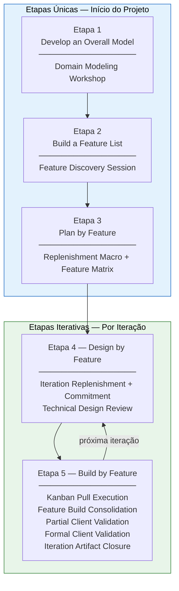

# 4. Engenharia de Requisitos

## Histórico de Revisão

| Versão | Data       | Descrição                                                                                                                                                                                | Autor(es)        |
| ------ | ---------- | ---------------------------------------------------------------------------------------------------------------------------------------------------------------------------------------- | ---------------- |
| 1.0    | 12/04/2026 | Criação das seções 4.1 a 4.4                                                                                                                                                             | Heitor e Lucas   |
| 1.1    | 13/04/2026 | Revisão da seção 4                                                                                                                                                                       | Equipe Crianex   |
| 1.2    | 04/05/2026 | Ajustes da seção 4.1                                                                                                                                                                     | Heitor           |
| 1.3    | 04/05/2026 | Ajustes da seção 4.2                                                                                                                                                                     | Heitor           |
| 1.4    | 06/05/2026 | Revisão dos ajustes da seção 4.1 e reajustes                                                                                                                                             | Philipe          |
| 1.5    | 05/05/2026 | Ajustes de clareza e consistência na seção 4                                                                                                                                             | Hugo             |
| 1.6    | 08/05/2026 | Ajustes de cerimônias e técnicas                                                                                                                                                         | Lucas e Philipe  |
| 1.7    | 18/05/2026 | Reestruturação completa: separação entre etapas únicas e iterativas do FDD; adição da tabela de atividades de ER                                                                         | Lucas A. Zanetti |
| 1.8    | 06/06/2026 | Reestruturação da tabela 4.5: colunas Etapa FDD · Atividade de ER · Técnicas; enunciação explícita das 6 atividades de ER                                                                | Lucas A. Zanetti |
| 1.9    | 17/06/2026 | Reestruturação ER-primeiro: atividades de Engenharia de Requisitos promovidas a nível principal; processo FDD + Kanban rebaixado a camada de execução (§4.3)                             | Heitor           |
| 1.10   | 17/06/2026 | Separação ER × ESw: artefatos de design técnico e smoke test movidos para nova trilha de Engenharia de Software (§4.5); V&V de requisitos reforçada com DoR, DoD e inspeção de requisito | Heitor           |
| 1.11   | 18/06/2026 | Consolidação do PR #174: técnicas do §4.2 enriquecidas com o formato/especificação concreta de uso de cada uma (IP, INVEST, Vertical Slicing, Feature Card, validações etc.)             | Heitor           |

---

## 4.1 Abordagem de Engenharia de Requisitos

No projeto Crianex, a **Engenharia de Requisitos (ER) é a disciplina condutora**: é ela que define _o que estamos fazendo_ do ponto de vista de requisitos, organizada nas seis atividades canônicas — Elicitação e Descoberta, Análise e Consenso, Declaração, Representação, Verificação e Validação, e Organização e Atualização. Todas as decisões de documentação do projeto se estruturam em torno dessas atividades.

O **Processo Híbrido (FDD + Kanban)** é o **meio pelo qual cada atividade de ER é executada** — não o contrário. O FDD (Feature-Driven Development) estrutura o planejamento orientado a valor — o que construir e em que ordem entregar —, enquanto o Kanban fornece o controle visual da execução — quando puxar o trabalho e quando parar — por meio da limitação de Work in Progress (WIP). Em resumo: as seis atividades de ER definem **o que** fazemos do ponto de vista de requisitos; o FDD + Kanban define **como** operacionalizamos cada uma delas.

A seção 4.2 apresenta as seis atividades de ER como nível principal. A seção 4.3 descreve, em camada de execução subordinada, como o processo FDD + Kanban realiza essas atividades. A seção 4.4 consolida a correspondência entre atividade de ER, etapa FDD e técnicas empregadas. A seção 4.5 reúne os artefatos de Engenharia de Software (ESw) produzidos na execução técnica, mantendo-os explicitamente separados das atividades de ER.

---

## 4.2 As seis atividades de Engenharia de Requisitos

Esta seção é o nível principal da documentação de requisitos do Crianex. Cada subseção descreve uma das seis atividades canônicas de ER, na ordem em que conduzem o ciclo de requisitos, indicando como a Crianex a realiza por meio do processo FDD + Kanban, as técnicas empregadas e os artefatos gerados.

### 4.2.1 Elicitação e Descoberta

**Propósito.** Extrair e descobrir os requisitos brutos junto a stakeholders, documentos e sistemas existentes. É nela que identificamos os stakeholders, o domínio, o problema, as necessidades e os requisitos funcionais e não funcionais ainda sem refino.

**Como a Equipe realiza.** Operacionalizada pelas cerimônias **Domain Modeling Workshop** (exploração do domínio com o Domain Expert Otávio Maya) e **Feature Discovery Session** (descoberta de funcionalidades orientadas a valor a partir das necessidades de negócio).

**Técnicas.**

- _Color Modeling_ — workshop com o Domain Expert (Otávio) para identificar visualmente classes, papéis, eventos e agregados do domínio, antes de qualquer feature ser escrita
- _Feature Discovery Session_ — sessão dedicada com o Domain Expert para transformar necessidades de negócio brutas em candidatas a feature, ainda sem formato final

**Artefatos gerados:** diagrama de domínio, glossário de termos, Feature Cards e ata da sessão.

---

### 4.2.2 Análise e Consenso

**Propósito.** Refinar o requisito bruto: resolver ambiguidade, contradição e lacuna, conciliar visões divergentes dos stakeholders e estabelecer prioridades, resolvendo conflitos sobre o que entra primeiro no fluxo de desenvolvimento.

**Como a Equipe realiza.** Operacionalizada pelas cerimônias de **Iteration Replenishment** (na versão macro, ao planejar o roadmap completo, e por iteração, ao selecionar as features candidatas) somadas ao **Commitment**, que formaliza o compromisso da equipe e do cliente com o objetivo da iteração.

**Técnicas.**

- _Vertical Slicing_ — toda feature é decomposta em fatias que entregam valor de ponta a ponta (UI → API → dado), nunca em camadas técnicas isoladas
- _INVEST_ — checklist aplicado a cada fatia de feature (Independente, Negociável, Valiosa, Estimável, Pequena, Testável) para verificar se está apta a entrar no backlog
- _Matriz Valor × Esforço_ — cada feature é posicionada em quadrantes (alto/baixo valor × alto/baixo esforço) para apoiar a priorização macro e por iteração
- _Priorização IP (VB / PT)_ — `IP = VB / PT`, onde `PT = (CX + ES) / 2`; VB, CX e ES em escala 1–5. IP ≥ 1,50 = alta prioridade; 1,00–1,49 = média; < 1,00 = baixa
- _Reordenação por IP_ — reordenação das features conforme o contexto da iteração
- _Iteration Goal Statement_ — uma frase única, demonstrável e orientada a valor que sintetiza o objetivo da iteração, acordada na Iteration Commitment

**Artefatos gerados:** backlog macro priorizado, roadmap de iterações, Feature Matrix, backlog priorizado da iteração, lista de features comprometidas e Iteration Goal documentado.

---

### 4.2.3 Declaração

**Propósito.** Enunciar e comunicar o requisito em linguagem — natural ou estruturada — no nível de granularidade adequado, de modo que seja compreendido por todos os envolvidos.

**Como a Equipe realiza.** Operacionalizada pelas cerimônias **Feature Discovery Session** (enunciação das features) e **Technical Design Review** (declaração dos critérios de aceite de cada feature). As decisões de design técnico discutidas na Technical Design Review são evidências de Engenharia de Software, registradas em §4.5 — não fazem parte da declaração do requisito.

**Técnicas.**

- _Feature Card Specification_ — toda feature é escrita no formato fixo `<ação> <resultado> <de/para/no/com> <objeto>` (ex.: "Cadastrar produto SaaS para o portfólio")
- _Critérios de aceite BDD_ — cada issue/feature tem critérios de aceite escritos em Dado / Quando / Então, nunca como User Story solta — é parte do Definition of Ready

**Artefatos gerados:** Feature Cards com critérios de aceite documentados.

---

### 4.2.4 Representação

**Propósito.** Complementar a declaração com formas visuais e estruturadas **do requisito** — modelos, diagramas de domínio e visualizações — que tornem o requisito mais claro, analisável e comunicável.

**Como a Equipe realiza.** Operacionalizada pela cerimônia **Domain Modeling Workshop** (representação do domínio do problema). A representação da solução técnica — diagramas de sequência e análise de impacto produzidos na Technical Design Review — é evidência de Engenharia de Software, registrada em §4.5, e não representa o requisito em si.

**Técnicas.**

- _Diagrama de domínio_ — diagrama de classes do domínio produzido no Color Modeling, representando entidades, relacionamentos e regras centrais do negócio
- _Glossário de termos_ — vocabulário de negócio compartilhado pela equipe
- _Feature Cards (Miro)_ — cada feature aprovada é registrada como card visual no Miro, linkada à sua CP de origem e rastreável até os RFs/RNFs
- _Prototipagem_ — mockup ou protótipo de tela usado quando a feature tem impacto direto de UI/UX, para validar o fluxo antes da codificação

**Artefatos gerados:** diagrama de domínio, glossário de termos, Feature Cards e Feature Matrix.

---

### 4.2.5 Verificação e Validação

**Propósito.** Assegurar a qualidade do requisito. A **verificação** (interna) checa consistência, completude e testabilidade — "fiz o requisito de forma correta?". A **validação** (externa) confirma com o stakeholder que se trata do requisito certo — "é o requisito certo?".

**Como a Equipe realiza.** A qualidade de entrada e saída do requisito é controlada pelos gates de **Definition of Ready (DoR)** e **Definition of Done (DoD)** (ver [§7 · DoR e DoD](dor-dod.md)). A validação externa ocorre nas cerimônias **Partial Client Validation** (validação assíncrona de entregas intermediárias com Otávio) e **Formal Client Validation** (demo orientada a valor ao final da iteração).

**Técnicas.**

- _Definition of Ready (DoR)_ — gate de verificação de **entrada** do requisito: confirma que o requisito está claro, completo e testável antes de entrar na iteração ([§7 · DoR e DoD](dor-dod.md))
- _Definition of Done (DoD)_ — gate de validação de **saída** do requisito: confirma que o requisito foi efetivamente atendido ([§7 · DoR e DoD](dor-dod.md))
- _Inspeção do requisito / critério de aceite_ — revisão da **qualidade do requisito** e de seus critérios de aceite. Distingue-se da revisão de código em Pull Request, que é verificação de Engenharia de Software (§4.5): aqui o foco é inspecionar o requisito, não a implementação
- _Verificação de critérios de aceite_ — conferência item a item dos critérios BDD/checklist da feature contra o comportamento implementado
- _Validação assíncrona_ — vídeo curto ou screenshots + checklist de critérios de aceite, enviados a Otávio via WhatsApp em até 24h, sem esperar reunião formal
- _Demo orientada a valor_ — demonstração na Formal Client Validation narrada pelo Iteration Goal ("o cliente consegue X"), não por lista de features isoladas

**Artefatos gerados:** DoR e DoD aplicados, matriz de rastreabilidade atualizada, comentário de validação na issue, checklist marcado, ata da demo e aprovação formal de Otávio.

---

### 4.2.6 Organização e Atualização

**Propósito.** Manter o conjunto de requisitos estruturado e atual: listas e mapas, rastreabilidade, refinamento e priorização contínuos, e versionamento ao longo do projeto.

**Como a Equipe realiza.** Operacionalizada pelas cerimônias **Plan by Feature** (organização e priorização do trabalho no horizonte completo do projeto) e **Iteration Artifact Closure** (empacotamento e atualização dos artefatos ao final de cada iteração).

**Técnicas.**

- _Backlog macro priorizado_ — lista de todas as features do projeto, ordenada por IP, mantida no Miro/GitHub Projects e revisada a cada replenishment macro
- _Roadmap de iterações + Feature Matrix_ — visão de qual feature entra em qual iteração e quem é o Chief Programmer responsável, atualizada no Plan by Feature
- _Requirements Traceability Matrix_ — tabela viva ligando OE → CP → Feature → RF/RNF, atualizada a cada Feature Build Consolidation (ver [rastreabilidade](../backlog/rastreabilidade.md))
- _Backlog Reorganization_ — sessão (eventual) de reordenação do backlog a partir do feedback capturado na Formal Client Validation
- _Checklist de empacotamento_ — lista de verificação usada na Iteration Artifact Closure para garantir que todos os artefatos exigidos pelo cliente acadêmico foram entregues

**Artefatos gerados:** backlog macro priorizado, roadmap de iterações, Feature Matrix, matriz de rastreabilidade, Documento de Visão e GitHub Pages atualizados, e backlog congelado da iteração.

---

## 4.3 Operacionalização — o processo FDD + Kanban

Esta seção descreve o **como executamos** — a camada de execução subordinada às atividades de ER da seção 4.2. Cada etapa e cerimônia do FDD descrita aqui serve a uma ou mais das seis atividades de ER: é o processo híbrido FDD + Kanban que coloca em prática a elicitação, a análise, a declaração, a representação, a verificação/validação e a organização dos requisitos.

O FDD é composto por **5 etapas**, mas elas **não são todas iterativas**. A separação entre o que ocorre uma única vez e o que se repete em cada iteração é central para entender como o processo funciona no projeto Crianex.

### 4.3.1 Etapas Únicas — Realizadas uma vez no início do projeto

As três primeiras etapas do FDD constroem a fundação do produto: o modelo de domínio, a lista de funcionalidades e o plano de desenvolvimento. São executadas **uma única vez**, antes da primeira iteração de construção, e seus artefatos servem de insumo para todas as iterações seguintes.

#### Etapa 1 — Develop an Overall Model (Desenvolver Modelo Global)

O objetivo é construir uma visão compartilhada e abrangente do domínio do problema antes de qualquer detalhe funcional ser discutido. A equipe e o Domain Expert (Otávio Maya) exploram juntos o negócio, suas entidades, relacionamentos e regras centrais.

**Cerimônia:** Domain Modeling Workshop

Reunião em que a equipe e o Domain Expert constroem o modelo de domínio que sustenta as features do projeto. O resultado é um entendimento coletivo e documentado sobre as entidades do sistema — não apenas uma lista de requisitos.

**Técnica:** Color Modeling — organização visual dos elementos do domínio para identificar classes, papéis, eventos e agregados.

**Artefatos gerados:** diagrama de domínio e glossário de termos.

---

#### Etapa 2 — Build a Feature List (Construir Lista de Funcionalidades)

Com o modelo de domínio estabelecido, a equipe decompõe o sistema em funcionalidades concretas e orientadas ao cliente. Cada feature representa uma ação de valor entregável e verificável.

**Cerimônia:** Feature Discovery Session

Cerimônia dedicada à descoberta e ao refinamento de funcionalidades com o Domain Expert. A equipe transforma necessidades de negócio em features claras, compreensíveis e orientadas a valor.

**Técnicas:**

- _Feature Card Specification_ — padroniza a escrita da feature na formulação `<ação> <resultado> <de/para/no/com> <objeto>`
- _Vertical Slicing_ — orienta a decomposição em partes menores com valor demonstrável de ponta a ponta
- _INVEST_ — garante que cada fatia seja independente, negociável, valiosa, estimável, pequena e testável

**Artefatos gerados:** Feature Cards e ata da sessão.

---

#### Etapa 3 — Plan by Feature (Planejar por Funcionalidade)

Com a lista de features construída, a equipe organiza e prioriza o trabalho no horizonte completo do projeto: quais features vão para qual iteração, quem é o Chief Programmer responsável por cada conjunto e qual a sequência de entrega orientada a valor de negócio.

**Cerimônia:** Iteration Replenishment (versão macro — planejamento do roadmap completo)

A priorização é feita com base na matriz **Valor × Esforço** e no **Índice de Prioridade (IP = VB / PT)**, garantindo que as features de maior valor e menor esforço relativo entrem primeiro no fluxo de desenvolvimento.

**Técnicas:**

- _Matriz Valor × Esforço_ — posiciona cada feature em quadrantes de prioridade
- _Priorização IP_ — ordena features por IP = VB / PT, onde PT = (CX + ES) / 2

**Artefatos gerados:** backlog macro priorizado, roadmap de iterações com CPs por iteração e Feature Matrix.

---

### 4.3.2 Etapas Iterativas — Repetidas em cada iteração

As duas últimas etapas do FDD são executadas **a cada iteração**, para cada conjunto de features comprometido. É aqui que o Kanban entra como sistema de gestão de fluxo, complementando o FDD com visibilidade operacional e controle de WIP.

#### Etapa 4 — Design by Feature (Projetar por Funcionalidade)

No início de cada iteração, as features do escopo são refinadas tecnicamente antes de qualquer linha de código ser escrita. Essa etapa produz os critérios de aceite, o design técnico e o compromisso formal da equipe com o objetivo da iteração.

##### Cerimônia 1 — Iteration Replenishment Micro + Commitment

A Iteration Replenishment seleciona as features candidatas para a iteração corrente com base no IP e na capacidade da equipe. O Iteration Commitment formaliza o compromisso da equipe e do cliente com o Iteration Goal — uma frase única e demonstrável que sintetiza o valor a ser entregue.

**Técnicas:**

- _Matriz Valor × Esforço_ e _Priorização IP_ — reordenação das features conforme contexto da iteração
- _Iteration Goal Statement_ — formulação do objetivo principal da iteração

**Artefatos gerados:** backlog priorizado da iteração, lista de features comprometidas e Iteration Goal documentado.

---

##### Cerimônia 2 — Technical Design Review

Cerimônia em que a solução técnica de cada feature comprometida é analisada antes da implementação. O Chief Programmer lidera a sessão com o objetivo de validar a abordagem estrutural e reduzir riscos antes da codificação.

**Técnicas:**

- Diagrama de sequência leve — representa interações e integrações relevantes da solução
- Análise de impacto e identificação de pontos de extensão
- Prototipagem quando aplicável
- Diagrama de sequência formal

**Artefatos gerados:** notas de design e especificação técnica por feature.

> **ESw, não ER.** Diagramas de sequência, análise de impacto e notas de design produzidos aqui são evidências de **Engenharia de Software**, catalogadas em §4.5. Não constituem atividades de Engenharia de Requisitos.

---

#### Etapa 5 — Build by Feature (Construir por Funcionalidade)

Com o design validado, as features entram no fluxo de execução Kanban. A construção é acompanhada por validações contínuas com o cliente e consolidações formais ao final da iteração.

##### Cerimônia 3 — Midweek Sync / Kanban Pull Execution

Alinhamento rápido e assíncrono da equipe, combinado com a regulação do fluxo de execução das issues pelo Kanban. Garante visibilidade do trabalho em andamento e controle de WIP.

**Técnicas:**

- _Kanban_ e _Pull System_ — novas issues só são puxadas conforme capacidade disponível
- _WIP limits_ — máx. 2 issues In Progress por Class Owner

**Artefatos gerados:** board atualizado, comentários de bloqueio, commits, branches e Pull Requests.

---

##### Cerimônia 4 — Feature Build Consolidation

Cerimônia realizada ao final de cada semana de produção para garantir que todas as fatias de uma feature foram integradas e são rastreáveis de ponta a ponta.

**Técnicas:**

- Smoke test end-to-end
- Verificação de critério de aceite da feature
- Requirements Traceability Matrix

**Artefatos gerados:** features em ambiente de homologação e matriz de rastreabilidade atualizada.

> **ESw, não ER.** O smoke test end-to-end verifica a **implementação** e é evidência de Engenharia de Software (§4.5). A verificação do _requisito_ e de seus critérios de aceite permanece na atividade de V&V de ER (§4.2.5).

---

##### Cerimônia 5 — Partial Client Validation

Validação assíncrona de entregas intermediárias com Otávio, realizada ao final de cada semana, para acelerar o ciclo de feedback sem aguardar a reunião formal.

**Técnicas:**

- Validação assíncrona via vídeo curto ou screenshots + checklists de critérios de aceite

**Artefatos gerados:** comentário de validação na issue, checklist marcado e organização de feedback para o backlog.

---

##### Cerimônia 6 — Formal Client Validation

Reunião de demo ao final de cada iteração. Confirma com Otávio se o valor de negócio foi de fato entregue. A demo é orientada ao valor entregue — narrativa "o cliente consegue X" —, não a features individuais.

**Técnicas:**

- Demo orientada a valor: narrativa centrada no Iteration Goal, não em funcionalidades isoladas

**Artefatos gerados:** ata da demo, aprovação formal de Otávio e lista de feedback para o backlog. Pode gerar uma sessão extra de **Backlog Reorganization** a partir do feedback capturado.

---

##### Cerimônia 7 — Iteration Artifact Closure

Cerimônia de fechamento da iteração que empacota todos os artefatos que o cliente acadêmico (professor George Marsicano) precisa receber na unidade correspondente.

**Técnicas:**

- Checklist de empacotamento
- Revisão cruzada entre membros da equipe

**Artefatos gerados:** Documento de Visão e GitHub Pages atualizados; backlog congelado da iteração; atas de reunião entregues; matriz de rastreabilidade; evidências de validação da metodologia.

---

### 4.3.3 Visão consolidada do processo

---

## 4.4 Visão consolidada (ER → FDD → Técnicas)

A tabela abaixo consolida a correspondência entre as seis atividades de Engenharia de Requisitos e o processo de execução, agora com a **atividade de ER como agrupador principal**. Para cada atividade, indica-se em qual etapa do FDD ela é operacionalizada e quais técnicas emprega.

| Atividade de ER               | Etapa FDD                                 | Técnicas                                                                                                                                                                                     |
| ----------------------------- | ----------------------------------------- | -------------------------------------------------------------------------------------------------------------------------------------------------------------------------------------------- |
| **Elicitação e Descoberta**   | Etapa 1 — Develop an Overall Model        | Color Modeling                                                                                                                                                                               |
|                               | Etapa 2 — Build a Feature List            | Feature Discovery Session                                                                                                                                                                    |
| **Análise e Consenso**        | Etapa 2 — Build a Feature List            | Vertical Slicing · INVEST                                                                                                                                                                    |
|                               | Etapa 3 — Plan by Feature                 | Matriz Valor × Esforço · Priorização IP (VB / PT)                                                                                                                                            |
|                               | Etapa 4 — Design by Feature _(iterativa)_ | Reordenação por IP · Iteration Goal Statement                                                                                                                                                |
| **Declaração**                | Etapa 2 — Build a Feature List            | Feature Card Specification (`<ação> <resultado> <de/para/no/com> <objeto>`)                                                                                                                  |
|                               | Etapa 4 — Design by Feature _(iterativa)_ | Critérios de aceite BDD (Dado / Quando / Então)                                                                                                                                              |
| **Representação**             | Etapa 1 — Develop an Overall Model        | Diagrama de domínio · Glossário de termos                                                                                                                                                    |
|                               | Etapa 2 — Build a Feature List            | Feature Cards · Feature Matrix                                                                                                                                                               |
|                               | Etapa 4 — Design by Feature _(iterativa)_ | Prototipagem                                                                                                                                                                                 |
| **Verificação e Validação**   | Etapa 4 — Design by Feature _(iterativa)_ | Definition of Ready (DoR) — gate de entrada do requisito                                                                                                                                     |
|                               | Etapa 5 — Build by Feature _(iterativa)_  | Definition of Done (DoD) · Inspeção do requisito / critério de aceite · Verificação de critérios de aceite · Validação assíncrona (vídeo / screenshots + checklist) · Demo orientada a valor |
| **Organização e Atualização** | Etapa 3 — Plan by Feature                 | Backlog macro priorizado · Roadmap de iterações · Feature Matrix                                                                                                                             |
|                               | Etapa 5 — Build by Feature _(iterativa)_  | Requirements Traceability Matrix · Backlog Reorganization · Checklist de empacotamento                                                                                                       |

> **Trilha de Engenharia de Software (ESw).** Os artefatos de design técnico e teste de software — diagrama de sequência (leve e formal), análise de impacto, notas de design técnico e smoke test end-to-end — **não** pertencem às atividades de ER acima. São evidências de execução do processo de ESw e estão catalogados na seção §4.5.

---

## 4.5 Artefatos de Engenharia de Software (execução técnica)

Os artefatos listados nesta seção são **evidências de execução do processo de Engenharia de Software (ESw)**, produzidos durante o design e a construção das features — na cerimônia **Technical Design Review** e na etapa **Build by Feature** do FDD, descritas em §4.3. Eles **não constituem atividades de Engenharia de Requisitos**: descrevem e verificam a _solução técnica_, não o requisito. Estão documentados aqui justamente para preservar a separação ER × ESw exigida pela disciplina — a Unidade 3 pede "Evidências de execução do processo de ESw e ER" —, evitando que sejam confundidos com as atividades de ER da §4.2.

| Artefato de ESw                                             | Natureza                                         | Onde é produzido (§4.3)                                  |
| ----------------------------------------------------------- | ------------------------------------------------ | -------------------------------------------------------- |
| Diagrama de sequência (leve e formal)                       | Representação da solução técnica                 | Technical Design Review (Etapa 4 — Design by Feature)    |
| Análise de impacto e identificação de pontos de extensão    | Design técnico                                   | Technical Design Review (Etapa 4 — Design by Feature)    |
| Notas de design técnico / especificação técnica por feature | Design técnico                                   | Technical Design Review (Etapa 4 — Design by Feature)    |
| Smoke test end-to-end                                       | Verificação da implementação (teste de software) | Feature Build Consolidation (Etapa 5 — Build by Feature) |
