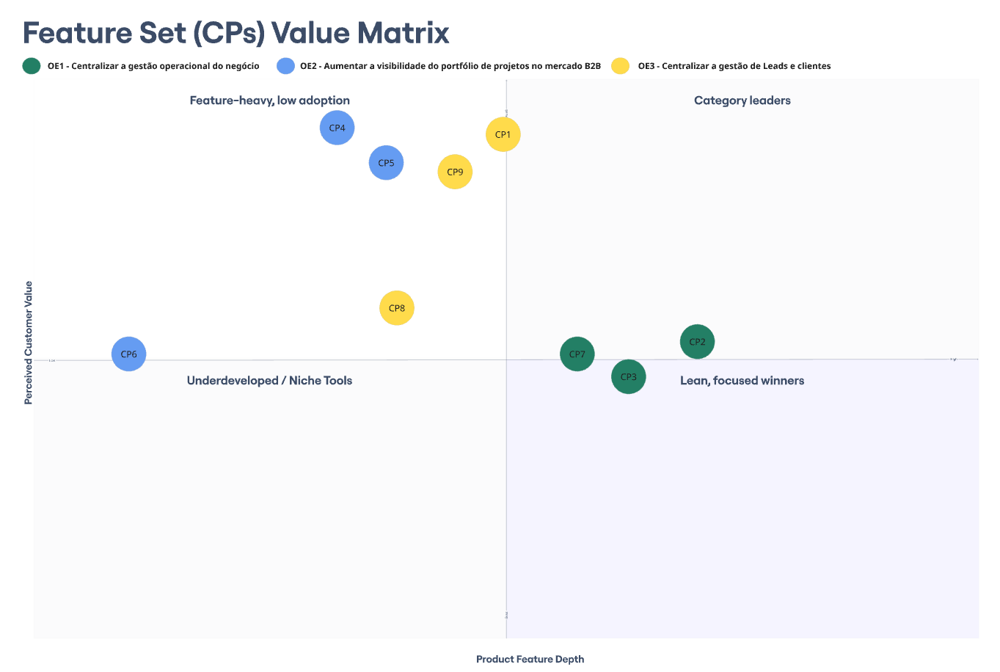
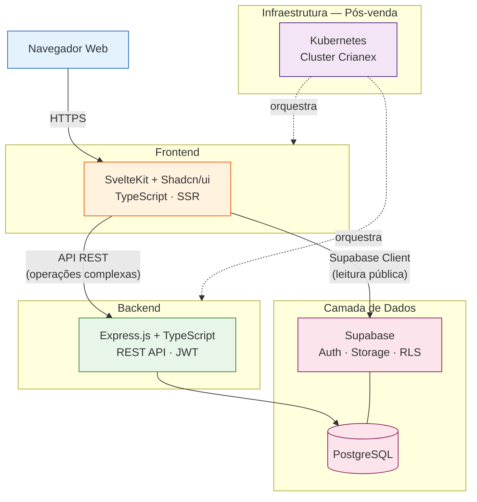

# 2. Solução Proposta

## Histórico de Revisão

| Versão | Data | Descrição | Autor(es) |
|--------|------|-----------|-----------|
| 1.0 | 03/04/2026 | Criação das seções 2.1 a 2.3 | Lucas A. Zanetti |
| 1.1 | 09/04/2026 | Revisão geral e ajuste de objetivos | Equipe Crianex |
| 1.2 | 12/04/2026 | Preenchimento das seções 2.4 a 2.7 | Philipe e Hugo |
| 1.3 | 05/05/2026 | re-ajuste do objetivo principal, objetivos específicos e características de Produto | Lucas A. Zanetti |
| 1.4 | 06/05/2026 | Substituição do diagrama de arquitetura ASCII por diagrama Mermaid com atribuição autoral | Equipe Crianex |
| 1.5 | 06/05/2026 | Remoção de CP10 e CP12 (RNFs), renumeração das CPs e reformulação do OE4 | Lucas A. Zanetti |
| 1.6 | 06/05/2026 | Adição de CP14 — Portal do Cliente (OE4); remoção de CP13 (Design Responsivo, RNF); renumeração CP14→CP13 | Lucas A. Zanetti |

---

## 2.1 Perspectiva do Produto

!!! tip "Objetivo Geral do Produto"
    Aumentar a competitividade da Crianex no mercado SaaS

O **Crianex Hub** é uma plataforma que envolve duas áreas principais:

| Área | Acesso | Descrição |
|--------|--------|-----------|
| **Área Administrativa** | Autenticado (login) | Gestão interna de projetos, status, logs e alocação de pessoas em tempo real |
| **Vitrine Digital** | Público | Exposição do portfólio de projetos e cases para aumento de engajamento e captação B2B |

---

## 2.2 Declaração de Posição do Produto

| Campo | Descrição |
|-------|-----------|
| **Para** | A Crianex Software House e seus gestores, colaboradores e potenciais clientes B2B |
| **Que** | Necessita de visibilidade centralizada dos projetos e de uma vitrine digital profissional |
| **O Crianex** | É uma plataforma SaaS de gestão e portfólio de projetos |
| **Que** | Unifica a gestão interna (área administrativa) e a apresentação pública (vitrine digital) numa única solução |
| **Diferente de** | Ferramentas genéricas de gestão (Jira, Trello) ou sites institucionais estáticos |
| **Nosso produto** | Integra em tempo real a operação interna com a comunicação de portfólio ao mercado |

---

## 2.3 Objetivos Específicos e Características do Produto

### Objetivos Específico (OE)

| ID | Objetivo Específico | Foco
|----|----------------------|------------------------|
| OE1 | Centralizar a gestão de projetos | Administração/Gestão |
| OE2 | Aumentar a visibilidade do portfólio de projetos no mercado B2B | Vitrine/Portifolio Empresarial |
| OE3 | Centralizar a gestão de Leads e clientes | Expansão da base de clientes |

### Características do Produto (CP)

| OE Principal | OE Secundária | ID | Nome da CP | Descrição Funcional | Valor de Negócio |
|---|---|---|---|---|---|
| OE3 | - | CP1 | CRM Interno de Clientes (Kanban) | Módulo autenticado que centraliza o relacionamento com clientes e leads em um board visual Kanban. Cada card representa um cliente ou oportunidade, contendo histórico de interações, tickets vinculados e produto SaaS de interesse. O responsável interno é identificável por card. As colunas representam estágios do funil de relacionamento, configuráveis pelo administrador. O sistema emite notificações internas ao aproximar-se de prazos e ao mover cards. | Eliminar o uso de planilhas e e-mails para gestão de relacionamento; garantir rastreabilidade de cada oportunidade; reduzir perdas por falta de follow-up. |
| OE1 | - | CP2 | Dashboard de Logs e Monitoramento | Painel autenticado com visualização de logs de acesso segmentados por perfil (usuário cliente e usuário desenvolvedor), logs de atividades por produto/projeto e logs de tickets de suporte. Permite filtros por período, produto e tipo de evento. Exportável em formato estruturado (CSV/JSON). | Aumentar a visibilidade operacional interna; facilitar diagnóstico de problemas e auditorias de segurança; rastrear ações na plataforma em tempo real. |
| OE1 | OE3 | CP3 | Dashboard Executivo de Métricas | Painel autenticado com indicadores-chave de negócio consolidados: volume de tickets abertos/resolvidos por produto, páginas mais acessadas da vitrine e faturamento por período. Dados apresentados em gráficos e cards KPI com filtros por intervalo de data. | Substituir relatórios manuais em planilhas por um painel interativo; prover visibilidade estratégica em tempo real para tomada de decisão de priorização e investimento. |
| OE2 | — | CP4 | Vitrine Pública de Produtos SaaS | Página pública bilíngue (PT/EN) com apresentação completa do portfólio (Avali, Pontua, Notifly e futuros produtos), incluindo descrição, screenshots, funcionalidades-chave, público-alvo e links de acesso a cada SaaS. Design alinhado ao posicionamento técnico da empresa. | Aumentar a visibilidade externa do portfólio; atrair novos clientes e parceiros; reduzir a barreira de entrada apresentando cada produto de forma clara e atrativa. |
| OE2 | — | CP5 | Página Institucional da Empresa | Seção pública com missão, valores, diferenciais técnicos (K8s, multi-tenant, IA, WebSocket em tempo real) e informações de contato comercial. Conteúdo reflete a identidade e maturidade técnica da Crianex para novos públicos. | Comunicar credibilidade técnica para clientes B2B e parceiros; apoiar decisões de contratação por meio de transparência sobre a empresa e seu posicionamento. |
| OE2 | OE3 | CP6 | Formulário de Contato e Captação de Leads | Formulário público com campos de nome, e-mail, produto de interesse e mensagem. Respostas submetidas dos Leads são registradas automaticamente no CRM interno (CP1) e geram notificação imediata para o time, sem necessidade de cadastro prévio pelo visitante. | Criar canal estruturado de captação de oportunidades comerciais na vitrine, integrando geração de leads ao CRM com atrito mínimo para o visitante. |
| OE1 | OE2 | CP7 | Painel de Gerenciamento de Produtos SaaS | Interface administrativa autenticada com 2FA para adicionar, editar, remover e reordenar os produtos exibidos na vitrine. Permite edição de textos, imagens e links de cada SaaS sem necessidade de alteração direta no código. Histórico de alterações auditável por log. | Dar autonomia ao time para manter o portfólio sempre atualizado sem depender de deploy; garantir rastreabilidade de todas as mudanças realizadas pelos administradores. |
| OE2 | OE1 | CP8 | FAQ e Base de Conhecimentos por Produto | Seção pública de perguntas frequentes organizada por produto SaaS, com artigos criados e editados pelo administrador. Cada artigo é indexável e possui categorização por tipo de dúvida, permitindo ao cliente resolver problemas comuns de forma autônoma sem abrir ticket. | Reduzir o volume de tickets para dúvidas recorrentes; liberar o time para demandas complexas; melhorar a experiência do cliente com autoatendimento. |
| OE1 | - | CP9 | Controle de Faturamento e Relatórios Financeiros | Área restrita ao administrador para registro de receitas por produto SaaS, acompanhamento de faturamento por cliente e período, e emissão de relatórios financeiros periódicos exportáveis em PDF/CSV. | Eliminar o uso de planilhas isoladas para controle financeiro; centralizar dados de receita com informações precisas para tomada de decisão estratégica. |
| OE3 | OE1 | CP10 | Sistema de Tickets de Suporte | Canal autenticado de suporte via tickets onde o usuário abre chamados sobre um SaaS específico sem necessidade de cadastro prévio. Os tickets são vinculados ao produto e ao cliente no CRM (CP1), com acompanhamento de status, histórico de respostas e encerramento pelo administrador. | Centralizar todo o atendimento pós-venda num único canal rastreável; reduzir o tempo de resposta; eliminar comunicações perdidas em e-mails ou mensagens informais. |
| OE3 | OE1 | CP11 | Notificações Automáticas no Sistema | Sistema de notificações automáticas disparadas em eventos-chave: abertura de ticket, atualização de status do chamado, novo lead via formulário de contato e resposta do administrador ao ticket. Templates configuráveis por tipo de evento com possível integração com e-mail. | Reduzir o tempo médio de resposta a clientes; garantir que nenhum ticket ou lead fique sem resposta por falta de visibilidade do time. |

### Mapeamento de Valor das Características (Feature/Value Matrix)

O diagrama abaixo posiciona cada CP em relação ao **valor percebido pelo cliente** (eixo Y) e à **profundidade de funcionalidade** necessária para implementá-la (eixo X). O quadrante superior direito ("Category leaders") agrupa as CPs de maior impacto e maior complexidade — prioridades absolutas do roadmap.

<figure class="crianex-figure">
  <figcaption>Figura 2 — Feature/Value Matrix das Características do Produto (CP1–CP13). Fonte: Elaborado pelos autores (2026).</figcaption>
</figure>

---

## 2.4 Tecnologias Utilizadas

O stack tecnológico do Crianex foi escolhido com base em três critérios principais: **alinhamento com os requisitos técnicos do produto**, **curva de aprendizado da equipe** e **suporte a SEO e performance** necessários para a vitrine digital pública.

### Visão Geral da Arquitetura

<figure class="crianex-figure">
  <figcaption>Figura 1 — Visão Geral da Arquitetura do Crianex Hub. Fonte: Elaborado pelos autores (2026).</figcaption>
</figure>

### 2.4.1 Frontend — SvelteKit + Shadcn/ui

| Atributo | Detalhe |
|----------|---------|
| **Framework** | SvelteKit |
| **Biblioteca de UI** | Shadcn/ui (componentes acessíveis e customizáveis) |
| **Renderização** | SSR (Server-Side Rendering) |
| **Linguagem** | TypeScript |

**Justificativa para SvelteKit em vez de React:**

| Critério | SvelteKit | React/Next.js |
|----------|-----------|---------------|
| **Bundle size** | Muito menor — sem runtime virtual DOM | Runtime React incluído |
| **Curva de aprendizado** | Sintaxe mais próxima de HTML/CSS/JS puro | Requer conhecimento de JSX e hooks |
| **Performance** | Compilação estática sem overhead de runtime | Diferenças notáveis em payloads grandes |
| **Adequação ao projeto** | Vitrine pública exige SEO; área adm. exige reatividade | Ambos alcançáveis, porém com maior complexidade |

O SSR do SvelteKit é essencial para que a **vitrine digital** seja indexada corretamente por motores de busca, aumentando a visibilidade da Crianex no mercado B2B.

### 2.4.2 Backend — Express.js + TypeScript

| Atributo | Detalhe |
|----------|---------|
| **Framework** | Express.js |
| **Linguagem** | TypeScript |
| **Arquitetura** | REST API |
| **Autenticação** | JWT integrado ao Supabase Auth |

O backend atua como camada de negócio intermediária para os fluxos de maior complexidade — especialmente operações que envolvem múltiplas tabelas, validações de negócio e geração de relatórios. Para fluxos mais simples (como leitura de dados públicos da vitrine), o frontend pode acessar o Supabase diretamente via cliente.

### 2.4.3 Banco de Dados — Supabase + PostgreSQL + RLS

| Atributo | Detalhe |
|----------|---------|
| **BaaS** | Supabase |
| **Banco** | PostgreSQL |
| **Segurança de acesso** | Row Level Security (RLS) |
| **Autenticação** | Supabase Auth (JWT) |
| **Acesso direto** | Supabase Client JS (fluxos de leitura simples) |

O **Row Level Security (RLS)** do PostgreSQL garante que cada usuário só acessa os dados aos quais tem permissão, mesmo em acessos diretos pelo frontend — eliminando a necessidade de um proxy de backend para todos os endpoints de leitura.

### 2.4.4 Infraestrutura — Kubernetes

| Atributo | Detalhe |
|----------|---------|
| **Orquestrador** | Kubernetes |
| **Operado por** | Crianex (infraestrutura própria) |
| **Previsão de deploy** | Sprint 6 |

O deploy da aplicação será realizado no cluster Kubernetes gerenciado pela própria Crianex. O time de desenvolvimento integrará a pipeline de CI/CD ao cluster nas etapas finais do projeto. Até lá, os ambientes de desenvolvimento e homologação utilizam Docker Compose localmente.

### Resumo do Stack

| Camada | Tecnologia | Versão / Notas |
|--------|-----------|---------------|
| Frontend | SvelteKit + Shadcn/ui | TypeScript, SSR |
| Backend | Express.js | TypeScript, REST API |
| Banco de Dados | PostgreSQL (via Supabase) | RLS habilitado |
| BaaS | Supabase | Auth + Storage + RLS |
| Infra / Deploy | Kubernetes | Gerenciado pela Crianex |
| CI/CD | GitHub Actions | Build, test, deploy automático |
| Controle de versão | Git / GitHub | Monorepo |

---

## 2.5 Posicionamento no Mercado

Esta seção analisa as soluções existentes no mercado e o posicionamento diferenciado do produto Crianex frente aos concorrentes diretos e indiretos.

### 2.5.1 Análise de Concorrentes

O mercado de gestão de projetos e portfólio digital para Software Houses é dominado por ferramentas genéricas de grande porte ou por soluções especializadas que não atendem simultaneamente as necessidades de **gestão interna** e **vitrine pública**. Os principais concorrentes identificados são:

#### Microsoft Dynamics 365

| Atributo | Detalhe |
|----------|---------|
| **Tipo** | Suite ERP/CRM empresarial |
| **Foco** | Gestão de clientes, vendas, finanças e operações |
| **Público-alvo** | Grandes corporações e médias empresas |
| **Modelo de preço** | Licença por usuário (alto custo — a partir de USD 65/usuário/mês) |
| **Limitações para o contexto** | Complexidade elevada; sem módulo de vitrine digital; curva de aprendizado alta; custo proibitivo para Software Houses de pequeno/médio porte |

#### Oracle CRM (Oracle Fusion CRM)

| Atributo | Detalhe |
|----------|---------|
| **Tipo** | CRM corporativo |
| **Foco** | Gestão de relacionamento com clientes e pipeline de vendas |
| **Público-alvo** | Grandes empresas com processos de vendas complexos |
| **Modelo de preço** | Enterprise — custo elevado com contrato anual |
| **Limitações para o contexto** | Não contempla gestão operacional de projetos de desenvolvimento de software; sem vitrine digital; integração complexa com ferramentas de desenvolvimento |

#### Agendor CRM

| Atributo | Detalhe |
|----------|---------|
| **Tipo** | CRM para pequenas e médias empresas |
| **Foco** | Gestão do funil de vendas e relacionamento com clientes |
| **Público-alvo** | PMEs brasileiras |
| **Modelo de preço** | A partir de R$ 53/usuário/mês |
| **Limitações para o contexto** | Foco exclusivo em CRM de vendas; sem suporte a gestão de projetos de desenvolvimento; sem módulo de portfólio/vitrine |

### 2.5.2 Tabela Comparativa

| Característica | Crianex | MS Dynamics 365 | Oracle CRM | Agendor CRM |
|----------------|---------|-----------------|------------|-------------|
| Gestão de projetos de software | Sim | Parcial | Não | Não |
| Vitrine digital pública | Sim | Não | Não | Não |
| Alocação de pessoas em projetos | Sim | Sim | Não | Não |
| Dashboard de projetos em tempo real | Sim | Sim | Não | Não |
| Formulário de captação B2B | Sim | Parcial | Sim | Sim |
| Integração entre gestão e portfólio | Sim | Não | Não | Não |
| Custo acessível para PMEs | Sim | Não | Não | Parcial |
| Customização de identidade visual | Sim | Parcial | Não | Não |
| Implantado pela própria Crianex | Sim | Não | Não | Não |

### 2.5.3 Diferenciais do Crianex Hub

| Diferencial | Descrição |
|-------------|-----------|
| **Integração nativa gestão ↔ vitrine** | Um único produto que conecta a operação interna com a apresentação pública do portfólio — eliminando silos de informação |
| **Desenvolvido sob medida** | Construído especificamente para a realidade e os fluxos da Crianex, sem excesso de funcionalidades irrelevantes |
| **Custo de operação controlado** | Rodando na infraestrutura própria da Crianex (Kubernetes), sem licenças de terceiros recorrentes |
| **Publicação seletiva de projetos** | A equipe controla quais projetos e informações são exibidos publicamente na vitrine |
| **Identidade visual customizável** | Logo, cores e textos da vitrine configuráveis pelo próprio time da Crianex |
| **Alocação em tempo real** | Visualização imediata de quem está em qual projeto, com qual carga, facilitando decisões de RH técnico |

### 2.5.4 Segmento-Alvo

| Segmento | Característica |
|----------|---------------|
| **Software Houses B2B** | Empresas de desenvolvimento que gerenciam múltiplos projetos simultâneos para clientes corporativos |
| **Equipes distribuídas** | Times remotos ou híbridos que precisam de visibilidade centralizada do status dos projetos |
| **PMEs de tecnologia** | Empresas com 5 a 50 colaboradores técnicos, onde ferramentas Enterprise são excessivamente complexas e caras |

---

## 2.6 Viabilidade do Projeto

Esta seção avalia a viabilidade do projeto Crianex sob três dimensões: **escopo acadêmico**, **capacidade técnica da equipe** e **riscos de infraestrutura**.

### 2.6.1 Viabilidade de Escopo — Semestre Acadêmico

O projeto precisa ser entregue dentro do cronograma da disciplina de Requisitos de Software (REQ-2026.1), organizado em 3 unidades com iterações quinzenais.

| Dimensão | Avaliação | Justificativa |
|----------|-----------|---------------|
| **Escopo do MVP** | Viável | As 11 características do produto foram priorizadas a partir da matrix de Valor x Esforço|
| **Prazo total** | Viável com dificuldades | 4 iterações que cobrem o desenvolvimento incremental sem necessidade de paralelismo excessivo |
| **Entregas incrementais** | Viável | A arquitetura modular (Área Adm. + Vitrine) permite entregas independentes por iteração |
| **Alinhamento acadêmico** | Alto | As entregas de cada unidade estão alinhadas aos critérios de avaliação da disciplina |

### 2.6.2 Viabilidade Técnica — Alinhamento de Skills da Equipe

A equipe é composta por 6 membros com experiência em tecnologias web modernas.

| Tecnologia | Nível de Familiaridade da Equipe | Risco | Mitigação |
|------------|----------------------------------|-------|-----------|
| **SvelteKit** | Médio (maioria conhece Vue/React; Svelte é novo para alguns) | Médio | Documentação excelente; curva de aprendizado curta — estimativa de 1 semana de onboarding |
| **TypeScript** | Alto (toda a equipe tem experiência prévia) | Baixo | — |
| **Express.js** | Alto | Baixo | — |
| **PostgreSQL** | Alto | Baixo | — |
| **Supabase** | Médio | Baixo | BaaS bem documentado; simplifica Auth, Storage e RLS sem necessidade de configuração de infraestrutura |
| **Kubernetes** | Baixo (infraestrutura gerenciada pela Crianex) | Médio | Ver seção 2.6.3 |

### 2.6.3 Viabilidade de Infraestrutura — Kubernetes e API da Crianex

| Risco | Probabilidade | Impacto | Mitigação |
|-------|---------------|---------|-----------|
| **Indisponibilidade do cluster Kubernetes** | Baixa | Alto | Ambiente de desenvolvimento local com Docker Compose; deploy no Kubernetes apenas na Iteração |
| **Alterações na API da Crianex sem aviso prévio** | Média | Médio | Contratos de API documentados via OpenAPI; versionamento de endpoints; comunicação direta com CTO |
| **Acesso ao cluster não liberado no prazo** | Média | Alto | Pipeline de CI/CD preparada antecipadamente; acesso solicitado com 2 iterações de antecedência |
| **Mudanças de requisitos de infraestrutura** | Baixa | Médio | PM mantém contato direto com a liderança da Crianex para alinhamento contínuo |

### 2.6.4 Conclusão de Viabilidade

| Dimensão | Veredicto |
|----------|-----------|
| Escopo dentro do semestre acadêmico | **Viável com dificuldades** |
| Capacidade técnica da equipe | **Viável** (com onboarding em SvelteKit) |
| Infraestrutura Kubernetes | **Viável com risco gerenciado** |
| **Veredicto geral** | **Projeto viável para execução** |

---

## 2.7 Benefícios Esperados

Esta seção descreve os benefícios que o produto Crianex trará tanto para a **organização cliente** quanto para os **usuários diretos** da plataforma.

### 2.7.1 Benefícios para o Cliente (Crianex Software House)

| # | Benefício | Descrição |
|---|-----------|-----------|
| 1 | **Visibilidade centralizada dos projetos** | Um painel único com o status em tempo real de todos os projetos ativos, eliminando a necessidade de consolidação manual de informações dispersas em planilhas e conversas |
| 2 | **Redução de retrabalho operacional** | Automação dos fluxos de atualização de status e logs de projeto reduz o tempo dedicado a relatórios manuais e reuniões de alinhamento interno |
| 3 | **Presença digital profissional** | Uma vitrine pública e customizável com o portfólio de projetos e cases de sucesso da Crianex, aumentando a credibilidade e visibilidade no mercado B2B |
| 4 | **Captação de leads** | Formulário de contato integrado à vitrine digital facilita a entrada de potenciais clientes interessados nos serviços da Crianex |
| 5 | **Controle de alocação de pessoas** | Visão em tempo real de quem está alocado em qual projeto e com qual carga de trabalho, facilitando decisões de redistribuição de recursos |
| 6 | **Rastreabilidade e governança** | Histórico de alterações de status, logs de projeto e trilha de auditoria garantem rastreabilidade e transparência nas operações internas |
| 7 | **Plataforma própria e sem licenças recorrentes** | Rodando na infraestrutura Kubernetes da Crianex, o produto não gera custos de licenças mensais por usuário |
| 8 | **Identidade visual sob controle** | Customização de logo, cores e textos da vitrine diretamente pelo time da Crianex, sem dependência de agência ou desenvolvedor externo |

### 2.7.2 Benefícios para os Usuários

#### Usuários Internos (Área Administrativa)

| Perfil | Benefícios |
|--------|-----------|
| **Sócios da Crianex** | Controle centralizado de acessos e permissões; configuração da identidade visual da vitrine sem suporte técnico |
| **Equipe de Desenvolvimento** | Dashboard consolidado de todos os projetos; atualização de status e alocação em poucos cliques; notificações automáticas de eventos críticos; Clareza sobre tarefas e responsabilidades; visibilidade do progresso do sprint; redução de interrupções por dúvidas sobre status |

#### Usuários Externos (Vitrine Digital)

| Perfil | Benefícios |
|--------|-----------|
| **Potencial Cliente B2B** | Acesso facilitado ao portfólio de projetos com informações detalhadas sobre tecnologias, resultados e cases; canal direto de contato |
| **Parceiro Comercial** | Visibilidade das capacidades técnicas e áreas de atuação da Crianex, facilitando avaliação de parceria |

### 2.7.3 Impacto Esperado nos Indicadores

| Indicador | Situação Atual | Expectativa com o Crianex |
|-----------|----------------|--------------------------|
| Tempo para consolidar status de todos os projetos | Horas (reuniões + planilhas) | Minutos (dashboard em tempo real) |
| Visibilidade do portfólio no mercado digital | Baixa (sem vitrine estruturada) | Alta (vitrine SEO-otimizada com SSR) |
| Leads B2B gerados digitalmente | Baixo | Crescente (formulário + vitrine profissional) |
| Rastreabilidade de mudanças em projetos | Parcial (conversas informais) | Total (logs e histórico no sistema) |
| Tempo de onboarding de novos colaboradores | Alto (informações dispersas) | Reduzido (plataforma centralizada) |
