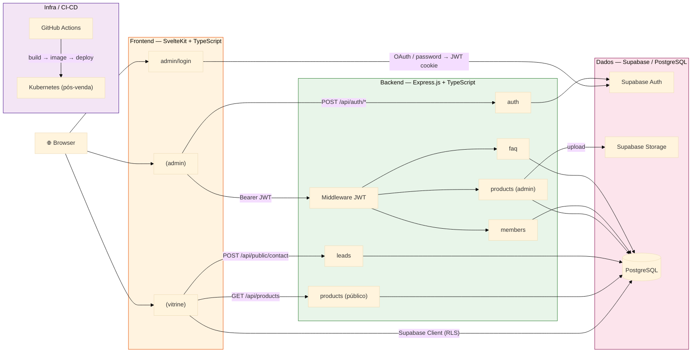
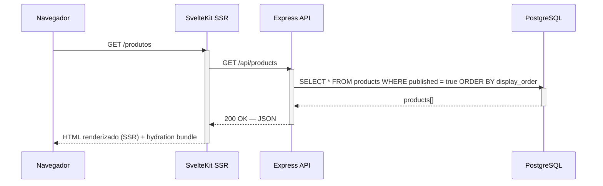
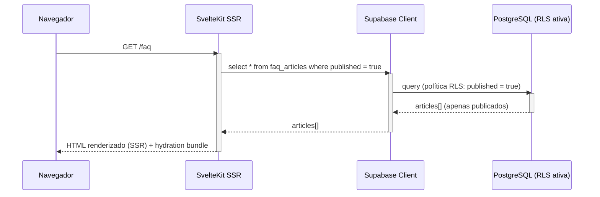
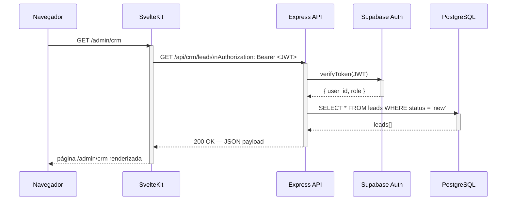
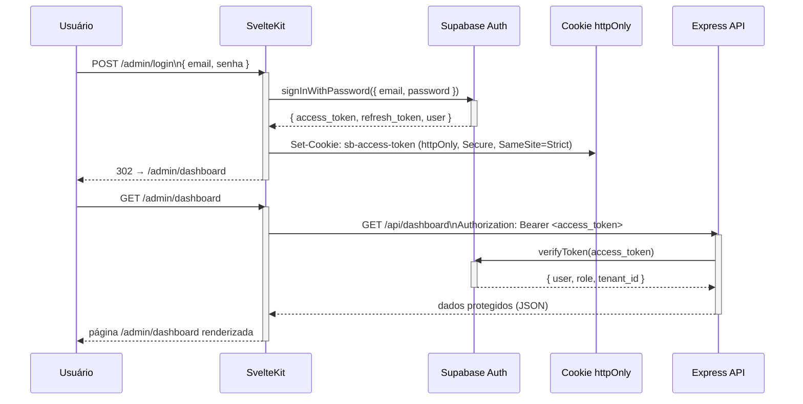
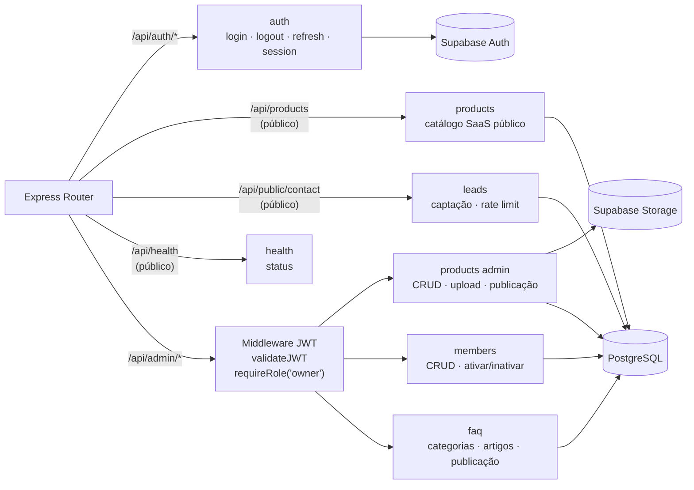

# Arquitetura do Sistema — Crianex Hub

Visão técnica da plataforma Crianex Hub — diagramas, decisões de arquitetura (ADRs) e descrição dos componentes.

---

## 1. Visão Geral

O Crianex Hub é uma plataforma SaaS composta por duas áreas funcionais distintas: uma **vitrine pública** (sem autenticação) voltada ao portfólio de produtos, captação de leads e FAQ institucional; e uma **área administrativa autenticada** que concentra o CRM Kanban, dashboard executivo, gestão financeira, tickets de suporte e notificações.

A arquitetura adotada é **Monolito Modular** — uma aplicação Express.js com separação lógica por módulos internos, servida por um frontend SvelteKit com SSR. Essa decisão foi guiada por quatro critérios principais:

1. **Prazo:** ~1,5 meses de desenvolvimento ativo, 3 iterações de entrega, 6 desenvolvedores com WIP limit de 2 por Class Owner — overhead de orquestração de microsserviços é incompatível com essa cadência.
2. **Latência:** RNF02 e RNF03 exigem resposta ≤ 2s em 95% das requisições; a comunicação intra-processo do monolito elimina a latência de rede entre serviços.
3. **Superfície de segurança:** RNF07 (OWASP Top 10) é mais simples de cumprir com um único ponto de entrada e RLS centralizado no banco, em vez de múltiplos endpoints independentes.

A estrutura modular garante que, se necessário no futuro, módulos possam ser extraídos como microsserviços sem refatoração estrutural — o desacoplamento lógico já está preservado.

### Visão Rápida (Stack)

| Camada | Tecnologia | Papel |
| ------ | ---------- | ----- |
| Frontend | SvelteKit + TypeScript | SSR, rotas `(vitrine)` públicas e `(admin)` autenticadas |
| Backend | Express.js + TypeScript | API modular (auth, products, leads, members, faq) |
| Autenticação | Supabase Auth | Login, sessão JWT, cookie `httpOnly` |
| Dados | PostgreSQL (Supabase) | Persistência + Row Level Security (RLS) |
| Armazenamento | Supabase Storage | Upload de imagens de produtos |
| CI/CD | GitHub Actions | Lint → typecheck → test → build → (pós-venda) deploy |
| Infra futura | Kubernetes | Escala horizontal — só ativa pós-venda |

---

## 2. Diagrama de Arquitetura Geral {#diagrama}




:::note[Kubernetes — pós-venda]
O nó Kubernetes está presente na arquitetura, mas não é utilizado durante as iterações de desenvolvimento (IT1–IT3). O ambiente de desenvolvimento usa Docker Compose local + Supabase gerenciado na nuvem.
:::

:::tip[Duas estratégias de leitura pública]
Produtos e leads passam pelo Express (controle de rate limit e lógica de negócio no servidor). Os artigos FAQ públicos são lidos via Supabase Client diretamente do SvelteKit SSR — a RLS do PostgreSQL (`published = true`) garante que apenas artigos publicados são retornados, sem necessidade de endpoint Express intermediário.
:::

---

## 3. Fluxo de Requisição — Vitrine Pública

A vitrine pública usa **duas estratégias distintas** dependendo do recurso:

- **Produtos e leads**: passam pelo Express, onde há lógica de negócio e rate limiting.
- **FAQ públicos**: lidos via Supabase Client direto no SvelteKit SSR — não existe endpoint Express público para FAQ; a RLS no banco garante que apenas artigos `published = true` são retornados.

### 3a — Listagem de Produtos (via Express)



### 3b — FAQ Público (Supabase Client direto, com RLS)




:::note[RLS como segunda linha de defesa]
Mesmo na leitura direta via Supabase Client, a política RLS `published = true` é aplicada no banco — dados não publicados nunca chegam ao cliente, independente de quem faz a query.
:::

---

## 4. Fluxo de Requisição — Área Administrativa

Toda rota sob `/admin` passa pelo Express, que valida o JWT antes de executar qualquer query. Isso cria um único ponto de controle de acesso (RNF01) e permite filtragem por tenant no nível da aplicação.



---

## 5. Fluxo de Autenticação

A autenticação usa Supabase Auth como provedor de identidade. O SvelteKit armazena os tokens em cookie `httpOnly`, impedindo acesso por JavaScript no cliente — mitigação direta da vulnerabilidade OWASP A07 (XSS).




:::warning[Mitigação OWASP A07 — XSS]
O cookie `httpOnly` impede que qualquer script client-side acesse o token de sessão. Combinado com `Secure` (HTTPS only) e `SameSite=Strict` (bloqueio CSRF), essa configuração atende ao controle A07 do OWASP Top 10 sem necessidade de lógica adicional na aplicação.
:::

---

## 6. Estrutura de Módulos do Backend

O Express é organizado em módulos independentes, cada um com seu próprio `router`, `controller` e `service`. O middleware de JWT (`validateJWT` + `requireRole('owner')`) é aplicado nas rotas `/api/admin/*` antes de qualquer lógica de módulo ser executada. Rotas públicas (`/api/products`, `/api/public/contact`, `/api/health`) não passam pelo middleware.




:::tip[Módulos futuros (IT2 e IT3)]
CRM, tickets, financeiro e notificações serão adicionados nas iterações IT2 e IT3. A estrutura modular do Express permite adicionar novos módulos sem alterar os existentes.
:::

---

## 7. Decisões Arquiteturais (ADRs)

| ADR | Decisão | Motivador principal |
| --- | ------- | -------------------- |
| [ADR-001](#adr-001) | Monolito Modular em vez de Microsserviços | Prazo, RNF02/RNF03 (latência), RNF07 (segurança) |
| ADR-002 | SvelteKit em vez de React/Next.js | SSR nativo + bundle pequeno (SEO, OE2) |
| ADR-003 | paraglide-js para i18n | Vitrine bilíngue PT/EN sem overhead no cliente (RNF13) |
| ADR-004 | Argon2id / bcrypt para senhas | Hash de senha gerenciado pelo Supabase Auth (RNF08) |
| ADR-005 | RLS como primeira linha de defesa | Isolamento de dados no banco, independente da camada de aplicação (RNF07) |

### ADR-001 — Monolito Modular em vez de Microsserviços {#adr-001}

**Título:** ADR-001 — Adoção de Monolito Modular em vez de Microsserviços

**Status:** Aceito

**Data:** 20/05/2026

---

### Contexto

O projeto Crianex Hub possui as seguintes restrições e requisitos não-funcionais que condicionaram a escolha arquitetural:

- **Prazo:** ~10 semanas de desenvolvimento, 3 iterações de entrega, 6 desenvolvedores operando com WIP limit de 2 por Class Owner (metodologia FDD + Scrumban Enxuto).
- **RNF02 e RNF03:** Tempo de resposta ≤ 2s em 95% das requisições, tanto na vitrine pública quanto na área administrativa.
- **RNF07:** Conformidade com OWASP Top 10 — minimizar superfície de ataque e pontos de falha de autenticação/autorização.
- **Infra:** Kubernetes disponível apenas na fase pós-venda; durante o desenvolvimento, o ambiente é Docker Compose local.

---

### Decisão

Adotar **Monolito Modular** com separação lógica por módulos dentro do Express.js, compartilhando um único banco PostgreSQL via Supabase, e servido por um único frontend SvelteKit com rotas separadas por contexto (`(public)` e `(admin)`).

---

### Alternativa Rejeitada — Microsserviços

A alternativa de microsserviços foi avaliada e rejeitada pelos seguintes motivos:

| Critério                    | Problema com Microsserviços                                                                                                                                                  |
| --------------------------- | ---------------------------------------------------------------------------------------------------------------------------------------------------------------------------- |
| **Latência (RNF02, RNF03)** | Comunicação inter-serviço via HTTP/gRPC adiciona latência de rede não controlável, tornando difícil garantir ≤ 2s em 95% das requisições sem camada de cache adicional.      |
| **Segurança (RNF07)**       | Múltiplos endpoints independentes ampliam a superfície de ataque. Cada serviço precisa de sua própria validação JWT, aumentando o risco de lacunas de autorização.           |
| **Prazo e capacidade**      | Service mesh, service discovery, múltiplos Dockerfiles, comunicação assíncrona (mensageria) e observabilidade distribuída são inviáveis em 10 semanas com 6 desenvolvedores. |

---

### Consequências Positivas

- Entrega incremental possível desde a IT1 sem dependência de infra complexa.
- Isolamento lógico por módulo sem custo de latência de rede entre serviços.
- Path claro de extração futura: a separação por módulos já respeita fronteiras de domínio — extrair um módulo como microsserviço no futuro requer mover código, não refatorar arquitetura.
- Testes mais simples: uma codebase, um banco, uma pipeline CI — cobertura de 45% (RNF17) é mais fácil de atingir e medir.
- Transações ACID nativas sem padrões de consistência eventual.

---

### Consequências Negativas e Riscos

| Risco                                                                           | Mitigação                                                                                                     |
| ------------------------------------------------------------------------------- | ------------------------------------------------------------------------------------------------------------- |
| O monolito escala inteiro mesmo quando apenas um módulo está sob carga          | Kubernetes com réplicas do Express (pós-venda) — aceitável no prazo atual                                     |
| Acoplamento acidental entre módulos (imports diretos fora da interface pública) | Revisão de imports no code review é critério de DoD; proibido chamar repositórios de outro módulo diretamente |
| Banco compartilhado como ponto único de falha                                   | Supabase gerenciado tem SLA de 99.9% e backup automático — risco aceito para o escopo do projeto              |

---

### ADR-002 — SvelteKit em vez de React/Next.js

**Contexto:** necessidade de SSR para SEO (OE2) e bundle pequeno para vitrine pública.

| Critério             | SvelteKit                     | React / Next.js            |
| -------------------- | ----------------------------- | --------------------------- |
| Bundle size          | Sem runtime virtual DOM       | Runtime React incluído     |
| SSR + SEO            | Nativo, simples               | Configuração extra         |
| Curva de aprendizado | HTML/CSS/JS puro              | JSX + hooks                |
| Bilinguismo          | paraglide-js nativo SvelteKit | next-intl ou react-i18next |

**Decisão:** SvelteKit com `adapter-node` para SSR em produção.

### ADR-003 — paraglide-js para i18n

**Contexto:** vitrine bilíngue PT/EN com troca em 1 clique (RNF13), SSR obrigatório.

**Decisão:** `@inlang/paraglide-sveltekit` — integração nativa com SvelteKit, mensagens tree-shakeable (só o que é usado vai para o bundle), sem overhead de runtime no cliente.

### ADR-004 — Argon2id / bcrypt para senhas

Supabase Auth gerencia o hash. Fator mínimo 12 (RNF08).

### ADR-005 — RLS como primeira linha de defesa

Row Level Security no PostgreSQL garante isolamento de dados mesmo em acessos diretos do frontend via Supabase JS client — não depender apenas de validações da camada de aplicação.

---

## 8. Estratégia de Deploy por Fase

### Ambientes

| Fase                | Ambiente                               | Estratégia                                                                          |
| ------------------- | -------------------------------------- | ----------------------------------------------------------------------------------- |
| Individual (dev)    | Local — `supabase start` (Docker)      | Supabase CLI sobe instância completa localmente; sem conta necessária               |
| Integração (equipe) | Projeto Supabase da equipe (free tier) | Migrations aplicadas via `supabase db push`; compartilhado pela equipe              |
| Produção            | Projeto Supabase da Crianex (Otávio)   | `supabase db push --linked` após validação em staging; acesso liberado pela Crianex |
| Pós-venda           | Cluster Kubernetes Crianex             | GitHub Actions: build → push image → `kubectl apply`                                |


:::note[Fluxo de schema (issues de DB)]
Cada issue de schema gera **um arquivo de migration SQL** em `supabase/migrations/`. O dev escreve
a migration localmente (`supabase start` + `supabase db diff`), testa com `supabase db reset` e
abre PR com o arquivo versionado. O CI aplica automaticamente no projeto de integração da equipe.
O projeto da Crianex só recebe a migration na entrega de cada iteração.
:::

### Pipeline CI/CD

O pipeline é executado pelo GitHub Actions a cada push na branch `main` (via Pull Request aprovado):

```
Push → main
  │
  ├── lint (ESLint + Prettier)
  ├── typecheck (tsc --noEmit)
  ├── test (Vitest — cobertura mínima 45%)
  └── build
        ├── Docker image: crianex/web:sha
        └── Docker image: crianex/api:sha
              │
              └── [pós-venda] push → registry → kubectl apply -f k8s/
```

Durante as iterações IT1–IT3, o pipeline para após o `build` — o deploy em Kubernetes não está ativo. O ambiente de homologação usa `docker compose up` com as imagens geradas localmente.


:::warning[Proteção da branch main]
Todo merge em `main` requer ao menos 1 aprovação de revisor via Pull Request. Commits diretos na `main` são bloqueados por regra de branch protection no GitHub. Essa regra está alinhada com o DoD da metodologia FDD + Scrumban Enxuto do projeto.
:::

## 9. Rastreabilidade Arquitetural → RNFs

| Decisão Arquitetural                                    | RNFs Atendidos      | Justificativa                                                                                           |
| ------------------------------------------------------- | ------------------- | ------------------------------------------------------------------------------------------------------- |
| SvelteKit SSR (`load()` server-side)                    | RNF02, RNF04, RNF05 | HTML pré-renderizado no servidor reduz TTFB; SSR nativo; metadados Open Graph e sitemap por rota        |
| Acesso direto Supabase Client (leitura pública)         | RNF02               | Elimina round-trip ao Express para rotas públicas, mantendo latência abaixo de 2s                       |
| Express modular — chamada local, sem rede inter-serviço | RNF03               | Latência intra-processo (< 1ms) em vez de HTTP entre serviços; resposta admin ≤ 2s garantida            |
| Supabase Auth + JWT + cookie `httpOnly`                 | RNF01, RNF07        | Isolamento da rota `/admin` via middleware; cookie `httpOnly` mitiga XSS (OWASP A07)                    |
| RLS no PostgreSQL                                       | RNF07               | Controle de acesso no nível do banco elimina privilege escalation mesmo em falhas de aplicação          |
| Shadcn/ui + design tokens (Tailwind)                    | RNF12               | Componentes responsivos por padrão; uma codebase para mobile, tablet e desktop                          |
| Monorepo TypeScript com `packages/shared`               | RNF16, RNF17        | Stack obrigatória preservada; tipos compartilhados reduzem superfície de bug; cobertura unificada       |
| Kubernetes + réplicas Express (pós-venda)               | RNF14               | Escala horizontal do backend sem alterações de código; orquestração via cluster gerenciado pela Crianex |

---

<details className="crianex-revisions">
<summary>Histórico de Revisão</summary>
<div className="crianex-revisions__body">

| Versão | Data       | Descrição                                                                                                              | Autor            |
| ------ | ---------- | ---------------------------------------------------------------------------------------------------------------------- | ---------------- |
| v1.0   | 20/05/2026 | Documentação inicial da arquitetura                                                                                    | Equipe Crianex   |
| v1.1   | 06/06/2026 | Correção do diagrama geral (rotas públicas, módulos reais do backend, estrutura do repositório) e fluxos de requisição | Lucas A. Zanetti |
| v1.2   | 29/06/2026 | Correção dos admonitions quebrados (texto fora da caixa); consolidação dos ADRs em seção única e renumeração (eliminado ADR-001 duplicado); tabela de Visão Rápida da stack e índice de ADRs | Equipe Crianex |

</div>
</details>

