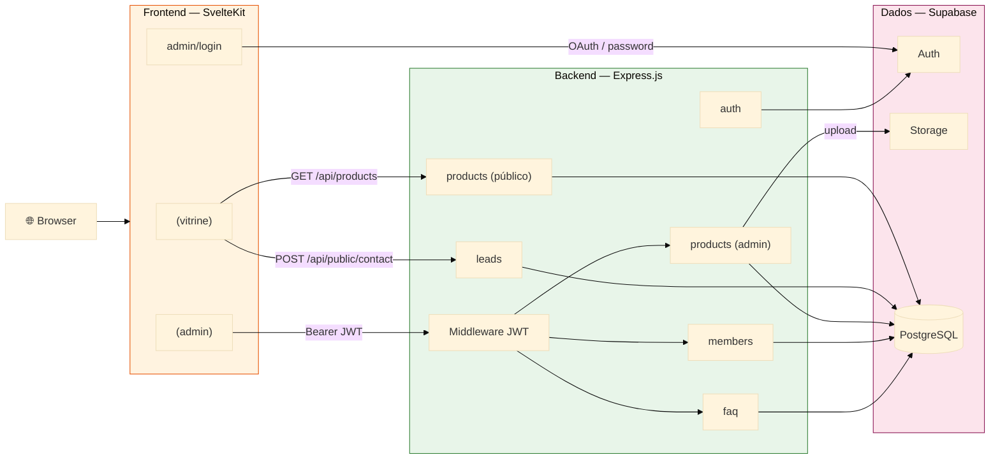
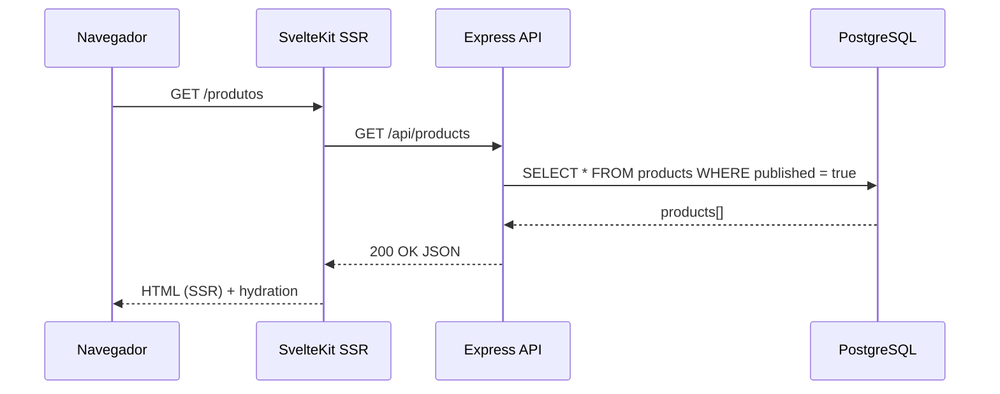
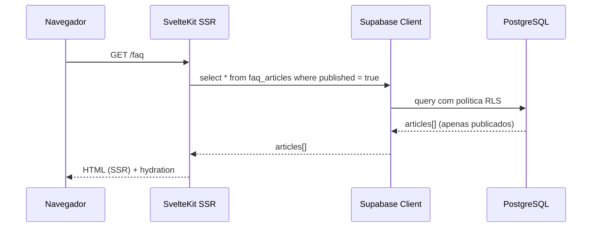
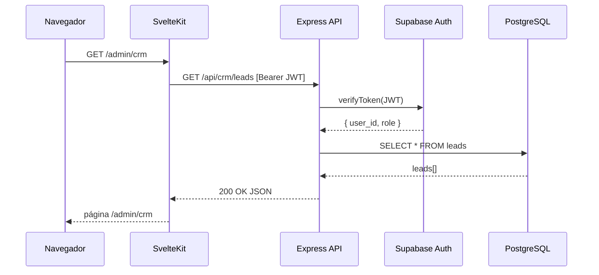
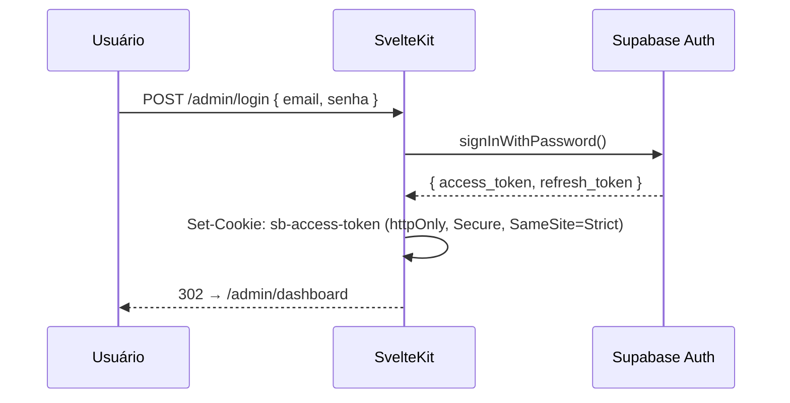
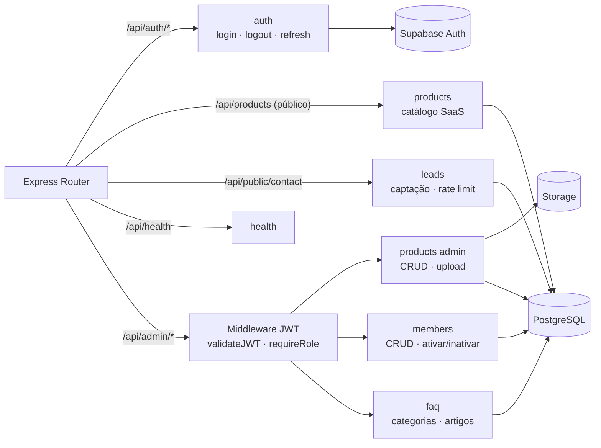

import Tabs from '@theme/Tabs';
import TabItem from '@theme/TabItem';
import RevisionHistory from '@site/src/components/RevisionHistory';

# Arquitetura do Sistema

**Monolito Modular** — Express.js + SvelteKit SSR + PostgreSQL (Supabase). Separação lógica por módulos; sem overhead de microsserviços para o prazo de ~10 semanas.

<Tabs>
<TabItem value="stack" label="Stack">

| Camada | Tecnologia | Papel |
|--------|------------|-------|
| Frontend | SvelteKit + TypeScript | SSR; `(vitrine)` público e `(admin)` autenticado |
| Backend | Express.js + TypeScript | API modular (auth, products, leads, members, faq) |
| Auth | Supabase Auth | JWT em cookie `httpOnly`; mitiga OWASP A07 |
| Dados | PostgreSQL + RLS | Persistência + isolamento no nível do banco |
| Storage | Supabase Storage | Upload de imagens de produtos |
| CI/CD | GitHub Actions | lint → typecheck → test → build |
| Infra futura | Kubernetes | Escala horizontal — apenas pós-venda |

**Por que Monolito?** Latência intra-processo (< 1 ms) atende RNF02/RNF03 (≤ 2 s). Superfície única de segurança simplifica RNF07. Extração futura de módulos como microsserviços é possível sem refatoração estrutural.

</TabItem>
<TabItem value="diagrama" label="Diagrama Geral">



:::tip[Duas estratégias de leitura pública]
Produtos e leads → Express (rate limit + lógica de negócio). FAQ público → Supabase Client direto com RLS (`published = true`) — sem endpoint Express intermediário.
:::

</TabItem>
<TabItem value="fluxos" label="Fluxos de Requisição">

<Tabs>
<TabItem value="vitrine" label="Vitrine — Produtos">



</TabItem>
<TabItem value="faq" label="Vitrine — FAQ (RLS direto)">



:::note[RLS como segunda linha de defesa]
Mesmo sem passar pelo Express, a política RLS garante que apenas artigos publicados chegam ao cliente.
:::

</TabItem>
<TabItem value="admin" label="Área Admin">



</TabItem>
<TabItem value="auth" label="Autenticação">



:::warning[Mitigação OWASP A07]
Cookie `httpOnly` impede acesso por JS client-side. `Secure` + `SameSite=Strict` bloqueiam CSRF.
:::

</TabItem>
</Tabs>

</TabItem>
<TabItem value="modulos" label="Módulos Backend">



:::tip[Módulos IT2/IT3]
CRM, tickets, financeiro e notificações serão adicionados nas próximas iterações sem alterar os módulos existentes.
:::

</TabItem>
<TabItem value="adrs" label="ADRs">

| ADR | Decisão | Motivador |
|-----|---------|-----------|
| ADR-001 | Monolito Modular | Prazo, RNF02/03 (latência ≤ 2s), RNF07 (OWASP) |
| ADR-002 | SvelteKit > React/Next.js | SSR nativo, bundle menor, paraglide-js nativo |
| ADR-003 | paraglide-js para i18n | PT/EN tree-shakeable sem runtime no cliente (RNF13) |
| ADR-004 | Supabase Auth (Argon2id) | Hash de senha gerenciado, fator mínimo 12 (RNF08) |
| ADR-005 | RLS como 1ª linha de defesa | Isolamento no banco independente da aplicação (RNF07) |

<details>
<summary><strong>ADR-001 — Monolito Modular vs. Microsserviços (detalhes)</strong></summary>

**Status:** Aceito · **Data:** 20/05/2026

**Alternativa rejeitada — Microsserviços:**

| Critério | Problema |
|----------|----------|
| Latência (RNF02/03) | HTTP inter-serviço adiciona latência não controlável; difícil garantir ≤ 2s sem cache adicional |
| Segurança (RNF07) | Múltiplos endpoints ampliam superfície de ataque; cada serviço precisa de validação JWT própria |
| Prazo | Service mesh, service discovery, mensageria e observabilidade distribuída são inviáveis em 10 semanas |

**Consequências positivas:** entrega incremental desde IT1; isolamento lógico sem latência de rede; extração futura de módulos sem refatoração; testes unificados (cobertura 45% — RNF17 — mais fácil de medir); transações ACID nativas.

**Riscos e mitigações:**

| Risco | Mitigação |
|-------|-----------|
| Escala do monolito inteiro sob carga de um módulo | Kubernetes com réplicas Express (pós-venda) |
| Acoplamento acidental entre módulos | Imports diretos entre módulos proibidos — critério no DoD |
| Banco compartilhado como SPOF | Supabase SLA 99,9% + backup automático — risco aceito |

</details>

</TabItem>
<TabItem value="deploy" label="Deploy & CI">

**Ambientes:**

| Fase | Ambiente | Estratégia |
|------|----------|------------|
| Dev individual | `supabase start` (Docker local) | Instância completa local |
| Integração | Projeto Supabase da equipe | `supabase db push` com migrations versionadas |
| Produção | Projeto Supabase da Crianex | `supabase db push --linked` após validação |
| Pós-venda | Kubernetes Crianex | GitHub Actions → build → push image → `kubectl apply` |

**Pipeline CI (GitHub Actions):**

```
push → main (via PR aprovado)
  ├── lint (ESLint + Prettier)
  ├── typecheck (tsc --noEmit)
  ├── test (Vitest ≥ 45% cobertura)
  └── build → Docker images crianex/web:sha + crianex/api:sha
        └── [pós-venda] push registry → kubectl apply
```

:::note[Schema migrations]
Cada issue de banco gera um arquivo SQL em `supabase/migrations/`. Dev escreve localmente, testa com `supabase db reset`, abre PR. CI aplica no projeto de integração. Produção só recebe na entrega de cada iteração.
:::

</TabItem>
<TabItem value="rnf" label="Rastreabilidade → RNFs">

| Decisão Arquitetural | RNFs | Justificativa |
|----------------------|------|---------------|
| SvelteKit SSR (`load()` server-side) | RNF02, RNF04, RNF05 | HTML pré-renderizado reduz TTFB; metadados Open Graph por rota |
| Supabase Client direto (FAQ público) | RNF02 | Elimina round-trip ao Express |
| Express modular intra-processo | RNF03 | Latência < 1 ms entre módulos |
| Supabase Auth + JWT + cookie `httpOnly` | RNF01, RNF07 | Isola `/admin`; mitiga OWASP A07/XSS |
| RLS no PostgreSQL | RNF07 | Controle de acesso no banco; falha de aplicação não expõe dados |
| Shadcn/ui + Tailwind tokens | RNF12 | Responsivo por padrão (mobile, tablet, desktop) |
| Monorepo TypeScript + `packages/shared` | RNF16, RNF17 | Tipos compartilhados; cobertura unificada |
| Kubernetes + réplicas Express (pós-venda) | RNF14 | Escala horizontal sem mudança de código |

</TabItem>
</Tabs>

<RevisionHistory
  headers={['Versão', 'Data', 'Descrição', 'Autor(es)']}
  rows={[
    ['v1.0', '20/05/2026', 'Documentação inicial da arquitetura', 'Equipe Crianex'],
    ['v1.1', '06/06/2026', 'Correção do diagrama geral e fluxos de requisição', 'Lucas A. Zanetti'],
    ['v1.2', '29/06/2026', 'Consolidação dos ADRs; tabela de stack; correção de admonitions', 'Equipe Crianex'],
    ['v1.3', '29/06/2026', 'Reestruturação com tabs (Stack, Diagrama, Fluxos, Módulos, ADRs, Deploy, RNFs) — compactação sem perda de conteúdo', 'Equipe Crianex'],
  ]}
/>
