# IT1 — Design Técnico

Artefatos produzidos durante a fase de **Technical Design Review (TDR)** da IT1, aplicando a **Formalização Seletiva**: diagramas leves e acordos de arquitetura para mitigar riscos antes do desenvolvimento, seguidos de validação com os stakeholders.

Esta página reúne os **diagramas de sequência leves** e os **feature cards iniciais** (planejamento). Os **diagramas formais** e os **feature cards finais** (pós-implementação, com status de cada critério) estão em [Features Entregues — Diagramas Formais](/iteracoes/iteracao-1/evidencias/diagrama-formal).

---

## O que é um Diagrama Leve?

Representação visual simplificada do fluxo de comunicação entre as entidades do sistema (Frontend, API, Banco de Dados, etc.), focando no **caminho feliz** sem cobrir cenários de erro. Renderizado em [Mermaid](https://mermaid.js.org/) diretamente na página — não é mais uma captura de tela.

## O que é um Feature Card?

Documenta uma funcionalidade de forma atômica: título, regras de negócio e critérios de aceitação (BDD — _Dado/Quando/Então_). A versão abaixo é a **inicial** (planejamento); a **final** (com status de cada critério) está em [Features Entregues](/iteracoes/iteracao-1/evidencias/diagrama-formal).

---

## Mapa de Dependências {#mapa-dependencias}

Artefato do TDR que mapeia o bloqueio lógico entre as features comprometidas na IT1 — usado para sequenciar o início das issues e verificar o DoR. Versão completa, com legenda, em [Mapa de Dependências — IT1](/backlog/dependencias#it1).

## Artefatos de Domain Modeling {#color-modeling}

### Glossário de Domínio {#glossario}

Artefato gerado a partir da **Domain Modeling** do FDD em reunião com os stakeholders Otávio e Vitor. Lista e explica palavras que devem ter significado explícito para o consenso do grupo.

**Figura 1** — Glossário de Palavras (parte 1)

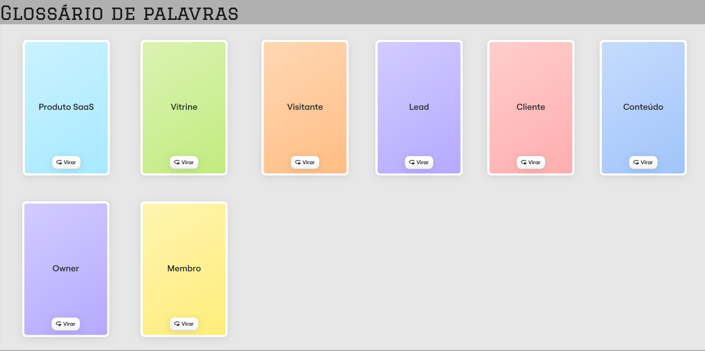

_Fonte: Elaborado pelos autores._

**Figura 2** — Glossário de Palavras (parte 2)

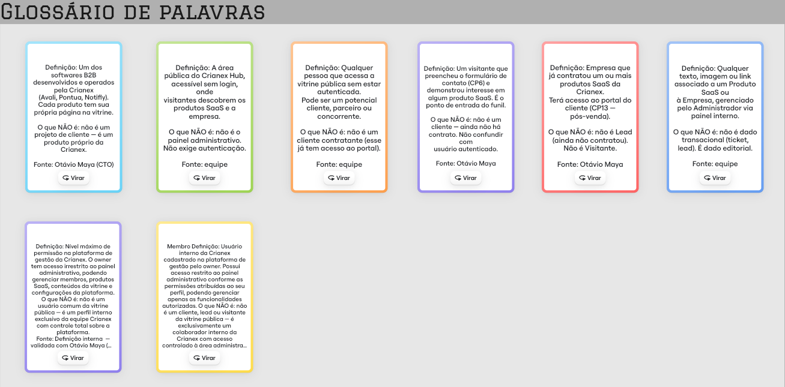

_Fonte: Elaborado pelos autores._

### Diagrama de Domínio {#diagrama-dominio}

**Figura 3** — Diagrama de Domínio

_Fonte: Elaborado pelos autores._

---

## Diagramas Leves e Feature Cards por Feature {#feature-cards}

### CP5 — Painel de Gerenciamento do Administrador

<strong>F09 — Autenticar administradores</strong>

Diagrama Leve

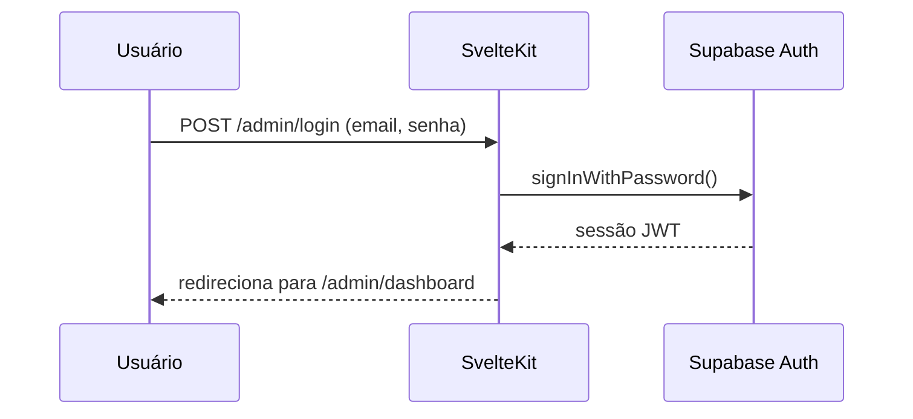

Feature Card (inicial — completo)

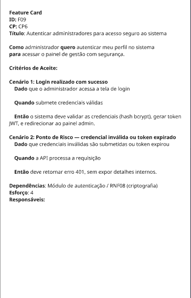

<strong>F10 — Acessar painel administrativo</strong>

Diagrama Leve

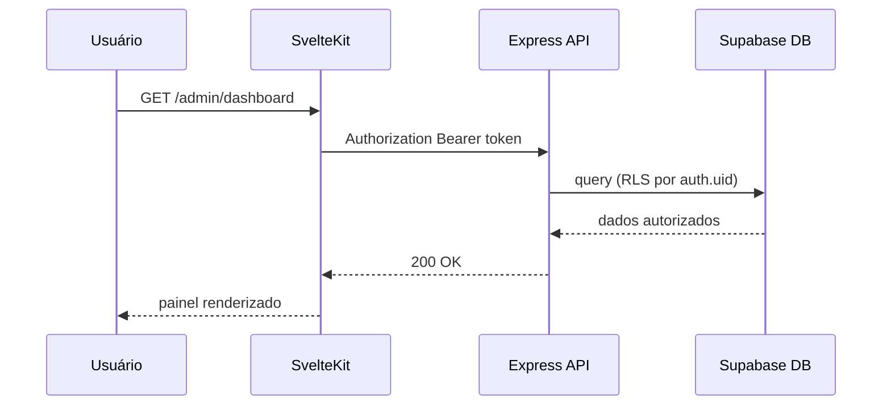

Feature Card (inicial — completo)

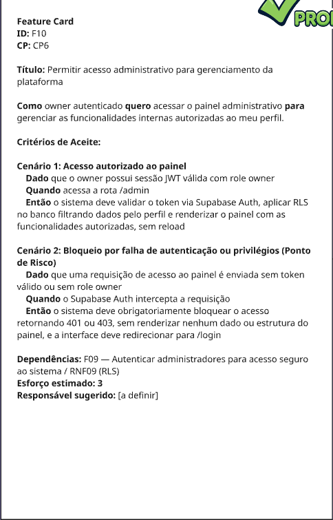

<strong>F11 — Gerenciar membros da Crianex</strong>

Diagrama Leve

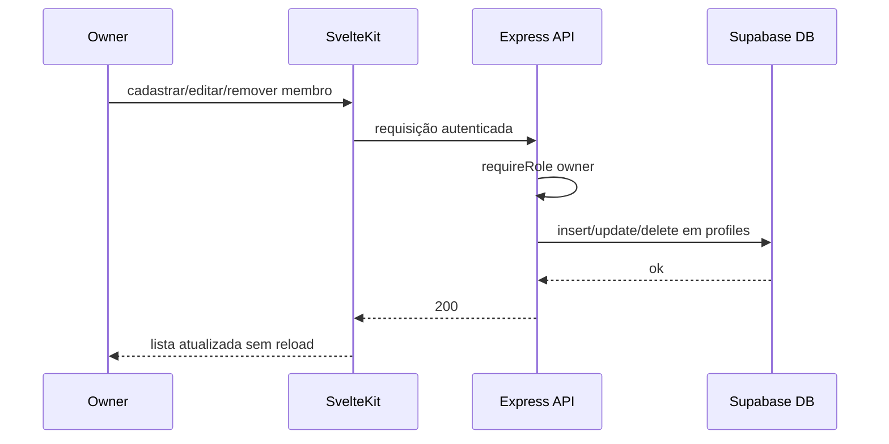

Feature Card (inicial — completo)

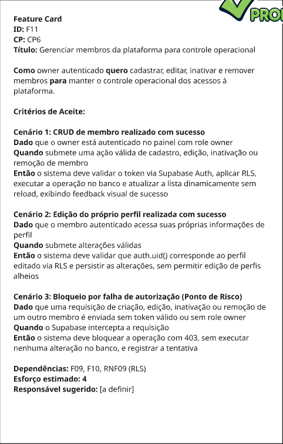

### CP4 — Vitrine Pública de Produtos SaaS

<strong>F12 — Gerenciar produtos SaaS</strong>

Diagrama Leve

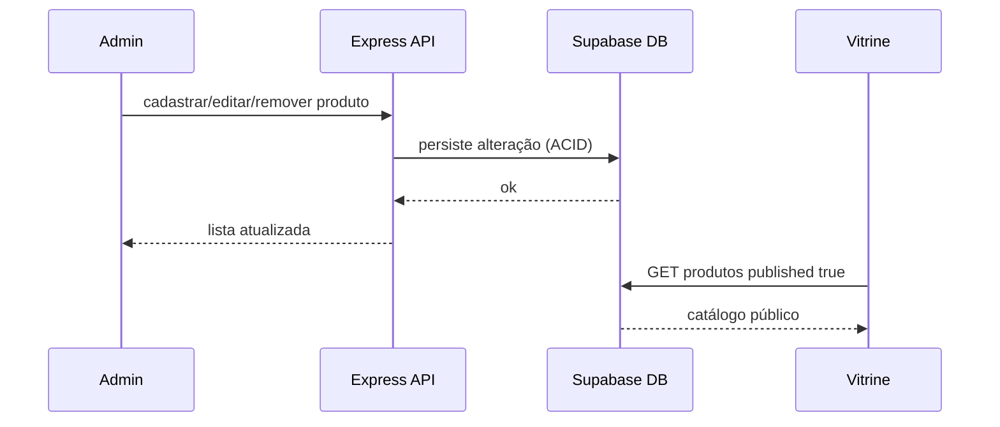

Feature Card (inicial — completo)

<strong>F13 — Publicar / despublicar produto SaaS</strong>

Diagrama Leve

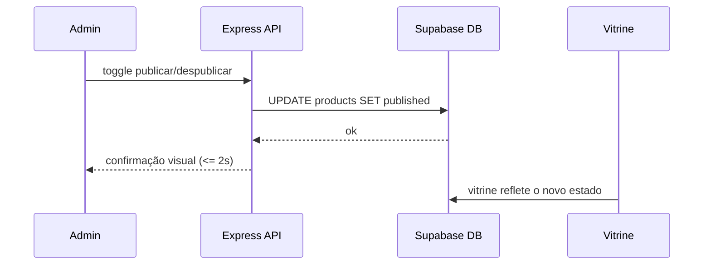

Feature Card (inicial — completo)

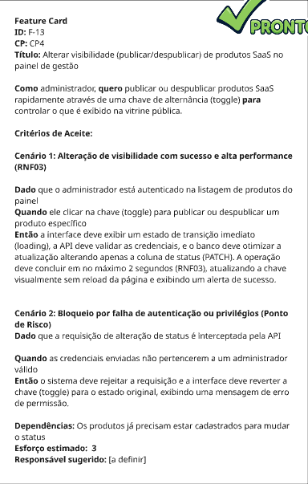

<strong>F14 — Formulário de contato</strong>

Diagrama Leve

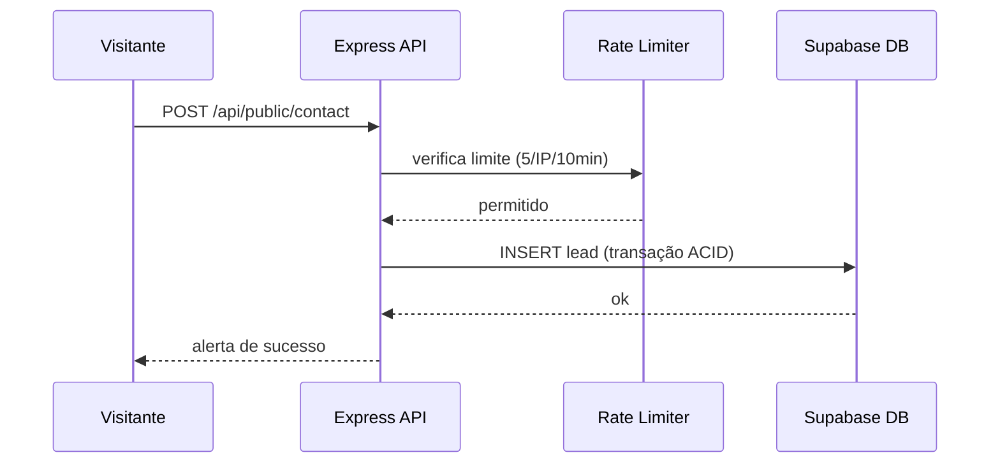

Feature Card (inicial — completo)

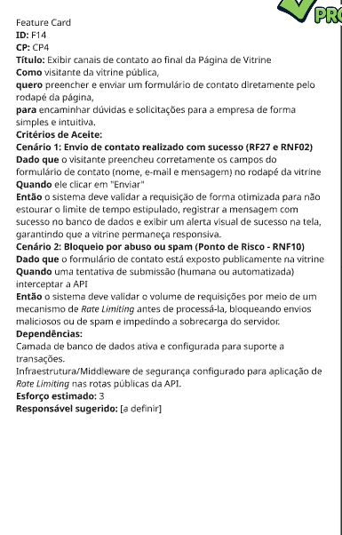

<strong>F15 — Página institucional</strong>

Diagrama Leve

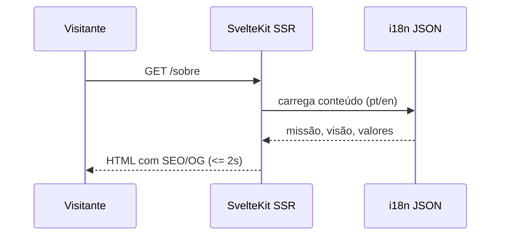

Feature Card (inicial — completo)

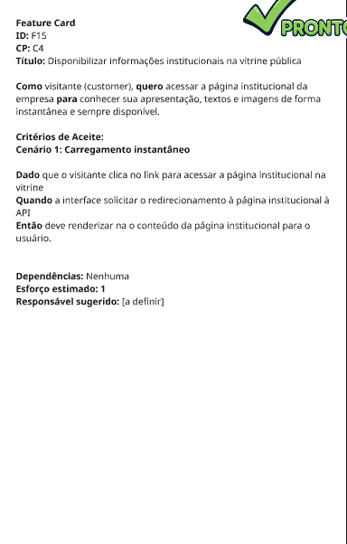

### CP6 — FAQ e Base de Conhecimentos por Produto

<strong>F16 — CRUD de artigos de FAQ</strong>

Diagrama Leve

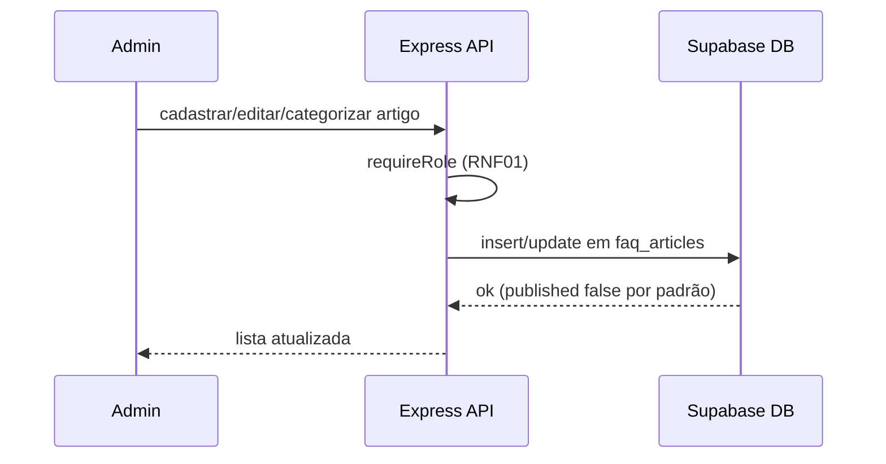

Feature Card (inicial — completo)

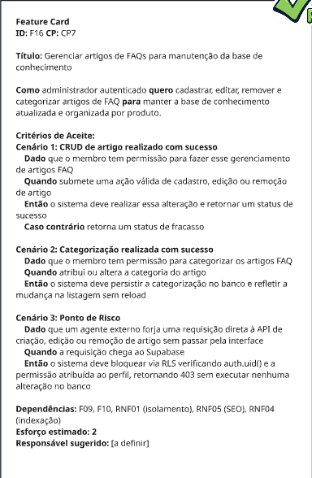

<strong>F17 — Publicar / despublicar artigo de FAQ</strong>

Diagrama Leve

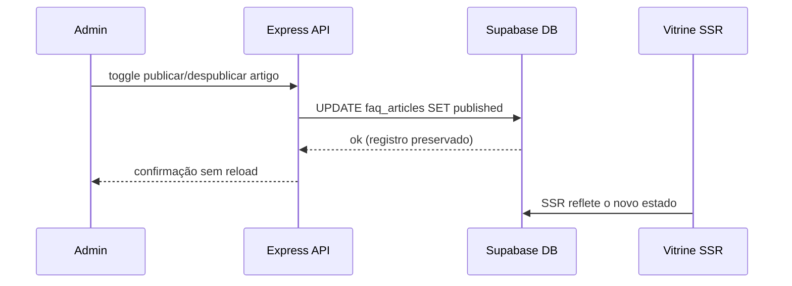

Feature Card (inicial — completo)

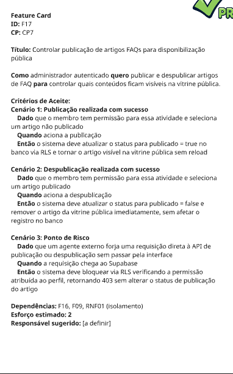

<strong>F18 — Avaliação de artigos de FAQ</strong>

Diagrama Leve

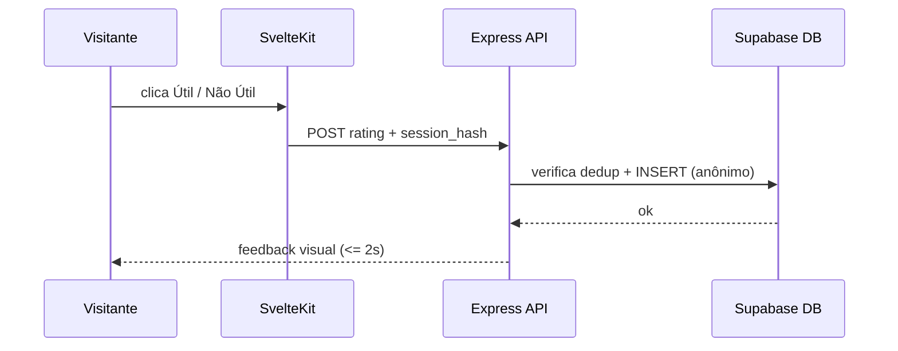

Feature Card (inicial — completo)

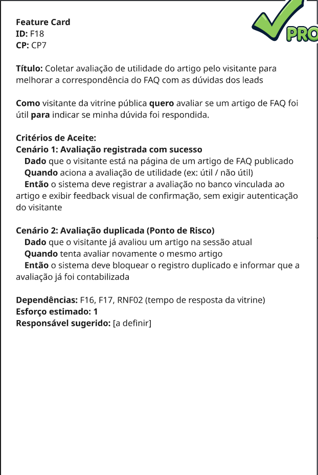

---

Histórico de Revisão

| Versão | Data       | Descrição                                                   | Autor(es)      |
| ------ | ---------- | ------------------------------------------------------------ | -------------- |
| 1.1    | 29/06/2026 | Adição do Mapa de Dependências da IT1 como artefato do TDR | Equipe Crianex |

