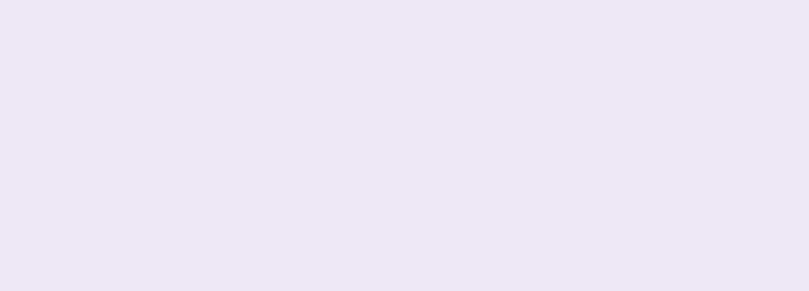
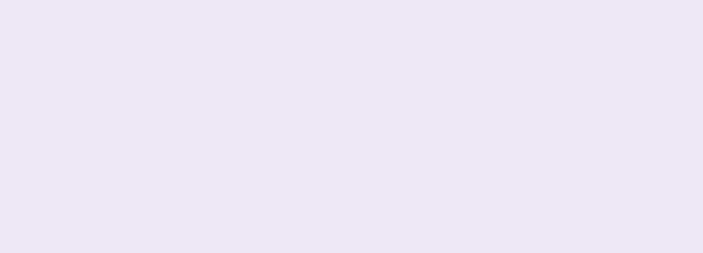
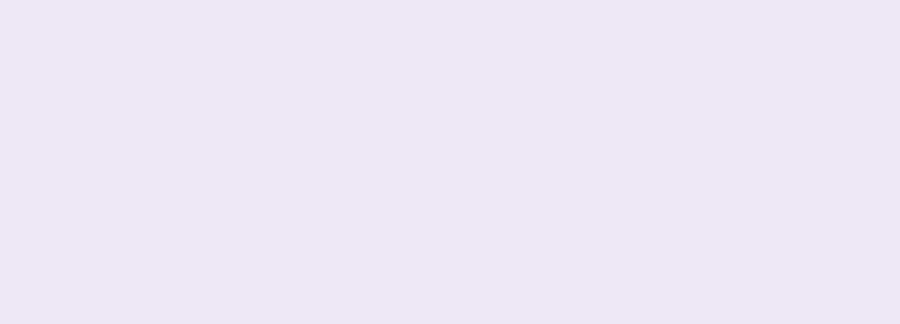
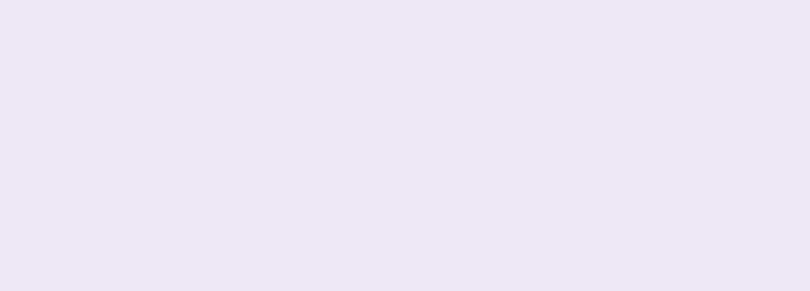

import Tabs from '@theme/Tabs';
import TabItem from '@theme/TabItem';

# F09 — Autenticar para acesso seguro ao sistema

IT1 · Rastreabilidade: [F09](/backlog/requisitos#f09) · [CP5](/visao/solucao#cp5) · [OE2](/visao/solucao#oe2)

**Issue da Feature (GitHub):** [abrir no repositório](https://github.com/mdsreq-fga-unb/REQ-2026.1-T02-Crianex-/issues) — _nº a definir_

:::note[Acesso para avaliação]
Esta funcionalidade exige **login de administrador**. Credenciais para o professor: **e-mail** `a definir` · **senha** `a definir`.
:::

## Requisitos (evidências)

Selecione um requisito na navegação abaixo. Cada um traz seus critérios de aceite, regras de negócio e um espaço para o **screenshot da funcionalidade em funcionamento** (substitua a imagem de placeholder pela captura real).

<Tabs>
<TabItem value="rf08" label="RF08">

#### RF08 — Autenticar perfil de usuário

**Critérios de aceite (BDD)**

- **Dado** credenciais válidas, **quando** POST `/admin/login`, **então** o Supabase Auth gera a sessão JWT e redireciona para `/admin/dashboard`.
- **Dado** credenciais inválidas, **quando** POST `/admin/login`, **então** retorna mensagem genérica sem expor detalhes internos.
- **Dado** acesso a `/admin` sem sessão, **quando** GET de rota protegida, **então** redireciona para `/admin/login` sem renderizar dados.

**Regras de negócio:** [RN05](/backlog/requisitos#rns) — Membro inativo bloqueado no painel

**Evidência (screenshot):**

**Deploy:** _link a definir_

</TabItem>
<TabItem value="rf09" label="RF09">

#### RF09 — Encerrar sessão

**Critérios de aceite (BDD)**

- **Dado** sessão ativa, **quando** POST `/admin/logout`, **então** executa `signOut()`, limpa o cookie e redireciona para `/admin/login`.

**Regras de negócio:** —

**Evidência (screenshot):**

**Deploy:** _link a definir_

</TabItem>
<TabItem value="rnf01" label="RNF01">

#### RNF01 — Isolamento de acesso administrativo

**Classificação:** Segurança da Informação  
**Descrição:** Área administrativa em endpoint distinto, acessível apenas mediante autenticação.

**Evidência (screenshot):**

**Verificação:** [Resultados V&V da IT1](/iteracoes/iteracao-1/vv)

</TabItem>
<TabItem value="rnf03" label="RNF03">

#### RNF03 — Tempo de resposta da área administrativa

**Classificação:** Eficiência  
**Descrição:** Operações de leitura no painel em ≤ 2s em 95% das requisições.

**Evidência (screenshot):**

**Verificação:** [Resultados V&V da IT1](/iteracoes/iteracao-1/vv)

</TabItem>
<TabItem value="rnf08" label="RNF08">

#### RNF08 — Criptografia de credenciais

**Classificação:** Segurança da Informação  
**Descrição:** Senhas com hash Argon2id/bcrypt, salt individual e custo ≥ 12.

**Evidência (screenshot):**

**Verificação:** [Resultados V&V da IT1](/iteracoes/iteracao-1/vv)

</TabItem>
</Tabs>
