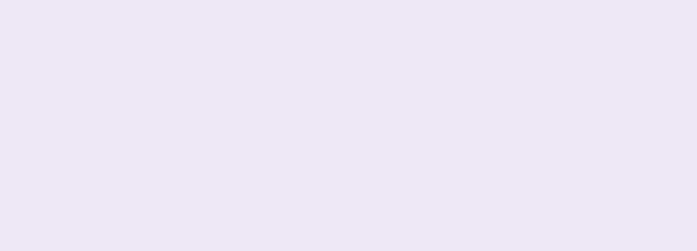
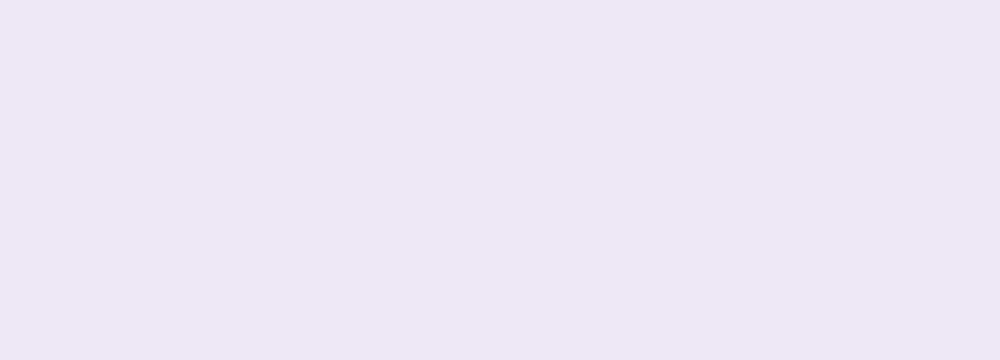
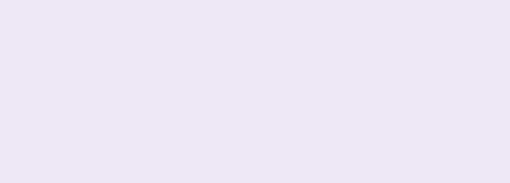

import Tabs from '@theme/Tabs';
import TabItem from '@theme/TabItem';

# F10 — Permitir acesso ao painel administrativo

IT1 · Rastreabilidade: [F10](/backlog/requisitos#f10) · [CP5](/visao/solucao#cp5) · [OE2](/visao/solucao#oe2)

**Issue da Feature (GitHub):** [abrir no repositório](https://github.com/mdsreq-fga-unb/REQ-2026.1-T02-Crianex-/issues) — _nº a definir_

:::note[Acesso para avaliação]
Esta funcionalidade exige **login de administrador**. Credenciais para o professor: **e-mail** `a definir` · **senha** `a definir`.
:::

## Requisitos (evidências)

Selecione um requisito na navegação abaixo. Cada um traz seus critérios de aceite, regras de negócio e um espaço para o **screenshot da funcionalidade em funcionamento** (substitua a imagem de placeholder pela captura real).

<Tabs>
<TabItem value="rf10" label="RF10">

#### RF10 — Acessar painel administrativo

**Critérios de aceite (BDD)**

- **Dado** JWT válido com `role = owner`, **quando** GET `/admin/dashboard`, **então** o RLS filtra por `auth.uid()` e o painel é renderizado.
- **Dado** JWT expirado, **quando** acesso ao painel, **então** tenta `refreshSession()`; se falhar, redireciona para `/admin/login`.
- **Dado** token sem permissão, **quando** GET de rota admin, **então** retorna 401/403 e redireciona sem expor a estrutura.

**Regras de negócio:** [RN03](/backlog/requisitos#rns) — Controle de acesso modular por permissão (v/e/a) · [RN04](/backlog/requisitos#rns) — Owner com acesso irrestrito a todos os módulos · [RN05](/backlog/requisitos#rns) — Membro inativo bloqueado no painel

**Evidência (screenshot):**

**Deploy:** _link a definir_

</TabItem>
<TabItem value="rf48" label="RF48">

#### RF48 — Editar próprio perfil no painel

**Critérios de aceite (BDD)**

- **Dado** admin autenticado, **quando** editar o próprio perfil, **então** PATCH `/profile/me` (e `/profile/me/password`) atualiza os dados sem reload.

**Regras de negócio:** —

**Evidência (screenshot):**

**Deploy:** _link a definir_

</TabItem>
<TabItem value="rnf01" label="RNF01">

#### RNF01 — Isolamento de acesso administrativo

**Classificação:** Segurança da Informação  
**Descrição:** Área administrativa em endpoint distinto, acessível apenas mediante autenticação.

**Evidência (screenshot):**

**Verificação:** [Resultados V&V da IT1](/iteracoes/iteracao-1/vv)

</TabItem>
<TabItem value="rnf09" label="RNF09">

#### RNF09 — Controle de acesso por linha (RLS)

**Classificação:** Segurança da Informação  
**Descrição:** Row Level Security restringindo leitura ao perfil autorizado.

**Evidência (screenshot):**

**Verificação:** [Resultados V&V da IT1](/iteracoes/iteracao-1/vv)

</TabItem>
</Tabs>
