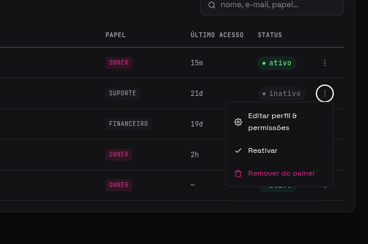
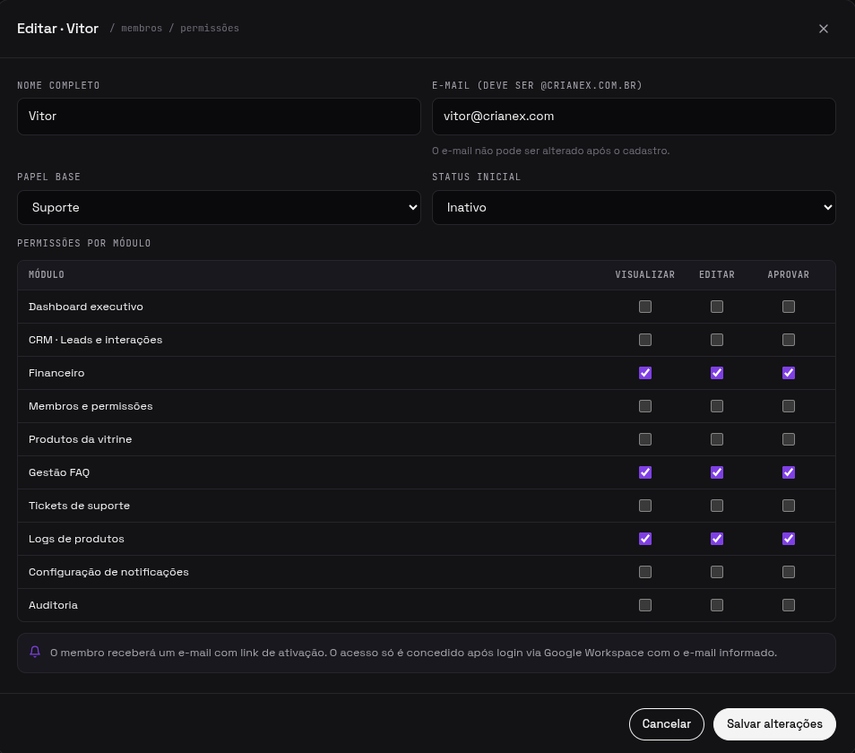
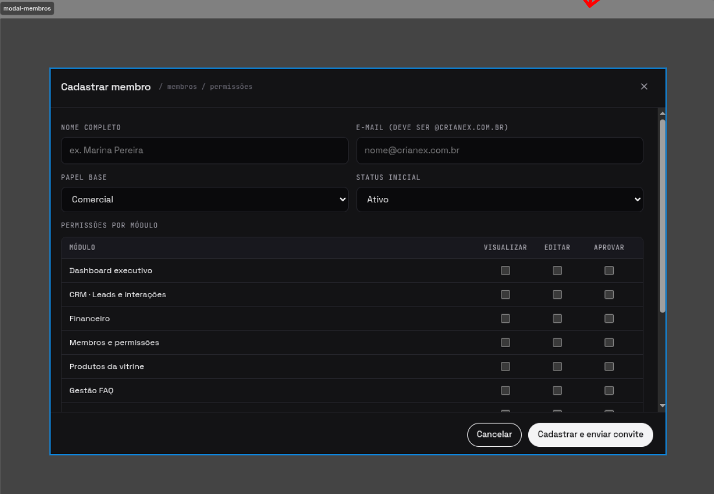
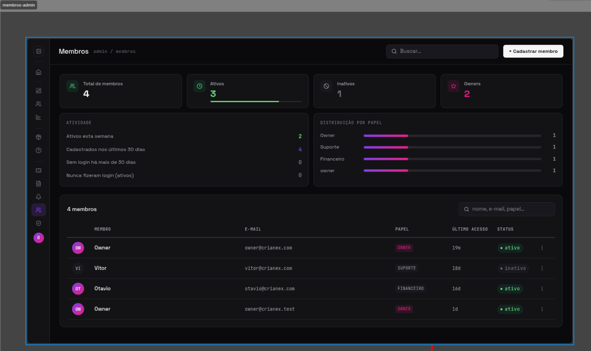
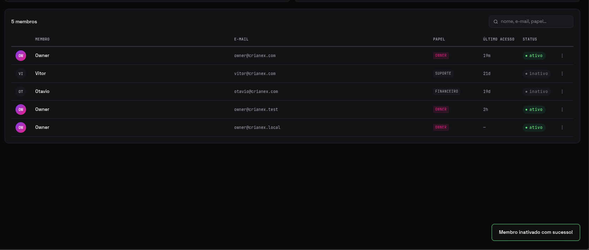
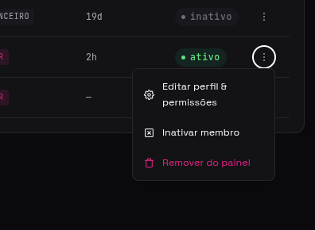
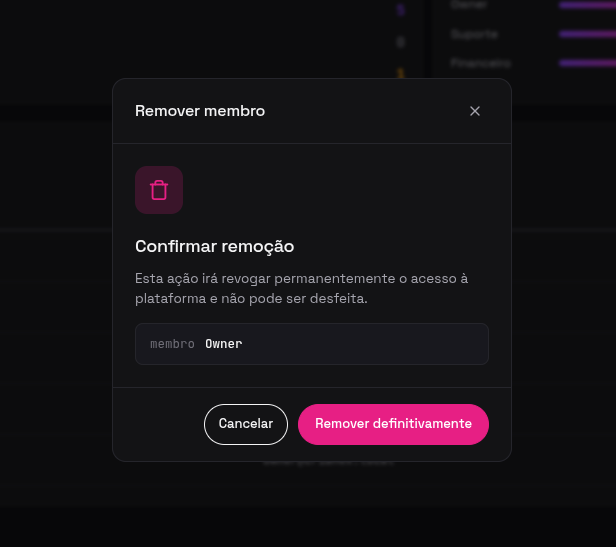
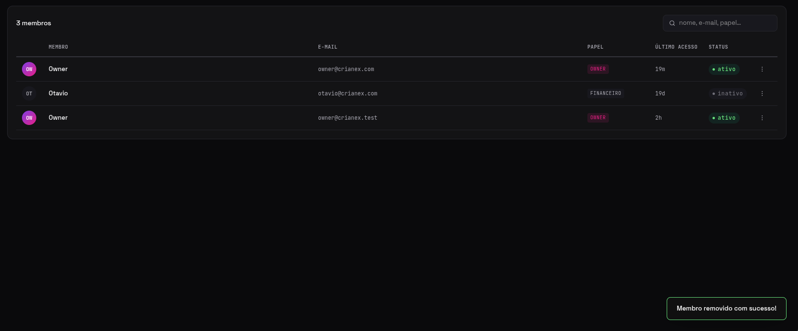

import Tabs from '@theme/Tabs';
import TabItem from '@theme/TabItem';
import AccessCredentials from '@site/src/components/AccessCredentials';

# F11 — Gerenciar usuários da plataforma

IT1 · Rastreabilidade: [F11](/backlog/requisitos#f11) · [CP5](/visao/solucao#cp5) · [OE2](/visao/solucao#oe2)

**Issue da Feature (GitHub):** [#58 — abrir no GitHub](https://github.com/mdsreq-fga-unb/REQ-2026.1-T02-Crianex-/issues/58)

:::note[Acesso para avaliação]
Esta funcionalidade exige **login de administrador**.

<AccessCredentials email="owner@crianex.com" password="Crianex@Owner1" />
:::

## Requisitos (evidências)

Selecione um requisito na navegação abaixo. Cada um traz seus critérios de aceite, regras de negócio e um espaço para o **screenshot da funcionalidade em funcionamento** (substitua a imagem de placeholder pela captura real).

<Tabs queryString="tab">
<TabItem value="rf11" label="RF11">

#### RF11 — Editar informações dos membros

**Critérios de aceite (BDD)**

- **Dado** `role = owner`, **quando** editar um membro, **então** o MemberModal atualiza perfil e permissões sem reload.
- **Dado** membro sem permissão de edição (`e`), **quando** tentar editar, **então** a ação fica indisponível/bloqueada.
- **Dado** campos inválidos, **quando** submeter a edição, **então** a validação impede e mantém os dados anteriores.

**Regras de negócio:** [RN03](/backlog/requisitos#rns) — Controle de acesso modular por permissão (v/e/a)

**Evidência (screenshot):**

**Deploy:** _link a definir_

</TabItem>
<TabItem value="rf12" label="RF12">

#### RF12 — Cadastrar novo membro

**Critérios de aceite (BDD)**

- **Dado** `role = owner` com dados válidos, **quando** cadastrar membro, **então** `createUser()` + insert em `profiles` + lista atualizada sem reload.
- **Dado** e-mail duplicado, **quando** cadastrar, **então** erro informativo sem criar registro duplicado.
- **Dado** campos obrigatórios vazios, **quando** submeter, **então** a validação impede a criação.
- **Dado** membro recém-criado, **quando** o cadastro conclui, **então** uma senha temporária é gerada, não retornada pela API e exigida a troca no 1º acesso.

**Regras de negócio:** [RN06](/backlog/requisitos#rns) — Senha temporária gerada no cadastro de membro

**Evidência (screenshot):**

**Deploy:** _link a definir_

</TabItem>
<TabItem value="rf13" label="RF13">

#### RF13 — Inativar membro cadastrado

**Critérios de aceite (BDD)**

- **Dado** `role = owner`, **quando** inativar membro, **então** `active = false` e a lista é atualizada.
- **Dado** o próprio usuário logado, **quando** tentar se inativar, **então** a auto-inativação é bloqueada.
- **Dado** membro inativo, **quando** reativar, **então** `active = true` e ele volta ao fluxo.

**Regras de negócio:** [RN15](/backlog/requisitos#rns) — Proteção contra autoexclusão de conta (não é possível inativar a própria conta)

**Evidência (screenshot):**

**Deploy:** _link a definir_

</TabItem>
<TabItem value="rf14" label="RF14">

#### RF14 — Remover membro cadastrado

**Critérios de aceite (BDD)**

- **Dado** `role = owner`, **quando** remover membro, **então** `deleteUser()` + remoção de `profiles` sem reload.
- **Dado** remoção, **quando** acionada, **então** exige confirmação antes de excluir.
- **Dado** o próprio usuário logado, **quando** tentar se remover, **então** a auto-remoção é bloqueada.
- **Dado** membro inexistente, **quando** remover, **então** o erro é tratado sem quebrar a lista.

**Regras de negócio:** [RN15](/backlog/requisitos#rns) — Proteção contra autoexclusão de conta (não é possível remover a própria conta)

**Evidência (screenshot):**

**Deploy:** _link a definir_

</TabItem>
<TabItem value="rnf09" label="RNF09">

#### RNF09 — Controle de acesso por linha (RLS)

**Classificação:** Segurança da Informação  
**Descrição:** Row Level Security restringindo leitura ao perfil autorizado.

**Evidência (screenshot):**

**Verificação:** [Resultados V&V da IT1](/iteracoes/iteracao-1/vv)

</TabItem>
<TabItem value="dor" label="DoR">

## Definition of Ready — Evidências

Checklist do DoR aplicado à F11 antes de entrar em execução. Todos os itens foram atendidos conforme o critério definido em [DoR e DoD](/visao/dor-dod).

| Critério DoR | Status | Evidência |
| ------------ | ------ | --------- |
| Título no padrão FDD `<ação> <resultado> <de/para/no/com> <objeto>` | ✅ | [Issue #58](https://github.com/mdsreq-fga-unb/REQ-2026.1-T02-Crianex-/issues/58) — título conforme o padrão |
| Critérios de aceite escritos e verificáveis (Given/When/Then) | ✅ | Ver abas RF/RNF desta página — todos os cenários BDD documentados |
| Estimativa registrada: VB, CX e IP calculados | ✅ | [Priorização do Backlog](/backlog/priorizacao) — coluna IP da tabela de features |
| Dependências identificadas; bloqueantes resolvidos | ✅ | [Mapa de Dependências — IT1](/backlog/dependencias#it1) — bloqueantes verificados antes do início |
| Class Owner designado e linkada à Feature parent e à CP de origem | ✅ | [Issue #58](https://github.com/mdsreq-fga-unb/REQ-2026.1-T02-Crianex-/issues/58) — assignees e labels de CP/Feature registrados |
| Protótipo revisado pelo cliente | ✅ | [Protótipo de Alta Fidelidade — IT1](/iteracoes/iteracao-1/evidencias/prototipo) |
| Technical Design Review (TDR) concluída | ✅ | [Design Técnico IT1](/iteracoes/iteracao-1/evidencias/design-tecnico) — diagramas leves e feature cards elaborados |
| Ao menos um critério de segurança ou usabilidade identificado | ✅ | Ver aba RNF desta página |

</TabItem>
<TabItem value="dod" label="DoD">

## Definition of Done — Evidências

Checklist do DoD verificado ao encerrar a F11. Todos os itens foram atendidos antes de mover a issue para Done no Kanban.

| Critério DoD | Status | Evidência |
| ------------ | ------ | --------- |
| Critérios de aceite validados (BDD cobertos) | ✅ | [Issue #58](https://github.com/mdsreq-fga-unb/REQ-2026.1-T02-Crianex-/issues/58) — evidências anexadas na descrição da issue |
| Testes automatizados passando (unitários + integração) | ✅ | [Issue #58](https://github.com/mdsreq-fga-unb/REQ-2026.1-T02-Crianex-/issues/58) — evidências anexadas na descrição da issue |
| Lint sem erros e formatação OK (ESLint + Prettier) | ✅ | [Issue #58](https://github.com/mdsreq-fga-unb/REQ-2026.1-T02-Crianex-/issues/58) — evidências anexadas na descrição da issue |
| CI verde (build + testes + lint) | ✅ | [Issue #58](https://github.com/mdsreq-fga-unb/REQ-2026.1-T02-Crianex-/issues/58) — evidências anexadas na descrição da issue |
| PR aprovado por Chief Programmer ou Project Manager | ✅ | [Issue #58](https://github.com/mdsreq-fga-unb/REQ-2026.1-T02-Crianex-/issues/58) — PR de resolução com approve registrado |
| Migration de banco aplicada | ✅ | [Issue #58](https://github.com/mdsreq-fga-unb/REQ-2026.1-T02-Crianex-/issues/58) — evidências anexadas na descrição da issue |
| Sem vulnerabilidades críticas (SAST/linting de segurança) | ✅ | [Issue #58](https://github.com/mdsreq-fga-unb/REQ-2026.1-T02-Crianex-/issues/58) — evidências anexadas na descrição da issue |
| Validação parcial do cliente registrada | ✅ | [Validação Parcial IT1](/iteracoes/iteracao-1/validacao/partial) |
| Validação Formal aprovada pelo cliente | ✅ | [Validação Formal IT1](/iteracoes/iteracao-1/validacao/formal) |
| Rastreabilidade atualizada | ✅ | [Tabela de Requisitos](/backlog/requisitos) — RF/RNF vinculados |
| Issue movida para Done no GitHub Projects | ✅ | [Issue #58](https://github.com/mdsreq-fga-unb/REQ-2026.1-T02-Crianex-/issues/58) — fechada via merge do PR (`closes #N`) |

</TabItem>
</Tabs>
