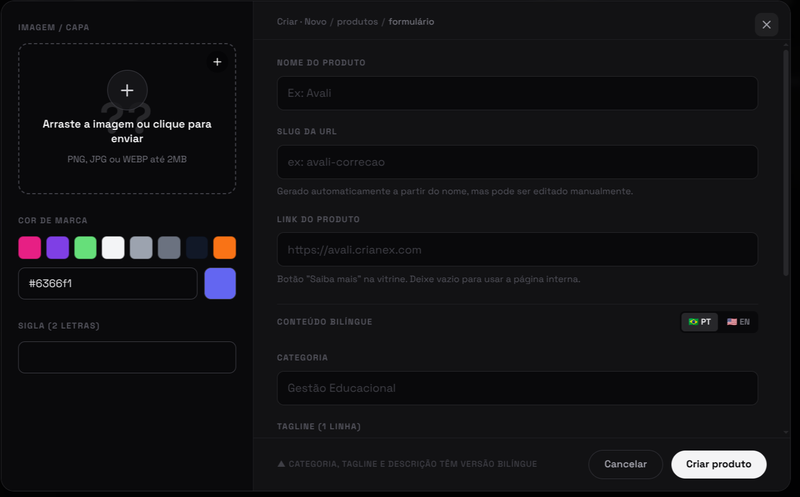
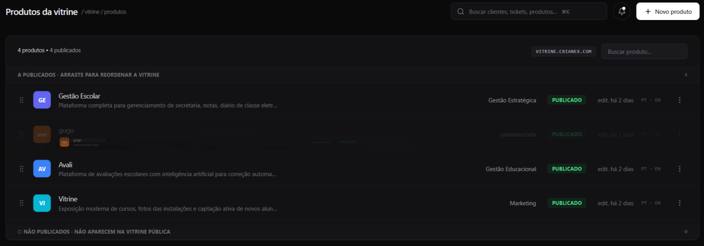
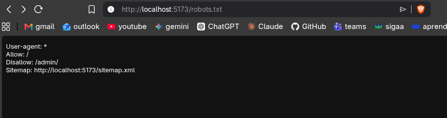

import Tabs from '@theme/Tabs';
import TabItem from '@theme/TabItem';
import AccessCredentials from '@site/src/components/AccessCredentials';

# F12 — Gerenciar produtos SaaS da vitrine

IT1 · Rastreabilidade: [F12](/backlog/requisitos#f12) · [CP4](/visao/solucao#cp4) · [OE2](/visao/solucao#oe2)

**Issue da Feature (GitHub):** [#55 — abrir no GitHub](https://github.com/mdsreq-fga-unb/REQ-2026.1-T02-Crianex-/issues/55)

:::note[Acesso para avaliação]
Esta funcionalidade exige **login de administrador**.

<AccessCredentials email="owner@crianex.com" password="Crianex@Owner1" />
:::

## Requisitos (evidências)

Selecione um requisito na navegação abaixo. Cada um traz seus critérios de aceite, regras de negócio e um espaço para o **screenshot da funcionalidade em funcionamento** (substitua a imagem de placeholder pela captura real).

<Tabs queryString="tab">
<TabItem value="rf21" label="RF21">

#### RF21 — Cadastrar produto SaaS

**Critérios de aceite (BDD)**

- **Dado** admin autenticado com dados válidos, **quando** cadastrar produto, **então** é persistido em transação ACID e fica apto à publicação.
- **Dado** campos obrigatórios vazios, **quando** submeter, **então** a validação impede a criação.
- **Dado** produto publicado, **quando** a vitrine é carregada, **então** o SSR retorna apenas `published = true` em ≤ 2s.

**Regras de negócio:** [RN16](/backlog/requisitos#rns) — Publicação explícita de conteúdo (produto nasce despublicado até liberação do administrador)

**Evidência (screenshot):**

**Deploy:** _link a definir_

</TabItem>
<TabItem value="rf22" label="RF22">

#### RF22 — Editar produto SaaS

**Critérios de aceite (BDD)**

- **Dado** admin autenticado, **quando** editar produto, **então** PATCH `/admin/products/:id` atualiza os dados refletidos na vitrine.
- **Dado** campos inválidos, **quando** submeter, **então** a validação impede e mantém a versão anterior.
- **Dado** produto inexistente, **quando** editar, **então** retorna 404 sem efeito.

**Regras de negócio:** —

**Evidência (screenshot):**

**Deploy:** _link a definir_

</TabItem>
<TabItem value="rf23" label="RF23">

#### RF23 — Remover produto SaaS

**Critérios de aceite (BDD)**

- **Dado** admin autenticado, **quando** remover produto, **então** DELETE `/admin/products/:id` o remove da vitrine e do banco.
- **Dado** remoção, **quando** acionada, **então** exige confirmação antes de excluir.
- **Dado** produto inexistente, **quando** remover, **então** retorna 404 sem efeito.

**Regras de negócio:** —

**Evidência (screenshot):**

**Deploy:** _link a definir_

</TabItem>
<TabItem value="rf24" label="RF24">

#### RF24 — Reordenar produtos SaaS

**Critérios de aceite (BDD)**

- **Dado** lista de produtos, **quando** reordenar via drag-and-drop, **então** PATCH `/admin/products/reorder` persiste a nova ordem em ≤ 1,5s.
- **Dado** falha ao persistir a nova ordem, **quando** o PATCH não confirma, **então** a UI reverte para a ordem anterior.
- **Dado** nova ordem persistida, **quando** a vitrine carrega, **então** os produtos respeitam a sequência definida pelo administrador.

**Regras de negócio:** [RN12](/backlog/requisitos#rns) — Ordem de exibição de produtos definida pelo administrador

**Evidência (screenshot):**

**Deploy:** _link a definir_

</TabItem>
<TabItem value="rnf03" label="RNF03">

#### RNF03 — Tempo de resposta da área administrativa

**Classificação:** Eficiência  
**Descrição:** 95% das operações de leitura no painel administrativo (listagens, dashboards, detalhes de registro) retornam em até 2 segundos, do disparo da requisição HTTP à resposta completa da API, sob carga normal de uso (≤ 10 usuários simultâneos).

:::tip[Como capturar essa evidência]
Abra o DevTools do navegador (F12) → aba **Network** → recarregue a tela de produtos do painel administrativo → clique na requisição do endpoint que carrega a listagem (ex.: `GET /admin/products`) → tire o print mostrando a coluna **Time**/o waterfall com a duração total da requisição (precisa aparecer bem abaixo de 2000 ms). Alternativa: aba **Lighthouse** do DevTools → relatório de Performance → print do "Time to First Byte" da rota administrativa.
:::

**Evidência (screenshot):**

**Verificação:** [Resultados V&V da IT1](/iteracoes/iteracao-1/vv)

</TabItem>
<TabItem value="rnf04" label="RNF04">

#### RNF04 — Renderização server-side da vitrine

**Classificação:** Organizacional  
**Descrição:** Todas as páginas públicas da vitrine são renderizadas no servidor (SSR) antes do envio ao cliente: o HTML inicial já contém o conteúdo textual completo, verificável via `curl`/"view-source" sem executar JavaScript.

:::tip[Como capturar essa evidência]
Duas formas simples de provar SSR com um print:
1. **View-source:** acesse uma página pública de produto (ex.: `/produtos/[slug]`), aperte `Ctrl+U` (ver código-fonte) e tire o print mostrando o texto do produto (nome, descrição) já presente no HTML bruto — sem precisar rodar JavaScript.
2. **DevTools sem JS:** DevTools (F12) → `Ctrl+Shift+P` → "Disable JavaScript" → recarregue a página → print mostrando o conteúdo completo renderizado mesmo com JS desabilitado.
:::

**Evidência (screenshot):**

**Verificação:** [Resultados V&V da IT1](/iteracoes/iteracao-1/vv)

</TabItem>
<TabItem value="rnf05" label="RNF05">

#### RNF05 — Otimização para mecanismos de busca (SEO)

**Classificação:** Externo  
**Descrição:** Cada página pública expõe meta tags (title, description, Open Graph), `sitemap.xml` atualizado a cada publicação e `robots.txt` permitindo indexação; validado sem erros no Google Rich Results Test e nota ≥ 90 no Lighthouse SEO.

**Evidência (screenshot):**

**Verificação:** [Resultados V&V da IT1](/iteracoes/iteracao-1/vv)

</TabItem>
<TabItem value="rnf13" label="RNF13">

#### RNF13 — Bilinguismo da vitrine

**Classificação:** Usabilidade  
**Descrição:** Toda a vitrine pública está disponível em português e inglês, com troca de idioma em 1 clique, sem perda de contexto de navegação (permanece na mesma rota); nenhuma string de interface pública fica sem tradução.

**Evidência (screenshot):**

**Verificação:** [Resultados V&V da IT1](/iteracoes/iteracao-1/vv)

</TabItem>
<TabItem value="rnf19" label="RNF19">

#### RNF19 — Alcançabilidade de seções em até 3 cliques

**Classificação:** Usabilidade  
**Descrição:** Qualquer seção da vitrine pública é alcançável a partir da página inicial em no máximo 3 cliques/interações, validado por mapeamento do fluxo de navegação e teste de usuário sem instrução prévia sobre a estrutura do site.

**Evidência (screenshot):**

**Verificação:** [Resultados V&V da IT1](/iteracoes/iteracao-1/vv)

</TabItem>
<TabItem value="dor" label="DoR">

## Definition of Ready — Evidências

Checklist do DoR aplicado à F12 antes de entrar em execução. Todos os itens foram atendidos conforme o critério definido em [DoR e DoD](/visao/dor-dod).

| Critério DoR | Status | Evidência |
| ------------ | ------ | --------- |
| Título no padrão FDD `<ação> <resultado> <de/para/no/com> <objeto>` | ✅ | [Issue #55](https://github.com/mdsreq-fga-unb/REQ-2026.1-T02-Crianex-/issues/55) — título conforme o padrão |
| Critérios de aceite escritos e verificáveis (Given/When/Then) | ✅ | Ver abas RF/RNF desta página — todos os cenários BDD documentados |
| Estimativa registrada: VB, CX e IP calculados | ✅ | [Priorização do Backlog](/backlog/priorizacao) — coluna IP da tabela de features |
| Dependências identificadas; bloqueantes resolvidos | ✅ | [Mapa de Dependências — IT1](/backlog/dependencias#it1) — bloqueantes verificados antes do início |
| Class Owner designado e linkada à Feature parent e à CP de origem | ✅ | [Issue #55](https://github.com/mdsreq-fga-unb/REQ-2026.1-T02-Crianex-/issues/55) — assignees e labels de CP/Feature registrados |
| Protótipo revisado pelo cliente | ✅ | [Protótipo de Alta Fidelidade — IT1](/iteracoes/iteracao-1/evidencias/prototipo) |
| Technical Design Review (TDR) concluída | ✅ | [Design Técnico IT1](/iteracoes/iteracao-1/evidencias/design-tecnico) — diagramas leves e feature cards elaborados |
| Ao menos um critério de segurança ou usabilidade identificado | ✅ | Ver aba RNF desta página |

</TabItem>
<TabItem value="dod" label="DoD">

## Definition of Done — Evidências

Checklist do DoD verificado ao encerrar a F12. Todos os itens foram atendidos antes de mover a issue para Done no Kanban.

| Critério DoD | Status | Evidência |
| ------------ | ------ | --------- |
| Critérios de aceite validados (BDD cobertos) | ✅ | [Issue #55](https://github.com/mdsreq-fga-unb/REQ-2026.1-T02-Crianex-/issues/55) — evidências anexadas na descrição da issue |
| Testes automatizados passando (unitários + integração) | ✅ | [Issue #55](https://github.com/mdsreq-fga-unb/REQ-2026.1-T02-Crianex-/issues/55) — evidências anexadas na descrição da issue |
| Lint sem erros e formatação OK (ESLint + Prettier) | ✅ | [Issue #55](https://github.com/mdsreq-fga-unb/REQ-2026.1-T02-Crianex-/issues/55) — evidências anexadas na descrição da issue |
| CI verde (build + testes + lint) | ✅ | [Issue #55](https://github.com/mdsreq-fga-unb/REQ-2026.1-T02-Crianex-/issues/55) — evidências anexadas na descrição da issue |
| PR aprovado por Chief Programmer ou Project Manager | ✅ | [Issue #55](https://github.com/mdsreq-fga-unb/REQ-2026.1-T02-Crianex-/issues/55) — PR de resolução com approve registrado |
| Migration de banco aplicada | ✅ | [Issue #55](https://github.com/mdsreq-fga-unb/REQ-2026.1-T02-Crianex-/issues/55) — evidências anexadas na descrição da issue |
| Sem vulnerabilidades críticas (SAST/linting de segurança) | ✅ | [Issue #55](https://github.com/mdsreq-fga-unb/REQ-2026.1-T02-Crianex-/issues/55) — evidências anexadas na descrição da issue |
| Validação parcial do cliente registrada | ✅ | [Validação Parcial IT1](/iteracoes/iteracao-1/validacao/partial) |
| Validação Formal aprovada pelo cliente | ✅ | [Validação Formal IT1](/iteracoes/iteracao-1/validacao/formal) |
| Rastreabilidade atualizada | ✅ | [Tabela de Requisitos](/backlog/requisitos) — RF/RNF vinculados |
| Issue movida para Done no GitHub Projects | ✅ | [Issue #55](https://github.com/mdsreq-fga-unb/REQ-2026.1-T02-Crianex-/issues/55) — fechada via merge do PR (`closes #N`) |

</TabItem>
</Tabs>
