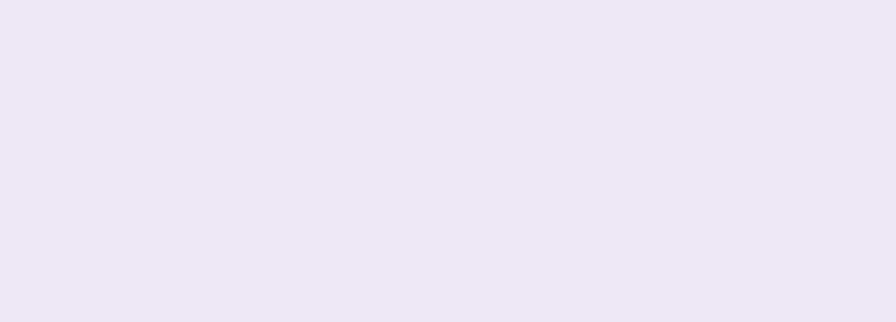
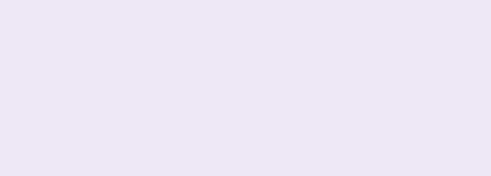

import Tabs from '@theme/Tabs';
import TabItem from '@theme/TabItem';

# F13 — Controlar publicação de produto SaaS

IT1 · Rastreabilidade: [F13](/backlog/requisitos#f13) · [CP4](/visao/solucao#cp4) · [OE2](/visao/solucao#oe2)

**Issue da Feature (GitHub):** [#56 — abrir no GitHub](https://github.com/mdsreq-fga-unb/REQ-2026.1-T02-Crianex-/issues/56)

:::note[Acesso para avaliação]
Esta funcionalidade exige **login de administrador**. Credenciais para o professor: **e-mail** `a definir` · **senha** `a definir`.
:::

## Requisitos (evidências)

Selecione um requisito na navegação abaixo. Cada um traz seus critérios de aceite, regras de negócio e um espaço para o **screenshot da funcionalidade em funcionamento** (substitua a imagem de placeholder pela captura real).

<Tabs queryString="tab">
<TabItem value="rf25" label="RF25">

#### RF25 — Publicar produto SaaS

**Critérios de aceite (BDD)**

- **Dado** admin autenticado, **quando** acionar toggle ON, **então** `published = true` com confirmação visual em ≤ 2s e o produto aparece na vitrine imediatamente.
- **Dado** requisição não autorizada no toggle, **quando** a requisição chega à API, **então** é rejeitada e o toggle revertido na UI.

**Regras de negócio:** [RN01](/backlog/requisitos#rns) — Visibilidade de produtos — só `published = true` aparece na vitrine; efeito imediato · [RN12](/backlog/requisitos#rns) — Ordem de exibição de produtos definida pelo administrador

**Evidência (screenshot):**

**Deploy:** _link a definir_

</TabItem>
<TabItem value="rf26" label="RF26">

#### RF26 — Despublicar produto SaaS

**Critérios de aceite (BDD)**

- **Dado** admin autenticado, **quando** acionar toggle OFF, **então** o produto é ocultado da vitrine com os dados preservados no banco.
- **Dado** falha na requisição, **quando** o toggle OFF não confirma, **então** a UI reverte para o estado publicado.

**Regras de negócio:** [RN01](/backlog/requisitos#rns) — Visibilidade de produtos — só `published = true` aparece na vitrine; efeito imediato

**Evidência (screenshot):**

**Deploy:** _link a definir_

</TabItem>
<TabItem value="rnf03" label="RNF03">

#### RNF03 — Tempo de resposta da área administrativa

**Classificação:** Eficiência  
**Descrição:** Operações de leitura no painel em ≤ 2s em 95% das requisições.

**Evidência (screenshot):**

**Verificação:** [Resultados V&V da IT1](/iteracoes/iteracao-1/vv)

</TabItem>
<TabItem value="dor" label="DoR">

## Definition of Ready — Evidências

Checklist do DoR aplicado à F13 antes de entrar em execução. Todos os itens foram atendidos conforme o critério definido em [DoR e DoD](/visao/dor-dod).

| Critério DoR | Status | Evidência |
| ------------ | ------ | --------- |
| Título no padrão FDD `<ação> <resultado> <de/para/no/com> <objeto>` | ✅ | [Issue #56](https://github.com/mdsreq-fga-unb/REQ-2026.1-T02-Crianex-/issues/56) — título conforme o padrão |
| Critérios de aceite escritos e verificáveis (Given/When/Then) | ✅ | Ver abas RF/RNF desta página — todos os cenários BDD documentados |
| Estimativa registrada: VB, CX e IP calculados | ✅ | [Priorização do Backlog](/backlog/priorizacao) — coluna IP da tabela de features |
| Dependências identificadas; bloqueantes resolvidos | ✅ | [Mapa de Dependências — IT1](/backlog/dependencias#it1) — bloqueantes verificados antes do início |
| Class Owner designado e linkada à Feature parent e à CP de origem | ✅ | [Issue #56](https://github.com/mdsreq-fga-unb/REQ-2026.1-T02-Crianex-/issues/56) — assignees e labels de CP/Feature registrados |
| Protótipo revisado pelo cliente | ✅ | [Protótipo de Alta Fidelidade — IT1](/iteracoes/iteracao-1/evidencias/prototipo) |
| Technical Design Review (TDR) concluída | ✅ | [Design Técnico IT1](/iteracoes/iteracao-1/evidencias/design-tecnico) — diagramas leves e feature cards elaborados |
| Ao menos um critério de segurança ou usabilidade identificado | ✅ | Ver aba RNF desta página |

</TabItem>
<TabItem value="dod" label="DoD">

## Definition of Done — Evidências

Checklist do DoD verificado ao encerrar a F13. Todos os itens foram atendidos antes de mover a issue para Done no Kanban.

| Critério DoD | Status | Evidência |
| ------------ | ------ | --------- |
| Critérios de aceite validados (BDD cobertos) | ✅ | [Issue #56](https://github.com/mdsreq-fga-unb/REQ-2026.1-T02-Crianex-/issues/56) — evidências anexadas na descrição da issue |
| Testes automatizados passando (unitários + integração) | ✅ | [Issue #56](https://github.com/mdsreq-fga-unb/REQ-2026.1-T02-Crianex-/issues/56) — evidências anexadas na descrição da issue |
| Lint sem erros e formatação OK (ESLint + Prettier) | ✅ | [Issue #56](https://github.com/mdsreq-fga-unb/REQ-2026.1-T02-Crianex-/issues/56) — evidências anexadas na descrição da issue |
| CI verde (build + testes + lint) | ✅ | [Issue #56](https://github.com/mdsreq-fga-unb/REQ-2026.1-T02-Crianex-/issues/56) — evidências anexadas na descrição da issue |
| PR aprovado por Chief Programmer ou Project Manager | ✅ | [Issue #56](https://github.com/mdsreq-fga-unb/REQ-2026.1-T02-Crianex-/issues/56) — PR de resolução com approve registrado |
| Migration de banco | — | Não aplicável para esta feature |
| Sem vulnerabilidades críticas (SAST/linting de segurança) | ✅ | [Issue #56](https://github.com/mdsreq-fga-unb/REQ-2026.1-T02-Crianex-/issues/56) — evidências anexadas na descrição da issue |
| Validação parcial do cliente registrada | ✅ | [Validação Parcial IT1](/iteracoes/iteracao-1/validacao/partial) |
| Validação Formal aprovada pelo cliente | ✅ | [Validação Formal IT1](/iteracoes/iteracao-1/validacao/formal) |
| Rastreabilidade atualizada | ✅ | [Tabela de Requisitos](/backlog/requisitos) — RF/RNF vinculados |
| Issue movida para Done no GitHub Projects | ✅ | [Issue #56](https://github.com/mdsreq-fga-unb/REQ-2026.1-T02-Crianex-/issues/56) — fechada via merge do PR (`closes #N`) |

</TabItem>
</Tabs>
