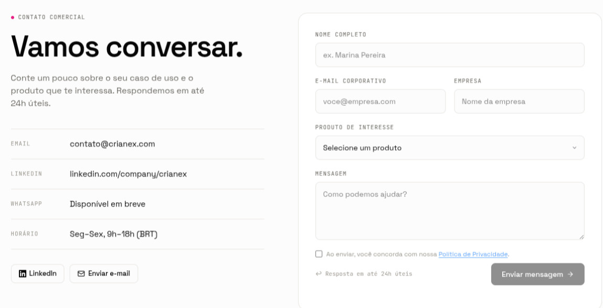
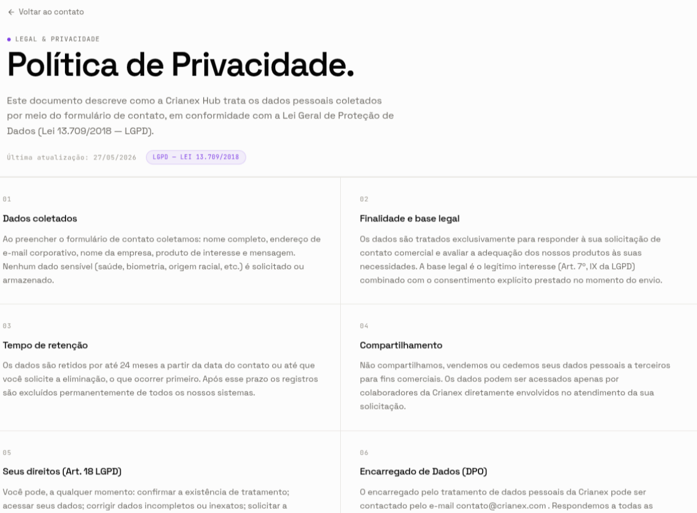

import Tabs from '@theme/Tabs';
import TabItem from '@theme/TabItem';

# F14 — Exibir canais de contato / captação de leads

IT1 · Rastreabilidade: [F14](/backlog/requisitos#f14) · [CP4](/visao/solucao#cp4) · [OE2](/visao/solucao#oe2)

**Issue da Feature (GitHub):** [#61 — abrir no GitHub](https://github.com/mdsreq-fga-unb/REQ-2026.1-T02-Crianex-/issues/61)

## Requisitos (evidências)

Selecione um requisito na navegação abaixo. Cada um traz seus critérios de aceite, regras de negócio e um espaço para o **screenshot da funcionalidade em funcionamento** (substitua a imagem de placeholder pela captura real).

<Tabs>
<TabItem value="rf27" label="RF27">

#### RF27 — Cadastrar contato com a empresa

**Critérios de aceite (BDD)**

- **Dado** visitante preenche o formulário, **quando** POST válido, **então** o lead é persistido em transação ACID + alerta de sucesso em ≤ 2s.
- **Dado** campos obrigatórios vazios ou e-mail inválido, **quando** submeter, **então** a validação client-side impede o envio e sinaliza os campos.
- **Dado** IP que excede 5 requisições em 10 min, **quando** POST ao formulário, **então** retorna 429 com "Tente novamente mais tarde".
- **Dado** o envio do formulário, **quando** o lead é coletado, **então** o consentimento LGPD é exigido/registrado antes da persistência.

**Regras de negócio:** [RN18](/backlog/requisitos#rns) — Consentimento LGPD registrado antes de persistir os dados do lead

**Evidência (screenshot):**

**Deploy:** _link a definir_

</TabItem>
<TabItem value="rf49" label="RF49">

#### RF49 — Detalhar conformidade com a LGPD

**Critérios de aceite (BDD)**

- **Dado** visitante na vitrine, **quando** acessar `/privacidade` ou `/cookies`, **então** as páginas de conformidade com a LGPD são exibidas.
- **Dado** qualquer página da vitrine, **quando** renderizada, **então** os links de privacidade e cookies estão sempre acessíveis no rodapé.

**Regras de negócio:** [RN08](/backlog/requisitos#rns) — Consentimento de cookies obrigatório no 1º acesso · [RN09](/backlog/requisitos#rns) — Políticas de conformidade sempre acessíveis no rodapé

**Evidência (screenshot):**

**Deploy:** _link a definir_

</TabItem>
<TabItem value="rnf02" label="RNF02">

#### RNF02 — Tempo de resposta da vitrine

**Classificação:** Eficiência  
**Descrição:** Carregamento das páginas públicas em ≤ 2s em 95% das requisições (4G).

**Evidência (screenshot):**

**Verificação:** [Resultados V&V da IT1](/iteracoes/iteracao-1/vv)

</TabItem>
<TabItem value="rnf10" label="RNF10">

#### RNF10 — Proteção contra abuso do formulário público

**Classificação:** Segurança da Informação  
**Descrição:** Rate limit de 5 submissões por IP a cada 10 minutos.

**Evidência (screenshot):**

**Verificação:** [Resultados V&V da IT1](/iteracoes/iteracao-1/vv)

</TabItem>
<TabItem value="rnf11" label="RNF11">

#### RNF11 — Conformidade parcial com LGPD

**Classificação:** Legal  
**Descrição:** Consentimento, finalidade, minimização e direito de exclusão (Lei 13.709/2018).

**Evidência (screenshot):**

**Verificação:** [Resultados V&V da IT1](/iteracoes/iteracao-1/vv)

</TabItem>
</Tabs>
