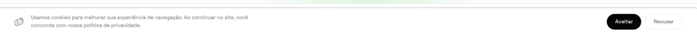

import Tabs from '@theme/Tabs';
import TabItem from '@theme/TabItem';

# F15 — Disponibilizar informações institucionais

IT1 · Rastreabilidade: [F15](/backlog/requisitos#f15) · [CP4](/visao/solucao#cp4) · [OE2](/visao/solucao#oe2)

**Issue da Feature (GitHub):** [#63 — abrir no GitHub](https://github.com/mdsreq-fga-unb/REQ-2026.1-T02-Crianex-/issues/63)

## Requisitos (evidências)

Selecione um requisito na navegação abaixo. Cada um traz seus critérios de aceite, regras de negócio e um espaço para o **screenshot da funcionalidade em funcionamento** (substitua a imagem de placeholder pela captura real).

<Tabs queryString="tab">
<TabItem value="rf50" label="RF50">

#### RF50 — Consultar detalhes de produto na vitrine

**Critérios de aceite (BDD)**

- **Dado** visitante, **quando** acessar `/produtos/[slug]`, **então** o SSR retorna os detalhes completos do produto em ≤ 2s com Open Graph.
- **Dado** acesso sem autenticação, **quando** GET da página, **então** nenhum guard intercepta e o conteúdo é exibido.
- **Dado** slug inexistente ou produto despublicado, **quando** acessar, **então** retorna 404.

**Regras de negócio:** [RN11](/backlog/requisitos#rns) — Conteúdo institucional obrigatório (Missão, Visão, Valores)

**Evidência (screenshot):**

**Deploy:** _link a definir_

</TabItem>
<TabItem value="rf51" label="RF51">

#### RF51 — Permitir utilização de cookies

**Critérios de aceite (BDD)**

- **Dado** primeiro acesso, **quando** a vitrine carrega, **então** exibe o banner de consentimento de cookies.
- **Dado** escolha de aceitar ou recusar, **quando** confirmada, **então** a preferência é persistida e respeitada nos acessos seguintes (sem reexibir o banner).
- **Dado** qualquer página, **quando** renderizada, **então** a política de cookies permanece acessível no rodapé.

**Regras de negócio:** [RN08](/backlog/requisitos#rns) — Consentimento de cookies obrigatório no 1º acesso · [RN09](/backlog/requisitos#rns) — Políticas de conformidade sempre acessíveis no rodapé

**Evidência (screenshot):**

**Deploy:** _link a definir_

</TabItem>
<TabItem value="rnf02" label="RNF02">

#### RNF02 — Tempo de resposta da vitrine

**Classificação:** Eficiência  
**Descrição:** Carregamento das páginas públicas em ≤ 2s em 95% das requisições (4G).

**Evidência (screenshot):**

**Verificação:** [Resultados V&V da IT1](/iteracoes/iteracao-1/vv)

</TabItem>
<TabItem value="rnf20" label="RNF20">

#### RNF20 — Disponibilidade das informações institucionais

**Classificação:** Dependabilidade  
**Descrição:** Informações institucionais públicas sem necessidade de autenticação.

**Evidência (screenshot):**

**Verificação:** [Resultados V&V da IT1](/iteracoes/iteracao-1/vv)

</TabItem>
<TabItem value="dor" label="DoR">

## Definition of Ready — Evidências

Checklist do DoR aplicado à F15 antes de entrar em execução. Todos os itens foram atendidos conforme o critério definido em [DoR e DoD](/visao/dor-dod).

| Critério DoR | Status | Evidência |
| ------------ | ------ | --------- |
| Título no padrão FDD `<ação> <resultado> <de/para/no/com> <objeto>` | ✅ | [Issue #63](https://github.com/mdsreq-fga-unb/REQ-2026.1-T02-Crianex-/issues/63) — título conforme o padrão |
| Critérios de aceite escritos e verificáveis (Given/When/Then) | ✅ | Ver abas RF/RNF desta página — todos os cenários BDD documentados |
| Estimativa registrada: VB, CX e IP calculados | ✅ | [Priorização do Backlog](/backlog/priorizacao) — coluna IP da tabela de features |
| Dependências identificadas; bloqueantes resolvidos | ✅ | [Mapa de Dependências — IT1](/backlog/dependencias#it1) — bloqueantes verificados antes do início |
| Class Owner designado e linkada à Feature parent e à CP de origem | ✅ | [Issue #63](https://github.com/mdsreq-fga-unb/REQ-2026.1-T02-Crianex-/issues/63) — assignees e labels de CP/Feature registrados |
| Protótipo revisado pelo cliente | ✅ | [Protótipo de Alta Fidelidade — IT1](/iteracoes/iteracao-1/evidencias/prototipo) |
| Technical Design Review (TDR) concluída | ✅ | [Design Técnico IT1](/iteracoes/iteracao-1/evidencias/design-tecnico) — diagramas leves e feature cards elaborados |
| Ao menos um critério de segurança ou usabilidade identificado | ✅ | Ver aba RNF desta página |

</TabItem>
<TabItem value="dod" label="DoD">

## Definition of Done — Evidências

Checklist do DoD verificado ao encerrar a F15. Todos os itens foram atendidos antes de mover a issue para Done no Kanban.

| Critério DoD | Status | Evidência |
| ------------ | ------ | --------- |
| Critérios de aceite validados (BDD cobertos) | ✅ | Ver abas RF/RNF desta página — screenshots e cenários verificados |
| Testes automatizados passando (unitários + integração) | ✅ | [Resultados V&V IT1](/iteracoes/iteracao-1/vv) |
| Lint sem erros e formatação OK (ESLint + Prettier) | ✅ | [Resultados V&V IT1](/iteracoes/iteracao-1/vv) |
| CI verde (build + testes + lint) | ✅ | [Resultados V&V IT1](/iteracoes/iteracao-1/vv) |
| PR aprovado por Chief Programmer ou Project Manager | ✅ | [Issue #63](https://github.com/mdsreq-fga-unb/REQ-2026.1-T02-Crianex-/issues/63) — PR de resolução com approve registrado |
| Migration de banco | — | Não aplicável para esta feature |
| Sem vulnerabilidades críticas (SAST/linting de segurança) | ✅ | [Resultados V&V IT1](/iteracoes/iteracao-1/vv) |
| Validação parcial do cliente registrada | ✅ | [Validação Parcial IT1](/iteracoes/iteracao-1/validacao/partial) |
| Validação Formal aprovada pelo cliente | ✅ | [Validação Formal IT1](/iteracoes/iteracao-1/validacao/formal) |
| Rastreabilidade atualizada | ✅ | [Tabela de Requisitos](/backlog/requisitos) — RF/RNF vinculados |
| Issue movida para Done no GitHub Projects | ✅ | [Issue #63](https://github.com/mdsreq-fga-unb/REQ-2026.1-T02-Crianex-/issues/63) — fechada via merge do PR (`closes #N`) |

</TabItem>
</Tabs>
