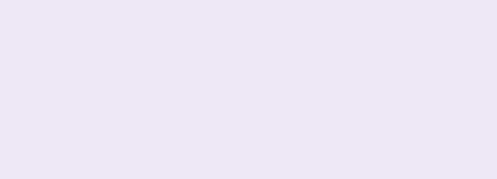
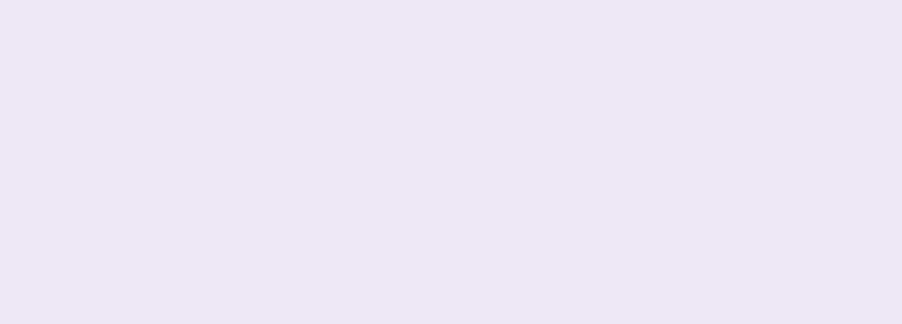
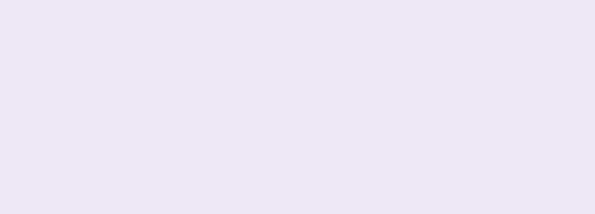
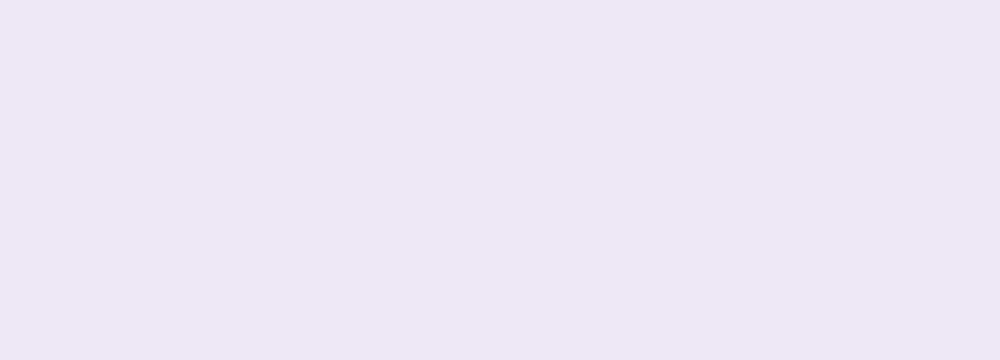

import Tabs from '@theme/Tabs';
import TabItem from '@theme/TabItem';

# F16 — Gerenciar artigos de FAQ

IT1 · Rastreabilidade: [F16](/backlog/requisitos#f16) · [CP6](/visao/solucao#cp6) · [OE2](/visao/solucao#oe2)

**Issue da Feature (GitHub):** [abrir no repositório](https://github.com/mdsreq-fga-unb/REQ-2026.1-T02-Crianex-/issues) — _nº a definir_

:::note[Acesso para avaliação]
Esta funcionalidade exige **login de administrador**. Credenciais para o professor: **e-mail** `a definir` · **senha** `a definir`.
:::

## Requisitos (evidências)

Selecione um requisito na navegação abaixo. Cada um traz seus critérios de aceite, regras de negócio e um espaço para o **screenshot da funcionalidade em funcionamento** (substitua a imagem de placeholder pela captura real).

<Tabs>
<TabItem value="rf28" label="RF28">

#### RF28 — Cadastrar artigo de FAQ

**Critérios de aceite (BDD)**

- **Dado** admin autenticado, **quando** cadastrar artigo, **então** é persistido com `published = false` por padrão.
- **Dado** agente externo sem token, **quando** INSERT/UPDATE direto no Supabase, **então** o RLS bloqueia com 403.

**Regras de negócio:** —

**Evidência (screenshot):**

**Deploy:** _link a definir_

</TabItem>
<TabItem value="rf29" label="RF29">

#### RF29 — Editar artigo de FAQ

**Critérios de aceite (BDD)**

- **Dado** admin autenticado, **quando** editar artigo, **então** PATCH `/admin/faq/articles/:id` atualiza o conteúdo.

**Regras de negócio:** —

**Evidência (screenshot):**

**Deploy:** _link a definir_

</TabItem>
<TabItem value="rf30" label="RF30">

#### RF30 — Remover artigo de FAQ

**Critérios de aceite (BDD)**

- **Dado** admin autenticado, **quando** remover artigo, **então** DELETE `/admin/faq/articles/:id` o exclui.

**Regras de negócio:** —

**Evidência (screenshot):**

**Deploy:** _link a definir_

</TabItem>
<TabItem value="rf31" label="RF31">

#### RF31 — Categorizar artigo de FAQ

**Critérios de aceite (BDD)**

- **Dado** admin autenticado, **quando** categorizar artigo, **então** a categoria é associada via modal dedicado.

**Regras de negócio:** —

**Evidência (screenshot):**

**Deploy:** _link a definir_

</TabItem>
<TabItem value="rnf01" label="RNF01">

#### RNF01 — Isolamento de acesso administrativo

**Classificação:** Segurança da Informação  
**Descrição:** Área administrativa em endpoint distinto, acessível apenas mediante autenticação.

**Evidência (screenshot):**

**Verificação:** [Resultados V&V da IT1](/iteracoes/iteracao-1/vv)

</TabItem>
<TabItem value="rnf04" label="RNF04">

#### RNF04 — Renderização server-side da vitrine

**Classificação:** Eficiência  
**Descrição:** Páginas públicas renderizadas via SSR para indexação completa.

**Evidência (screenshot):**

**Verificação:** [Resultados V&V da IT1](/iteracoes/iteracao-1/vv)

</TabItem>
<TabItem value="rnf05" label="RNF05">

#### RNF05 — Otimização para mecanismos de busca (SEO)

**Classificação:** Usabilidade  
**Descrição:** Metadados semânticos, sitemap.xml, robots.txt e Open Graph.

**Evidência (screenshot):**

**Verificação:** [Resultados V&V da IT1](/iteracoes/iteracao-1/vv)

</TabItem>
</Tabs>
