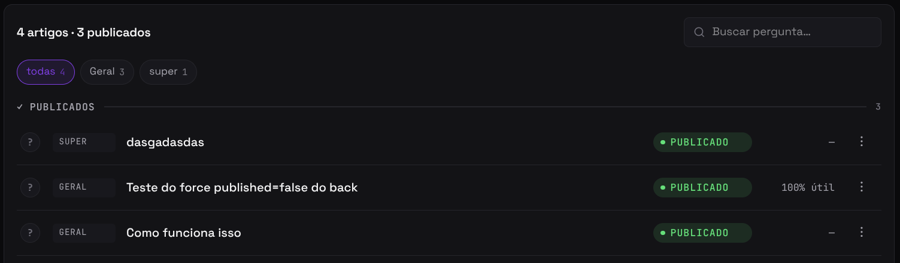
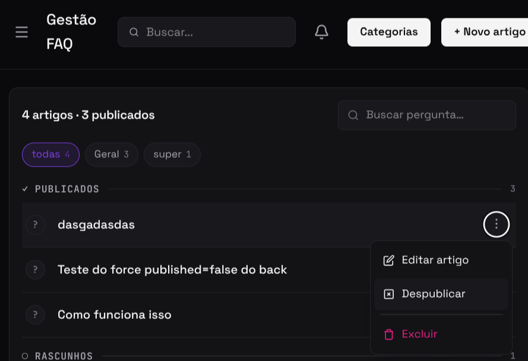

import Tabs from '@theme/Tabs';
import TabItem from '@theme/TabItem';

# F17 — Controlar publicação de artigos FAQ

IT1 · Rastreabilidade: [F17](/backlog/requisitos#f17) · [CP6](/visao/solucao#cp6) · [OE2](/visao/solucao#oe2)

**Issue da Feature (GitHub):** [#60 — abrir no GitHub](https://github.com/mdsreq-fga-unb/REQ-2026.1-T02-Crianex-/issues/60)

:::note[Acesso para avaliação]
Esta funcionalidade exige **login de administrador**. Credenciais para o professor: **e-mail** `a definir` · **senha** `a definir`.
:::

## Requisitos (evidências)

Selecione um requisito na navegação abaixo. Cada um traz seus critérios de aceite, regras de negócio e um espaço para o **screenshot da funcionalidade em funcionamento** (substitua a imagem de placeholder pela captura real).

<Tabs queryString="tab">
<TabItem value="rf32" label="RF32">

#### RF32 — Publicar artigo de FAQ

**Critérios de aceite (BDD)**

- **Dado** admin autenticado, **quando** publicar artigo, **então** `published = true` + visível na próxima requisição da vitrine sem reload.
- **Dado** falha na requisição de publicação, **quando** não confirma, **então** o estado é revertido na UI.

**Regras de negócio:** [RN02](/backlog/requisitos#rns) — Visibilidade de artigos FAQ — `published = false` não aparece; despublicação não exclui

**Evidência (screenshot):**

**Deploy:** _link a definir_

</TabItem>
<TabItem value="rf33" label="RF33">

#### RF33 — Despublicar artigo de FAQ

**Critérios de aceite (BDD)**

- **Dado** admin autenticado, **quando** despublicar artigo, **então** ele some da vitrine com o conteúdo preservado no banco.
- **Dado** falha na requisição, **quando** a despublicação não confirma, **então** o estado é revertido na UI.

**Regras de negócio:** [RN02](/backlog/requisitos#rns) — Visibilidade de artigos FAQ — `published = false` não aparece; despublicação não exclui

**Evidência (screenshot):**

**Deploy:** _link a definir_

</TabItem>
<TabItem value="rnf01" label="RNF01">

#### RNF01 — Isolamento de acesso administrativo

**Classificação:** Segurança da Informação  
**Descrição:** Área administrativa em endpoint distinto, acessível apenas mediante autenticação.

**Evidência (screenshot):**

**Verificação:** [Resultados V&V da IT1](/iteracoes/iteracao-1/vv)

</TabItem>
<TabItem value="rnf04" label="RNF04">

#### RNF04 — Renderização server-side da vitrine

**Classificação:** Eficiência  
**Descrição:** Páginas públicas renderizadas via SSR para indexação completa.

**Evidência (screenshot):**

**Verificação:** [Resultados V&V da IT1](/iteracoes/iteracao-1/vv)

</TabItem>
<TabItem value="dor" label="DoR">

## Definition of Ready — Evidências

Checklist do DoR aplicado à F17 antes de entrar em execução. Todos os itens foram atendidos conforme o critério definido em [DoR e DoD](/visao/dor-dod).

| Critério DoR | Status | Evidência |
| ------------ | ------ | --------- |
| Título no padrão FDD `<ação> <resultado> <de/para/no/com> <objeto>` | ✅ | [Issue #60](https://github.com/mdsreq-fga-unb/REQ-2026.1-T02-Crianex-/issues/60) — título conforme o padrão |
| Critérios de aceite escritos e verificáveis (Given/When/Then) | ✅ | Ver abas RF/RNF desta página — todos os cenários BDD documentados |
| Estimativa registrada: VB, CX e IP calculados | ✅ | [Priorização do Backlog](/backlog/priorizacao) — coluna IP da tabela de features |
| Dependências identificadas; bloqueantes resolvidos | ✅ | [Mapa de Dependências — IT1](/backlog/dependencias#it1) — bloqueantes verificados antes do início |
| Class Owner designado e linkada à Feature parent e à CP de origem | ✅ | [Issue #60](https://github.com/mdsreq-fga-unb/REQ-2026.1-T02-Crianex-/issues/60) — assignees e labels de CP/Feature registrados |
| Protótipo revisado pelo cliente | ✅ | [Protótipo de Alta Fidelidade — IT1](/iteracoes/iteracao-1/evidencias/prototipo) |
| Technical Design Review (TDR) concluída | ✅ | [Design Técnico IT1](/iteracoes/iteracao-1/evidencias/design-tecnico) — diagramas leves e feature cards elaborados |
| Ao menos um critério de segurança ou usabilidade identificado | ✅ | Ver aba RNF desta página |

</TabItem>
<TabItem value="dod" label="DoD">

## Definition of Done — Evidências

Checklist do DoD verificado ao encerrar a F17. Todos os itens foram atendidos antes de mover a issue para Done no Kanban.

| Critério DoD | Status | Evidência |
| ------------ | ------ | --------- |
| Critérios de aceite validados (BDD cobertos) | ✅ | Ver abas RF/RNF desta página — screenshots e cenários verificados |
| Testes automatizados passando (unitários + integração) | ✅ | [Resultados V&V IT1](/iteracoes/iteracao-1/vv) |
| Lint sem erros e formatação OK (ESLint + Prettier) | ✅ | [Resultados V&V IT1](/iteracoes/iteracao-1/vv) |
| CI verde (build + testes + lint) | ✅ | [Resultados V&V IT1](/iteracoes/iteracao-1/vv) |
| PR aprovado por Chief Programmer ou Project Manager | ✅ | [Issue #60](https://github.com/mdsreq-fga-unb/REQ-2026.1-T02-Crianex-/issues/60) — PR de resolução com approve registrado |
| Migration de banco | — | Não aplicável para esta feature |
| Sem vulnerabilidades críticas (SAST/linting de segurança) | ✅ | [Resultados V&V IT1](/iteracoes/iteracao-1/vv) |
| Validação parcial do cliente registrada | ✅ | [Validação Parcial IT1](/iteracoes/iteracao-1/validacao/partial) |
| Validação Formal aprovada pelo cliente | ✅ | [Validação Formal IT1](/iteracoes/iteracao-1/validacao/formal) |
| Rastreabilidade atualizada | ✅ | [Tabela de Requisitos](/backlog/requisitos) — RF/RNF vinculados |
| Issue movida para Done no GitHub Projects | ✅ | [Issue #60](https://github.com/mdsreq-fga-unb/REQ-2026.1-T02-Crianex-/issues/60) — fechada via merge do PR (`closes #N`) |

</TabItem>
</Tabs>
