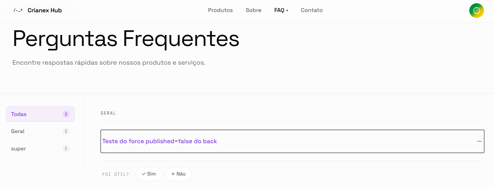

import Tabs from '@theme/Tabs';
import TabItem from '@theme/TabItem';

# F18 — Melhorar correspondência FAQ e dúvidas dos leads

IT1 · Rastreabilidade: [F18](/backlog/requisitos#f18) · [CP6](/visao/solucao#cp6) · [OE2](/visao/solucao#oe2)

**Issue da Feature (GitHub):** [#62 — abrir no GitHub](https://github.com/mdsreq-fga-unb/REQ-2026.1-T02-Crianex-/issues/62)

## Requisitos (evidências)

Selecione um requisito na navegação abaixo. Cada um traz seus critérios de aceite, regras de negócio e um espaço para o **screenshot da funcionalidade em funcionamento** (substitua a imagem de placeholder pela captura real).

<Tabs queryString="tab">
<TabItem value="rf34" label="RF34">

#### RF34 — Avaliar artigo de FAQ

**Critérios de aceite (BDD)**

- **Dado** visitante clica "Útil"/"Não Útil", **quando** a avaliação é submetida, **então** é persistida anonimamente + feedback em ≤ 2s.
- **Dado** `session_hash` já existe para o artigo, **quando** o backend recebe a avaliação, **então** retorna 409 sem duplicata.
- **Dado** visitante não autenticado, **quando** avaliar, **então** a avaliação é aceita sem exigir login.

**Regras de negócio:** [RN07](/backlog/requisitos#rns) — Avaliação anônima de artigo FAQ

**Evidência (screenshot):**

**Deploy:** _link a definir_

</TabItem>
<TabItem value="rf52" label="RF52">

#### RF52 — Filtrar artigos FAQ

**Critérios de aceite (BDD)**

- **Dado** visitante na FAQ, **quando** filtrar artigos, **então** a lista é refinada conforme o critério de busca.
- **Dado** filtro sem correspondências, **quando** aplicado, **então** um estado vazio amigável é exibido.
- **Dado** filtro aplicado, **quando** limpo, **então** a lista completa é restaurada.

**Regras de negócio:** —

**Evidência (screenshot):**

**Deploy:** _link a definir_

</TabItem>
<TabItem value="rnf02" label="RNF02">

#### RNF02 — Tempo de resposta da vitrine

**Classificação:** Eficiência  
**Descrição:** Carregamento das páginas públicas em ≤ 2s em 95% das requisições (4G).

**Evidência (screenshot):**

**Verificação:** [Resultados V&V da IT1](/iteracoes/iteracao-1/vv)

</TabItem>
<TabItem value="dor" label="DoR">

## Definition of Ready — Evidências

Checklist do DoR aplicado à F18 antes de entrar em execução. Todos os itens foram atendidos conforme o critério definido em [DoR e DoD](/visao/dor-dod).

| Critério DoR | Status | Evidência |
| ------------ | ------ | --------- |
| Título no padrão FDD `<ação> <resultado> <de/para/no/com> <objeto>` | ✅ | [Issue #62](https://github.com/mdsreq-fga-unb/REQ-2026.1-T02-Crianex-/issues/62) — título conforme o padrão |
| Critérios de aceite escritos e verificáveis (Given/When/Then) | ✅ | Ver abas RF/RNF desta página — todos os cenários BDD documentados |
| Estimativa registrada: VB, CX e IP calculados | ✅ | [Priorização do Backlog](/backlog/priorizacao) — coluna IP da tabela de features |
| Dependências identificadas; bloqueantes resolvidos | ✅ | [Mapa de Dependências — IT1](/backlog/dependencias#it1) — bloqueantes verificados antes do início |
| Class Owner designado e linkada à Feature parent e à CP de origem | ✅ | [Issue #62](https://github.com/mdsreq-fga-unb/REQ-2026.1-T02-Crianex-/issues/62) — assignees e labels de CP/Feature registrados |
| Protótipo revisado pelo cliente | ✅ | [Protótipo de Alta Fidelidade — IT1](/iteracoes/iteracao-1/evidencias/prototipo) |
| Technical Design Review (TDR) concluída | ✅ | [Design Técnico IT1](/iteracoes/iteracao-1/evidencias/design-tecnico) — diagramas leves e feature cards elaborados |
| Ao menos um critério de segurança ou usabilidade identificado | ✅ | Ver aba RNF desta página |

</TabItem>
<TabItem value="dod" label="DoD">

## Definition of Done — Evidências

Checklist do DoD verificado ao encerrar a F18. Todos os itens foram atendidos antes de mover a issue para Done no Kanban.

| Critério DoD | Status | Evidência |
| ------------ | ------ | --------- |
| Critérios de aceite validados (BDD cobertos) | ✅ | Ver abas RF/RNF desta página — screenshots e cenários verificados |
| Testes automatizados passando (unitários + integração) | ✅ | [Resultados V&V IT1](/iteracoes/iteracao-1/vv) |
| Lint sem erros e formatação OK (ESLint + Prettier) | ✅ | [Resultados V&V IT1](/iteracoes/iteracao-1/vv) |
| CI verde (build + testes + lint) | ✅ | [Resultados V&V IT1](/iteracoes/iteracao-1/vv) |
| PR aprovado por Chief Programmer ou Project Manager | ✅ | [Issue #62](https://github.com/mdsreq-fga-unb/REQ-2026.1-T02-Crianex-/issues/62) — PR de resolução com approve registrado |
| Migration de banco aplicada | ✅ | Migrations aplicadas e testadas via `supabase db reset` sem erros |
| Sem vulnerabilidades críticas (SAST/linting de segurança) | ✅ | [Resultados V&V IT1](/iteracoes/iteracao-1/vv) |
| Validação parcial do cliente registrada | ✅ | [Validação Parcial IT1](/iteracoes/iteracao-1/validacao/partial) |
| Validação Formal aprovada pelo cliente | ✅ | [Validação Formal IT1](/iteracoes/iteracao-1/validacao/formal) |
| Rastreabilidade atualizada | ✅ | [Tabela de Requisitos](/backlog/requisitos) — RF/RNF vinculados |
| Issue movida para Done no GitHub Projects | ✅ | [Issue #62](https://github.com/mdsreq-fga-unb/REQ-2026.1-T02-Crianex-/issues/62) — fechada via merge do PR (`closes #N`) |

</TabItem>
</Tabs>
