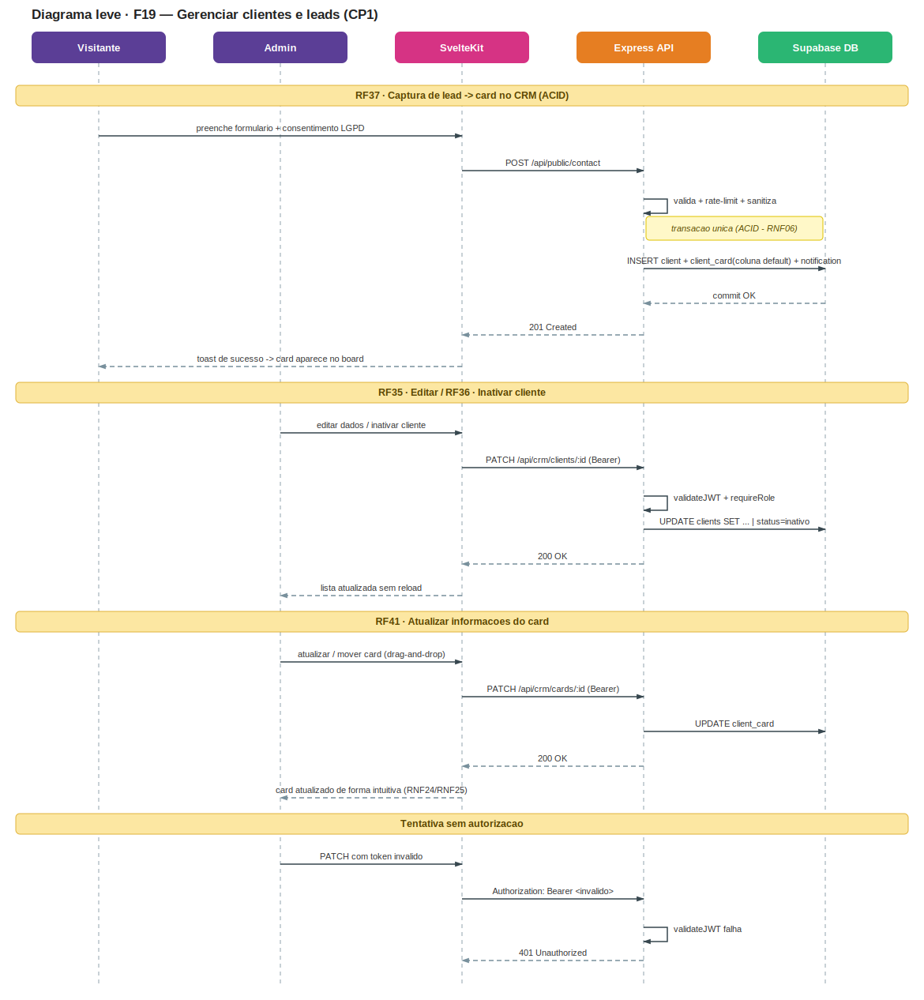
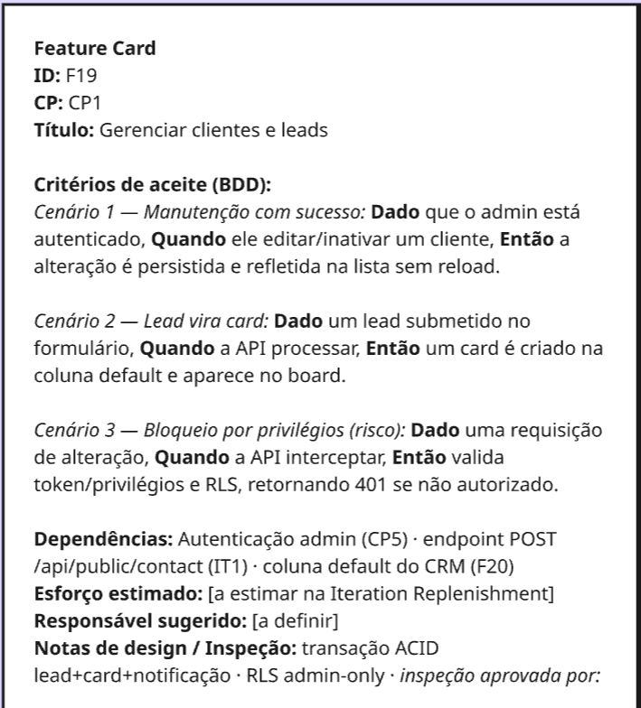
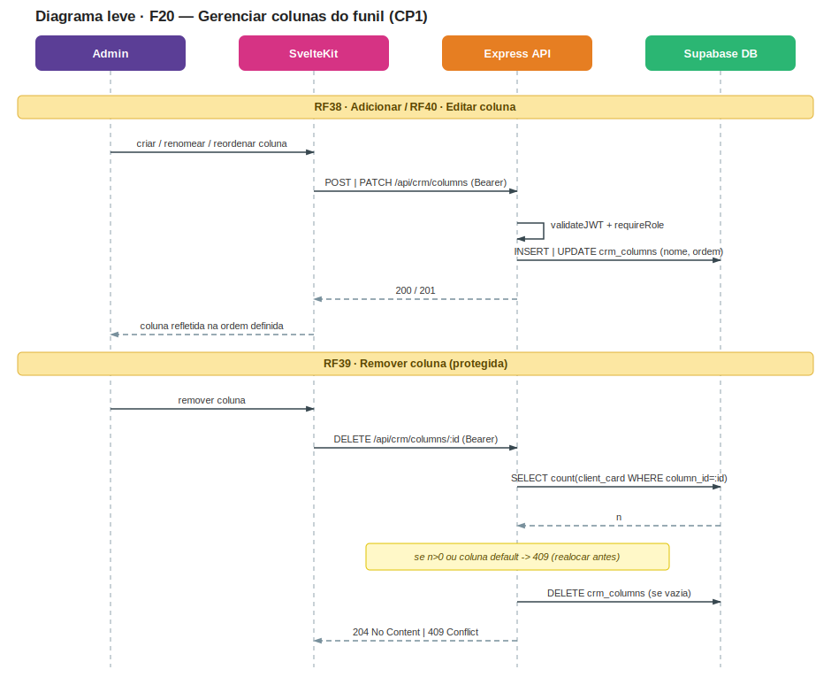
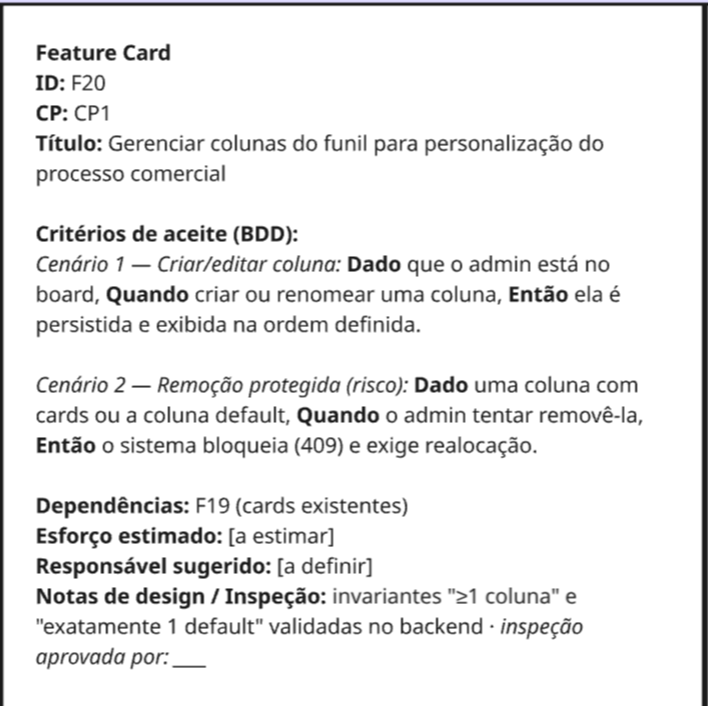
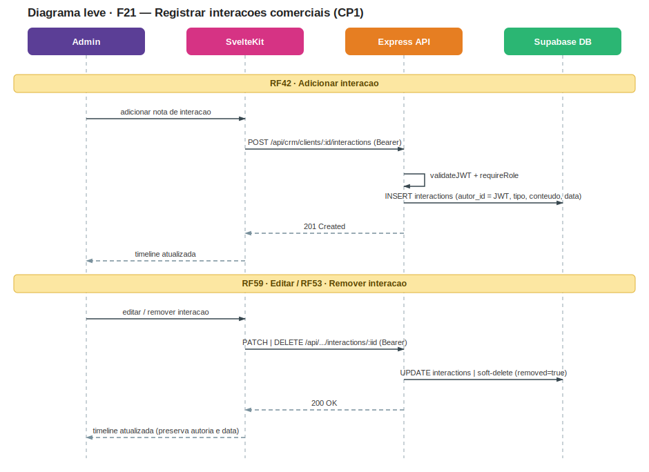
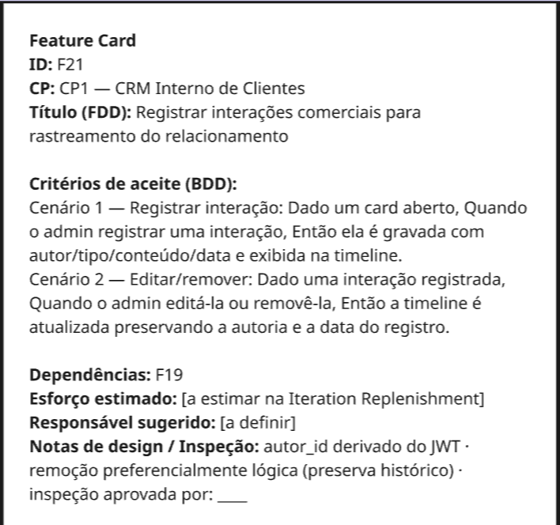
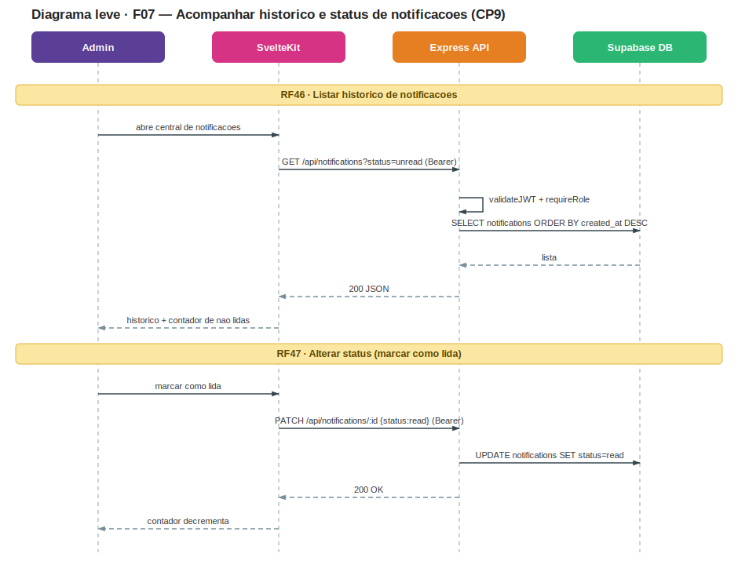
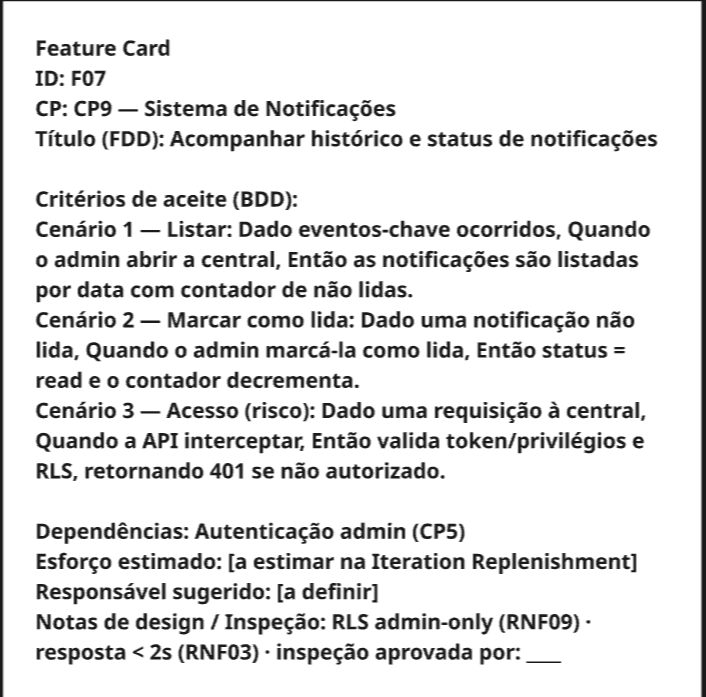
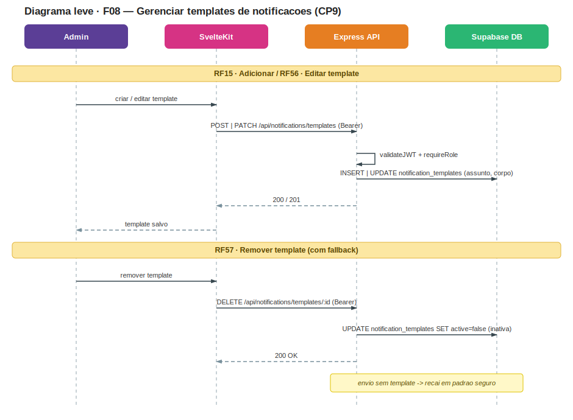
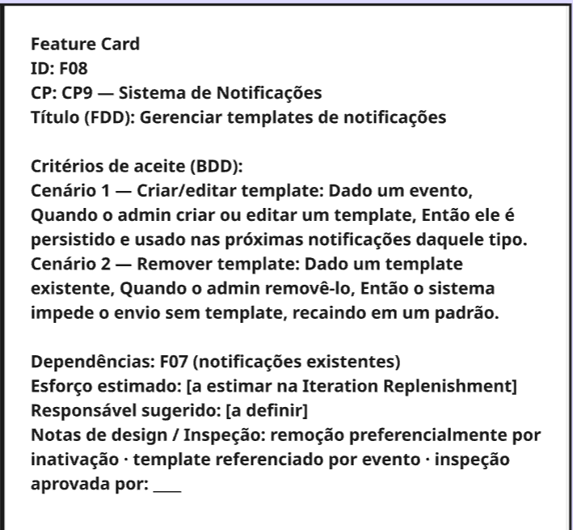

# IT2 — Design Técnico

Artefatos produzidos durante a fase de **Technical Design Review (TDR)** da IT2, aplicando **Formalização Seletiva**: diagramas leves e Feature Cards por feature, para mitigar riscos antes do desenvolvimento.

---

## Mapa de Dependências {#mapa-dependencias}

Artefato do TDR que mapeia o bloqueio lógico entre as features comprometidas na IT2 (CP1 e CP9) — usado para sequenciar o início das issues e verificar o DoR. Versão completa, com legenda, em [Mapa de Dependências — IT2](/backlog/dependencias#it2).

## Diagramas Leves e Feature Cards por Feature

### CP1 — CRM Interno de Clientes

#### F19 — Gerenciar clientes e leads para organização do relacionamento comercial

**Diagrama Leve**

**Feature Card**

---

#### F20 — Gerenciar colunas do funil para personalização do processo comercial

**Diagrama Leve**

**Feature Card**

---

#### F21 — Registrar interações comerciais para rastreamento do relacionamento

**Diagrama Leve**

**Feature Card**

---

### CP9 — Sistema de Notificações no Sistema

#### F07 — Acompanhar histórico e status de notificações

**Diagrama Leve**

**Feature Card**

---

#### F08 — Gerenciar templates de notificações

**Diagrama Leve**

**Feature Card**

---

Histórico de Revisão

| Versão | Data       | Descrição                                        | Autor(es)             |
| ------ | ---------- | ------------------------------------------------ | --------------------- |
| 1.0    | 15/06/2026 | Criação do documento com artefatos do TDR da IT2 | Heitor Macedo Ricardo |
| 1.1    | 29/06/2026 | Adição do Mapa de Dependências da IT2 como artefato do TDR | Equipe Crianex |

