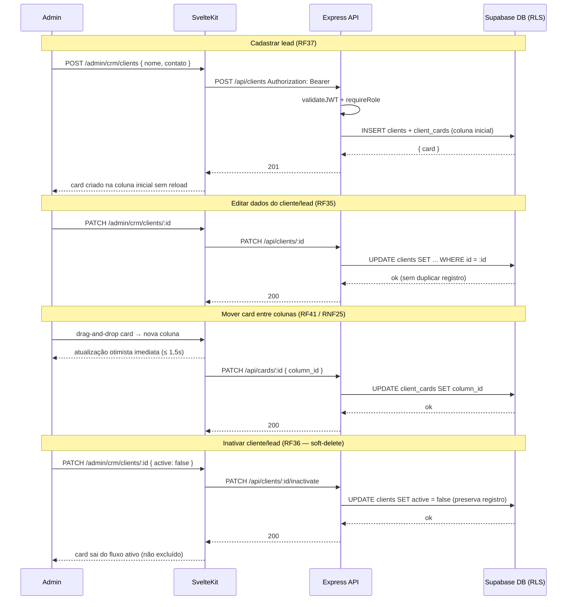
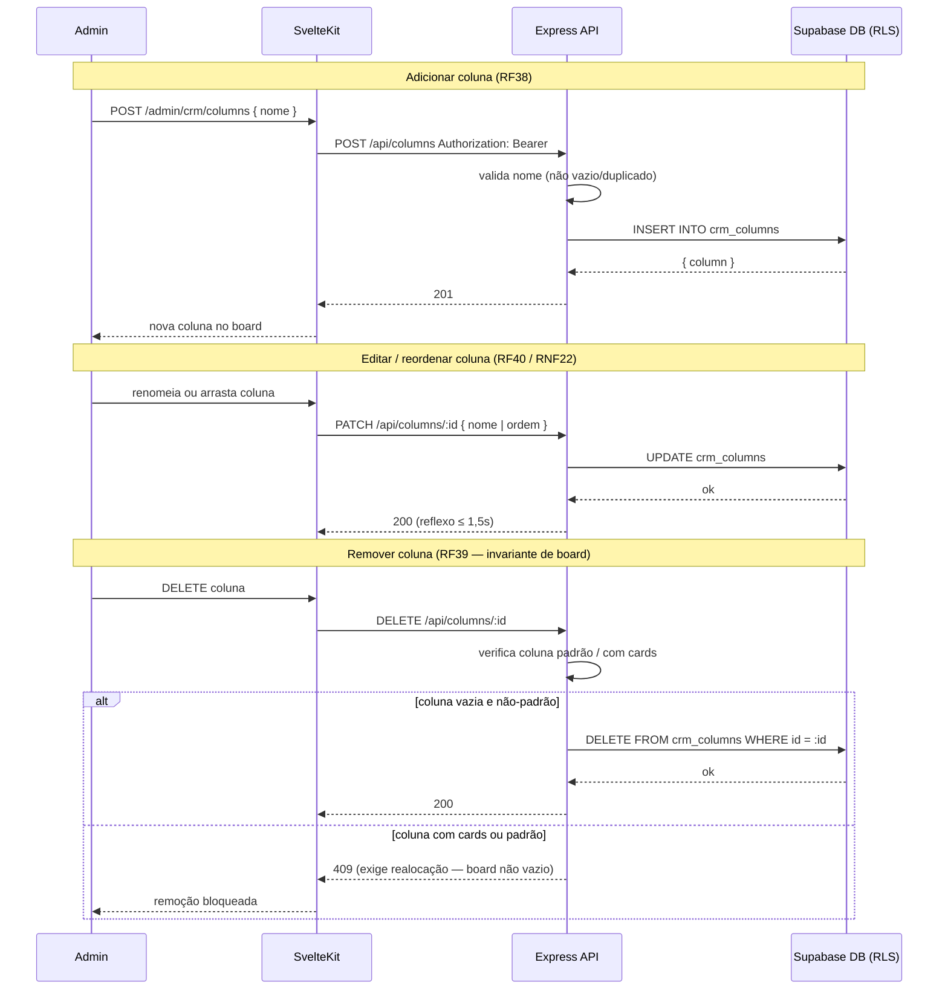
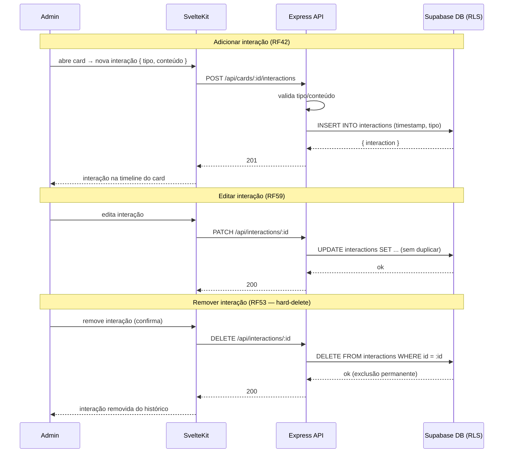
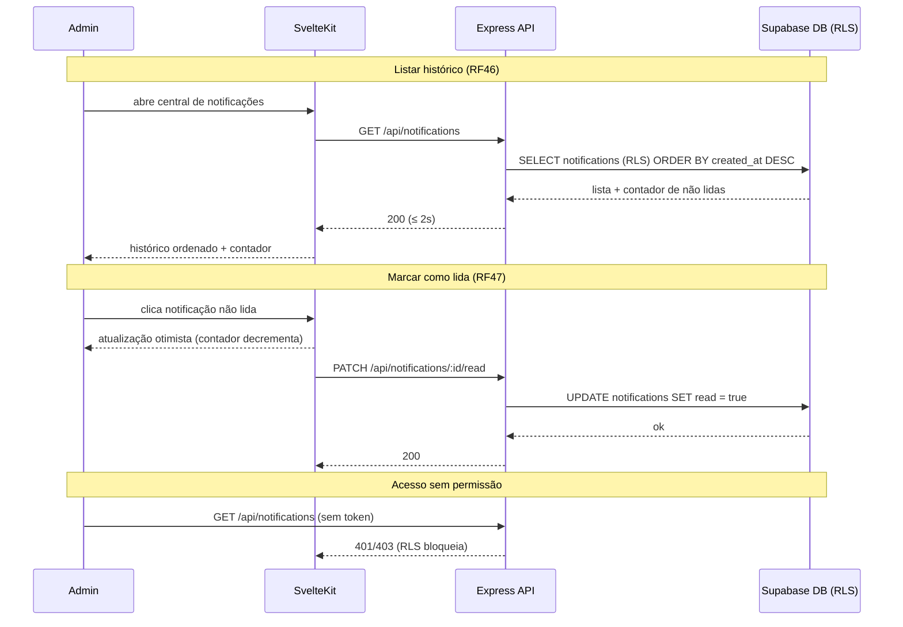
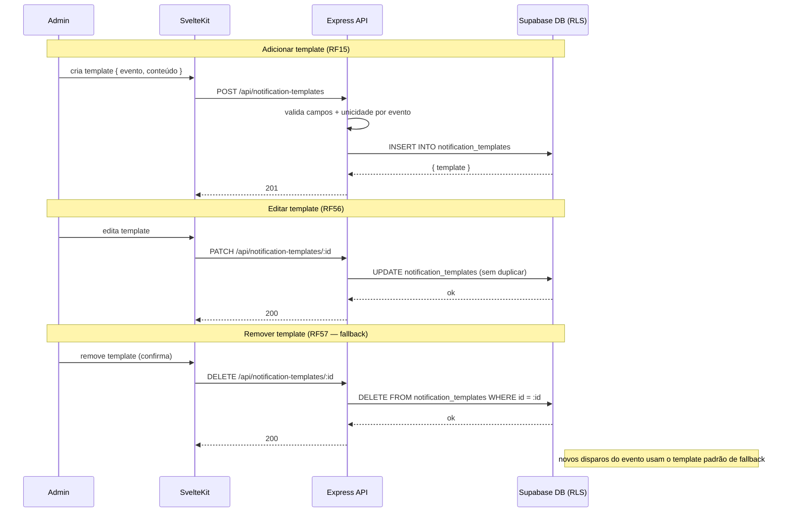

# IT2 — Diagramas de Sequência Formais

Para cada feature da **IT2 — Lead Capture**: o **diagrama de sequência formal** (Mermaid, renderizado na página) e o **feature card** correspondente. Os detalhes completos (critérios de aceite, evidências) ficam na página específica de cada feature.

:::info[Iteração em andamento]
A IT2 está **em andamento** — os diagramas formais refletem o design técnico acordado na Technical Design Review; o status de cada critério é acompanhado na página de cada feature.
:::

---

## CP1 — CRM Interno de Clientes

<strong>F19 — Gerenciar clientes e leads no CRM</strong>

Diagrama de Sequência Formal

Feature Card

**RFs:** RF35, RF36, RF37, RF41 · **Detalhes:** [F19](/iteracoes/iteracao-2/features/f19)

<strong>F20 — Gerenciar colunas do funil</strong>

Diagrama de Sequência Formal

Feature Card

**RFs:** RF38, RF39, RF40 · **Detalhes:** [F20](/iteracoes/iteracao-2/features/f20)

<strong>F21 — Registrar interações comerciais</strong>

Diagrama de Sequência Formal

Feature Card

**RFs:** RF42, RF53, RF59 · **Detalhes:** [F21](/iteracoes/iteracao-2/features/f21)

---

## CP9 — Sistema de Notificações no Sistema

<strong>F07 — Acompanhar histórico e status de notificações</strong>

Diagrama de Sequência Formal

Feature Card

**RFs:** RF46, RF47 · **Detalhes:** [F07](/iteracoes/iteracao-2/features/f07)

<strong>F08 — Gerenciar templates de notificações</strong>

Diagrama de Sequência Formal

Feature Card

**RFs:** RF15, RF56, RF57 · **Detalhes:** [F08](/iteracoes/iteracao-2/features/f08)

---
