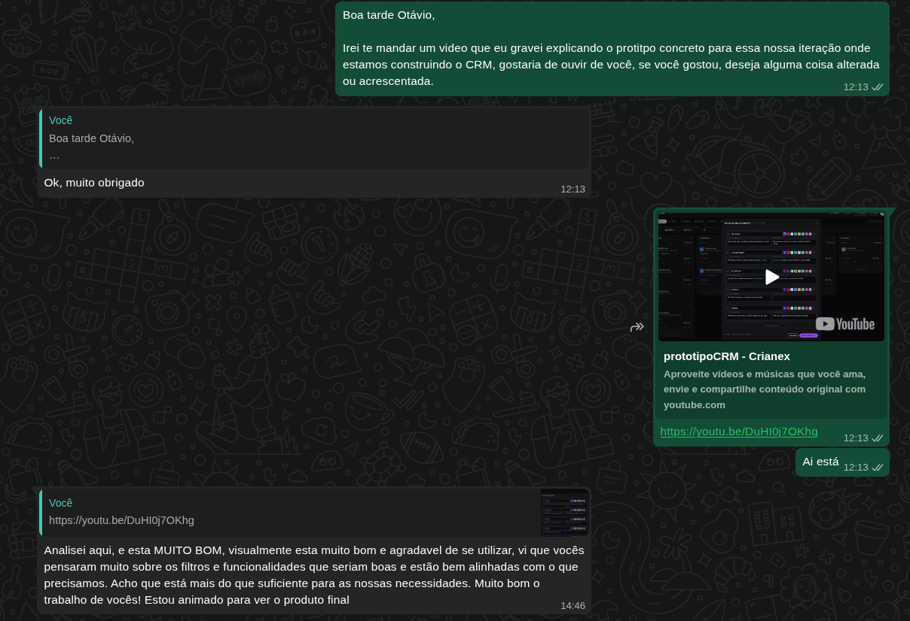

import ProtoEmbed from '@site/src/components/ProtoEmbed';

# IT2 — Protótipo do CRM Interno (CP1)

Protótipo de alta fidelidade do CRM interno (pipeline de leads em Kanban) desenvolvido em HTML, produzido para validar o fluxo com o cliente antes da codificação.

## Vídeo de Apresentação ao Cliente

  <iframe
    width="100%"
    height="450"
    src="https://www.youtube.com/embed/DuHI0j7OKhg"
    title="Apresentação do protótipo CRM Crianex ao cliente"
    style={{border: '1px solid var(--crianex-border)', borderRadius: '8px', display: 'block'}}
    frameBorder="0"
    allow="accelerometer; autoplay; clipboard-write; encrypted-media; gyroscope; picture-in-picture; web-share"
    allowFullScreen>
  </iframe>

## Protótipo Interativo

<ProtoEmbed path="proto/iteracao-2/PrototipoCrianexCRM/" height={620} label="Abrir protótipo CRM em tela cheia" />

## Feedback do Cliente

> "Analisei aqui, e está MUITO BOM, visualmente está muito bom e agradável de se utilizar, vi que vocês pensaram muito sobre os filtros e funcionalidades que seriam boas e estão bem alinhadas com o que precisamos. Acho que está mais do que suficiente para as nossas necessidades. Muito bom o trabalho de vocês! Estou animado para ver o produto final" — Otávio, 01/07/2026

:::info[Feedback exclusivamente positivo — nada a resolver]
O cliente aprovou o protótipo sem nenhuma ressalva ou pedido de ajuste. Não há itens pendentes de correção ou alteração decorrentes desta rodada de feedback.
:::
