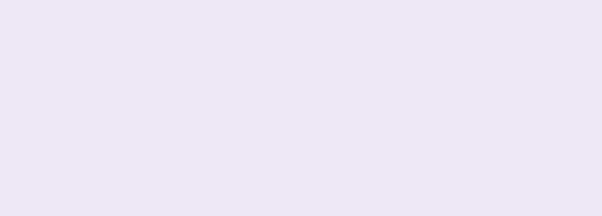
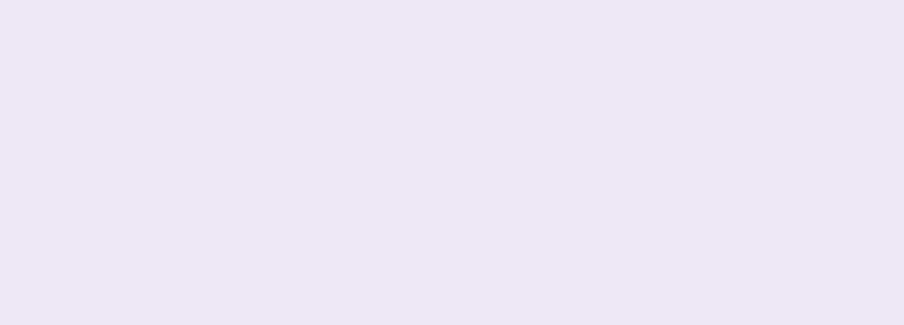

import Tabs from '@theme/Tabs';
import TabItem from '@theme/TabItem';

# F07 — Acompanhar histórico e status de notificações

IT2 · Rastreabilidade: [F07](/backlog/requisitos#f07) · [CP9](/visao/solucao#cp9) · [OE3](/visao/solucao#oe3)

**Issue da Feature (GitHub):** [#179 — abrir no GitHub](https://github.com/mdsreq-fga-unb/REQ-2026.1-T02-Crianex-/issues/179)

:::note[Acesso para avaliação]
Esta funcionalidade exige **login de administrador**. Credenciais para o professor: **e-mail** `a definir` · **senha** `a definir`.
:::

## Requisitos (evidências)

Selecione um requisito na navegação abaixo. Cada um traz seus critérios de aceite, regras de negócio e um espaço para o **screenshot da funcionalidade em funcionamento** (substitua a imagem de placeholder pela captura real).

<Tabs>
<TabItem value="rf46" label="RF46">

#### RF46 — Listar histórico de notificações

**Critérios de aceite (BDD)**

- **Dado** admin autenticado, **quando** acessar o painel de notificações, **então** o histórico é exibido ordenado por data/hora (mais recentes primeiro) com o status (lida/não lida) de cada notificação.
- **Dado** notificações não lidas, **quando** a central carrega, **então** um contador de não lidas é exibido refletindo exatamente a quantidade real.
- **Dado** nenhuma notificação registrada, **quando** a central carrega, **então** um estado vazio amigável é exibido sem erro.
- **Dado** requisição sem sessão válida ou sem privilégio, **quando** GET da listagem, **então** a API retorna 401/403 via RLS sem expor dados.
- **Dado** o volume de notificações, **quando** a central carrega, **então** a listagem responde em ≤ 2s em 95% das requisições.

**Regras de negócio:** [RN13](/backlog/requisitos#rns) — Geração automática de notificações por eventos-chave (nunca criadas manualmente)

**Evidência (screenshot):**

**Deploy:** _link a definir_

</TabItem>
<TabItem value="rf47" label="RF47">

#### RF47 — Alterar status da notificação

**Critérios de aceite (BDD)**

- **Dado** notificação não lida, **quando** o admin a marca como lida, **então** o status passa a `read` sem reload e o contador de não lidas decrementa (atualização otimista).
- **Dado** notificação já lida, **quando** a ação é reenviada, **então** permanece `read` sem erro nem alteração indevida (idempotência).
- **Dado** falha de rede/servidor no PATCH, **quando** a atualização não confirma, **então** o estado é revertido na UI e uma mensagem de erro é exibida.
- **Dado** tentativa de alterar notificação de outro perfil, **quando** o PATCH chega à API, **então** o RLS bloqueia com 403.

**Regras de negócio:** —

**Evidência (screenshot):**

**Deploy:** _link a definir_

</TabItem>
<TabItem value="rnf03" label="RNF03">

#### RNF03 — Tempo de resposta da área administrativa

**Classificação:** Eficiência  
**Descrição:** Operações de leitura no painel em ≤ 2s em 95% das requisições.

**Evidência (screenshot):**

**Verificação:** [Resultados V&V da IT2](/iteracoes/iteracao-2/vv)

</TabItem>
<TabItem value="rnf09" label="RNF09">

#### RNF09 — Controle de acesso por linha (RLS)

**Classificação:** Segurança da Informação  
**Descrição:** Row Level Security restringindo leitura ao perfil autorizado.

**Evidência (screenshot):**

**Verificação:** [Resultados V&V da IT2](/iteracoes/iteracao-2/vv)

</TabItem>
</Tabs>
