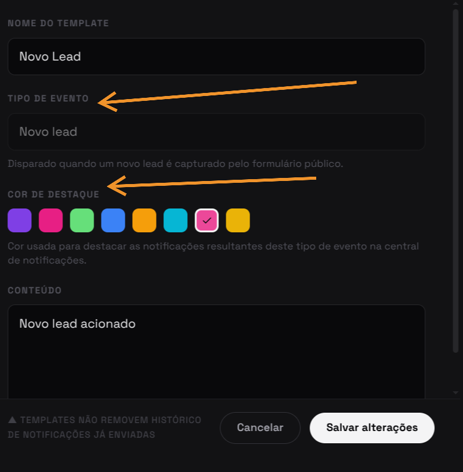

import Tabs from '@theme/Tabs';
import TabItem from '@theme/TabItem';
import AccessCredentials from '@site/src/components/AccessCredentials';

# F08 — Gerenciar templates de notificações

IT2 Concluída · Rastreabilidade: [F08](/backlog/requisitos#f08) · [CP9](/visao/solucao#cp9) · [OE3](/visao/solucao#oe3)

**Issue da Feature (GitHub):** [#180 — abrir no GitHub](https://github.com/mdsreq-fga-unb/REQ-2026.1-T02-Crianex-/issues/180)

**Protótipo:** [Protótipo V2 (IT1)](/iteracoes/iteracao-1/evidencias/prototipo) — está na seção de notificações do protótipo geral do painel administrativo.

**Deploy:** _link a definir_

:::note[Acesso para avaliação]
Esta funcionalidade exige **login de administrador**.

<AccessCredentials email="owner@crianex.com" password="Crianex@Owner1" />
:::

:::info[Refinamento pós-implementação]
RF63 foi adicionado após a entrega inicial (seleção de tipo por catálogo fixo + cor personalizável por template). O AC de RF15 também foi revisado: o bloqueio de duplicidade por tipo de evento (409) foi substituído por ativação automática com substituição do template anterior. Detalhamento completo em [Resultados V&V da IT2 — MR.03/MR.04](/iteracoes/iteracao-2/vv#mr03).
:::

## Requisitos (evidências)

Selecione um requisito na navegação abaixo. Cada um traz seus critérios de aceite, regras de negócio e um espaço para o **screenshot da funcionalidade em funcionamento** (substitua a imagem de placeholder pela captura real).

<Tabs>
<TabItem value="rf15" label="RF15">

#### RF15 — Adicionar template de notificações

**Critérios de aceite (BDD)**

- **Dado** admin autenticado com dados válidos, **quando** criar template, **então** é persistido e associado a um tipo de evento.
- **Dado** campos obrigatórios vazios (nome, conteúdo ou evento), **quando** submeter, **então** a validação impede a criação e sinaliza os campos.
- **Dado** tipo de evento que já possui um template ativo, **quando** criar outro template para o mesmo evento, **então** o template anterior é desativado automaticamente e o novo passa a ser o único ativo para aquele tipo (ativação automática por substituição, sem exigir remoção manual prévia). Critério revisado
- **Dado** requisição sem permissão, **quando** POST do template, **então** o RLS bloqueia com 403.

**Regras de negócio:** [RN14](/backlog/requisitos#rns) — Template de notificação por evento, com fallback para o template padrão · [RN25](/backlog/requisitos#rns) — Ativação exclusiva de template por tipo de evento

**Evidência (screenshot):**

**Deploy:** _link a definir_

</TabItem>
<TabItem value="rf56" label="RF56">

#### RF56 — Editar template de notificações

**Critérios de aceite (BDD)**

- **Dado** template existente, **quando** editar, **então** os dados são atualizados sem duplicar o registro.
- **Dado** campos inválidos na edição, **quando** submeter, **então** a validação impede e a versão anterior é mantida.
- **Dado** template inexistente ou removido, **quando** editar, **então** retorna 404 sem efeito.
- **Dado** requisição sem permissão, **quando** PATCH do template, **então** o RLS bloqueia com 403.

**Regras de negócio:** [RN14](/backlog/requisitos#rns) — Template de notificação por evento, com fallback para o template padrão

**Evidência (screenshot):**

**Deploy:** _link a definir_

</TabItem>
<TabItem value="rf57" label="RF57">

#### RF57 — Remover template de notificações

**Critérios de aceite (BDD)**

- **Dado** template existente, **quando** remover, **então** é excluído e não é mais usado em novos disparos.
- **Dado** remoção, **quando** acionada, **então** exige confirmação explícita antes de excluir.
- **Dado** template vinculado a evento ativo, **quando** removido, **então** novos disparos caem para o template de fallback padrão sem quebrar o envio.
- **Dado** template já removido, **quando** remover novamente, **então** retorna 404 de forma idempotente.
- **Dado** requisição sem permissão, **quando** DELETE do template, **então** o RLS bloqueia com 403.

**Regras de negócio:** [RN14](/backlog/requisitos#rns) — Template de notificação por evento, com fallback para o template padrão

**Evidência (screenshot):**

**Deploy:** _link a definir_

</TabItem>
<TabItem value="rf63" label="RF63">

#### RF63 — Personalizar cor e tipo de template de notificação

Novo — refinamento pós-implementação

**Critérios de aceite (BDD)**

- **Dado** o formulário de criação/edição de template, **quando** o admin abre o campo "tipo de evento", **então** as opções são carregadas de um catálogo fixo de tipos, não um campo de texto livre.
- **Dado** um tipo de evento do catálogo ainda não implementado no sistema, **quando** exibido no seletor, **então** aparece desabilitado/acinzentado e não pode ser selecionado.
- **Dado** o formulário de template, **quando** o admin escolhe uma cor na paleta, **então** a cor é persistida e usada para destacar as notificações resultantes daquele tipo de evento na central de notificações.
- **Dado** nenhuma cor selecionada explicitamente, **quando** o template é salvo, **então** a cor sugerida do catálogo para aquele tipo é aplicada como padrão.

**Regras de negócio:** [RN25](/backlog/requisitos#rns) — Ativação exclusiva de template por tipo de evento · [RN26](/backlog/requisitos#rns) — Catálogo fixo de tipos de notificação

**Evidência (screenshot):**

**Deploy:** _link a definir_

</TabItem>
<TabItem value="rnf03" label="RNF03">

#### RNF03 — Tempo de resposta da área administrativa

**Classificação:** Eficiência  
**Descrição:** Operações de leitura no painel em ≤ 2s em 95% das requisições.

**Evidência (screenshot):**

**Verificação:** [Resultados V&V da IT2](/iteracoes/iteracao-2/vv)

</TabItem>
<TabItem value="rnf09" label="RNF09">

#### RNF09 — Controle de acesso por linha (RLS)

**Classificação:** Segurança da Informação  
**Descrição:** Row Level Security restringindo leitura ao perfil autorizado.

**Evidência (screenshot):**

**Verificação:** [Resultados V&V da IT2](/iteracoes/iteracao-2/vv)

</TabItem>
</Tabs>
