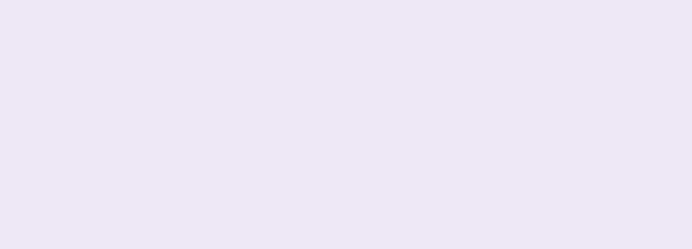
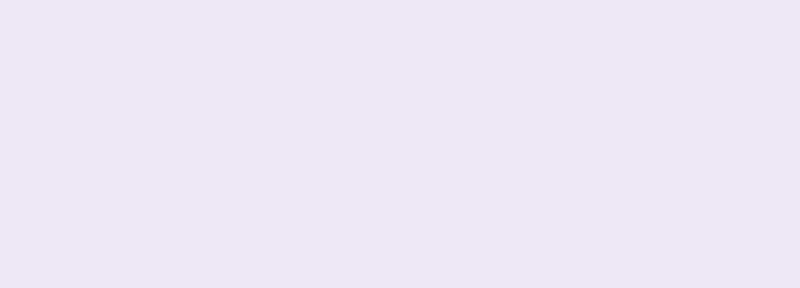
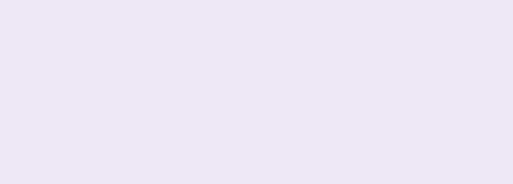

import Tabs from '@theme/Tabs';
import TabItem from '@theme/TabItem';

# F08 — Gerenciar templates de notificações

IT2 · Rastreabilidade: [F08](/backlog/requisitos#f08) · [CP9](/visao/solucao#cp9) · [OE3](/visao/solucao#oe3)

**Issue da Feature (GitHub):** [abrir no repositório](https://github.com/mdsreq-fga-unb/REQ-2026.1-T02-Crianex-/issues) — _nº a definir_

:::note[Acesso para avaliação]
Esta funcionalidade exige **login de administrador**. Credenciais para o professor: **e-mail** `a definir` · **senha** `a definir`.
:::

## Requisitos (evidências)

Selecione um requisito na navegação abaixo. Cada um traz seus critérios de aceite, regras de negócio e um espaço para o **screenshot da funcionalidade em funcionamento** (substitua a imagem de placeholder pela captura real).

<Tabs>
<TabItem value="rf15" label="RF15">

#### RF15 — Adicionar template de notificações

**Critérios de aceite (BDD)**

- **Dado** admin autenticado, **quando** criar template, **então** é persistido e associado a um tipo de evento.

**Regras de negócio:** —

**Evidência (screenshot):**

**Deploy:** _link a definir_

</TabItem>
<TabItem value="rf56" label="RF56">

#### RF56 — Editar template de notificações

**Critérios de aceite (BDD)**

- **Dado** template existente, **quando** editar, **então** os dados são atualizados sem duplicata.

**Regras de negócio:** —

**Evidência (screenshot):**

**Deploy:** _link a definir_

</TabItem>
<TabItem value="rf57" label="RF57">

#### RF57 — Remover template de notificações

**Critérios de aceite (BDD)**

- **Dado** template existente, **quando** remover, **então** é excluído e não é mais usado em novos disparos.

**Regras de negócio:** —

**Evidência (screenshot):**

**Deploy:** _link a definir_

</TabItem>
<TabItem value="rnf03" label="RNF03">

#### RNF03 — Tempo de resposta da área administrativa

**Classificação:** Eficiência  
**Descrição:** Operações de leitura no painel em ≤ 2s em 95% das requisições.

**Evidência (screenshot):**

**Verificação:** [Resultados V&V da IT2](/iteracoes/iteracao-2/vv)

</TabItem>
<TabItem value="rnf09" label="RNF09">

#### RNF09 — Controle de acesso por linha (RLS)

**Classificação:** Segurança da Informação  
**Descrição:** Row Level Security restringindo leitura ao perfil autorizado.

**Evidência (screenshot):**

**Verificação:** [Resultados V&V da IT2](/iteracoes/iteracao-2/vv)

</TabItem>
</Tabs>
