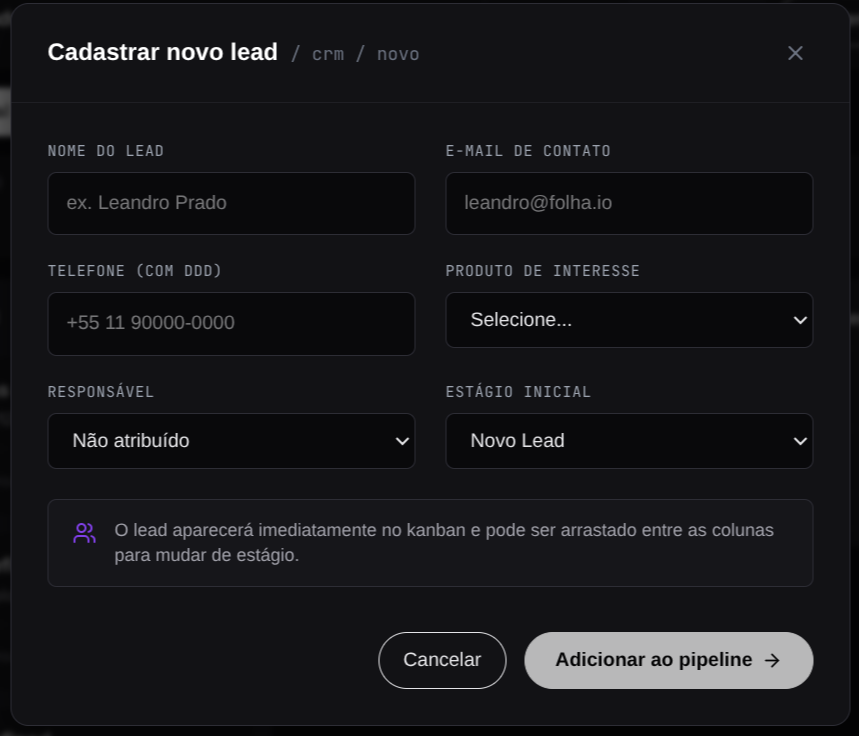
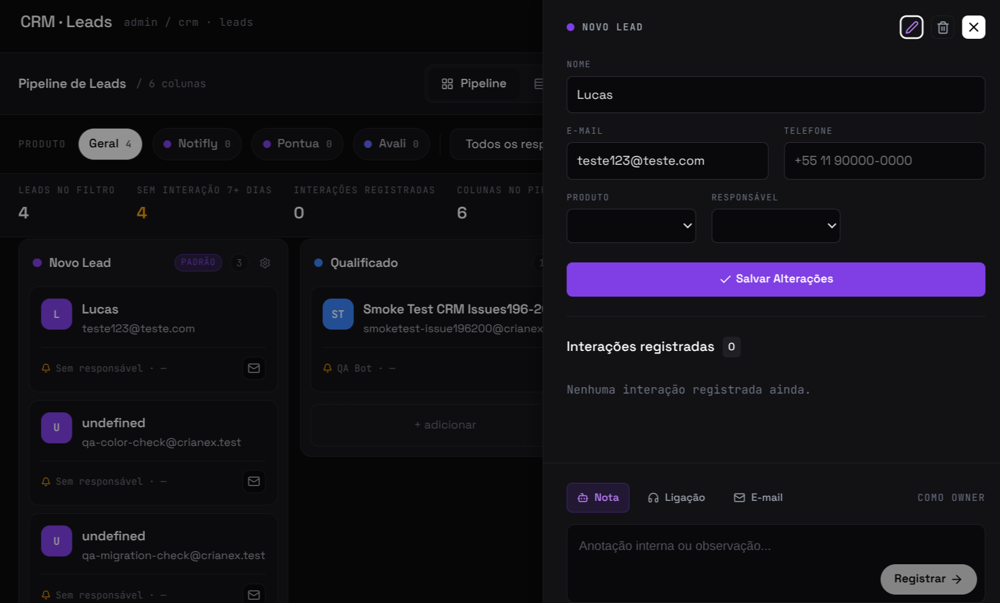
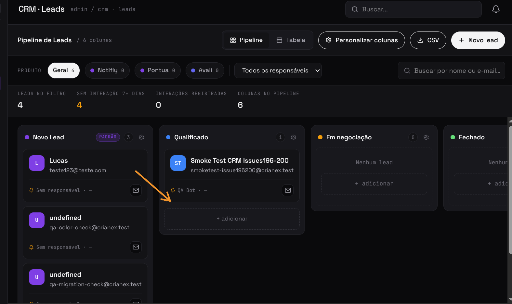
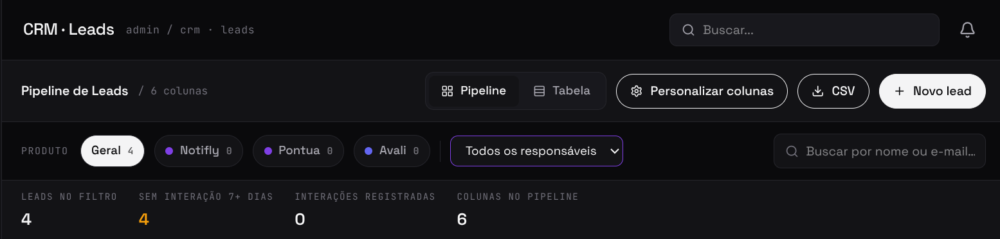
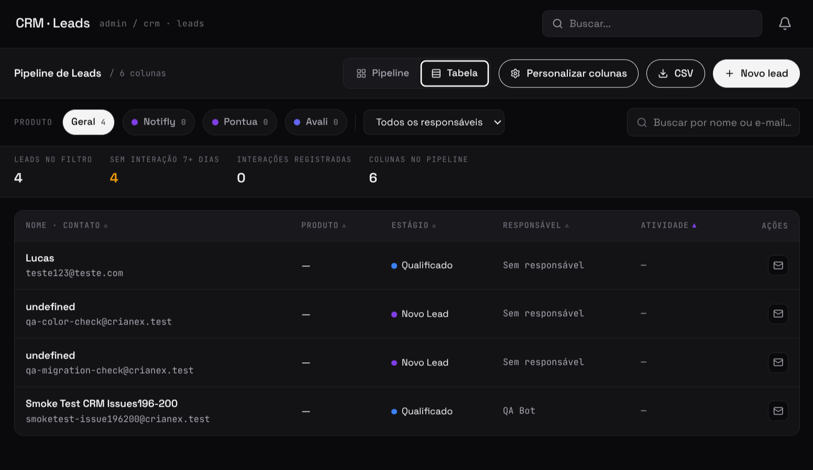
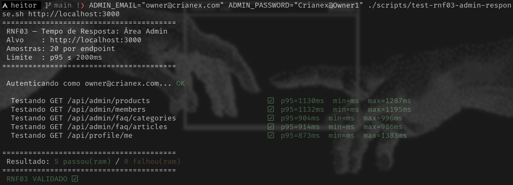

import Tabs from '@theme/Tabs';
import TabItem from '@theme/TabItem';
import AccessCredentials from '@site/src/components/AccessCredentials';

# F19 — Gerenciar clientes e leads no CRM

IT2 Concluída · Rastreabilidade: [F19](/backlog/requisitos#f19) · [CP1](/visao/solucao#cp1) · [OE3](/visao/solucao#oe3)

**Issue da Feature (GitHub):** [#177 — abrir no GitHub](https://github.com/mdsreq-fga-unb/REQ-2026.1-T02-Crianex-/issues/177)

**Protótipo:** [Protótipo CRM (IT2)](/iteracoes/iteracao-2/evidencias/prototipo) — compartilhado entre F19, F20 e F21 (mesmo board Kanban).

**Deploy:** _link a definir_

:::note[Acesso para avaliação]
Esta funcionalidade exige **login de administrador**.

<AccessCredentials email="owner@crianex.com" password="Crianex@Owner1" />
:::

:::info[Refinamento pós-implementação]
RF60, RF61 e RF62 foram adicionados após a entrega inicial, a partir de uma auditoria de rastreabilidade — cobrem busca/filtros, exportação CSV e visualização em tabela/indicadores do funil, capacidades que faltavam além do CRUD básico de leads. Detalhamento completo em [Resultados V&V da IT2 — MR.02](/iteracoes/iteracao-2/vv#mr02).
:::

## Requisitos (evidências)

Selecione um requisito na navegação abaixo. Cada um traz seus critérios de aceite, regras de negócio e um espaço para o **screenshot da funcionalidade em funcionamento** (substitua a imagem de placeholder pela captura real).

<Tabs>
<TabItem value="rf37" label="RF37">

#### RF37 — Cadastrar lead no CRM

**Critérios de aceite (BDD)**

- **Dado** admin autenticado com dados válidos, **quando** cadastrar lead, **então** um card é criado na coluna inicial com os dados persistidos.
- **Dado** campos obrigatórios vazios, **quando** submeter, **então** a validação impede a criação.
- **Dado** requisição sem permissão, **quando** POST do lead, **então** o RLS bloqueia com 403.

**Regras de negócio:** [RN19](/backlog/requisitos#rns) — Entrada do lead no funil (todo lead cadastrado entra na coluna inicial padrão)

**Evidência (screenshot):**

**Deploy:** _link a definir_

</TabItem>
<TabItem value="rf35" label="RF35">

#### RF35 — Editar dados do cliente/lead

**Critérios de aceite (BDD)**

- **Dado** card existente, **quando** editar os dados do cliente/lead, **então** as alterações são persistidas sem duplicar o registro.
- **Dado** campos inválidos, **quando** submeter, **então** a validação impede e mantém os dados anteriores.
- **Dado** cliente/lead inexistente, **quando** editar, **então** retorna 404 sem efeito.

**Regras de negócio:** —

**Evidência (screenshot):**

**Deploy:** _link a definir_

</TabItem>
<TabItem value="rf36" label="RF36">

#### RF36 — Inativar cliente/lead

**Critérios de aceite (BDD)**

- **Dado** cliente/lead ativo, **quando** inativar, **então** o registro passa a `inactive` e sai do fluxo ativo do funil.
- **Dado** cliente/lead inativo, **quando** reativar, **então** volta ao fluxo ativo.

**Regras de negócio:** [RN20](/backlog/requisitos#rns) — Inativação preserva o registro (soft-delete; cliente/lead sai do fluxo ativo mas não é excluído)

**Evidência (screenshot):**

**Deploy:** _link a definir_

</TabItem>
<TabItem value="rf41" label="RF41">

#### RF41 — Atualizar dados operacionais dos cards

**Critérios de aceite (BDD)**

- **Dado** card no CRM, **quando** arrastar para outra coluna (drag-and-drop), **então** o estágio é atualizado em ≤ 1,5s sem reload.
- **Dado** card com dados visíveis, **quando** clicar, **então** os detalhes expandem sem redirecionamento de página.
- **Dado** falha ao persistir o novo estágio, **quando** o drag não confirma, **então** o card retorna à coluna de origem (rollback visual).

**Regras de negócio:** —

**Evidência (screenshot):**

**Deploy:** _link a definir_

</TabItem>
<TabItem value="rf60" label="RF60">

#### RF60 — Filtrar e buscar leads no CRM

Novo — refinamento pós-implementação

**Critérios de aceite (BDD)**

- **Dado** leads cadastrados no funil, **quando** o admin digita um termo na busca, **então** os cards exibidos são filtrados por nome ou e-mail em tempo real, sem reload.
- **Dado** um produto selecionado no filtro, **quando** aplicado, **então** somente leads vinculados a esse produto são exibidos, com a contagem por produto refletida nos chips de filtro.
- **Dado** um responsável selecionado no filtro, **quando** aplicado, **então** somente leads atribuídos a esse responsável são exibidos.
- **Dado** múltiplos filtros combinados (produto + responsável + busca), **quando** aplicados, **então** os resultados atendem a todos os critérios simultaneamente (E lógico).

**Regras de negócio:** [RN24](/backlog/requisitos#rns) — Escopo de busca, filtros e exportação do CRM (opera somente sobre leads ativos)

**Evidência (screenshot):**

**Deploy:** _link a definir_

</TabItem>
<TabItem value="rf61" label="RF61">

#### RF61 — Exportar leads do CRM em CSV

Novo — refinamento pós-implementação

**Critérios de aceite (BDD)**

- **Dado** leads visíveis após os filtros aplicados, **quando** o admin aciona "Exportar CSV", **então** um arquivo CSV é gerado e baixado contendo apenas os leads filtrados.
- **Dado** o arquivo exportado, **quando** aberto, **então** contém nome, e-mail, telefone, estágio, responsável, produto, status e última interação de cada lead.
- **Dado** nenhum filtro aplicado, **quando** exportado, **então** todos os leads ativos são incluídos.

**Regras de negócio:** [RN24](/backlog/requisitos#rns) — Escopo de busca, filtros e exportação do CRM (exportação reflete os filtros aplicados)

**Evidência (screenshot):**

**Deploy:** _link a definir_

</TabItem>
<TabItem value="rf62" label="RF62">

#### RF62 — Visualizar leads em tabela e indicadores do funil

Novo — refinamento pós-implementação

**Critérios de aceite (BDD)**

- **Dado** leads no funil após os filtros aplicados, **quando** o admin acessa o CRM, **então** um painel exibe total de leads, leads sem interação há 7+ dias, total de interações registradas e número de colunas do pipeline.
- **Dado** um filtro aplicado (produto/responsável/busca), **quando** alterado, **então** os indicadores são recalculados imediatamente para refletir o subconjunto filtrado.
- **Dado** a visualização em Kanban, **quando** o admin alterna para o formato de tabela, **então** os mesmos leads filtrados são exibidos em linhas ordenáveis por nome, produto, estágio, responsável e atividade.

**Regras de negócio:** [RN24](/backlog/requisitos#rns) — Escopo de busca, filtros e exportação do CRM (indicadores refletem os filtros aplicados)

**Evidência (screenshot):**

**Deploy:** _link a definir_

</TabItem>
<TabItem value="rnf01" label="RNF01">

#### RNF01 — Isolamento de acesso administrativo

**Classificação:** Segurança da Informação  
**Descrição:** Área administrativa em endpoint distinto, acessível apenas mediante autenticação.

**Evidência (screenshot):**

**Verificação:** [Resultados V&V da IT2](/iteracoes/iteracao-2/vv)

</TabItem>
<TabItem value="rnf03" label="RNF03">

#### RNF03 — Tempo de resposta da área administrativa

**Classificação:** Eficiência  
**Descrição:** Operações de leitura no painel em ≤ 2s em 95% das requisições.

**Evidência (screenshot):**

**Verificação:** [Resultados V&V da IT2](/iteracoes/iteracao-2/vv)

</TabItem>
<TabItem value="rnf09" label="RNF09">

#### RNF09 — Controle de acesso por linha (RLS)

**Classificação:** Segurança da Informação  
**Descrição:** Row Level Security restringindo leitura ao perfil autorizado.

**Evidência (screenshot):**

**Verificação:** [Resultados V&V da IT2](/iteracoes/iteracao-2/vv)

</TabItem>
<TabItem value="rnf24" label="RNF24">

#### RNF24 — Cards do CRM resumidos e expansíveis

**Classificação:** Usabilidade  
**Descrição:** Informação essencial no card, expansível sem redirecionamento.

**Evidência (screenshot):**

**Verificação:** [Resultados V&V da IT2](/iteracoes/iteracao-2/vv)

</TabItem>
<TabItem value="rnf25" label="RNF25">

#### RNF25 — Atualização drag-and-drop dos cards do CRM

**Classificação:** Usabilidade  
**Descrição:** Atualização visual imediata em ≤ 1,5s sem recarregar a página.

**Evidência (screenshot):**

**Verificação:** [Resultados V&V da IT2](/iteracoes/iteracao-2/vv)

</TabItem>
</Tabs>
