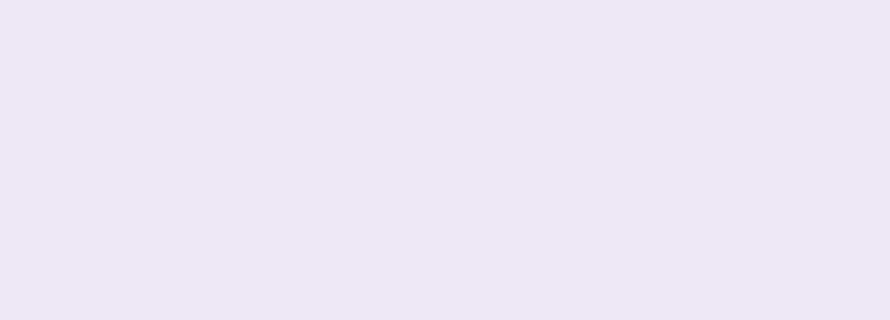
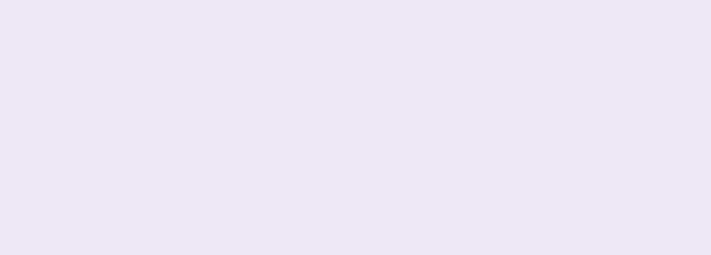

import Tabs from '@theme/Tabs';
import TabItem from '@theme/TabItem';

# F20 — Gerenciar colunas do funil

IT2 · Rastreabilidade: [F20](/backlog/requisitos#f20) · [CP1](/visao/solucao#cp1) · [OE3](/visao/solucao#oe3)

**Issue da Feature (GitHub):** [abrir no repositório](https://github.com/mdsreq-fga-unb/REQ-2026.1-T02-Crianex-/issues) — _nº a definir_

:::note[Acesso para avaliação]
Esta funcionalidade exige **login de administrador**. Credenciais para o professor: **e-mail** `a definir` · **senha** `a definir`.
:::

## Requisitos (evidências)

Selecione um requisito na navegação abaixo. Cada um traz seus critérios de aceite, regras de negócio e um espaço para o **screenshot da funcionalidade em funcionamento** (substitua a imagem de placeholder pela captura real).

<Tabs>
<TabItem value="rf38" label="RF38">

#### RF38 — Adicionar colunas no CRM

**Critérios de aceite (BDD)**

- **Dado** admin autenticado, **quando** adicionar coluna, **então** uma nova coluna é criada no funil e persistida.

**Regras de negócio:** —

**Evidência (screenshot):**

**Deploy:** _link a definir_

</TabItem>
<TabItem value="rf39" label="RF39">

#### RF39 — Remover colunas no CRM

**Critérios de aceite (BDD)**

- **Dado** coluna existente, **quando** remover, **então** a coluna é excluída do funil.

**Regras de negócio:** —

**Evidência (screenshot):**

**Deploy:** _link a definir_

</TabItem>
<TabItem value="rf40" label="RF40">

#### RF40 — Editar colunas no CRM

**Critérios de aceite (BDD)**

- **Dado** coluna existente, **quando** editar/arrastar, **então** o nome ou a ordem é atualizado com reflexo visual em ≤ 1,5s.

**Regras de negócio:** —

**Evidência (screenshot):**

**Deploy:** _link a definir_

</TabItem>
<TabItem value="rnf01" label="RNF01">

#### RNF01 — Isolamento de acesso administrativo

**Classificação:** Segurança da Informação  
**Descrição:** Área administrativa em endpoint distinto, acessível apenas mediante autenticação.

**Evidência (screenshot):**

**Verificação:** [Resultados V&V da IT2](/iteracoes/iteracao-2/vv)

</TabItem>
<TabItem value="rnf09" label="RNF09">

#### RNF09 — Controle de acesso por linha (RLS)

**Classificação:** Segurança da Informação  
**Descrição:** Row Level Security restringindo leitura ao perfil autorizado.

**Evidência (screenshot):**

**Verificação:** [Resultados V&V da IT2](/iteracoes/iteracao-2/vv)

</TabItem>
<TabItem value="rnf22" label="RNF22">

#### RNF22 — Reorganização intuitiva (colunas do CRM)

**Classificação:** Usabilidade  
**Descrição:** Reordenação de colunas por drag-and-drop com atualização ≤ 1,5s.

**Evidência (screenshot):**

**Verificação:** [Resultados V&V da IT2](/iteracoes/iteracao-2/vv)

</TabItem>
</Tabs>
