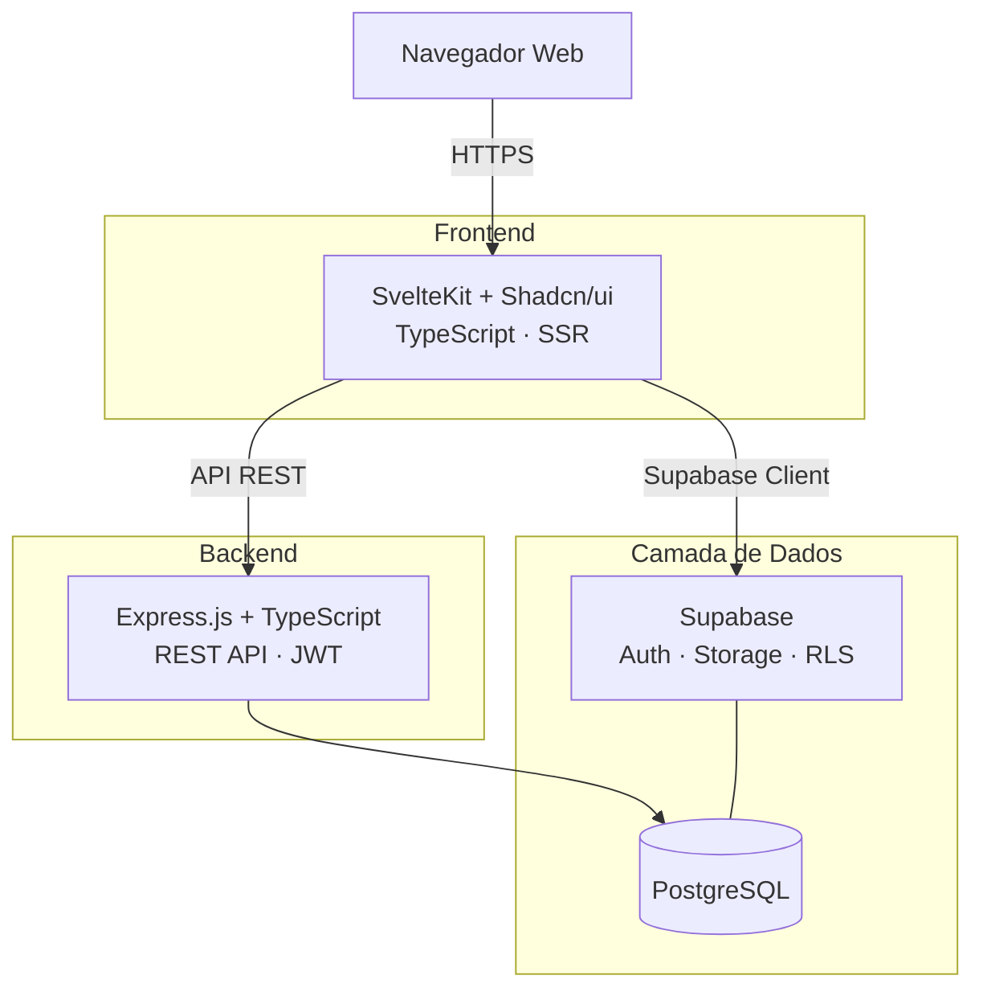

import Tabs from '@theme/Tabs';
import TabItem from '@theme/TabItem';
import RevisionHistory from '@site/src/components/RevisionHistory';

# 2 · Solução Proposta

:::tip[Objetivo Geral]
Aumentar a competitividade da Crianex no mercado SaaS — unindo **gestão interna** e **vitrine digital pública** numa única plataforma.
:::

O **Crianex Hub** envolve duas áreas:

| Área | Acesso | Descrição |
| ---- | ------ | --------- |
| **Área Administrativa** | Autenticado | Gestão interna de projetos, logs, faturamento e relacionamento |
| **Vitrine Digital** | Público | Portfólio de produtos SaaS para engajamento e captação B2B |

## Declaração de Posição

| Campo | Descrição |
| ----- | --------- |
| **Para** | A Crianex Software House, gestores, colaboradores e clientes B2B |
| **Que** | Necessita de visibilidade centralizada dos projetos e vitrine profissional |
| **O Crianex** | É uma plataforma SaaS de gestão e portfólio de projetos |
| **Diferente de** | Ferramentas genéricas (Jira, Trello) ou sites institucionais estáticos |
| **Nosso produto** | Integra em tempo real a operação interna com a comunicação ao mercado |

## Objetivos Específicos (OEs) {#oes}

| ID | Objetivo Específico | Natureza |
| -- | ------------------- | -------- |
| <a id="oe1"/>**OE1** | Centralizar a gestão operacional do negócio | Governança / Gestão |
| <a id="oe2"/>**OE2** | Aumentar a visibilidade do portfólio no mercado B2B | Aquisição / Apresentação |
| <a id="oe3"/>**OE3** | Centralizar a gestão de Leads e clientes | Relacionamento / Operação |

## Características do Produto (CPs) {#cps}

> Cada CP abaixo é alvo dos links da [matriz de rastreabilidade](/backlog/rastreabilidade).

| ID | Nome | OE | Valor de Negócio |
| -- | ---- | -- | ---------------- |
| <a id="cp1"/>**CP1** | CRM Interno de Clientes (Kanban) | OE3 | Eliminar planilhas; rastreabilidade de cada oportunidade; reduzir perdas por falta de follow-up |
| <a id="cp2"/>**CP2** | Histórico de Logs e Monitoramento | OE1 | Visibilidade operacional; diagnóstico e auditoria de segurança em tempo real |
| <a id="cp3"/>**CP3** | Dashboard Executivo de Métricas | OE1 | Painel interativo de KPIs para decisão estratégica de priorização e investimento |
| <a id="cp4"/>**CP4** | Vitrine Pública de Produtos SaaS | OE2 | Visibilidade externa do portfólio; atração de clientes e parceiros |
| <a id="cp5"/>**CP5** | Painel de Gerenciamento do Administrador | OE2 | Autonomia para manter o portfólio sem deploy; rastreabilidade de mudanças |
| <a id="cp6"/>**CP6** | FAQ e Base de Conhecimentos | OE2 | Redução de tickets recorrentes; autoatendimento do cliente |
| <a id="cp7"/>**CP7** | Faturamento e Relatórios Financeiros | OE1 | Centralizar receita; dados precisos para decisão estratégica |
| <a id="cp8"/>**CP8** | Sistema de Tickets de Suporte | OE3 | Atendimento pós-venda num canal único rastreável; menor tempo de resposta |
| <a id="cp9"/>**CP9** | Sistema de Notificações | OE3 | Garantir que nenhum ticket ou lead fique sem resposta |

<figure className="crianex-figure">
  
  <figcaption>Figura — Feature/Value Matrix das CPs (CP1–CP9). Fonte: autores (2026).</figcaption>
</figure>

## Tecnologias Utilizadas

<Tabs>
<TabItem value="frontend" label="Frontend">

**SvelteKit + Shadcn/ui** · TypeScript · SSR. O SSR é essencial para que a vitrine seja indexada por motores de busca. Escolhido sobre React por menor *bundle size*, curva de aprendizado e performance de compilação estática.

</TabItem>
<TabItem value="backend" label="Backend">

**Express.js + TypeScript** · REST API · JWT integrado ao Supabase Auth. Atua como camada de negócio para fluxos complexos (múltiplas tabelas, validações, relatórios). Leituras públicas simples acessam o Supabase diretamente.

</TabItem>
<TabItem value="dados" label="Banco de Dados">

**Supabase + PostgreSQL + RLS**. O *Row Level Security* garante que cada usuário só acessa dados autorizados, mesmo em acessos diretos pelo frontend — eliminando proxy de backend para leituras.

</TabItem>
<TabItem value="infra" label="Infraestrutura">

**Kubernetes** gerenciado pela própria Crianex. Deploy no cluster nas etapas finais; ambientes de dev/homologação usam Docker Compose. CI/CD via GitHub Actions.

</TabItem>
</Tabs>

| Camada | Tecnologia | Notas |
| ------ | ---------- | ----- |
| Frontend | SvelteKit + Shadcn/ui | TypeScript, SSR |
| Backend | Express.js | TypeScript, REST API |
| Banco | PostgreSQL (Supabase) | RLS habilitado |
| BaaS | Supabase | Auth + Storage + RLS |
| Infra | Kubernetes | Gerenciado pela Crianex |
| CI/CD | GitHub Actions | Build, test, deploy |

## Posicionamento no Mercado

<Tabs>
<TabItem value="comparativo" label="Comparativo">

| Característica | Crianex | MS Dynamics | Oracle CRM | Agendor |
| -------------- | :-----: | :---------: | :--------: | :-----: |
| Gestão de projetos de software | ✅ | Parcial | ❌ | ❌ |
| Vitrine digital pública | ✅ | ❌ | ❌ | ❌ |
| Alocação de pessoas | ✅ | ✅ | ❌ | ❌ |
| Dashboard em tempo real | ✅ | ✅ | ❌ | ❌ |
| Integração gestão ↔ portfólio | ✅ | ❌ | ❌ | ❌ |
| Custo acessível para PMEs | ✅ | ❌ | ❌ | Parcial |

</TabItem>
<TabItem value="diferenciais" label="Diferenciais">

- **Integração nativa gestão ↔ vitrine** — conecta operação interna e apresentação pública, sem silos.
- **Desenvolvido sob medida** — para os fluxos reais da Crianex, sem excesso de funcionalidades.
- **Custo controlado** — roda na infraestrutura própria (Kubernetes), sem licenças recorrentes.
- **Publicação seletiva** — a equipe controla o que é exibido na vitrine.
- **Identidade visual customizável** — logo, cores e textos configuráveis pelo time.

</TabItem>
<TabItem value="segmento" label="Segmento-Alvo">

- **Software Houses B2B** — múltiplos projetos simultâneos para clientes corporativos.
- **Equipes distribuídas** — times remotos/híbridos que precisam de visibilidade central.
- **PMEs de tecnologia** — 5 a 50 colaboradores, onde ferramentas Enterprise são complexas e caras.

</TabItem>
</Tabs>

## Viabilidade

<Tabs>
<TabItem value="escopo" label="Escopo">

| Dimensão | Avaliação | Justificativa |
| -------- | --------- | ------------- |
| Escopo do MVP | Viável | CPs priorizadas pela matriz Valor × Esforço |
| Prazo total | Viável com dificuldades | Iterações cobrem o desenvolvimento incremental |
| Entregas incrementais | Viável | Arquitetura modular (Adm + Vitrine) |
| Alinhamento acadêmico | Alto | Entregas alinhadas aos critérios da disciplina |

</TabItem>
<TabItem value="tecnica" label="Técnica">

| Tecnologia | Familiaridade | Risco | Mitigação |
| ---------- | ------------- | ----- | --------- |
| SvelteKit | Médio | Médio | Onboarding ~1 semana |
| TypeScript / Express / PostgreSQL | Alto | Baixo | — |
| Supabase | Médio | Baixo | BaaS bem documentado |
| Kubernetes | Baixo | Médio | Infra gerenciada pela Crianex |

</TabItem>
<TabItem value="conclusao" label="Conclusão">

| Dimensão | Veredicto |
| -------- | --------- |
| Escopo no semestre | **Viável com dificuldades** |
| Capacidade técnica | **Viável** (com onboarding em SvelteKit) |
| Infraestrutura | **Viável com risco gerenciado** |
| **Geral** | **Projeto viável para execução** |

</TabItem>
</Tabs>

## Benefícios Esperados

<Tabs>
<TabItem value="cliente" label="Para o Cliente">

Visibilidade centralizada dos projetos · redução de retrabalho operacional · presença digital profissional · captação de leads · controle de alocação · rastreabilidade e governança · plataforma própria sem licenças recorrentes · identidade visual sob controle.

</TabItem>
<TabItem value="usuarios" label="Para os Usuários">

**Internos:** dashboard consolidado, atualização de status em poucos cliques, notificações automáticas, clareza sobre tarefas. **Externos:** acesso facilitado ao portfólio com detalhes técnicos e canal direto de contato.

</TabItem>
<TabItem value="indicadores" label="Indicadores">

| Indicador | Atual | Com o Crianex |
| --------- | ----- | ------------- |
| Consolidar status de projetos | Horas | Minutos (dashboard) |
| Visibilidade do portfólio | Baixa | Alta (SEO/SSR) |
| Leads B2B digitais | Baixo | Crescente |
| Rastreabilidade de mudanças | Parcial | Total (logs) |

</TabItem>
</Tabs>

<RevisionHistory
  headers={['Versão', 'Data', 'Descrição', 'Autor(es)']}
  rows={[
    ['1.0', '03/04/2026', 'Criação das seções 2.1 a 2.3', 'Lucas A. Zanetti'],
    ['1.1', '09/04/2026', 'Revisão geral e ajuste de objetivos', 'Equipe Crianex'],
    ['1.2', '12/04/2026', 'Preenchimento das seções 2.4 a 2.7', 'Philipe e Hugo'],
    ['1.3', '05/05/2026', 'Reajuste do objetivo principal, OEs e CPs', 'Lucas A. Zanetti'],
    ['1.4', '06/05/2026', 'Substituição do diagrama ASCII por Mermaid', 'Equipe Crianex'],
    ['1.5', '06/05/2026', 'Remoção de CP10/CP12, renumeração e reformulação do OE4', 'Lucas A. Zanetti'],
    ['1.6', '06/05/2026', 'Adição de CP14 — Portal do Cliente; renumeração', 'Lucas A. Zanetti'],
    ['2.0', '26/06/2026', 'Migração para Docusaurus: seções pesadas em tabs; anchors de OE/CP para a matriz', 'Equipe Crianex'],
  ]}
/>
